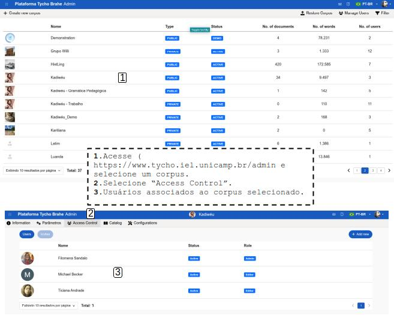
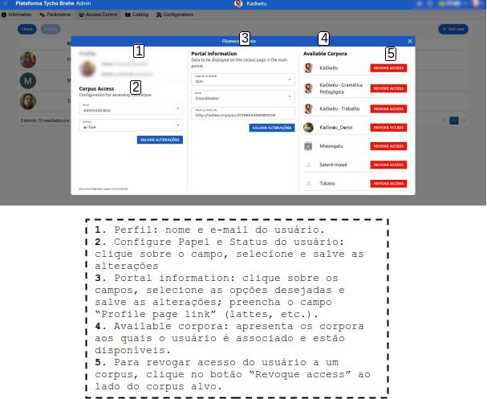

# Controle de acesso - usuários cadastrados

No Centro Adminstrativo, é possível realizar o controle de acesso de usuários com perfis de administrador e editor já cadastrados na plataforma.

Após ter acessado o Centro Adminstrativo de uma das maneiras descritas no [tutorial: Acessando o Centro administrativo](./accessing-admin-center.md), selecione um corpus e a aba "Access control": são presentados os usuários que estão atualmente associados e os convites gerados para associação ao corpus.

1. Para realizar alterações de controle de acesso do usuário, selecione um usuário, clicando sobre o perfil. Uma caixa com as informações do perfil do usuário se abre, com as seguintes informações:

    **Profile**: foto, nome e email associado.

    **Corpus Access**: nesta área, o administrador consegue configurar o "Role"(papel) do usuário; o status:

    1. Role

        1. Clique sobre o "papel"
        2. Selecione entre: Administrator, Editor e Visitor.
        3. Clique em "aplicar" para salvar a seleção.

    2. Status
        1. Clique sobre o Status.
        2. Selecione entre Active e Inactive.

    **Portal information**: informações que são apresentadas na página do corpus no portal principal.

    3. Display in Portal: clique sobre o campo, selecione "sim" ou "não" na lista suspensa.
    4. Role: clique no campo e selecione entre Coordinator, Researcher, Collaborator, Principal na lista suspensa.
    5. Preencha o campo “Profile page link”, com um link de perfil da plataforma desejada (por exemplo, lattes, etc.)

    **Available Corpora**: apresenta os corpora aos quais o usuário é associado e estão disponíveis.

    **Revoque access**: na área de corpora disponíveis, ao lado de cada corpus são dispostos botões para "revogar acesso". Para revogar acesso, clique no botão ao lado do corpus alvo.

Para realizar o registro de novos usuários, acesse este tutorial: [registro de novos usuários](../../admin/pt-br/register-new-users.md)

---
