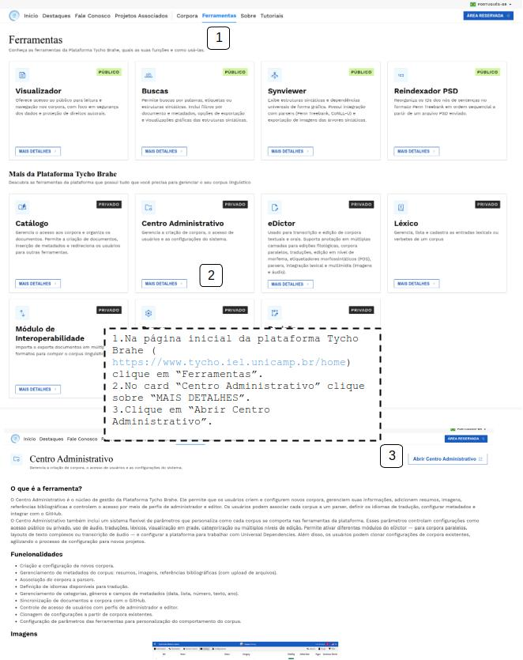

# Acessando o Centro Administrativo

- [Acessando o Centro Administrativo](#acessando-o-centro-administrativo)
  - [Tutorial](#tutorial)
    - [**Fluxo normal**](#fluxo-normal)

## Tutorial

É possível acessar o Centro adminstrativo de diferentes maneiras.

### **Fluxo normal**

**Através da área "Ferramentas" no portal principal da Plataforma Tycho Brahe:**

1. Na página inicial da plataforma Tycho Brahe (https://www.tycho.iel.unicamp.br/home) clique em “Ferramentas”.
2. No card “Centro Administrativo” clique sobre “MAIS DETALHES”.
3. Clique em “Abrir Centro Administrativo”.

**Através do acesso à "Área Reservada":**

1. Na página inicial da plataforma Tycho Brahe (https://www.tycho.iel.unicamp.br/home) clique em “Área Reservada” e realize o login.
2. Na Área Reservada, em Minhas Ferramentas, acesse “Admin”.

**Através do link direto do Centro Adminstrativo:**

1. Acesse a página de Admin (https://www.tycho.iel.unicamp.br/admin), diretamente (o usuário será redirecionado para o login caso não esteja logado).

---
