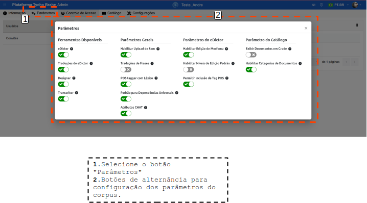
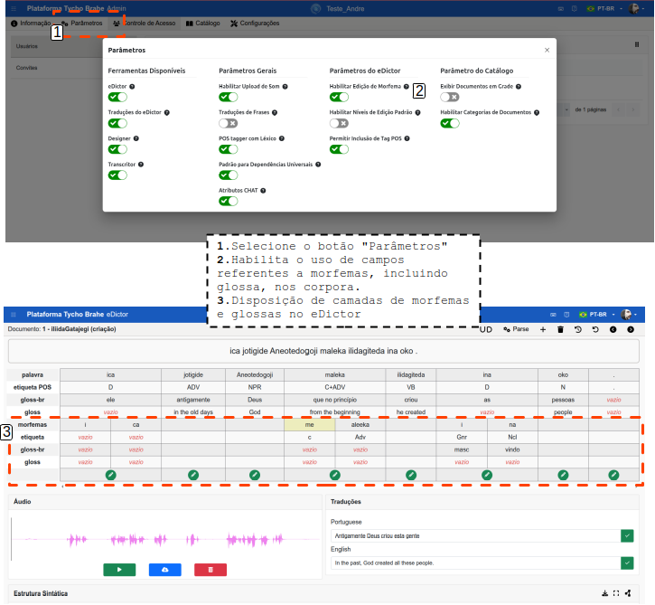
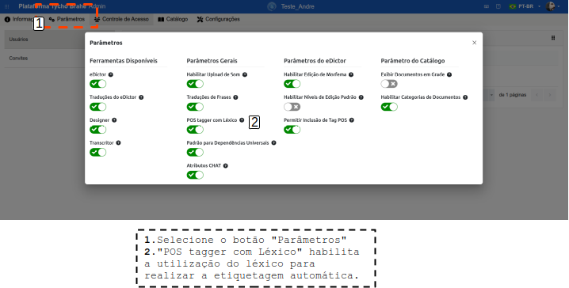
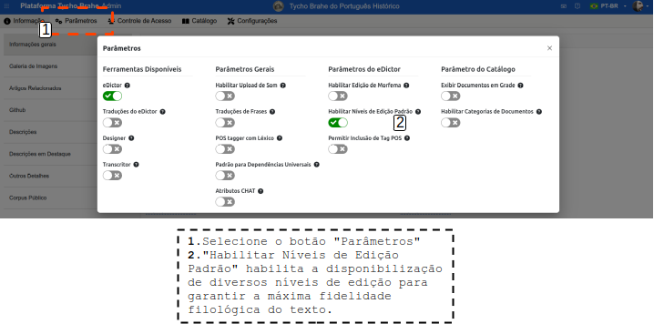
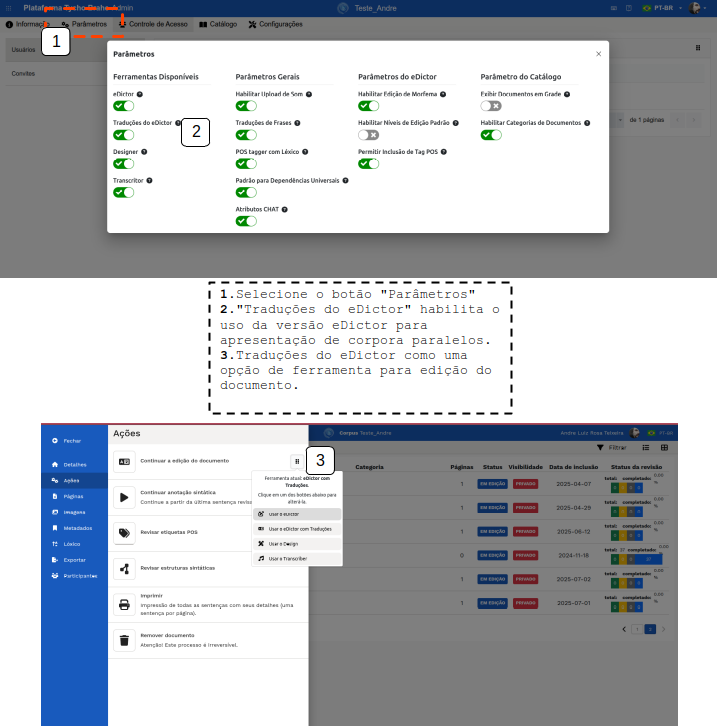
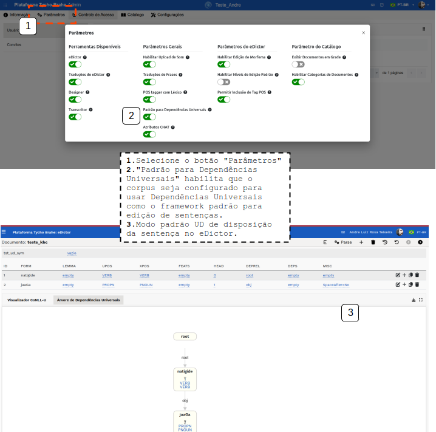
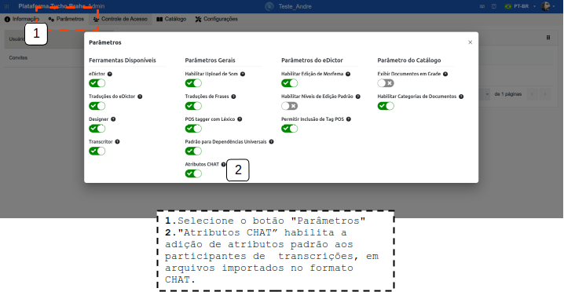
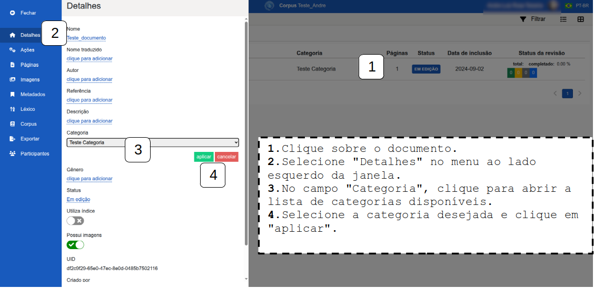
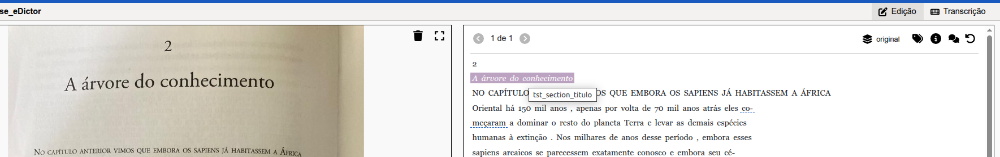
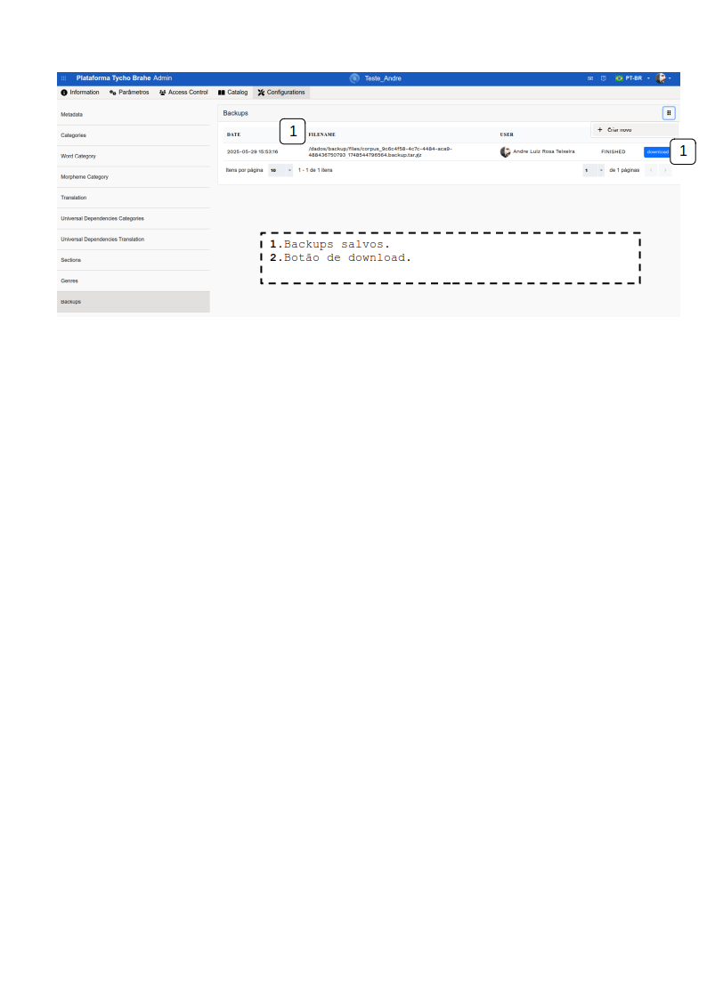

# Criação, configuração e edição dos corpora

Índice

- [Criação, configuração e edição dos corpora](#criação-configuração-e-edição-dos-corpora)
  - [Tutorial](#tutorial)
    - [Criação de corpora](#criação-de-corpora)
      - [**Fluxo normal**](#fluxo-normal)
    - [Configuração de corpora](#configuração-de-corpora)
      - [**Fluxo normal**](#fluxo-normal-1)
        - [**Aba Information**](#aba-information)
          - [**General Information**](#general-information)
          - [**Image Galery**](#image-galery)
          - [**Related Papers**](#related-papers)
          - [GitHub](#github)
          - [**Descriptions**](#descriptions)
          - [**Featured Descriptions**](#featured-descriptions)
          - [**Other details**](#other-details)
          - [**Public Corpus**](#public-corpus)
        - [**Aba Parâmetros**](#aba-parâmetros)
        - [**Aba Access Control**](#aba-access-control)
        - [**Aba Catalog**](#aba-catalog)
        - [**Aba Configurations**](#aba-configurations)
      - [**Fluxo alternativo:**](#fluxo-alternativo)

---

## Tutorial

Nos tópicos a seguir, serão abordados os principais fluxos de trabalho para a criação e configuração de novos corpora, além de tutoriais detalhados que guiam administradores e usuários no uso eficiente da ferramenta, garantindo uma experiência fluida e colaborativa na gestão dos catálogos.

### Criação de corpora

#### **Fluxo normal**

1. Acesse o Centro Adminstrativo de uma das maneiras descritas no [tutorial: Acessando o Centro Administrativo](./accessing-admin-center.md).
2. Ao acessar a página de administrador, uma lista de corpora é disposta. Clique em _"+ Create new corpus"_.
3. Adicione um nome ao novo corpus e clique em "Confirmar": esta ação finaliza a criação do corpus (Note que estas ações apenas criam o corpus. Para inclusão/edição de documentos, ou seja, alimentar o corpus ver o tutorial para [Criação de novos documentos nos corpora](../../edictor/pt-br/create-document.md). 

Esta ação cria um novo corpus, que aparecerá na lista.

**Nota**: este processo apenas cria o corpus. Sua alimentação (importação de dados/transcrição de áudios/extração de dados a partir de textos impressos etc.) pode ser realizada de diferentes formas a depender do tipo de material disponível (textos em papel, áudios, arquivos .txt, arquivos .csv - com ou sem traduções), das configurações estabelecidas (para mais detalhes, ver tutorial de Criação de novo documento no corpus). É necessário que haja uma interação com a equipe responsável pelo desenvolvimento da plataforma para que a melhor estratégia de importação de dados seja escolhida e aplicada. Cada um dos tipos de importação/transcrição de dados linguísticos será discutido separadamente na documentação.

### Configuração de corpora

Este tutorial detalha os passos necessários para a configuração dos corpora. As configurações são responsáveis disponibilização de informações iniciais referentes ao corpus, bem como por determinar desde o status dos corpora, grau de privacidade, tipo de display do corpus na plataforma, tipos de ferramentas habilitadas para o corpus etc.

#### **Fluxo normal**

1. Acesse o Centro Adminstrativo de uma das maneiras descritas no [tutorial: Acessando o Centro administrativo](./accessing-admin-center.md), dentre os corpora disponibilizados, vinculados ao usuário, selecione o que deseja configurar.
2. Na tela inicial de administração do corpus selecionado, são apresentadas 6 abas de configuração do corpus: **Information, Parâmetros, Access Control, Catalog, e Configurations**. Cada uma delas será detalhada abaixo.

##### **Aba Information**

Ao clicar-se nesta aba, aparecem estes campos de informações:

###### **General Information**

Esta área apresenta informações gerais sobre o corpus, a maioria delas editáveis. Clique sobre os campos para editar.

- **Edição do nome do corpus**:

1. Clique sobre a área do nome do corpus para alterar - um campo editável vai se abrir;
2. Realize a edição;
3. Clique em "aplicar" para salvar as alterações.

- **URL Shortcut**: este campo apresenta o atalho que redireciona para o corpus no Visualizador. Neste sentido, só surte efeito se o corpus for parametrizado como "público".

1. Clique sobre a área do nome do atalho - um campo editável vai se abrir;
2. Realize a edição;
3. Clique em "aplicar" para salvar as alterações.

<!--
Este atalho redireciona para o Visualizador:

REVISAR CRÍTICO: NÃO ENTENDI COMO FUNCIONA A QUESTÃO DO ATALHO, ENTENDI COMO EDITAR MAS NÃO ENTENDI A RAZÃO PRA MUDAR E O EFEITO QUE ISSO DÁ-->

- **Upload Directory**: este campo não é editável e representa o nome do diretório físico criado no servidor onde são mantidas todas as imagens, áudios, arquivos de importação do corpus. Este nome é baseado no nome do corpus, após uma limpeza dos espaços em branco, acentos e símbolos.

  

- **Constituency parser**: neste campo o usuário seleciona um parser de constituência dentre as diversas opções disponíveis. Há parser desenvolvidos por terceiros ou parsers baseados em regras desenvolvidos no âmbito do projeto.

1. Clique sobre o campo. As opções de parsers disponíveis aparecerem em uma lista suspensa.
2. Selecione o parser de constituência desejado.
3. Clique em "aplicar" para salvar a seleção.

- **Universal Dependency Parser**: neste campo o usuário seleciona um parser de Dependências Universais dentre as diversas opções disponíveis. Os parser disponíveis neste campo são desenvolvidos por terceiros para diversas línguas.

1. Clique sobre o campo. As opções de parsers disponíveis aparecerem em uma lista suspensa.
2. Selecione o parser de Dependências Universais desejado.
3. Clique em "aplicar" para salvar a seleção.

- **Filter and columns for catalog**: este campo apresenta opções de cabeçalhos para colunas de informações que podem ser selecionados para apresentação no catálogo. As opções possíveis são: Name, Status, Reference, Category, Author, Picture.

1. Clique sobre o campo. As opções serão apresentadas para marcação.
2. Selecione a opção marcando a caixinha.
3. Clique em "aplicar" para salvar a seleção.

<!--REVISAR CRÍTICO: CAMPO NÃO APARECE MAIS PARA EDIÇÃO-->

As seleções têm impacto na apresentação dos documentos na página do corpus no catálogo:

<!--REVISAR Filter and columns for catalog - NÃO ESTÁ FUNCIONANDO MAIS APÓS ATUALIZAÇÃO-->

- **Status**: este campo apresenta o status do corpus como "Ativo" (corpus ativo - se selecionado o corpus fica disponível na ferramenta de visualização e busca), "Inativo" (indisponível ao público geral nas ferramentas de busca e visualização), "Arquivado" (corpus archivado e aguardando ser deletado, e indisponível ao público geral nas ferramentas de busca e visualização) ou "Demo" (corpus criado para demonstração, indisponível ao público geral nas ferramentas de busca e visualização):

1. Clique sobre o campo. Um lista suspensa fica disponível com as opções.
2. Selecione uma opção de status.
3. Clique em "aplicar" para salvar a seleção.

- **Unique Identifier**: este campo apresenta o identificador do corpus. É gerado na criação do corpus e é único na base de dados. Na figura a seguir, no corpus Kadiwéu, é representado por C12 - é o códico que aparece nos links/atalhos dos corpora, por exemplo, https://www.tycho.iel.unicamp.br/catalog/C12, no catálogo, e https://www.tycho.iel.unicamp.br/viewer/C12 no visualizador.

###### **Image Galery**

Esta área apresenta a Galeria de Imagens. São apresentadas images de capa do corpus, bem como imagem do banner do portal principal do corpus.

1. Para adicionar uma imagem, clique sobre o ícone de menu no canto superior direito e "+ Add new image".
2. Uma caixa de "upload de arquivo" se abre. Arraste e solte uma imagem ou clique para selecionar no diretório de escolha.
3. Clique em "confirmar" para salvar a seleção.

###### **Related Papers**

Esta área apresenta os artigos relacionados ao corpus.

1. Para adicionar um novo artigo relacionado, clique sobre o botão e "+ Add new paper".
2. Preencha as informações do artigo: título, autor, adicionar um link ou realizar o upload do artigo.
3. Se for realizar upload do arquivo do artigo, selecione o botão de upload
4. Arraste e solte ou clique para selecionar o arquivo e confirme.

Após preencher os dados e salvar, o artigo adicionado aparece na coluna com as informações.
É possível editar, fazer o dowload do artigo e detelá-lo, clicando nos ícones de láís, download e lixeira, respectivamente, como em [2] na figura abaixo:

###### GitHub 
<!--REVISAR: vai ser necessário ter uma reunião com o Luiz para vermos como tudo se conecta com relação ao Git-->

Esta área permite o usuário associar um repositório GitHub.

1. Abas “Information” e “Github” selecionadas.
2. Clique sobre o campo, preencha as informações referentes ao Nome do usuário, Token de acesso, link do repositório remoto, branch e mensagem padrão de commit (confirme). <!--REVISAR: ver com o Luiz sobre o funcionamento de cada um dos campos - como gerar a chave adequadamente - ver como é a funcionalidade completa-->
3. Clique sobre o ícone no canto superior direito para apresentar opções de ações e clique sobre a ação desejada (Clone, Pull e Push). <!--REVISAR: ver como funciona cada uma dessas funcionalidades-->

###### **Descriptions**

Esta área dispõe uma descrição resumida sobre o corpus (e sua tradução), contendo, de maneira geral, as seguintes informações: um histórico sobre a língua, objetivos potenciais de compilação do corpus, potencial de uso em ferramentas e impacto social etc:

1. Abas “Information” e “Descriptions” selecionadas.
2. Área de edição da descrição.
3. Selecione o idioma.
4. No canto superior direito, são apresentados ícones de, respectivamente, área de edição; área de edição e renderização do texto; apenas renderização; tela cheia: o usuário consegue alternar o enfoque nas janelas.
5. Salve as alterações.

###### **Featured Descriptions**

Esta área contém um parágrafo resumindo informações do corpus para apresentação na página de corpora em destaque.

1. Preencha o campo em inglês, respeitando o máximo de caracteres.
2. Preencha o campo com a tradução, respeitando o máximo de caracteres.
3. Clique em "Save" para salvar as alterações.

O texto editado em "Featured" fica disposto na página inicial da plataforma, na definição dos corpora em destaque:

###### **Other details**

Área para preenchimento de outras informações pertinentes ao corpus, por exemplo, número de falantes, número de palavras gravadas, outras informações sociodemográficas pertinentes, etc

1. Abas “Information” e “Other Details” selecionadas.
2. Selecione o idioma para a edição.
3. Área de edição das informações.
4. Ícones de, respectivamente: área de edição; área de edição e renderização do texto; apenas renderização; tela cheia.
5. Salve as alterações.

###### **Public Corpus**

Esta área apresenta os critérios e as configurações básicas para que um corpus possa ser disposto como **Público**.
Para que um corpus possa ser Público, ele deve apresentar estes requisitos:

- Descrições em inglês
- Um artigo relacionado
- Imagem da capa
- Pelo menos um documento público
- Todos os documentos públicos devem ter um título
- E-mail de contato
- Informações sobre como citar o corpus

##### **Aba Parâmetros**

1. Clique em "Parâmetros": uma caixa se abre, disponibilizando diversos botões de alternância para configuração do corpus.

2. Diversos botões de alternância são apresentados. Selecione cada parâmetro de acordo com os objetivos do corpus.

**Use Morphemes**: habilita o uso de campos referentes a morfemas, incluindo glossa, nos corpora.

**Use Sound**: a habilita o suporte a áudio no corpus.

- Como podemos observar na figura abaixo, a seleção do botão "Use Sound" habitila uma seção de Áudio, que permite ao analista incluir o áudio a ser transcrito (ou o áudio correspondente à transcrição da sentença selecionada).

- O **"Use Sound"** também habilita, na ferramenta "eDictor", um botão de _play_ para tocar os áudios associados às sentenças do documento selecionado, como observamos na figura abaixo:
  

**Use Translations**: o botão "Use Translations" habilita a seção de Traduções no eDictor, como apresentado na figura a seguir:

<!--REVISAR: HABILITAR DESABILITAR NÃO PARECE ESTAR SURTINDO NENHUM EFEITO-->

**Use Lexicon**: é utilizado quando há um parser disponível, mas não há um etiquetador automático (que só funciona se houver uma quantidade mínima de palavras para treinamento do etiquetador). No caso de esta condição não estar satisfeita, o analista deve utilizar o léxico para realizar a etiquetagem automática.

<!--REVISAR: talvez precise de uma explicação melhor, ainda está um pouco obscuro pra mim-->

**Use Grid**: ao acessar o catálogo, o usuário tem a possibilidade de apresentação de documentos de duas maneiras: lista, ou grid.

Ao habilitar o botão "Use Grid", o usuário configura a apresentação em grid como default, como apresentado na Figura abaixo:

Se selecionado o formato em lista, os documentos são dispostos desta forma:

**Use Catalog Categories**: este botão habilita a possibilidade de categorização e subcategorização dos corpora (por exemplo, categorização com base em parâmetros demográficos etc). Note-se que a criação dos rótulos para as categorias pode ser realizada por um usuário com permissões de administrador. A criação de categorias pode ser realizada na aba **Configurations** - Categories (como será apresentado abaixo)

**Use Edition Tiers**<!--[REVISAR COM O LUIz]-->: este botão habilita a disponibilização de diversos níveis de edição para garantir a máxima fidelidade filológica do texto.

Por exemplo, acessando-se o catálogo, selecione o corpus Tycho Brahe do Português Histórico e selecione o documento "Atas dos Brasileiros - Tomo 02", como apresentado na Figura:

Esta ação abre um painel com uma matriz para edição dos níveis de edição, como mostra a Figura abaixo. Note-se: na mesma tela que seria análoga à sentença com o "Use Morphemes" selecionado, são apresentadas os níveis de edição.

Os botões "Use eDictor Translations"/"Use eDictor"/"Use Designer"/"Use Transcriber" não são excludentes, i.e., podem ser habilitados ao mesmo tempo em um determinado corpus. Esta ação disponibiliza todas as ferramentas para utilização no corpus.

**Use eDictor Translations**: Habilita o uso da versão eDictor para apresentação de corpora paralelos, como apresentado nas Figuras a seguir:

A configuração do eDictor Tranlations também depende de configurações na aba "Configurations" na pagina de Admin:

1. Acesse o Centro Adminstrativo de uma das maneiras descritas no [tutorial: Acessando o Centro Administrativo](./accessing-admin-center.md).
2. Ao acessar a página de administrador, uma lista de corpora é disposta. Selecione o corpus que deseja configurar (ou crie um novo corpus em "+ Create New Corpus").
3. Selecione a aba "Configurations" e "Translations" no canto esquerdo.
4. Clique em "+ Create": uma caixa com campos de configurações para entradas de tradução abre:

- **Order**: aceita números inteiros para configuração da ordem em que as línguas de tradução serão apresentadas;
- **Symbol**: preencha com o rótulo desejado;
- **Name**: preencha com o nome desejado;

Estas configurações habilitam a apresentação dos corpora paralelos como em [1] na Figura abaixo; Em [2], o usuário pode selecionar qual lingua de tradução deseja que seja apresentada; Em [3], após a seleção de uma sentença em um documento no catálogo, é possível verificar as traduções para a sentença selecionada, além de ser possível realizar edições nas traduções.

**Use eDictor**: o acionamento do botão "Use eDictor" habilita o uso do eDictor tradicional para transcrição e edição de documentos. Tutoriais sobre o "use eDictor" são disponibilizados neste documentos: [criação de documento](../../edictor/pt-br/create-document.md) e [uso geral do eDictor](../../edictor/pt-br/edictor-usage.md)

**Use Designer**: o acionamento deste botão habilita o uso da versão do eDictor para trabalhar com textos de layouts complexos, como jornais antigos, revistas, etc, que não tenham, por exemplo, passado por um processo de digitalização com extração das informações de maneira estruturada previamente (contendo, e.g., apenas fotografia do documento).
Os tutoriais de uso do designer estão disponíveis no documento [uso do designer](../../design/pt-br/design-usage.md)

**Use Transcriber**: este botão habilita o uso da versão do eDictor para trabalhar com transcrição de áudio, permitindo o upload de arquivos de áudio, criação de participantes para associação a trechos de áudios, tap mode (modo de teclas rápidas para alinhamento de participantes a trechos do áudio). Tutorial completo da ferramenta de transcrição esta disponível neste documento: [tutorial transcriber](../../transcriber/pt-br/transcriber-usage.md)

**Allow POS Tag inclusion**: o acionamento deste botão habilita adicionar novas etiquetas POS à lista enquanto o usuário edita sentenças no eDictor. Para incluir uma etiqueta: em uma sentença no eDictor, clique sobre o ícone de lápis para editar uma palavra.Inicie o preenchimento de uma etiqueta. Se ela não estiver na lista, aparecerá “Adicionar <etiqueta>. Pressione e confirme.

**Default for UD**: habilita que o corpus seja configurado para usar Universal Dependencies como o framework padrão para edição de sentenças. Ao acessar um documento e uma sentença, o padrão de disposição será em UD.

**Use CHAT attributes for Participants**: habilita a adição de atributos padrão aos participantes de transcrições. Estes atributos são extraídos de arquivos importados no formato CHAT do projeto CHILDES.

##### **Aba Access Control**

As configurações disponíveis para a aba Access Control são tratadas em documentos diferentes: [Controle de acesso de usuários já cadastrados](../../admin/pt-br/access-control.md) e [Cadastro novos usuários](register-new-users.md).

##### **Aba Catalog**

Esta aba dispõe os documentos presentes no corpus selecionado para configurações. Os documentos são dispostos em linhas, e colunas com informações Reference, Name, Status, Category, Added date, num Pages, num Sentences, num Words.

1. Clique sobre um documento para abrir uma janela de edição de informações sobre os documentos.

2. A maioria dos campos são editáveis (abertos) e aceitam texto. Clique sobre o campo e preencha as informações pertinentes (Name, Author, Description, Translated Name, Reference), clique em aplicar para que as alterações sejam salvas.

3. Os campos Status e Category apresentam um menu suspenso de opções. Clique sobre o campo, selecione a opção desejada e clique em aplicar para salvar as alterações. O campo Status tem as seguintes opções: Excluído, Em edição, Edição finalizada, Em revisão sintática, Finalizado. As opções de Category dependem do cadastro de categorias na aba Configurações - Categories. Além disso, é possívei selecionar a Visibilidade de um documento do catálogo marcando o corpus como Privado ou Pǘblico. Há ainda a possibilidade de selecionar o botão de alternância "Use index": <!--REVISAR CRÍTICO: qual a funcionalidade? Não está funcionando-->

##### **Aba Configurations**

Esta aba dispõe configurações de meta informações (informações que serão utilizadas e empregadas na edição (eDictor), busca, apresentação dos documentos no catálogo, categoria de morfemas e de palavras, traduções etc ) <!--REVISAR CRÍTICO-->

**Metadata**
A área de configuração de metadados habilita campos de preenchimentos de informações pertinentes aos documentos dos corpora no catálogo. Ao configurar um campo de metadado na página de Admin, é disponibilizado ao usuário o respectivo campo de preenchimento no catálogo. A depender dos atributos habilitados, as informações são exibidas no visualizador e podem ser utilizadas na busca ("used in search"); quando marcado "used in catalog grid", informações aparecem na lista do catálogo; se marcado para "used for importing" as informações são disponibilizadas no IO.

1. Com a aba de "Configurations" selecionada, selecione "Metadata". Metadados criados para o documento são dispostos à direita na tela.

2. Clique sobre uma linha de metadado para verificar os parâmetros selecionados e preenchidos. Clique nos campos para editar e salve as informações.

3.  Para adicionar um novo metadado, clique no ícone de opções no canto superior direito.

4.  Clique em "Create". Um painel para preenchimento das informações do metadado se abre.
    

    1. **Order:** preencha com um número inteiro que corresponde à ordem em que esse campo vai ser disponibilizado para preenchimento e clique em "Confirmar".
       

    2. **Name:** preencha com um nome para o campo de metadado e clique em "Confirmar"
       

    3. **Values:** este campo só se aplica se o tipo selecionado para o metadado por "List". Ao adicionar o metadado do tipo lista, o usuário consegue adicionar valores para esta lista, que serão disponibilizados para seleção no catálogo. Por exemplo: metadado: Estados de Nascimento; tipo: LIST; values: MG,SP,PR:
       

    4. **Symbol**: campo destinado ao símbolo/apelido do metadado na base de dados. Preencha o campo com o rótulo desejado e clique em "aplicar". <!--REVISAR:verificar com Luis se isto está correto-->

        

    5. **Type**: campo destinado à seleção do tipo de metadado a ser adicionado no catálogo. Disponbiliza os tipos: data, lista, local, número, texto e ano.

         

    6. **Format (para datas apenas)**: este campo disponibiliza o formatador de datas. Só surte efeito se o tipo de metadado estiver marcada para "Date". Preencha com o formato desejado para a data, por exemplo (dd/mm/yyy ou mm/dd/yyyy). Clique em “Confirmar”.
       

    7. **Used in search**: este botão de alternância habilita que as informações sejam apresentadas no visualizador e usadas em filtragem de busca.
      

    8. **Used in catalog grid**: este botão de alternância habilita a disponibilização das informações na lista do catálogo. <!--REVISAR CRÍTICO: não consegui verificar como isso muda o catálogo, não aparece a informação no grid/lista VER PRA DEPOIS INSERIR A FIGURA DE MUDANÇA DE ESTADO-->
      

    9. **"Used for importing"**: este botão habilita o uso dos metadados no IO (Interoperabilidade), habilitando a disposição das informações de metadados no catálogo para o usuário. <!--REVISAR CRÍTICO - isso não tem nenhum impacto no IO-->
      

    10. **Observations**: campo de preenchimento com observações. Selecione o campo, preencha com observações pertinentes e clique em Confirmar.

   

**Categories**
Esta configuração permite ao usuário incluir categorias (e subcategorias) às quais posteriormente é possível associar cada um dos documentos do corpus. Na página de admin o usuário cria as categorias e associa cada um dos documentos á categoria correspondente (documentos não associados a nenhuma categoria ficam rotulados "Sem categorização").

1. Para criar uma categoria, selecione a aba "Configurations" e "Categories".
2. Clique no ícone no topo superior direito da janela, selecione "+ Create".

3. É possível selecionar "clone" para clonar categorias de um corpus da base: clique em clone, selecione o corpus de origem para clonar as categorias.

4. Uma janela com os campos de edição se abre, apresentando: Name (campo de preenchimento para o nome da categoria), Order (ordem na qual a categoria será disposta), Symbol (rótulo que será dado à categoria), Description (campo de preenchimento da descrição da categoria). Clique em cada um dos campos, preencha com as informações desejadas e clique em "aplicar" para salvar as alterações e clique em "Confirmar" para criar a categoria.

5. Após sua criação na página de "admin", uma categoria fica disponível para o usuário no catálogo:
   1. Clique sobre o documento.
   2. Selecione "Detalhes" no menu ao lado esquerdo da janela.
   3. No campo "Categoria", clique para abrir a lista de categorias disponíveis.
   4. Selecione a categoria desejada e clique em "aplicar".

Os critérios para criação das categorias são discricionários do usuário, ou seja, dependem da lógica de organização deliberada por ele, podendo ser, por exemplo, uma organização com base no tempo, etc.: veja o corpus CE-DOHS, que é organizado nas categorias 1500-1822, 1823-2000, 2000-atual, com os respectivos números de documentos associados a cada categoria temporal.

**Word Category**
Esta área permite que o usuario crie rótulo para a camada de palavras que será apresentadas no eDictor

Para criar uma nova categoria de palavra:

1. Selecione "Configurations".
2. Selecione "Word Category"
3. Clique no ícone no canto superior direito e clique em "+ Create".
4. Na janela que se abre, preencha e clique em “aplicar” para salvar as alterações:
   1. Order: ordem que a categoria será disposta;
   2. ymbol: rótulo da categoria;
   3. Name(obrigatório): nome da categoria
5. Clique em “Confirmar”.

A categoria de palavra criada fica disponível como camada de edição no eDictor:

**Morpheme Category**
Esta área permite que o usuario crie rótulos para a camada de morfemas que será apresentadas no eDictor.

Para criar uma nova categoria de morfema:

1. Selecione "Configurations".
2. Selecione "Morpheme Category"
3. Clique no ícone no canto superior direito e clique em "+ Create".
4. Na janela que se abre, preencha e clique em “aplicar” para salvar as alterações:
   1. Order: ordem que a categoria será disposta;
   2. Symbol: rótulo da categoria;
   3. Name(obrigatório): nome da categoria
5. Clique em “Confirmar”.

A categoria de morfema criada fica disponíve como camada de edição no eDictor:

**Translation**
Esta configuração permite ao usuário criar campos que serão preenchidos com traduções no eDictor.

Para criar uma categoria de Tradução:

1. Selecione “Configurations”.
2. Selecione “Translation”.
3. Categorias criadas anteriormente.
4. Clique no ícone e selecione “+ Create” para criar uma nova categoria de tradução.
5. Na janela que se abre, preencha e clique em “aplicar” para salvar as alterações:
   Order: ordem que a categoria será disposta;
   Symbol: rótulo da categoria;
   Name(obrigatório): nome da categoria
6. Clique em “Confirmar”.

Os campos com categorias de tradução (línguas alvo de tradução) ficam dispostas para preenchimento do usuário no eDictor:

**Universal Dependencies Categories**
Esta configuração permite ao usuário a criar categorias de dependências universais. Cada categoria criada na página de admin fica disponível para preenchimento pelo usuário na página de sentenças (Selecionado o botão UD no eDictor(translations))

Para criar uma Categoria de Dependência Universal:

1. Selecione “Configurations”.
2. Selecione "Universal Dependencies Category".
3. Clique no ícone e selecione “+ Create” para criar uma nova categoria.
4. Na janela que se abre, preencha e clique em “aplicar” para salvar as alterações:

   1. Order: ordem em que a categoria será disposta;
   2. Symbol: rótulo da categoria;
   3. Name(obrigatório): nome da categoria;

5. Clique em “Confirmar”.

Os campos cadastrados na página de admin ficam disponíveis para edição no eDictor, ao selecionar um sentença e o botão UD:

<!--**Universal Dependencies Translation** REVISAR: NÃO ENCONTREI ONDE ISSO APARECE APÓS PREENCHIMENTO NO ADMIN, não sei onde isso tem impacto-->

**Sections**
Esta configuração permite ao usuário criar seções (partes). Após a criação de uma seção na página de admin, o usuário consegue, no eDictor, associar partes dos textos com correspondentes seções, rotulando, assim, as partes de texto selecionadas.

Para criar uma seção:

1. Selecione “Configurations”.
2. Selecione “Sections”.
3. Clique no ícone e selecione “+ Create” para criar uma nova categoria.
4. Na janela que se abre, preencha e clique em “aplicar” para salvar as alterações:
   1. Order: ordem em que a categoria será disposta;
   2. Symbol: rótulo da categoria;
   3. Name(obrigatório): nome da categoria;
   4. Genre: gênero ao qual a seção é parte integrante.
5. Clique em “Confirmar”.

As seções criadas na página de configurações no admin ficam disponíveis para seleção no eDictor:

1. Acesse o catálogo através do link https://www.tycho.iel.unicamp.br/catalog.
2. Clique no topo superior (nomes dos corpora) para apresentar os corpora disponíveis.
3. Selecione o corpus

4. Selecione um documento eDictor.
5. No menu do lado esquerdo, selecione “Ações”, clique no ícone para selecionar a ferramenta, e escolha “Abrir no eDictor”.

Para acessar, ver

6. No eDictor, selecione a aba de "Edição
7. Sobre a parte que deseja associar a um rótulo de seção, clique com o botão direito do mouse.
8. No menu que se abre, clique sobre "Seção" e "Adicionar seção"
9. Clique no menu “Tipo de seção” e escolha uma seção previamente cadastrada.

**Nota:** as seções que são disponibilizadas ao usuário no eDictor dependem de uma configuração extra: se a seção for configurada com um "gênero" ela só ficará disponível para rotulação em documentos também associados ao respectivo gênero.

Após a rotulação com a respectiva seção, o trecho apresenta-se com uma etiqueta no eDictor. No exemplo, o título do texto foi etiquetado como "titulo":

**Genre(Gênero)**

Esta configuração permite que o usuário crie rótulos para os gêneros (tipo de texto) que serão utilizados nos corpora.

Para criar um gênero:

1. Selecione “Configurations”.
2. Selecione “Genres”.
3. Gêneros criados anteriormente.
4. Clique no ícone e selecione “+ Create” para criar um novo gênero.
5. Na janela que se abre, preencha e clique em “aplicar” para salvar as alterações:
   Order: ordem em que a categoria será disposta;
   Symbol: rótulo da categoria;
   Name(obrigatório): nome da categoria;
6. Clique em “Confirmar”.

Os gêneros criados pelos usuários ficam disponíveis para serem marcados nos documentos do catálogo:

1. No catálogo, selecione um corpus, e um documento.
2. Selecione “Detalhes”.
3. Clique em “Gêneros” e selecione um gênero na lista e clique em “aplicar”.

**Backups**
É possível criar um back up do corpus pelo usuário.

Para criar um backup:

1. Selecione “Configurations”.
2. Selecione “Backups”.
3. Backups criados anteriormente.
4. Clique no ícone e selecione “+ Criar novo” para criar um novo backup.
5. Clique em “Confirmar”.

Os backups realizados ficam disponíveis, com informações de data, nome do arquivo, usuário, status e ícone de download (arquivo zipado). Para realizar o download clique sobre o ícone.

#### **Fluxo alternativo:**

**A1** - **Acesso direto pelo link de administrador**

1. Acesse o link de administrador: <https://www.tycho.iel.unicamp.br/admin>.
2. Navegue até o corpus desejado e o selecione, clicando sobre ele (isto abre a página de gestão do corpus).

3. Retomar a partir do passo 4 do Fluxo normal e realizar as configurações gerais do corpus. 

---
