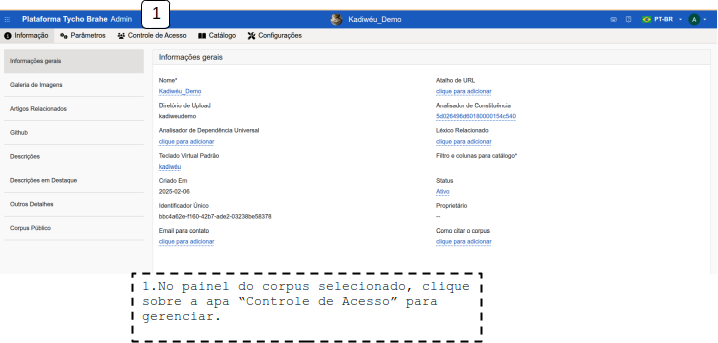

# Cadastro de Novos Usuários nos corpora

Índice

- [Cadastro de Novos Usuários nos corpora](#cadastro-de-novos-usuários-nos-corpora)
  - [Acessando o Centro Administrativo](#acessando-o-centro-administrativo)
  - [Selecionando um Corpus](#selecionando-um-corpus)
  - [Acessando a aba "Controle de Acesso"](#acessando-a-aba-controle-de-acesso)
  - [Usuário não cadastrado](#usuário-não-cadastrado)
    - [Criando Convite de acesso](#criando-convite-de-acesso)
    - [Realizando o Onboarding](#realizando-o-onboarding)
  - [Usuário cadastrado](#usuário-cadastrado)

---

Este tutorial detalha o processo para realizar o cadastro de novos usuários em corpora já criados, configurando as permissões necessárias e/ou enviando os convites de acesso. Em um fluxo normal, a coordenação ou professor entra em contato com o Admin previamente avisando a necessidade de cadastrar ou vincular um novo usuário a um determinado corpus (seja via convite para um novo cadastro na plataforma ou associação de um usuário já cadastrado a um novo corpus)

<!--REVISAR: ver com o Luis se vai haver modificação no processo de solicitação de cadastro-->
Há dois cenários de registro de usuários em um corpus: usuário não cadastrado na plataforma e usuário já cadastrado na plataforma. Antes de registrar um usuário em um corpus, de uma das maneiras, é necessário realizar acesso ao Centro Administrativo, selecionar um corpus, acessar a área de Controle de Acesso, e então gerar um convite (usuário não cadastrado) ou associar um usuário já cadastrado ao corpus.
Nas seções a seguir são apresentados os passos necessários.

## Acessando o Centro Administrativo

Para acessar o sistema de Gerenciamento dos corpora e realizar o registro de novos usuários, é necessário acessar o Centro Adminstrativo de uma das maneiras descritas no [tutorial: Acessando o Centro administrativo](./accessing-admin-center.md).

Todos os corpora disponíveis aparecem na sua página inicial de admin, listados com os campos: Nome, Tipo, Status, No. de documentos, No. de palavras, No. de usuários. Verifique se o corpus que deseja gerenciar está disponível.

Uma vez na área de Centro Adminstrativo, o admin do corpus consegue seguir com os passos necessários para registrar novos usuários.

## Selecionando um Corpus

1. Na interface de Administrador, selecione o corpus ao qual o novo usuário será associado. A Figura a seguir apresenta o catálogo de corpora disponíveis para acesso. Ao clicar em um dos corpora, o usuário é redirecionado ao corpus específico, como apresentado na Figura, como apresentado no topo da página “Corpus: Demonstration”.
    

## Acessando a aba "Controle de Acesso"

Na primeira tela de administração do corpus, são apresentadas informações gerais, como nome, um atalho URL, os parsers etc. No painel do corpus, clique na aba "Controle de Acesso" para gerenciar as permissões de acesso.

Ao acessar o “Controle de Acesso”, a plataforma apresenta uma página com os atuais usuários com permissões no corpus selecionado, como mostra a Figura a seguir. Com botão “Users” selecionado, é apresentado o usuário com os seguintes campos - “Name”, “status”, “Role”.

## Usuário não cadastrado

### Criando Convite de acesso

Na aba "Controle de Acesso", clique no botão "Invites" e depois em “ + Add new invite”. Uma nova janela se abre para que o admin possa realizar as configurações da permissão:

1. **Inserir título:** Escolha um título para o convite no campo “Title”
2. **Definir Quantidade de Convites**: Escolha se o convite será para um único usuário ou para múltiplos usuários (o contador de convites disponíveis será atualizado conforme os usuários se registrarem).
3. **Definir o tipo de permissão:** Selecione o tipo de permissão “Role” que o usuário terá:
    - **Edição**: O usuário poderá editar o corpus.
    - **Admin**: O usuário terá permissões de administrador no corpus.
4. **Email**: Preencha o email do usuário a ser adicionado ao corpus.
5. **Status do Usuário**: Selecione o status do usuário:
    - **Active**: O usuário terá acesso ativo ao corpus.
    - **Inactive**: O usuário estará registrado, mas sem acesso ativo.
6. Após configurar as permissões clicar em "Confirmar".

Após a geração do convite, o admin consegue enviar uma notificação automática com o convite para o e-mail cadastrado, copiar o ID do convite. Além disso, é possível reacessar o convite para verificação das informações, reenvio do e-mail etc.

### Realizando o Onboarding

O usuário recém cadastrado deve receber um email automático no formato apresentado na figura a seguir e deve clicar em "Join now" para ser redirecionado à página de adesão ao corpus e inserir o código de acesso constante no email.

## Usuário cadastrado

Se o usuário já estiver cadastrado na plataforma:

1. Acesse o Centro Adminstrativo
2. No painel de "Controle de Acesso", com o botão “Users” selecionado, clique em "+ Add New".
3. **Selecionar o e-mail do usuário**: Inicie o preenchimento e escolha o e-mail do usuário na lista suspensa (super-usuários e e-mails já cadastrados no corpus não aparecerão como opção).
4. **Configurar Permissões e Confirmar**: Selecione as permissões de "Role" (Adminstrator, Editor, Visitor) e "Status" (Active, Inactive).

---
