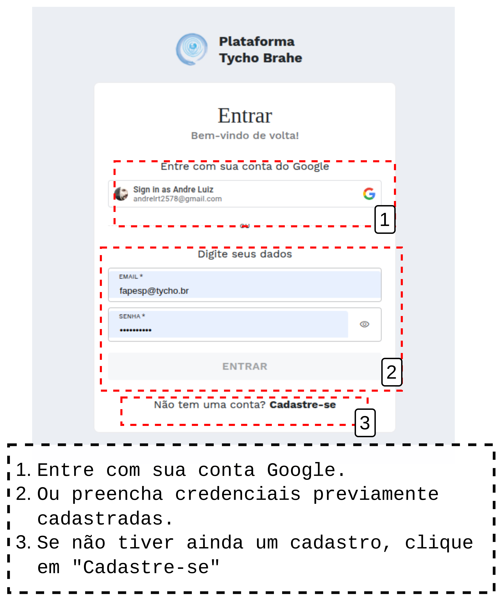
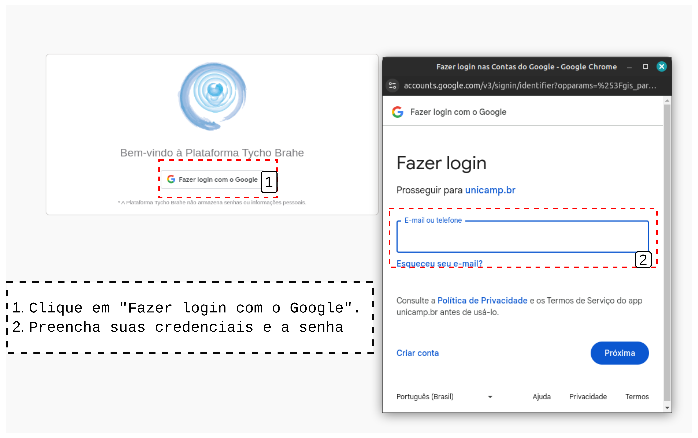

# DOCUMENTAÇÃO PLATAFORMA TYCHO BRAHE (TYCHO BRAHE PLATAFORM)

<figure>

</figure>

---

SUMÁRIO

- [DOCUMENTAÇÃO PLATAFORMA TYCHO BRAHE (TYCHO BRAHE PLATAFORM)](#documentação-plataforma-tycho-brahe-tycho-brahe-plataform)
  - [Introdução](#introdução)
  - [Caso de Uso 00 - Sign in e acesso à tela inicial de perfil do usuário cadastrado](#caso-de-uso-00---sign-in-e-acesso-à-tela-inicial-de-perfil-do-usuário-cadastrado)
    - [Tutorial:](#tutorial)
      - [**Fluxo normal**](#fluxo-normal)
      - [**Fluxo Alternativo**](#fluxo-alternativo)

## Introdução

A Plataforma Tycho Brahe é uma ferramenta avançada para o estudo e análise linguística, oferecendo um ambiente online integrado para a criação, análise e gestão de corpora linguísticos anotados sintaticamente. A plataforma abrange todo o processo de
desenvolvimento de corpora, desde a etapa inicial de transcrição até a aplicação de técnicas avançadas de processamento linguístico, anotação e busca.

Dentre as funcionalidades mais notáveis da Plataforma Tycho Brahe, citam-se:

- Mecanismos de busca sofisticados que permitem explorar dados linguísticos em múltiplos níveis, abrangendo desde unidades lexicais até estruturas sintáticas complexas;
- Recursos para o desenvolvimento de novos corpora, facilitando a colaboração e o compartilhamento de metodologias de anotação entre pesquisadores;
- Ferramentas especializadas para o registro e análise de idiomas ameaçados de extinção, fundamentadas em princípios da gramática gerativa;
- Suporte ao primeiro corpus com anotação sintática de uma língua indígena do Brasil, o kadiwéu, marcando um avanço significativo na documentação linguística;
- Interface intuitiva que permite a participação ativa de falantes nativos na edição e enriquecimento dos corpora, contribuindo para iniciativas educacionais em comunidades indígenas.

A Plataforma Tycho Brahe desempenha um papel crucial na preservação e no estudo de línguas ameaçadas. Sua flexibilidade e abrangência a tornam uma ferramenta valiosa para linguistas, educadores e comunidades linguísticas, promovendo avanços tanto na pesquisa acadêmica quanto na manutenção da diversidade linguística.

Este documento detalha o uso da Plataforma Tycho Brahe. A plataforma oferece uma gama de funcionalidades projetadas para facilitar a pesquisa e o trabalho com corpora linguísticos.

Entre as principais características da Plataforma Tycho Brahe, destacam-se:

- Visualizador de árvores sintáticas: permite a representação gráfica e análise detalhada de estruturas sintáticas;
- Construção de corpus: ferramentas para criar, organizar e gerenciar corpora linguísticos;
- Anotação: recursos para adicionar metadados, tags e anotações aos textos do corpus;
- Busca avançada: mecanismos de pesquisa sofisticados para localizar padrões linguísticos específicos;

Esta documentação fornecerá instruções detalhadas sobre como utilizar cada uma dessas funcionalidades, além de orientações sobre o acesso à plataforma, gerenciamento de usuários e boas práticas para o uso eficiente do sistema.

Nos documentos que compõem os tutoriais, serão apresentadas as diversas funcionalidades da plataforma Tycho Brahe. Serão apresentados os tutoriais dos casos de uso que representam as funcionalidades no sistema, detalhando cada um deles

---

## Caso de Uso 00 - Sign in e acesso à tela inicial de perfil do usuário cadastrado

**Atores primários**:

1. Usuário
2. Administrador

**Pré-requisitos:**

1. Usuário cadastrado deve estar logado; Para uso de algumas ferramentas, usuário deve ter permissão de admin.

O Sign in permite ao usuário acessar a plataforma com segurança. Este processo envolve somente o usuário previamente cadastrado.
Como será apresentado, o usuário terá acesso à plataforma por meio de um _login_ Google.
A Área Reservada dá acesso ao Catálogo, eDictor, Syntrees, Parser e Centro Administrativo.

A tela inicial de perfil do usuário cadastrado, acessada por meio do link "Área reservada", na página inicial da plataforma, apresenta as seguintes informações:

1. **Meu Perfil**, com Informações do usuário, como e-mail, Nome, Informações acadêmicas e Idioma de preferência.
2. **Meus corpora**, que apresenta os corpora disponíveis associados ao perfil logado.
3. **Minhas Ferrametentas**, que disponibiliza as ferramentas disponíveis para o usuário logado, de acordo com as permissões de acesso configuradas.

### Tutorial:

**Objetivo:**
Este tutorial detalha o processo para o usuário realizar o Sign in na plataforma e acessar a tela inicial do perfil do usuário. Em um fluxo normal, o usuário já foi previamente cadastrado com um e-mail Google. Caso contrário, veja Caso de uso 02 - Solicitar cadastro para realizar a solicitação junto aos administradores da plataforma.

#### **Fluxo normal**

1. Acesse a página _home_ da plataforma através do link: <https://www.tycho.iel.unicamp.br/home>.
2. Na área de "Ferramentas", o Usuário acessa "Área reservada" para ser redirecionado ao _login_.

Acessando "Área reservada".

3. Realize o _login_ com o Google ou com suas credenciais previamente cadastradas. Selecione a conta salva no sistema ou preencha os dados da sua conta Google cadastrada na Plataforma Tycho Brahe.

Seleção de conta Google ou credenciais cadastradas

Ou

Login in com o Google</figcaption>

4. Após _login_ o Usuário é redirecionado à página inicial do perfil, onde são dispostas as áreas **Meu Perfil**, com Informações do usuário, como e-mail, Nome, Informações acadêmicas e Idioma de preferência, que podem eventualmente ser editadas <!-- REVISAR CRÍTICO: avisar ao Luiz que as edições não são persistidos na base, não ficam salvas-->, **Meus corpora**, que apresenta os corpora disponíveis associados ao perfil logado e **Minhas Ferrametentas**, que disponibiliza as ferramentas disponíveis para o usuário logado, de acordo com as permissões de acesso configuradas.

Figure x: Tela inicial - perfil de usuário

Observe que para cada um dos corpora disponíveis para trabalho pelo usuário, são também disponibilizados botões de acesso rápido:

#### **Fluxo Alternativo**

1. Acesse o link da plataforma/perfil <https://www.tycho.iel.unicamp.br/platform> diretamente, sem passar pela página inicial da plataforma e acesse a "Área reservada".
2. Retome a partir do passo 3 do Fluxo normal
