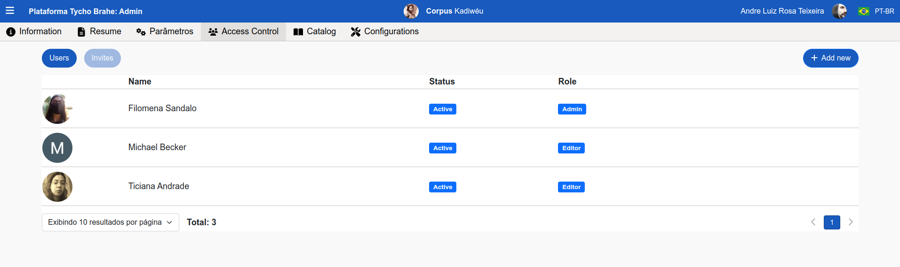

# Controle de acesso - Guia do Administrador

- [Controle de acesso - Guia do Administrador](#controle-de-acesso---guia-do-administrador)
  - [Tutorial](#tutorial)
    - [**Fluxo normal**](#fluxo-normal)

## Tutorial

A plataforma oferece funcionalidades de controle de acesso de usuários já cadastrados.

### **Fluxo normal**

1. Na página de Admin (https://www.tycho.iel.unicamp.br/admin), com a aba "Access control" selecionada, são apresentados os usuários que estão atualmente associados ao corpus e os convites gerados para associação ao corpus.

2. Para realizar alterações de controle de acesso do usuário, selecione um usuário, clicando sobre o perfil. Uma caixa com as informações do perfil do usuário se abre, com as seguintes informações:

**Profile**: foto, nome e email associado.

**Corpus Access**: nesta área, o administrador consegue configurar o "Role"(papel) do usuário; o status:

   1. Role
      1. Clique sobre o "papel"
      2. Selecione entre: Administrator, Editor e Visitor.
      3. Clique em "aplicar" para salvar a seleção.

   2. Status
      1. Clique sobre o Status.
      2. Selecione entre Active e Inactive.

**Portal information**: informações que são apresentadas na página do corpus no portal principal.

   1. Display in Portal: clique sobre o campo, selecione "sim" ou "não" na lista suspensa.
   2. Role: clique  no campo e selecione entre Coordinator, Researcher, Collaborator, Principal na lista suspensa.
   3. Preencha o campo “Profile page link”, com um link de perfil da plataforma desejada (por exemplo, lattes, etc.)

**Available Corpora**: apresenta os corpora aos quais o usuário é associado e estão disponíveis.

**Revoque access**: na área de corpora disponíveis, ao lado de cada corpus são dispostos botões para "revogar acesso". Para revogar acesso, clique no botão ao lado do corpus alvo.

----
