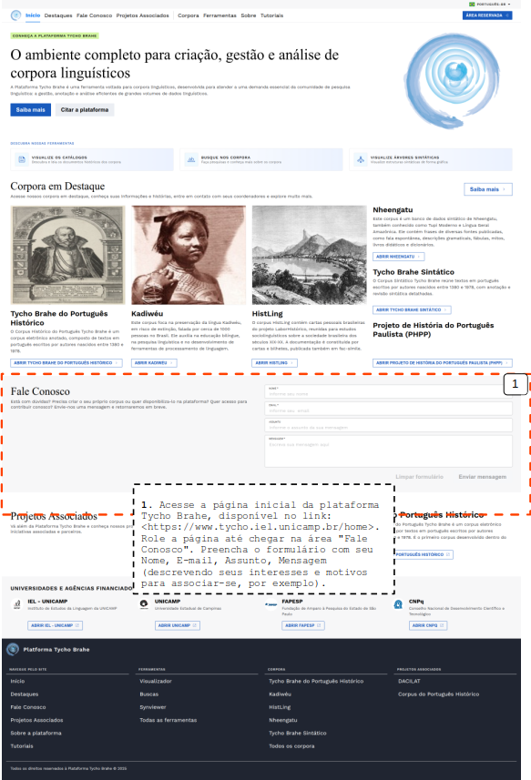

# Caso de uso 02 - Solicitar cadastro

Índice

- [Caso de uso 02 - Solicitar cadastro](#caso-de-uso-02---solicitar-cadastro)
  - [Tutorial](#tutorial)
    - [**Fluxo normal**](#fluxo-normal)

---

## Tutorial

O processo de solicitação de cadastro por meio do formulário permite aos usuários iniciar o procedimento de registro na plataforma. Este caso de uso detalha as etapas necessárias para que um novo usuário envie suas informações pessoais, garantindo que os dados sejam avaliados pelos administradores, validados e armazenados corretamente no sistema. Assim, mediante análise, os administradores podem providenciar o processo de cadastramento de novos usuários.

### **Fluxo normal**

1. Acesse a página inicial da plataforma Tycho Brahe, disponível no link: <https://www.tycho.iel.unicamp.br/home>.
2. Role a página até chegar na área "Entre em contato".
3. Preencha o formulário com seu Nome, E-mail, Assunto, Mensagem (descrevendo seus interesses e motivos para associar-se, por exemplo).

---
