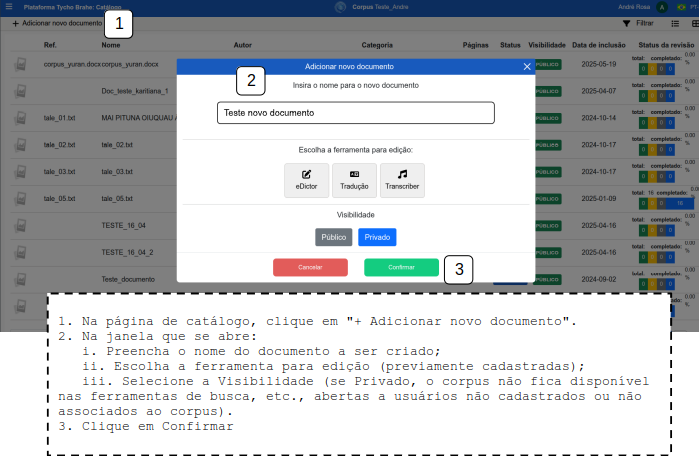

# DOCUMENTAÇÃO PLATAFORMA TYCHO BRAHE (TYCHO BRAHE PLATAFORM)

<figure>

</figure>

---

SUMÁRIO

- [DOCUMENTAÇÃO PLATAFORMA TYCHO BRAHE (TYCHO BRAHE PLATAFORM)](#documentação-plataforma-tycho-brahe-tycho-brahe-plataform)
  - [Caso de uso 03\_02 - Criação, configuração e edição de novos documentos](#caso-de-uso-03_02---criação-configuração-e-edição-de-novos-documentos)
    - [Criação de novos documentos](#criação-de-novos-documentos)
      - [**Fluxo normal**](#fluxo-normal)

---

## Caso de uso 03_02 - Criação, configuração e edição de novos documentos

Esta funcionalidade permite aos usuários associados aos corpora criarem novos documentos dentro dos corpora. Estafuncionalidade oferece recursos de criação de documentos, seleção de ferramentas de edição a serem utilizadas no documento, seleção de nível de publicidade do documento.

Nos tópicos a seguir serão desenvolvidos os principais fluxos envolvidos na criação de novos documentos.

### Criação de novos documentos

**Objetivo**: Este tutorial detalha os passos necessários para a criação de novos documentos no catálogo de corpora aos quais o usuário é associado.

**Atores primários**:

1. Usuário com permissões de editor ou admin no respectivo corpus

**Pré-requisitos:**

1. Os usuários devem ser previamente cadastrados e ter permissões de administrador ou editor nos corpora a serem editados.
2. Para que as ferramentas desejadas sejam associadas ao documento criado, o admin do corpus deve tê-las habilitado na página de admin - configurações de corpora.

#### **Fluxo normal**

1. Acesse a página _home_ da plataforma através do link: <https://www.tycho.iel.unicamp.br/home>.
2. Na área de "Ferramentas", o Usuário acessa "Área reservada" para ser redirecionado ao _login_.

3. Realize o _signin_ (ver caso de uso 00 - sign in).
4. Acesse o botão eDictor na área de botões de acesso rápido (sendo redirecionado ao catálogo do corpus):

5. Na página de catálogo, clique em "+ Adicionar novo documento".
6. Na janela que se abre:
   1. Preencha o nome do documento a ser criado;
   2. Escolha a ferramenta para edição (previamente cadastradas);
   3. Selecione a Visibilidade (se Privado, o corpus não fica disponível nas ferramentas de busca, etc., abertas a usuários não cadastrados ou não associados ao corpus).
7. Clique em Confirmar

Após criação do documento ele fica disposto no catálogo:

**Nota**: A Visibilidade deve ser selecionada como privada, por exemplo, durante a anotação do documento, ou quando o material tem questões relacionadas ao _copyright_.
