# DOCUMENTAÇÃO PLATAFORMA TYCHO BRAHE (TYCHO BRAHE PLATAFORM)

<figure>

</figure>

---

SUMÁRIO

- [DOCUMENTAÇÃO PLATAFORMA TYCHO BRAHE (TYCHO BRAHE PLATAFORM)](#documentação-plataforma-tycho-brahe-tycho-brahe-plataform)
  - [Caso de uso 03 - Criação, configuração e edição dos corpora](#caso-de-uso-03---criação-configuração-e-edição-dos-corpora)
    - [Criação de corpora](#criação-de-corpora)
      - [**Fluxo normal**](#fluxo-normal)
    - [Configuração de corpora](#configuração-de-corpora)
      - [**Fluxo normal**](#fluxo-normal-1)
        - [**Aba Information**](#aba-information)
          - [Coluna **General Information**](#coluna-general-information)
          - [Coluna **Image Galery**](#coluna-image-galery)
          - [Coluna **Related Papers**](#coluna-related-papers)
        - [**Aba Resume**](#aba-resume)
        - [**Aba Parâmetros**](#aba-parâmetros)
        - [**Aba Access Control**](#aba-access-control)
        - [**Aba Catalog**](#aba-catalog)
        - [**Aba Configurations**](#aba-configurations)
      - [**Fluxo alternativo:**](#fluxo-alternativo)

---

## Caso de uso 03 - Criação, configuração e edição dos corpora

A ferramenta de gestão de corpora é um componente fundamental para a construção e configuração eficiente de coleções de textos destinados a análises linguísticas. Este processo pode ser realizado por Administradores e usuários devidamente cadastrados e com as credenciais corretas (de edição).

Para os administradores, a ferramenta oferece recursos avançados para a criação e configuração dos corpora, atribuição de permissões e gerenciamento etc.

Há três formas para executar a criação de corpora na ferramenta Tycho Brahe:

1. _Translation mode_ (Modo traduções) ou _Translation eDictor_
2. TO DO<!-- <-[REVISAR CRÍTICO: INSERIR LISTA DE MANEIRAS DE DEV DE CORPUS]...diz respeito às ferramentas que vou habilitar na configuração dos corpora? Use eDictor, use Transcriber, Use designer ... ?-->

Nos tópicos a seguir, serão abordados os principais fluxos de trabalho para a criação e configuração de novos corpora, além de tutoriais detalhados que guiam administradores e usuários no uso eficiente da ferramenta, garantindo uma experiência fluida e colaborativa na gestão dos catálogos.

### Criação de corpora

**Objetivo**: Este tutorial detalha os passos necessários para a criação de novos corpora através através do link de administrador.

**Atores primários**:

1. Administrador
2. Usuário

**Pré-requisitos:**

1. Os usuários devem ser previamente cadastrados e ter permissões de administrador. <!--REVISAR CRÍTICO: SOMENTE ADMINS PODEM CRIAR NOVOS CORPORA?-->

#### **Fluxo normal**

1. Acesse a página inicial de administrador da plataforma Tycho Brahe, através do link: <https://www.tycho.iel.unicamp.br/admin> e realize o login (se não estiver logado).

2. Ao acessar a página de adminstrador, uma lista de corpora disponíveis abre. Clique em _"+ Create new corpus"_.

"
Criação de um novo corpus

3. Adicione um nome ao novo corpus e clique em "Confirmar": esta ação finaliza a criação do corpus (Note que estas ações apenas criam o corpus. Para inclusão/edição de documentos, ou seja, alimentar o corpus ver Caso de uso 03.2). Após preencher com o nome desejado, clique em "Confirmar". Esta ação cria um novo corpus, que aparecerá na lista.

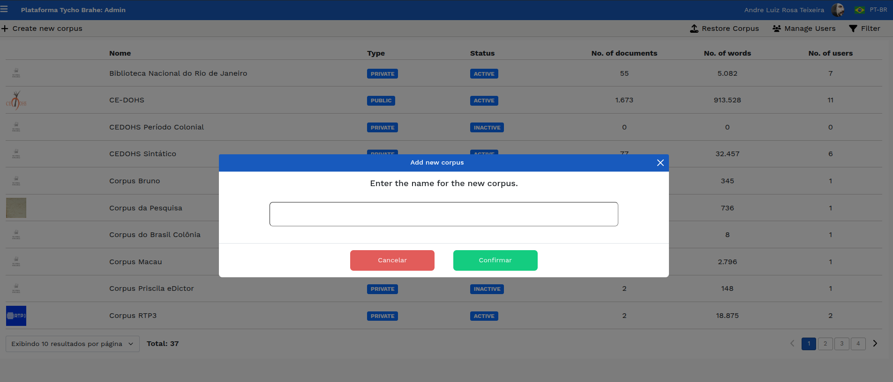
Criação de corpus: inserção de nome

**Nota**: este processo apenas cria o corpus. Sua alimentação (importação de dados/transcrição de áudios/extração de dados a partir de textos impressos etc.) pode ser realizada de diferentes formas a depender do tipo de material disponível (textos em papel, áudios, arquivos .txt, arquivos .csv - com ou sem traduções), das configurações estabelecidas (Caso de uso 03.2). É necessário que haja uma interação com a equipe responsável pelo desenvolvimento da plataforma para que a melhor estratégia de importação de dados seja escolhida e aplicada. Cada um dos tipos de importação/transcrição de dados linguísticos será discutido separadamente nesta documentação.

### Configuração de corpora

**Objetivo:**: Este tutorial detalha os passos necessários para a configuração dos corpora. As configurações são responsáveis disponibilização de informações iniciais referentes ao corpus, bem como por determinar desde o status dos corpora, grau de privacidade, tipo de display do corpus na plataforma, tipos de ferramentas habilitadas para o corpus etc.

**Atores primários**:

<!--REVISAR CRÍTICO: VERIFICAR SOBRE AS CREDENCIAIS NECESSÁRIAS SE UM USUÁRIO NORMAL, MAS COM ACESSO ADMIN CONSEGUE REALIZAR CONFIGURAÇÕES-->

1. Administrador
2. Usuário (com permissão de admin no corpus)

**Pré-requisitos:**

1. Os usuários devem ser previamente cadastrados e ter permissões de administrador. Para cadastro, ver Caso de uso 01; para solicitar cadastro, ver Caso de uso 02. Um corpus deve ter sido criado previamente (ver caso de uso 03.1).

#### **Fluxo normal**

1. Acesse a página inicial da plataforma Tycho Brahe, através do link: <https://www.tycho.iel.unicamp.br/home> .

2. Navegue até a área "Ferramentas" e selecione "Área Reservada".

Acessando "Área Reservada"

3. Na página de perfil que se abre, os corpora disponíveis, vinculados ao usuário, são apresentados. Selecione o corpus que deseja configurar e clique no botão "Admin" na área de "Acesso rápido" ou "Admin" na área "Minhas Ferramentas" e selecione o corpus que deseja configurar.

Acesso rápido - botões "Admin"

4. Na tela inicial de adminstração do corpus selecionado, são apresentadas 6 abas de configuração do corpus: **Information, Resume, Parâmetros, Access Control, Catalog, e Configurations**. Cada uma delas será detalhada abaixo. 

##### **Aba Information**

Ao clicar-se nesta aba, aparecem três colunas de informação: informações gerais sobre o corpus, a maioria delas editáveis; Galeria de imagens; e Artigos Relacionados.

###### Coluna **General Information**

**Edição do nome do corpus**:

1. Clique sobre a área do nome do corpus para alterar - um campo editável vai se abrir;
2. Realize a edição;
3. Clique em "aplicar" para salvar as alterações.

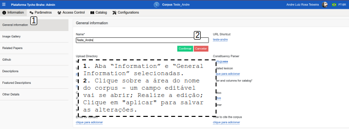

**URL Shortcut**: este campo apresenta o atalho que redireciona para o corpus no Visualizador (www.tycho.iel.unicamp.br/c/shortcut). Neste sentido, só surte efeito se o corpus for parametrizado como "público".

1. Clique sobre a área do nome do atalho - um campo editável vai se abrir;
2. Realize a edição;
3. Clique em "aplicar" para salvar as alterações.

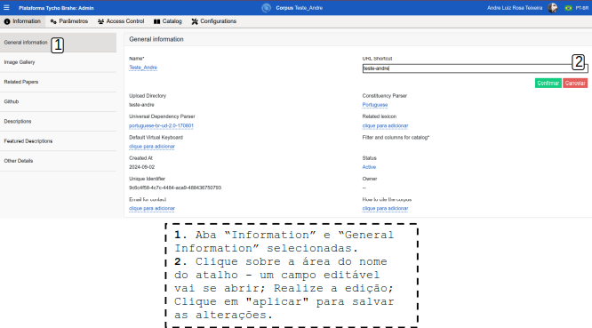

Este atalho redireciona para o Visualizador:

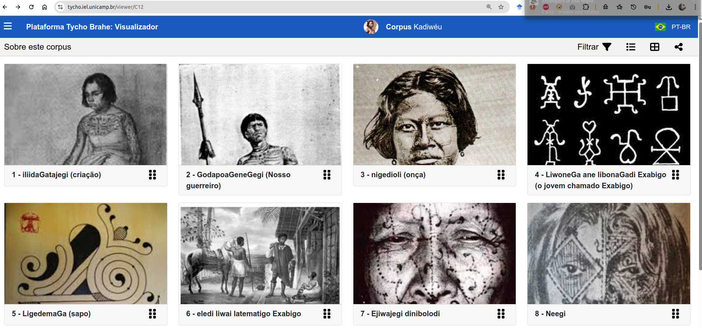

**Upload Directory**: este campo não é editável e representa o nome do diretório físico criado no servidor onde são mantidas todas as imagens, áudios, arquivos de importação do corpus. Este nome é baseado no nome do corpus, após uma limpeza dos espaços em branco, acentos e símbolos.

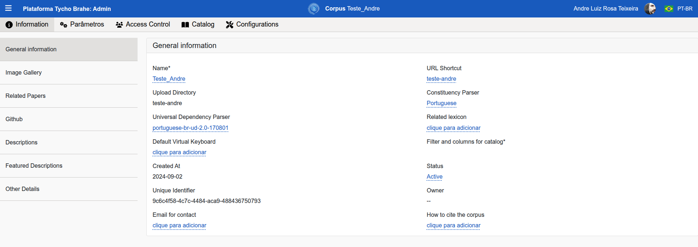

**Constituency parser**: neste campo o usuário seleciona um parser de constituência dentre as diversas opções disponíveis. Há parser desenvolvidos por terceiros ou parsers baseados em regras desenvolvidos no âmbito do projeto.

1. Clique sobre o campo. As opções de parsers disponíveis aparecerem em uma lista suspensa.
2. Selecione o parser de constituência desejado.
3. Clique em "aplicar" para salvar a seleção.
  
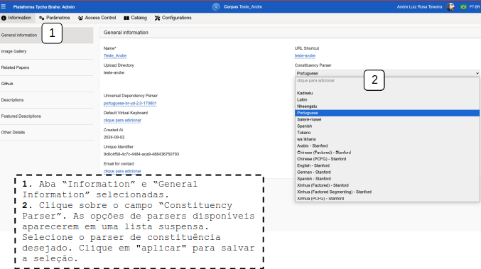

**Universal Dependency Parser**: neste campo o usuário seleciona um parser de Dependências Universais dentre as diversas opções disponíveis. Os parser disponíveis neste campo são desenvolvidos por terceiros para diversas línguas.

1. Clique sobre o campo. As opções de parsers disponíveis aparecerem em uma lista suspensa.
2. Selecione o parser de Dependências Universais desejado.
3. Clique em "aplicar" para salvar a seleção.

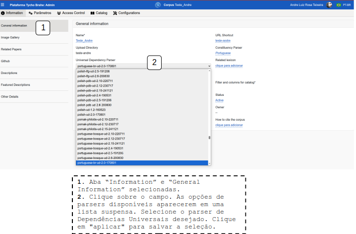

**Filter and columns for catalog**: este campo apresenta opções de cabeçalhos para colunas de informações que podem ser selecionados para apresentação no catálogo. As opções possíveis são: Name, Status, Reference, Category, Author, Picture.

1. Clique sobre o campo. As opções serão apresentadas para marcação.
2. Selecione a opção marcando a caixinha.
3. Clique em "aplicar" para salvar a seleção.

As seleções têm impacto na apresentação dos documentos na página do corpus no catálogo:

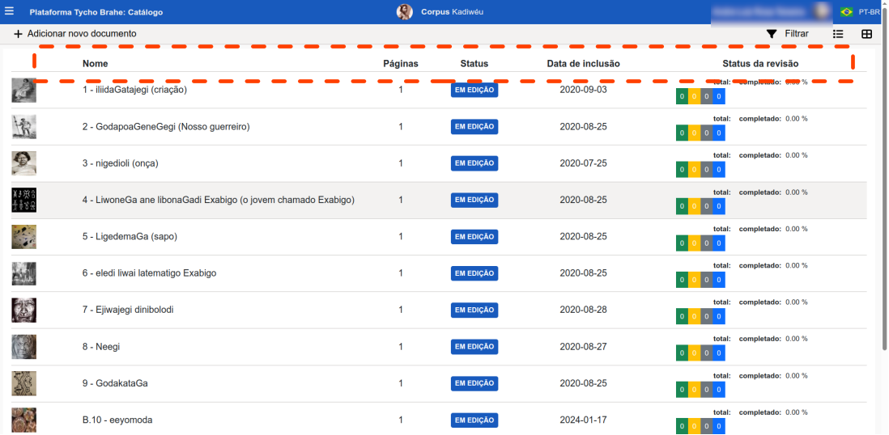

**Status**: este campo apresenta o statuso do corpus como "Ativo" (corpus ativo - se selecionado o corpus fica disponível na ferramenta de visualização e busca), "Inativo" (indisponível ao público geral nas ferramentas de busca e visualização), "Archivado" (corpus archivado e aguardando ser deletado, e indisponível ao público geral nas ferramentas de busca e visualização) ou "Demo" (corpus criado para demonstração, indisponível ao público geral nas ferramentas de busca e visualização):

1. Clique sobre o campo. Um lista suspensa fica disponível com as opções.
2. Selecione uma opção de status.
3. Clique em "aplicar" para salvar a seleção.

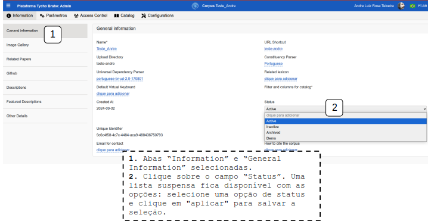

**Unique Identifier**: este campo apresenta o identificador do corpus. É gerado na criação do corpus e é único na base de dados. Na figura a seguir, no corpus Kadiwéu, é representado por C12 - é o códico que aparece nos links/atalhos dos corpora, por exemplo, https://www.tycho.iel.unicamp.br/catalog/C12, no catálogo, e https://www.tycho.iel.unicamp.br/viewer/C12 no visualizador.

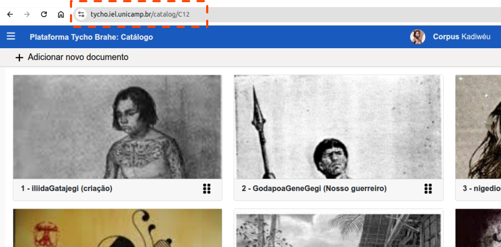

###### Coluna **Image Galery**

Esta coluna apresenta a Galeria de Imagens. A imagem selecionada será a imagem de capa do corpus.

1. Para selecionar uma imagem, clique sobre o botão "+ Click here to add a new image".
2. Uma caixa de "upload de arquivo" abre. Arraste e solte uma imagem ou clique para selecionar no diretório de escolha.
3. Clique em "confirmar" para salvar a seleção.

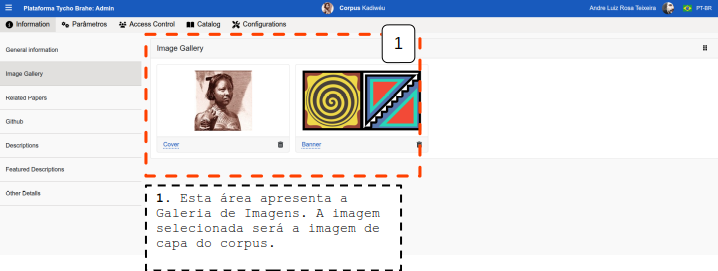

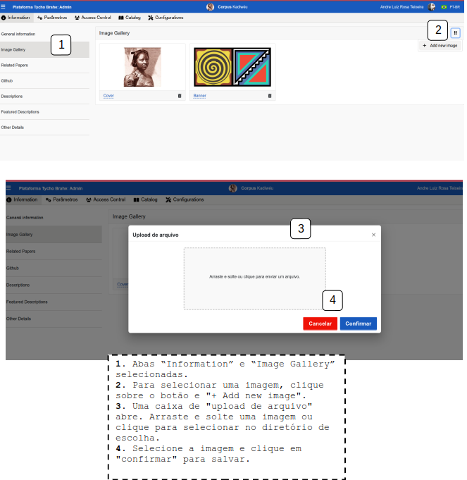

 

###### Coluna **Related Papers**

Esta coluna apresenta os artigos relacionados ao corpus.

1. Para preencher informações de um novo artigo relacionado, clique sobre o botão "+ Click here to add a new paper"
2. Preencha as informações do artigo: título, autor, adicionar um link ou realizar o upload do artigo.

3. Se for realizar upload do arquivo do artigo, selecione o botão de upload, arraste e solte ou clique para selecionar o arquivo e confirme.

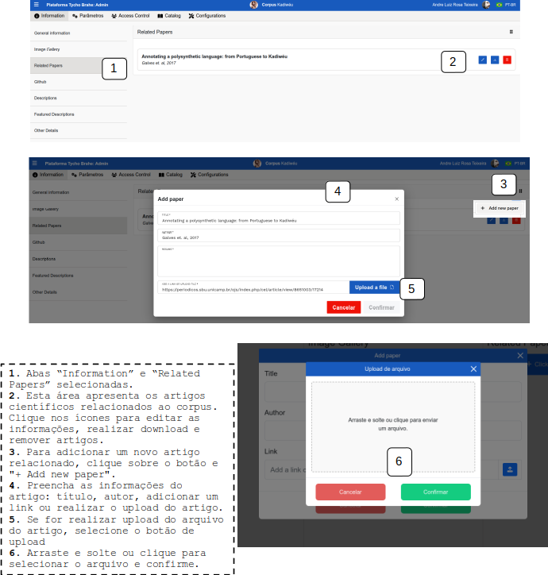

Após preencher os dados e salvar, o artigo adicionado aparece na coluna com as informações.
É possíve fazer o dowload do artigo e detelá-lo, clicando nos ícones de nuvem e lixeira, respectivamente:

##### **Aba Resume**

Esta aba dispõe três botões: 
**Resume** - uma descrição resumida sobre o corpus, contendo, de maneira geral, as seguintes informações: um histórico sobre a língua, objetivos potenciais de compilação do corpus, potencial de uso em ferramentas e impacto social etc:

1. Selecione o botão azul "Resume".
2. Edite o campo à esquerda com o texto desejado.
3. À direita é apresentado o texto renderizado. No canto superior direito, o usuário consegue alternar o enfoque em janela de edição, edição e renderização, somente renderização e tela cheia.
4. Após edição, clique em "Save" no topo direito superior para salvar as alterações.

 **Resume Translation** - este botão apresenta a tradução do Resume:

1. Edite o campo à esquerda com o texto desejado.
2. À direita é apresentado o texto renderizado. No canto superior direito, o usuário consegue alternar o enfoque em janela de edição, edição e renderização, somente renderização e tela cheia.
3. Após edição, clique em "Save" no topo direito superior para salvar as alterações.

**Featured** - contém um parágrafo resumindo informações do corpus para apresentação na página de corpora em destaque.  

1. Preencha o campo em inglês, respeitando o máximo de caracteres.
2. Preencha o campo com a tradução, respeitando o máximo de caracteres.
3. Clique em "Save" para salvar as alterações.

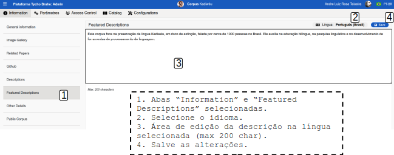

O texto editado em "Featured" aparece na página inicial da plataforma, na definição dos corpora em destaque:

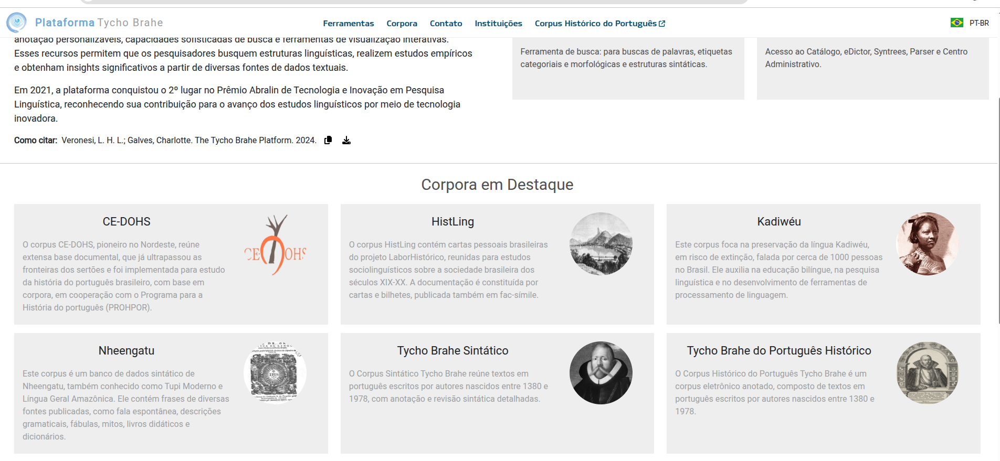

##### **Aba Parâmetros**

1. Clique em "Parâmetros": uma caixa se abre, disponibilizando diversos botões de alternância para configuração do corpus.

2. Diversos botões de alternância são apresentados. Selecione cada parâmetro de acordo com os objetivos do corpus.

**Public corpus**: seleciona se o corpus é disponível ao público em geral ou se é privado.

**Active**: configura se o corpus está ativo ou inativo;

**Featured Corpus**: Um corpus marcado com esse parâmetro aparece na página principal da plataforma, na área "Corpora em Destaque".

**Use Morphemes**: habilita o uso campos referentes a morfemas, incluindo glossa, nos corpora.

**Use Sound**: a habilita o uso de áudio no corpus.

- Como podemos observar na figura abaixo, a seleção do botão "Use Sound" habitila uma seção de Áudio, que permite ao analista incluir o áudio a ser transcrito (ou o áudio correspondente à transcrição da sentença selecionada).

  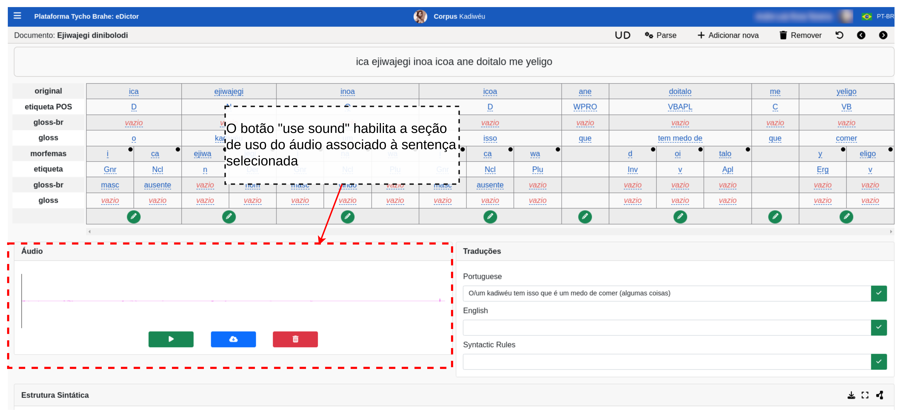
  Configuração de corpora: botão "Use Sound"

- O **"Use Sound"** também habilita, na ferramenta "eDictor", um botão de _play_ para tocar os áudios associados às sentenças do documento selecionado, como observamos na figura abaixo:
  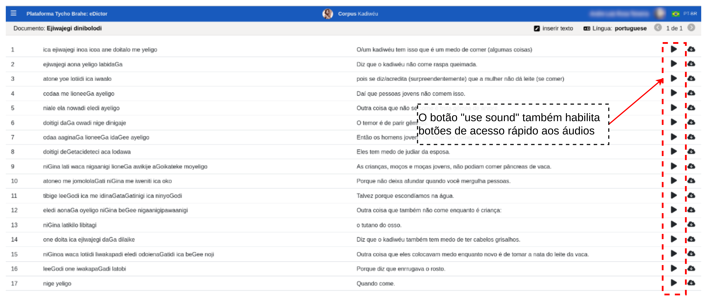
  Configuração de corpora: botão "Use Sound"(no eDictor)

**Use Translations**: o botão "Use Translations" habilita a seção de Traduções no eDictor, como apresentado na

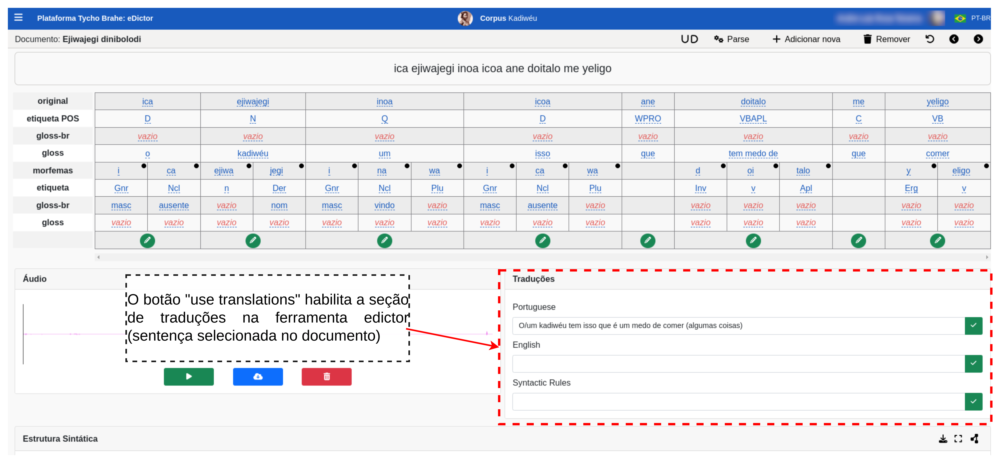
Configuração de corpora: botão "Use Translations"

**Use Lexicon**: é utilizado quando há um parser disponível, mas não há um etiquetador automático (que só funciona se houver uma quantidade mínima de palavras para treinamento do etiquetador). No caso de esta condição não estar satisfeita, o analista deve utilizar o léxico para realizar a etiquetagem automática.

**Use Grid**: ao acessar o catálogo, o usuário tem a possibilidade de apresentação de documentos de duas maneiras: lista, ou grid. Ao habilitar o botão "Use Grid", o usuário configura a apresentação em grid como default, como apresentado na Figura abaixo:

Configuração de corpora: botão "Use Grid"

**Use Category**: este botão habilita a possibilidade de categorização e subcategorização dos corpora (por exemplo, categorização com base em parâmetros demográficos etc). Note-se que a criação dos rótulos para as categorias pode ser realizada por um usuário com permissões de adminstrador

Configuração de corpora: botão "Use Category"

**Use Edition Tiers**<!--[REVISAR COM O LUIS]-->: este botão habilita a disponibilização de diversos níveis de edição para garantir a máxima fidelidade filológica do texto. Por exemplo, acessando-se o catálogo, selecione o corpus Tycho Brahe do Português Histórico e selecione o documento "Atas dos Brasileiros - Tomo 02", como apresentado na Figura:

 Configuração de corpora: botão "Use Edition Tiers"

Configuração de corpora: botão "Use Edition Tiers" (abrindo a ferramenta).

Configuração de corpora botão "Use Edition Tiers"

Esta ação abre um painel com uma matriz para edição dos níveis de edição, como mostra a Figura abaixo. Note-se: na mesma tela que seria análoga à sentença com o "Use Morphemes" selecionado, são apresentadas os níveis de edição.

Matriz para edição em níveis de edição

Os botões "Use eDictor Translations"/"Use eDictor"/"Use Designer"/"Use Transcriber" não são excludentes, i.e., podem ser habilitados ao mesmo tempo em um determinado corpus. Esta ação disponibiliza todas as ferramentas para utilização no corpus.

**Use eDictor Translations**: Habilita o uso da versão eDictor para apresentação de corpora paralelos, como apresentado na Figura a seguir:

Configuração de corpora: botão Use eDictor Translations - Corpora paralelos

A configuração do eDictor Tranlations também depende de configurações na aba eDictor na pagina de admin ("Corpora Management"):

- Acesse a página inicial da ferramenta no endereço <https://www.tycho.iel.unicamp.br/home>;
- Acesse "Corpora Management" na área de Ferramentas.
- Selecione o corpus que deseja configurar (ou crie um novo corpus em "+ Create New Corpus").
- Selecione a aba "eDictor" e "Translations" no canto esquerdo.
- Clique em "Create": uma caixa com campos de configurações para entradas de tradução abre:
  - **Order**: aceita números inteiros para configuração da ordem em que as línguas de tradução serão apresentadas;
  - **Symbol**: preencha com o rótulo desejado;
  - **Name**: preencha com o nome desejado;
  - **Reference**: preencha para adicionar uma referência.<!--[REVISAR: ESTA REFERENCIA DIZ RESPEITO A QUE?]-->

Estas configurações habilitam a apresentação dos corpora paralelos como em [2] na Figura abaixo; Em [3], o usuário pode selecionar qual lingua de tradução deseja que seja apresentada; Em [4], após a seleção de uma sentença, é possível verificar as traduções para a sentença selecionada, além de ser possível realizar edições nas traduções.

**Use eDictor**: o acionamento do botão "Use eDictor" habilita o uso do eDictor tradicional para transcrição e edição.

**Use Designer**: o acionamento deste botão habilita o uso da versão do eDictor para trabalhar com textos de layouts complexos, como jornais.

**Use Transcriber**: este botão habilita o uso da versão do eDictor para trabalhar com transcrição de áudio.

**Allow POS Tag inclusion**: o acionamento deste botão possibilita adicionar novas etiquetas POS à lista enquanto o usuário edita sentenças no eDictor.

**Default for UD**: habilita que o corpus seja configurado para usar Universal Dependencies como o framework padrão para edição de sentenças.

##### **Aba Access Control**

Esta configuração é tratada em um caso de uso separadamente: ver [o caso de uso 01 - cadastro novos usuários](../casos_de_uso_tutorial/tutorial_caso_01_cadastro_novos_usuarios.md).

##### **Aba Catalog**

Esta aba dispõe os documentos presentes no corpus selecionado para configurações. Os documentos são dispostos em linhas, e colunas com informações Reference, Name, Status, Category, Added date, num Pages, num Sentences, num Words.

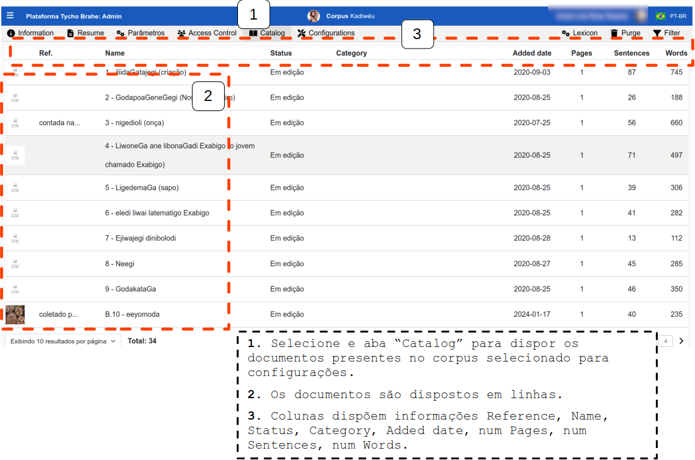

1. Clique sobre um documento para abrir uma janela de edição de informações sobre os documentos.

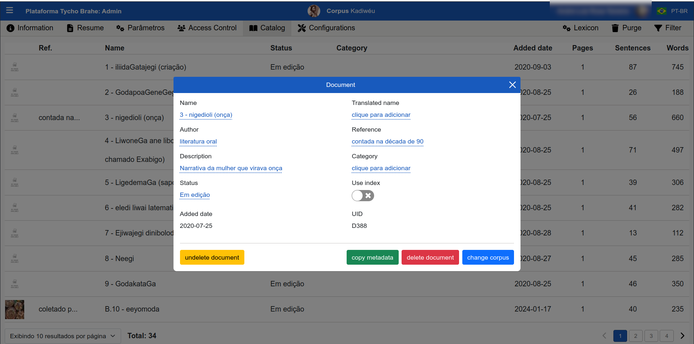

2. A maioria dos campos são editáveis (abertos) e aceitam texto. Clique sobre o campo e preencha as informações pertinentes (Name, Author, Description, Translated Name, Reference), clique em aplicar para que as alterações sejam salvas.

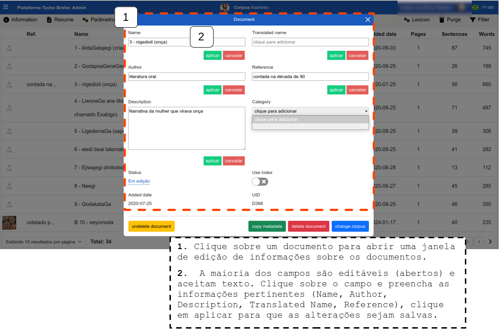

3. Os campos Status e Category apresentam um menu suspenso de opções. Clique sobre o campo, selecione a opção desejada e clique em aplicar para salvar as alterações. O campo Status tem as seguintes opções: Excluído, Em edição, Edição finalizada, Em revisão sintática, Finalizado. As opções de Catagory dependem do cadastro de categorias na aba Configurações - Categories. Há ainda a possibilidade de selecionar o botão de alternância "Use index": <!--REVISAR CRÍTICO: qual a funcionalidade? Não está funcionando--> 

##### **Aba Configurations**
Esta aba dispõe configurações de meta informações (informações que serão utilizadas e empregadas na edição (eDictor), busca, apresentação dos documentos no catálogo, categoria de morfemas e de palavras, traduções etc ) <!--REVISAR CRÍTICO-->

**Metadata**
[12:15, 06/05/2025] Luiz Veronesi: no catálogo
[12:16, 06/05/2025] Luiz Veronesi: quando se clica em um documento tem uma aba para preenchimento
[12:16, 06/05/2025] Luiz Veronesi: depois é exibido no visualizador e usado na busca, quando o atributo "used in search" está marcado
[12:17, 06/05/2025] Luiz Veronesi: quando está marcado "used in catalog grid", aparece na lista do catálogo
[12:17, 06/05/2025] Luiz Veronesi: e "used for importing" é no IO

#### **Fluxo alternativo:**

**A1** - **Acesso direto pelo link de administrador**

1. Acesse o link de administrador: <https://www.tycho.iel.unicamp.br/admin>.
2. Navegue até o corpus desejado e o selecione, clicando sobre ele (isto abre a página de gestão do corpus).

Acesso configuração de parâmetros - Fluxo alternativo 1

1. Retomar a partir do passo 4 do Fluxo normal e realizar as configurações gerais do corpus. 
---
