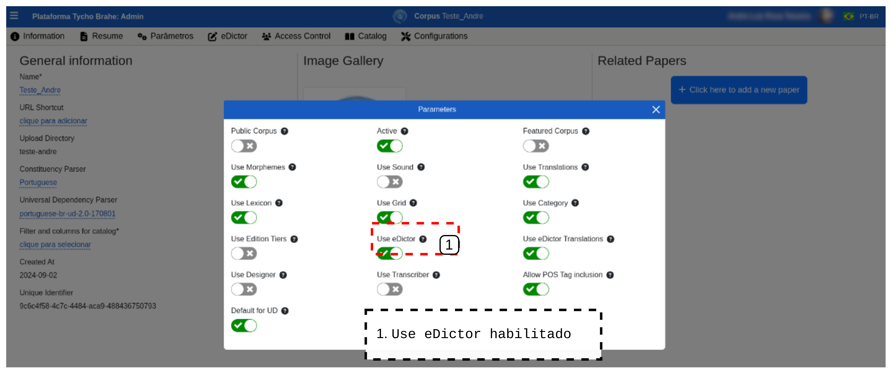
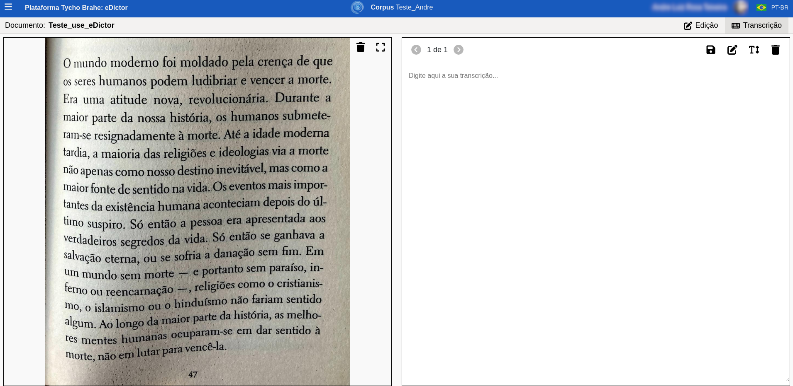
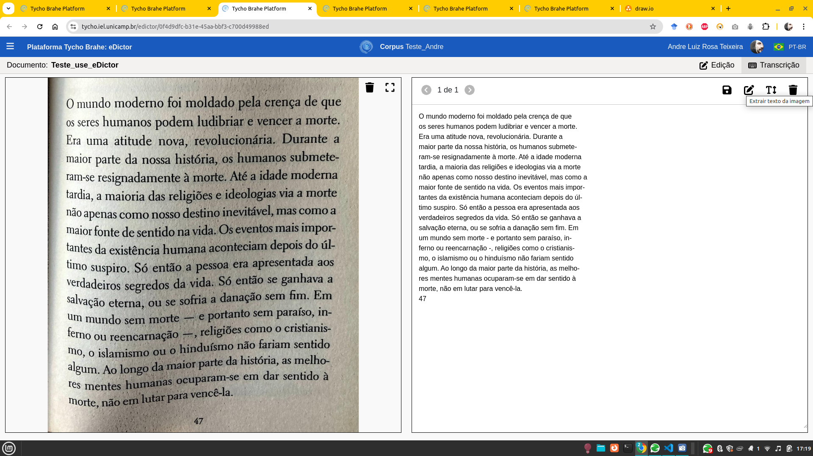
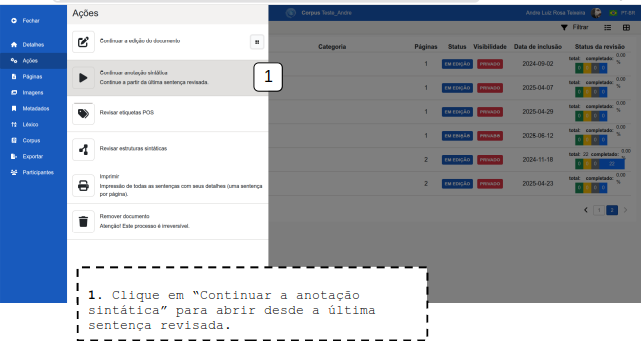
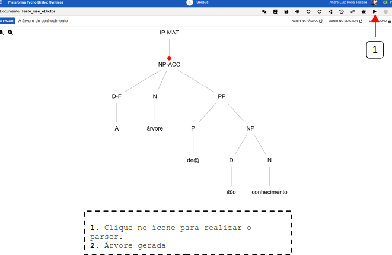

# DOCUMENTAÇÃO PLATAFORMA TYCHO BRAHE (TYCHO BRAHE PLATAFORM)

<figure>

</figure>

---

SUMÁRIO

- [DOCUMENTAÇÃO PLATAFORMA TYCHO BRAHE (TYCHO BRAHE PLATAFORM)](#documentação-plataforma-tycho-brahe-tycho-brahe-plataform)
  - [Caso de uso 04 - Ferramenta **Use eDictor**](#caso-de-uso-04---ferramenta-use-edictor)
    - [Tutorial:](#tutorial)
      - [**Fluxo normal**](#fluxo-normal)
        - [Operações no menu suspenso](#operações-no-menu-suspenso)

---

## Caso de uso 04 - Ferramenta **Use eDictor**

A ferramenta **Use eDictor** é uma funcionalidade integrada à plataforma Tycho Brahe que permite aos usuários realizar transcrições e edições de novos corpora utilizando o eDictor, uma ferramenta tradicional para edição e anotação de textos. Com o Use eDictor, é possível transcrever textos a partir de imagens, realizar edições manuais ou automáticas, etiquetar palavras com informações morfológicas e sintáticas, além de aplicar diversas operações de edição, como inserção, remoção, junção e segmentação de palavras. A ferramenta oferece suporte tanto para transcrições manuais quanto automáticas, proporcionando flexibilidade e eficiência no processo de edição de textos. Além disso, o **Use eDictor** permite a revisão e correção de etiquetas POS (Part-of-Speech) e a aplicação de parsers sintáticos, facilitando a análise linguística e a preparação de corpora para estudos avançados.

**Atores primários**:

1. Usuário com permissões de editor no corpus.
2. Administrador (com permissão de editor no corpus alvo)

**Pré-requisitos:**

1. Usuário logado (com permissões de edição no corpus)
2. Corpus previamente criado e o botão de configuração de parâmetros "Use eDictor" habilitado.

### Tutorial:

**Objetivo:**
Este tutorial apresenta em detalhes o uso do edictor para edição e revisão dos corpora.

#### **Fluxo normal**

1. Verifique (ou Habilite) o **use eDictor** na página de /admin do corpus, na aba de parâmetros.

   
   Habilitando o use eDictor.

2. Verifique se o documento que deseja editar está no corpus, ou adicione novo documento para transcrição e edição.

   1. Clique em "+Adicionar novo documento".
   2. Preencha o nome do novo documento.
   3. Selecione a Ferramenta de edição desejada para o documento (dentre use eDictor ou eDictor Translation) - Para este caso de uso selecione o use eDictor.

   
   Adicionando documento para use eDictor.

3. Realize o upload de um arquivo de imagem de onde pretende realizar a transcrição: do lado esquerdo da página que abre após a criação do documento, clique em "clique aqui para realizar o upload", selecione imagem e confirme.

   
   Upload de documento para eDictor.

   
   Envio do aquivo para eDictor.

4. Transcrições:
   **Manual**: Clique o botão "Transcrição" para abrir o campo de preenchimento manual das transcrições do texto da imagem inserida.

   

   **Automática**: Clique o botão "extrair texto de imagem"(T), no canto superior direito, para realizar a transcrição automática a partir da imagem com texto.

   
   Transcrição automática - extrair texto da imagem   

5. Preenchidas as transcrições, manualmente ou automaticamente, salve as alterações clicando no ícone em [2].  

   
   Salvando uma transcrição .  

6. Clique no ícone de "ir para o modo edição" para preparar o texto para receber edições (o texto será tokenizado (palavras e sentenças) e será preparado para outros tratamentos computacionais, como etiquetagme POS, parser automático etc).

   
   Preparando texto para edição   

7. Etiquetagem e outras edições:
   **Edições manuais** realizadas em cada palavra da sentença. Estas edições são feitas ainda no ambiente de edição o eDictor. Para abrir os campos de edição, clique sobre palavra que deseja editar e realize as edições desejadas:

   **Operações**: 
   

   - **Inserir palavras**: selecionada uma palavra da sentença, no menu "Operações" seleciona "inserir". Uma tela com espaço para preencher palavras a serem inseridas se abre. Preencha as palavras que deseja adicionar e confirme. Note que as palavras preenchidas serão inseridas após a palavra selecionada para edição na sentença;

     

   - **Dividir**: Divida a palavra selecionada em duas ou mais (separadas por espaços). As palavras separadas por espaços serão incluídas como novos _tokens_ na sentença e todas as informações dar parseamento serão redefinidas.  

     
     Dividindo palavras.  

   - **Juntar com a próxima**: Com a palavra que será junta e a operação "juntar com a próxima" selecionadas, clique em "Confirmar" para juntar as palavras. Note que a palavra selecionada se juntará à seguinte na sentença e informações de parseamento serão redefinidas.

     
     Juntar com a próxima palavra.  

   - **Spliter**: é possível adicionar ou remover spliter de um par de palavras. <!--[ REVISAR: VER COM O LUIZ COMO FUNCIONA - NÃO PARECE ESTAR EM FUNCIONAMENTO?]-->

   - **Remover** uma palavra: Selecione a palavra que deseja remover, clique em "remover" e confirme.

     
     Remoção de palavras.  

   - **Observações**: é possível adicionar observações nas palavras. Clique em "Observações", preencha o campo com as observações desejadas e confirme. As palavras com observações serão grifadas no eDictor e as observações são apresentadas ao usuário passar o cursor sobre a palavra grifada.

   
   Incluindo observações.  

   - **Notas de rodapé**: é possível, também, adicionar notas de rodapé nas palavras. Com a palavra selecionada, clique em "Notas de rodapé". Preencha o campo com as notas desejadas e confirme. O token recebe um índice superior e a nota correspondente aparece no rodapé do eDictor.

   
   Notas de rodapé  

   - **Edição da palavra original**: é possível realizar uma edição na palavra selecionada. Selecione a palavra desejada; no campo "Palavra original" realize as edições desejadas e clique em "Salvar".

   
   Editando as palavras originais.  

   - **Etiqueta POS**: selecione a palavra que deseja etiquetar; clique sobre o campo "Etiquetas POS" para abrir um menu suspenso com as opçõs de etiquetas POS; selecione a etiqueta apropriada; clique em "Salvar".

   
   Etiquetando POS.  

   - **Flexão**: além da etiqueta POS, também é possível marcar etiquetas de flexão (1,2,3S e 1,2,3P). Clique no campo "Flexão" para abrir o menu suspenso; selecione a flexão desejada e clique em "Salvar".

   
   Etiquetas de flexão  

   - **Ignorar para análise automática**: esta botão de alternância marca a palavra selecionada para ser ignorada pela análise automática. Essa operação altera a estrutura sintática e todas as informações de análise são redefinidas. Com a palavra selecionada, clique no botão de alternância "Ignorar para análise automática", leia a mensagem de aviso e clique em "Confirmar".

   
   Ignorar palavra para análise automática.  

   - "**Marcar esta palavra para ser revisada**": este botão de alternância grifa a palavra, marcando-a como palavra a ser revisada.

   
   Marcar palavra para revisão

- **Operações de edição**:
  <!--[REVISAR: pedir Luiz exemplos de segmentação e junção para entender melhor o objetivo destas funcionalidades-->

  - junção: é possível inserir junções. Selecione uma palavra, preencha o campo "junção" e clique no botão azul para confirmar.
  - segmentação: é possível incluir segmentações. Selecione a palavra, preencha o campo "segmentação" e clique no botão azul para confirmar.

  
  Junção e Segmentação.  

  - **Níveis de edição**: é possível preencher diversos níveis de edição da palavra selecionada.Selecione a palavra desejada, preencha os diversos Níveis de edição: grafia, expansão, correção, pontuação, ilegível, modernização, padronização, flexão. A palavra cujo preenchimento dos níveis de edição for realizado fica grifada, e as informações são apresentadas sob contato do cursor.

  
  Níveis de edição.

##### Operações no menu suspenso

- **"Alterações na sentença no modo edição no eDictor "**: é possível realizar algumas alterações nas sentenças ainda em modo de edição no eDictor.

1. Clique sobre uma sentença com o botão direito do mouse. Um menu se abre:
   

   1. Copiar conteúdo: copia conteúdo da sentença selecionada para área de transferência (permite colar o conteúdo da sentença em outras áreas de edição):
   
   2. "Dividir sentença em duas": divide a sentença em duas após a palavra selecionada pelo usuário:
   
   3. "Juntar sentença à seguinte": junta uma sentença à seguinte (a partir do token selecionado):
   

   4. "Adicionar texto após seleção": Preencha o texto desejado. A sentença será adicionada após a seleção. <!--REVISAR PQ TEM UM BUG AQUI-->
   

   5. “Ignorar para análise automática”: a sentença fica com as fontes em cor mais clara, indicando a marcação.
   

   A sentença com essa marcação apresenta "IGNORAR" ao acessar o catálogo e "Revisar etiquetas POS":
   
   É possível "Remover ignorar para análise automática:
   

   6. "Adicionar Participante": associar um participante (previamente criado ao acessar catálogo/corpus/documento/Participantes/+Adicionar Participantes) - Preencha o ID, Nome e outras informações pertinentes, escolha cor etc. e confirme. 
  
  
   Após a criação do perfil de Participante, é possível associar este perfil às sentenças, clicando com o botão direito na sentença para abrir o menu, clique em "Sentença" e em "Adicionar Participante", selecione o participante e confirme:
   

   7. Remover sentença: clique sobre a sentença com o botão direito para abrir o menu, selecione "Sentença" e "Excluir Sentença". Leia o aviso e confirme a exclusão.
   

**Inserir quebras**:
Para inserir quebras de linha e página:
1. Linha
   1. Clique com o botão direito sobre palavra (token) onde deseja inserir quebra de linha, um menu se abre.
   2. Clique em "Quebras" para abrir o menu suspenso.
   3. Clique em “Inserir quebra de linha”.
   A quebra de linha será adicionada após o token selecionado.
   

2. Página
   1. Clique com o botão direito sobre palavra (token) onde deseja inserir quebra de página, um menu se abre.
   2. Clique em "Quebras" para abrir o menu suspenso.
   3. Clique em “Inserir quebra de página”.
   A quebra de página será adicionada após o token selecionado.
   

**Formatar**

1. Clique com o botão direito sobre palavra (token)que deseja formatar.
2. Clique em "Formatação" para abrir o menu suspenso.
3. Utilize os botões de alternância para ligar/desligar Itálico, Negrito, Sublinhado e Tachado.  Clique sobre o campo e preencha o Espaçamento. Confirme.

**Seções**
Para associar seções a trechos de texto (esta ação pressupões que seções tenham sido criadas previamente - para mais detalhes ver Caso de uso 03 - criação e configuração de corpora, página de admin):

1. No eDictor, selecione a aba de "Edição
2. Sobre a parte que deseja associar a um rótulo de seção, clique com o botão direito do mouse.
3. No menu que se abre, clique sobre "Seção" e "Adicionar seção"
4. Clique no menu “Tipo de seção” e escolha uma seção previamente cadastrada.

**Nota:** as seções que são disponibilizadas ao usuário no eDictor dependem de uma configuração extra: se a seção for configurada com um "gênero" ela só ficará disponível para rotulação em documentos também associados ao respectivo gênero.

Após a rotulação com a respectiva seção, o trecho apresenta-se com uma etiqueta no eDictor. No exemplo, o título do texto foi etiquetado como "titulo":

Para criar seções, ver Caso de uso 03 - criação e configuração de corpora, página de admin.

1. Selecione “Configurations”.
2. Selecione “Sections”.
3. Clique no ícone e selecione “+ Create” para criar uma nova categoria.
4. Na janela que se abre, preencha e clique em “aplicar” para salvar as alterações:
   1. Order: ordem em que a categoria será disposta;
   2. Symbol: rótulo da categoria;
   3. Name(obrigatório): nome da categoria;
   4. Genre: gênero ao qual a seção é parte integrante.
5. Clique em “Confirmar”.

**Outras edições realizadas na sentença**: há duas maneiras de acessar as sentenças para realizar o _parser_ e revisar/editar manualmente a etiquetagem realizada automaticamente. Ao acessar o catálogo e acessar a área "exibir informações" do documento, selecionar:

- **"Continuar anotação sintática"** (Continue a partir da última sentença revisada): Ao acessar esta área, a plataforma apresenta a última sentença revisada do documento (e se o parser já tiver sido aplicado previamente, apresenta também a árvore que corresponde à sentença). É possível navegar entre as sentenças através das setas do lado direito superior.

  1. Para rodar o _parser_ na sentença selecionada é necessário que um parser tenha sido associado ao corpus previamente. Em caso afirmativo, clicar em no ícone de "▶️" no canto superior direito.
  

  1. É possível editar os nós da árvore sintática: clicar sobre o nó desejado e selecionar a etiqueta adequada.
     1. Clique sobre um nó para editá-lo.
     2. Clique sobre o campo de “Tag” para selecionar uma etiqueta na lista suspensa.
     3. Selecionar uma “Extension” da etiqueta no nó selecionado.
     4. Clique no ícone "✔" para salvar as as alterações
  
  1. Para conectar automaticamente ou remover um nó, clique com o botão direito do mouse sobre um nó para editá-lo.
     1. “Connect automatically”.
     2. ”Remove” para remover o nó.
  
  1. Para conectaros nós, clique sobre o ponto vermelho sobre o nó e arraste para outro para conectá-los. Para remover a conexão, clique com o botão direito sobre ela e clique em "remover"
  

Outras informações a ações são disponibilizadas neste tela: abrir comentários, ver manuais de anotação sintática, salvar, desfazer/refazer, aplicar layout, histórico, juntar à próxima sentença (ação não permitida caso a sentença tenha tradução e/ou áudio correspondentes), debugar _parser_, e por fim, marcar status de revisão de etiquetagem da sentença (a fazer, como pronta, para revisão).<!--REVISAR: EVENTUALMENTE ESTA PARTE DEVE SER MAIS DETALHADA-->

- **Revisar etiquetas POS**: Ao se acessar esta área, a plataforma apresenta as sentenças do documento para que o usuário possa realizar uma revisão da etiquetagem. Se o _parsing_ já tiver sido previamente realizado nas sentenças, elas apresentam as etiquetas atribuídas. Do contrário, a camada de etiquetagem POS fica com a etiqueta "vazio" atribuída a todos os tokens das sentenças.

  1. Para rodar o parser na sentença desejada (caso a sentença ainda não tenha sido etiquetada), clique no ícone "▶️" do lado esquerdo da sentença alvo.
  

  É possível também realizar edições manuais em cada uma das etiquetas nas palavras da sentença:

  2. Clique sobre o campo com "vazio" (ou etiqueta POS, se quiser editar uma anotação prévia), selecione a etiqueta POS desejada e Inflexão (se aplicável) e clique em "confirmar". 
   
  3. Ao editar uma etiqueta, é possível anotar outras ocorrências do mesmo token em _batch_, ou seja, dar a mesma etiqueta a todas as ocorrências do mesmo token. No campo de edição e seleção de uma etiqueta:
     1. Selecione a etiqueta POS desejada e Inflexão.
     2. Clique em apply all: leia a mensagem (A etiqueta "x" será aplicada a "N" ocorrência(s) da palavra "<TOKEN_SELECIONADO>". Note que as substituições serão aplicadas para todas as correspondências no documento. Se a sentença for etiquetada novamente, essa etiqueta será substituída.)

  4. Revise sentença etiquetada e marque o status desejado (Marcar a fazer, Marcar como etiquetada, Marcar como ignorada.)

     
É possível ainda realizar outras ações nesta área: 

1. Clique sobre o ícone para desfazer alterações.
2. Clique sobre o filtro para abrir campos de filtragem por “Contendo texto” ou por status.
3. Clique em "ABRIR NO EDICTOR" para retornar ao eDictor.

---
