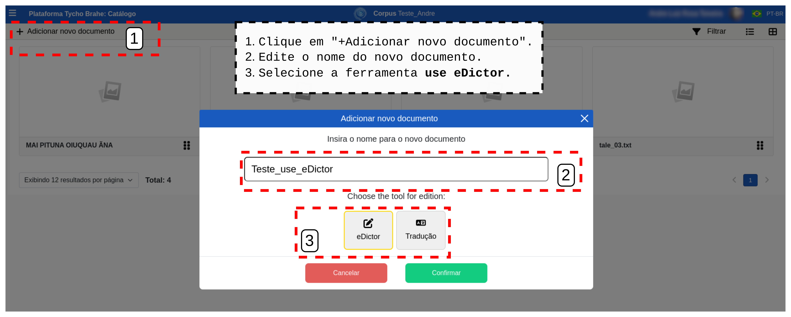
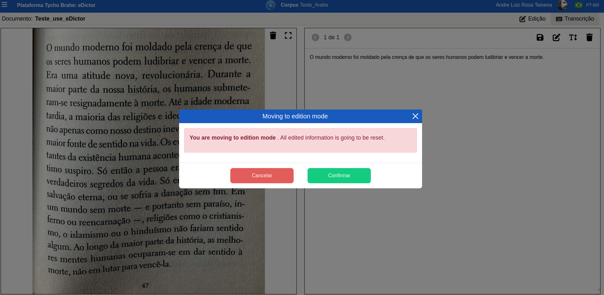

# DOCUMENTAÇÃO PLATAFORMA TYCHO BRAHE (TYCHO BRAHE PLATAFORM)

<figure>

</figure>

---

SUMÁRIO

- [DOCUMENTAÇÃO PLATAFORMA TYCHO BRAHE (TYCHO BRAHE PLATAFORM)](#documentação-plataforma-tycho-brahe-tycho-brahe-plataform)
  - [Caso de uso 04 - Ferramenta **Use eDictor**](#caso-de-uso-04---ferramenta-use-edictor)
    - [Tutorial:](#tutorial)
      - [**Fluxo normal**](#fluxo-normal)

---

## Caso de uso 04 - Ferramenta **Use eDictor**

A ferramenta **Use eDictor** é uma funcionalidade integrada à plataforma Tycho Brahe que permite aos usuários realizar transcrições e edições de novos corpora utilizando o eDictor, uma ferramenta tradicional para edição e anotação de textos. Com o Use eDictor, é possível transcrever textos a partir de imagens, realizar edições manuais ou automáticas, etiquetar palavras com informações morfológicas e sintáticas, além de aplicar diversas operações de edição, como inserção, remoção, junção e segmentação de palavras. A ferramenta oferece suporte tanto para transcrições manuais quanto automáticas, proporcionando flexibilidade e eficiência no processo de edição de textos. Além disso, o **Use eDictor** permite a revisão e correção de etiquetas POS (Part-of-Speech) e a aplicação de parsers sintáticos, facilitando a análise linguística e a preparação de corpora para estudos avançados.

**Atores primários**:

1. Usuário com permissões de editor no corpus.
2. Administrador (com permissão de editor no corpus alvo)

**Pré-requisitos:**

1. Usuário logado (com permissões de edição no corpus)
2. Corpus previamente criado e o botão de configuração de parâmetros "Use eDictor" habilitado.

### Tutorial:

**Objetivo:**
Este tutoria apresenta em detalhes o uso do edictor para edição e revisão dos corpora.

#### **Fluxo normal**

1. Verifique (ou Habilite) o **use eDictor** na página de /admin do corpus, na aba de parâmetros.

   
   Habilitando o use eDictor.

2. Verifique se o documento que deseja editar está no corpus, ou adicione novo documento para transcrição e edição.

   1. Clique em "+Adicionar novo documento".
   2. Preencha o nome do novo documento.
   3. Selecione a Ferramenta de edição desejada para o documento (dentre use eDictor ou eDictor Translation) - Para este caso de uso selecione o use eDictor.

   
   Adicionando documento para use eDictor.

3. Realize o upload de um arquivo de imagem de onde pretende realizar a transcrição: do lado esquerdo da página que abre após a criação do documento, clique em "clique aqui para realizar o upload", selecione imagem e confirme.

   
   Upload de documento para eDictor.

   
   Envio do aquivo para eDictor.

4. Transcrições:
   **Manual**: Clique o botão "Transcrição" para abrir o campo de preenchimento manual das transcrições do texto da imagem inserida.

   

   **Automática**: Clique o botão "extrair texto de imagem"(T), no canto superior direito, para realizar a transcrição automática a partir da imagem com texto.

   
   Transcrição automática - extrair texto da imagem   

5. Preenchidas as transcrições, manualmente ou automaticamente, salve as alterações clicando no ícone em [2].  

   
   Salvando uma transcrição .  

6. Clique no ícone de "ir para o modo edição" para preparar o texto para receber edições.

   
   Preparando texto para edição   

7. Etiquetagem e outras edições:
   **Edições manuais**: Clicar sobre palavra que deseja editar e realizar as edições desejadas:

   **Operações**: 
   

   - **Inserir palavras**: selecionada uma palavra da sentença, no menu "Operações" seleciona "inserir". Uma tela com espaço para preencher palavras a serem inseridas se abre. Preencha as palavras que deseja adicionar e confirme. Note que as palavras preenchidas serão inseridas após a palavra selecionada para edição na sentença;

     

   - **Dividir**: Divida a palavra selecionada em duas ou mais (separadas por espaços). As palavras separadas por espaços serão incluídas como novos _tokens_ na sentença e todas as informações dar parseamento serão redefinidas.  

     
     Dividindo palavras.  

   - **Juntar com a próxima**: Com a palavra que será junta e a operação "juntar com a próxima" selecionadas, clique em "Confirmar" para juntar as palavras. Note que a palavra selecionada se juntará à seguinte na sentença e informações de parseamento serão redefinidas.

     
     Juntar com a próxima palavra.  

   - **Spliter**: é possível adicionar ou remover spliter de um par de palavras. <!--[ REVISAR: VER COM O LUIZ COMO FUNCIONA - NÃO PARECE ESTAR EM FUNCIONAMENTO?]-->

   - **Remover** uma palavra: Selecione a palavra que deseja remover, clique em "remover" e confirme.

     
     Remoção de palavras.  

   - **Observações**: é possível adicionar observações nas palavras. Clique em "Observações", preencha o campo com as observações desejadas e confirme. As palavras com observações serão grifadas no eDictor e as observações são apresentadas ao usuário passar o cursor sobre a palavra grifada.

   
   Incluindo observações.  

   - **Notas de rodapé**: é possível, também, adicionar notas de rodapé nas palavras. Com a palavra selecionada, clique em "Notas de rodapé". Preencha o campo com as notas desejadas e confirme. O token recebe um índice superior e a nota correspondente aparece no rodapé do eDictor.

   
   Notas de rodapé  

   - **Edição da palavra original**: é possível realizar uma edição na palavra selecionada. Selecione a palavra desejada; no campo "Palavra original" realize as edições desejadas e clique em "Salvar".

   
   Editando as palavras originais.  

   - **Etiqueta POS**: selecione a palavra que deseja etiquetar; clique sobre o campo "Etiquetas POS" para abrir um menu suspenso com as opçõs de etiquetas POS; selecione a etiqueta apropriada; clique em "Salvar".

   
   Etiquetando POS.  

   - **Flexão**: além da etiqueta POS, também é possível marcar etiquetas de flexão (1,2,3S e 1,2,3P). Clique no campo "Flexão" para abrir o menu suspenso; selecione a flexão desejada e clique em "Salvar".

   
   Etiquetas de flexão  

   - **Ignorar para análise automática**: esta botão de alternância marca a palavra selecionada para ser ignorada pela análise automática. Essa operação altera a estrutura sintática e todas as informações de análise são redefinidas. Com a palavra selecionada, clique no botão de alternância "Ignorar para análise automática", leia a mensagem de aviso e clique em "Confirmar".

   
   Ignorar palavra para análise automática.  

   - "**Marcar esta palavra para ser revisada**": este botão de alternância grifa a palavra, marcando-a como palavra a ser revisada.

   
   Marcar palavra para revisão

- **Operações de edição**:
  <!--[REVISAR: pedir Luiz exemplos de segmentação e junção para entender melhor o objetivo destas funcionalidades-->

  - junção: é possível inserir junções. Selecione uma palavra, preencha o campo "junção" e clique no botão azul para confirmar.
  - segmentação: é possível incluir segmentações. Selecione a palavra, preencha o campo "segmentação" e clique no botão azul para confirmar.

  
  Junção e Segmentação.  

  - **Níveis de edição**: é possível preencher diversos níveis de edição da palavra selecionada.Selecione a palavra desejada, preencha os diversos Níveis de edição: grafia, expansão, correção, pontuação, ilegível, modernização, padronização, flexão. A palavra cujo preenchimento dos níveis de edição for realizado fica grifada, e as informações são apresentadas sob contato do cursor.

  
  Níveis de edição.

**Edições automáticas**: há duas maneiras de acessar as orações para realizar o _parser_ e revisar/editar a etiquetagem. Ao acessar o "exibir informações" do documento, selecionar:

- **"Continuar anotação sintática"** (Continue a partir da última sentença revisada): Ao acessar esta área, a plataforma apresenta a primeira sentença do documento (e se o parser já tiver sido aplicado previamente, apresenta também a árvore que corresponde à sentença). É possível navegar entre as sentenças através das setas do lado direito superior.
  1. Para rodar o _parser_ na sentença selecionada é necessário que um parser tenha sido associado ao corpus previamente. Em caso afirmativo, clicar em no ícone de "parser" no canto superior direito.
  2. É possível editar os nós da árvore sintática: clicar sobre o nó desejado e selecionar a etiqueta adequada.

Outras informações a ações são disponibilizadas neste tela: abrir comentários, ver manuais de anotação sintática, salvar, desfazer/refazer, aplicar layout, histórico, juntar à próxima sentença (ação não permitida caso a sentença tenha tradução e/ou áudio correspondentes), debugar _parser_, e por fim, marcar status de revisão de etiquetagem da sentença (a fazer, como pronta, para revisão).<!--REVISAR: EVENTUALMENTE ESTA PARTE DEVE SER MAIS DETALHADA-->

- **Revisar etiquetas POS**: Ao se acessar esta área, a plataforma apresenta as sentenças do documento para que o usuário possar realizar uma revisão da etiquetagem. Se o _parsing_ já tiver sido previamente realizado na sentença, ela apresenta as etiquetas atribuídas. Do contrário, a camada de etiquetagem POS fica com a etiqueta "vazio" atribuída a todas os tokens.

  1. Para rodar o parser na sentença desejada (caso a sentença ainda não tenha sido etiquetada), clicar no ícone "▶️" do lado esquerdo da sentença alvo.
  2. É possível também realizar edições manuais em cada uma das etiquetas nas palavras da sentença: clicar sobre a etiqueta (ou "vazio"), selecionar a etiqueta desejada e inflexão e confirmar.
  3. Revisar sentença etiquetada e marcar status (a fazer, como pronta, para revisão.)
     É possível ainda realizar outras ações: desfazer edição, ir para o eDictor, filtrar.

---
