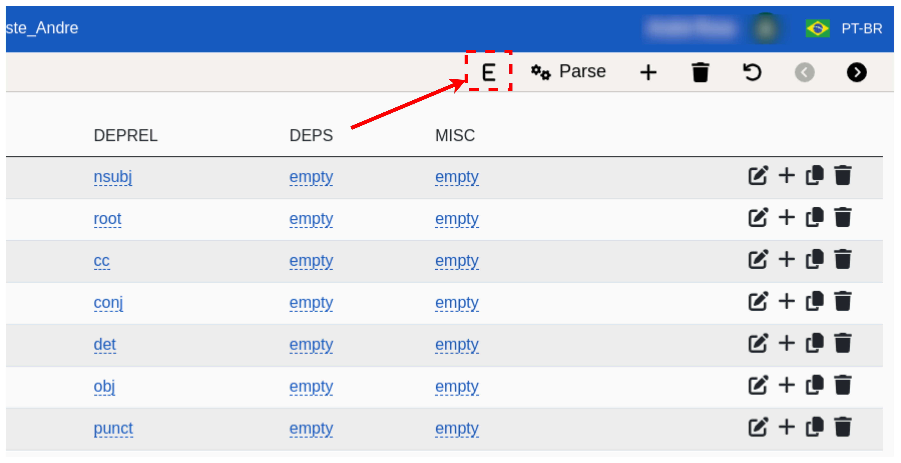
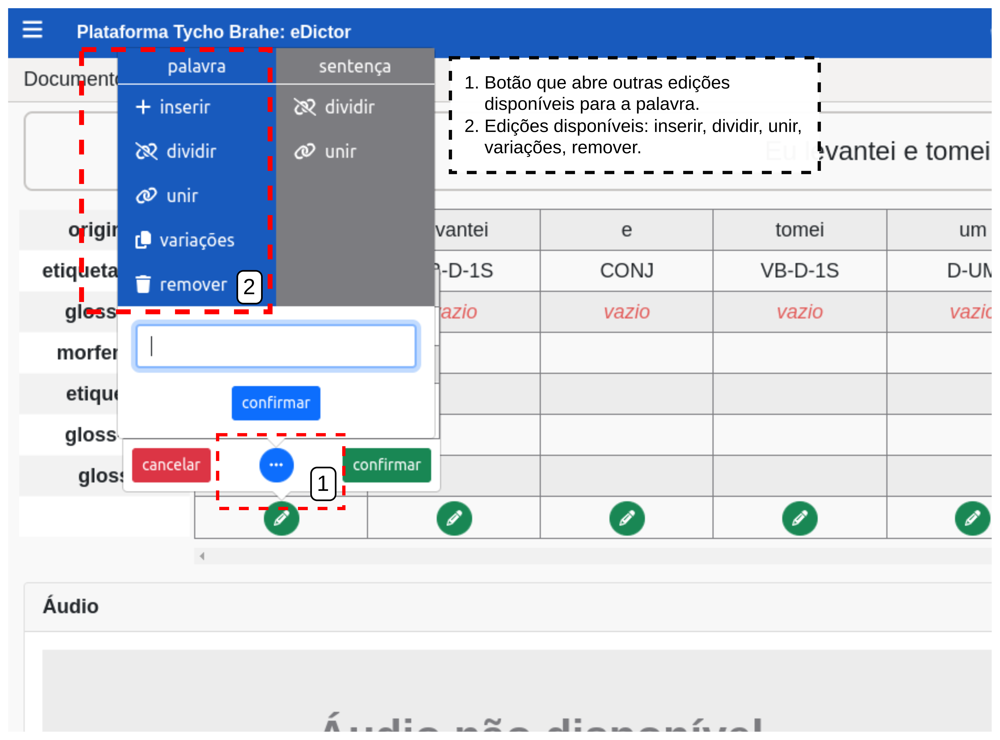

# Ferramenta **eDictor Translations**

Índice

- [Ferramenta **eDictor Translations**](#ferramenta-edictor-translations)
  - [Tutorial:](#tutorial)
    - [**Fluxo normal**](#fluxo-normal)
    - [**Fluxo alternativo:**](#fluxo-alternativo)

---

A ferramenta **Use eDictor Translations** habilita o uso da versão eDictor para desenvolvimento de corpora com suas traduções nas línguas configuradas e selecionadas pelo usuário. A habilitação desta ferramenta permite, consequentemente, a apresentação dos corpora de forma paralela, ou seja, com originais e traduções de forma paralela e sincronizada.

<!--[REVISAR: AVALIAR SE FUTURAMENTE VOU INSERIR AS OUTRAS FUNCIONALIDADES DE EDIÇÃO DOS CORPORA AQUI: EDITAR ETIQUETAS DAS DIVERSAS CAMADAS ETC]-->
 <!--[REVISAR: CONSIDERER SUBDIVIDIR OS CASOS?]-->

**Atores primários**:

1. Usuário (com acesso admin ao corpus)
2. Adminstrador

**Pré-requisitos:**

1. Usuário logado (com permissões de edição no corpus)
2. Corpus previamente criado e o botão de configuração de parâmetros "Use eDictor Translations" habilitado.

## Tutorial:

### **Fluxo normal**

1. Acesse a página inicial da plataforma Tycho Brahe, através do link: <https://www.tycho.iel.unicamp.br/home> .

2. Navegue até a área "Ferramentas" e selecione "Área Reservada".
   

3. Na página de perfil que se abre, os corpora disponíveis, vinculados ao usuário, são apresentados. Selecione o corpus que deseja configurar e clique no botão "eDictor" na área de "Acesso rápido" ou "eDictor" na área "Minhas Ferramentas" e selecione o corpus que deseja configurar.
   

4. Com o catálogo aberto, clique sobre o nome do corpus e como em [1] para abrir a lista suspensa com os corpora disponíveis e selecione o corpus que deseja editar [2], como na Figura:
   

5. Após selecionar o corpus que deseja editar, acesse "Exibir informações" clicando no ícone com menu (menu com seis pontos) no documento do corpus.
   

6. Na aba de "Ações" , na menu que abre à esquerda, no campo "Continuar a edição do documento", clique na seta para abrir o menu de ferramentas de edição: selecionar o "eDictor Translations" (Nota: o botão de configuração de parâmetros "Use eDictor Translations" deve estar habilitado para habilitar a edição através do **eDictor Translations**).
   
  
   1. Para inserir textos (sentenças):

      1. Selecione o botão "Inserir/Adicionar texto".
      2. Preencha o campo que apresenta "Digite ou cole o texto no idioma original" com o texto fonte (original); selecione o idioma de tradução; preencha o campo "Digite ou cole o texto traduzido em: [idioma selecionado para tradução]" com o texto traduzido.
      3. Clique em "Salvar" para salvar transcrições.
      4. Clique no botão "Sincronizar", para que as sentenças fonte e alvo sejam sincronizadas apresentadas paralelamente.
      5. Clique em "Inserir sentenças" para que as sentenças sincronizadas sejam inseridas no documento do corpus.

   2. Apagar textos transcritos (ainda não sincronizados):

      1. Selecione "Inserir texto"
      2. Clique em "Apagar" para apagar textos transcritos (Textos já sincronizados são mantidos)
      3. Clique em "voltar" para retornar ao documento com suas sentenças paralelas.

   3. Editar sentenças sincronizadas:
      1. Via botão E - eDictor:
         1. Com o corpus já selecionado, selecione um par de sentenças.  
         2. Selecione botão E (eDictor).  
         3. Para editar o texto original do token: no quadro, clique no ícone de "lápis" (edição) da palavra que desejar, edite a palavra e confirme.
         4. Para editar a tradução: role a página até o campo de "Traduções", edite o campo com o texto e salve.  
         5. Para outras edições da palavra: clique em "...":
            1. Clique em "inserir": inserir palavra á direita da palavra selecionada, preencha o campo e confirme  
            2. Clique em "dividir": dividir palavra em dois tokens distintos  
            3. Clique em "unir" para unir o token selecionado ao token seguinte na sentença: 
            4. Clique em "Variações": o botão de variações apresenta todas as variações de etiquetas e glossas utilizadas para a palavra e salvas no banco de dados. Este botão permite um preenchimento mais rápido das informações sobre a palavra selecionada.
            5. Clique em "remover": remover palavra.  
         6. Para edições da sentença, clicar em "...":
            1. "Dividir": dividir sentença em duas (após token selecionado)
            2. "Unir": unir com sentença seguinte.
               **Nota**: A função de Dividir e Unir sentenças não funciona se a sentença tiver traduções e áudios associados. Na tentativa, o sistema retorna uma mensagem de erro e a operação é impedida:

         
      2. Via botão UD:
         1. Com o corpus já selecionado, selecione um par de sentenças.  
         2. Selecione botão UD (Dependências Universais).  
         3. Para editar o original: no quadro, na linha da palavra desejada clique no ícone de lápis (edição) da palavra que desejar, edite a palavra e confirma.  
         4. Não há edição de tradução com o botão UD selecionado
         5. Para incluir palavra: na linha da palavra selecionada, clique em "+", preencha o campo com a palavra a ser adicionada e confirme.  
         6. Para aplicar informações de um token a todos tokens similares do documento: na linha da palavra selecionada, clique no ícone de "cópia".  
         7. Para deletar: na linha da palavra, clique no ícone com "lixeira" e confirme.  
   4. Remover sentenças sincronizadas:
      1. Selecionar um par de sentenças.
      2. Clicar em no ícone de "lixeira" (remover) e confirmar.

### **Fluxo alternativo:**

**A1**

1. Acesse a página de catálogo através do link: <https://www.tycho.iel.unicamp.br/catalog> :

   
  
2. Siga a partir do item 3 do Fluxo normal.

**A2** - Alternativa para inserção de sentenças

Siga o fluxo normal de 1 a 5, ou o fluxo A1, para acesso à ferramenta eDictor Translations. Para um fluxo alternativo de inserção de novas sentenças:

1. Selecione um par de sentenças.
2. Clique no botão "Adicionar nova".
3. Uma caixa de diaĺogo se abre: clique em "confirmar".

   

4. No campo superior "digite a transcrição aqui", preencha com o texto desejado.
5. Preencha as traduções e clique no botão verde para salvar.
6. Clique em "adicionar nova sentença".

   

Sentença e tradução adicionadas:

   

---
