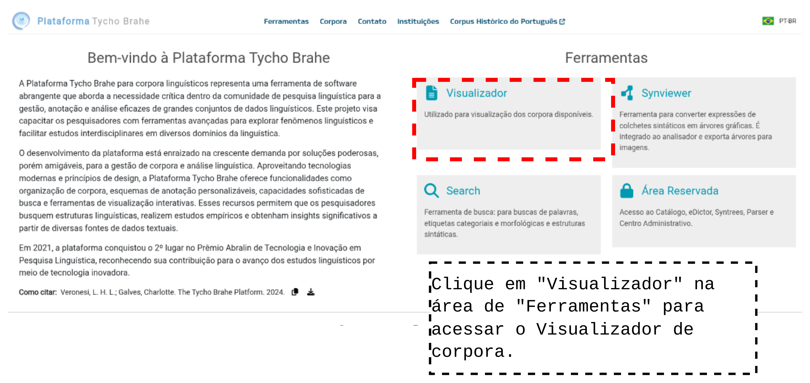
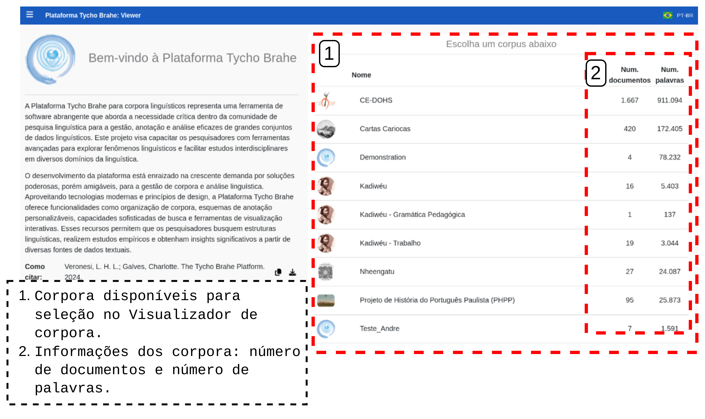
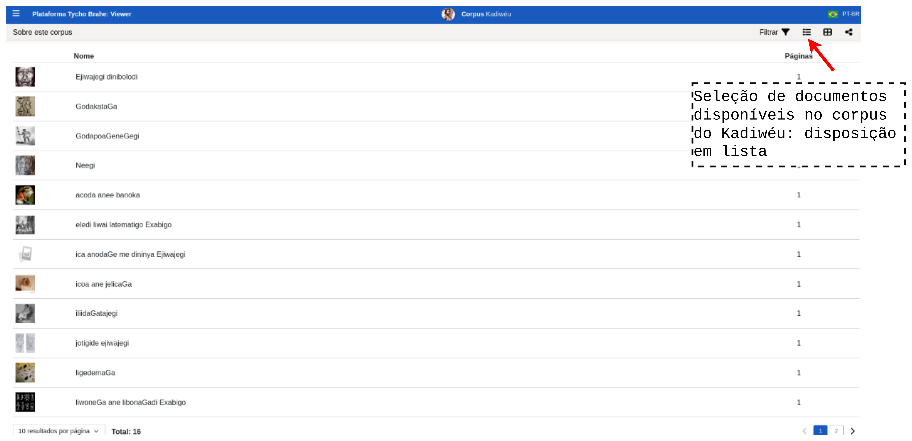
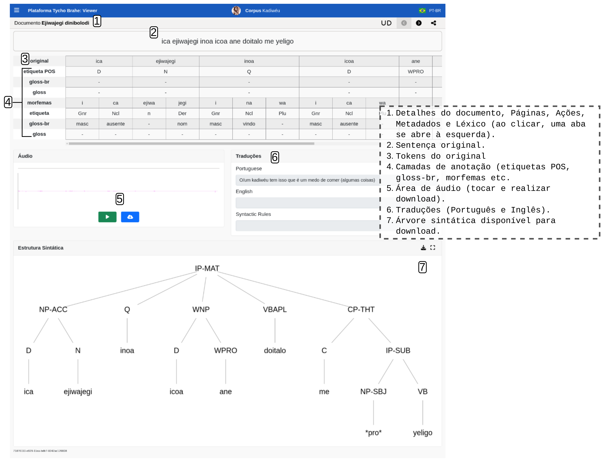

# Visualizador de corpora

Índice

- [Visualizador de corpora](#visualizador-de-corpora)
  - [Tutorial](#tutorial)
    - [Acesso público aos corpora](#acesso-público-aos-corpora)
    - [Opções de busca e filtros](#opções-de-busca-e-filtros)
    - [Visualização de dados anotados](#visualização-de-dados-anotados)

---
<!--FUNCIONALIDADES DISPOSTAS NA PÁGINA DE FERRAMENTAS:

- Modos de visualização configuráveis, permitindo alternar entre diferentes camadas de anotação (diplomática, interpretativa, modernizada).
- Segurança de dados e proteção de direitos autorais, restringindo downloads e metadados sensíveis quando necessário.
- Acesso aos metadados dos documentos, incluindo autor, período e descrição do corpus.
- Integração com links externos, como DOIs ou repositórios no GitHub, quando disponibilizados.

-->

## Tutorial

### Acesso público aos corpora

Funcionalidades de navegação e leitura

1. Acesse a página inicial da plataforma Tycho Brahe no endereço <https://www.tycho.iel.unicamp.br/home>.

2. Clique no "visualizador" na área de "Ferramentas".

3. Selecione um dos corpora disponíveis na lista.
   1. São apresentadas informações como número de documentos e número de palavras nos corpora.

4. Navegue pela lista de documentose e selecione um documento.

### Opções de busca e filtros

Funcionalidades para localizar textos, autores ou anotações específicas, exibição de imagens originais (que são associadas a cada documento) etc 

- Filtragem de documentos por palavra ou status:

Filtragem de documentos no Visualizador

- Documentos dispostos em forma de grade ou lista:

- Botão de compartilhamento de link do corpus:

Compartilhamento do link do corpus.

### Visualização de dados anotados

Visualização de corpus paralelo, apresentando textos originais lado a lado com suas traduções,  Navegação sentença por sentença e exibição individual de sentenças; Etiquetas morfossintáticas (POS), árvores sintáticas e camadas de edição, links para áudios associados aos textos ou sentenças etc.

1. Após a seleção do documento desejado, as sentenças que o corpus contém são apresentadas. Selecione a sentença desejada.
   - Na tela que apresenta as sentenças, são apresentadas: tradução, botão para tocar o áudio original, botão para realizar download do áudio, língua de tradução etc.:

- Ao ser selecionada uma sentença, são apresentadas informações como etiquetas POS, traduções, áudios disponíveis e árvore/estrutura sintática.

Anotações realizadas na sentença selecionada.

---
