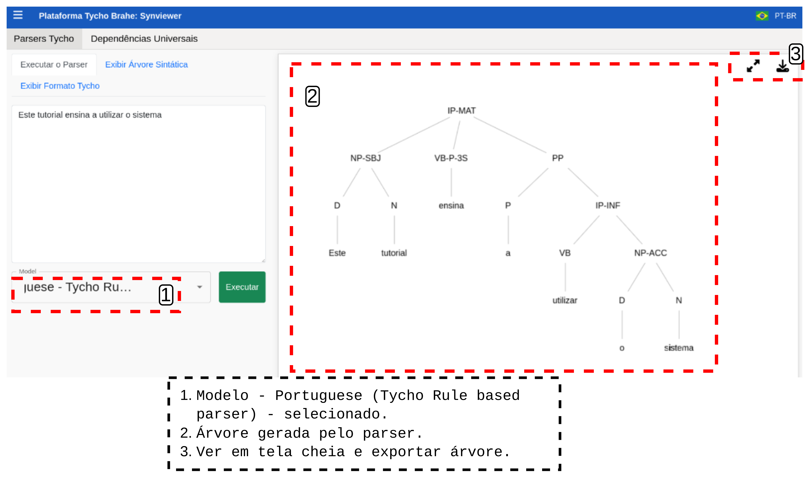

# DOCUMENTAÇÃO PLATAFORMA TYCHO BRAHE (TYCHO BRAHE PLATAFORM)

<figure>

</figure>

---

SUMÁRIO

- [DOCUMENTAÇÃO PLATAFORMA TYCHO BRAHE (TYCHO BRAHE PLATAFORM)](#documentação-plataforma-tycho-brahe-tycho-brahe-plataform)
  - [Caso de uso 08 - Synviewer](#caso-de-uso-08---synviewer)
    - [Tutorial](#tutorial)
      - [**Fluxo normal**](#fluxo-normal)

---

## Caso de uso 08 - Synviewer

A plataforma Tycho Brahe oferece uma interface para a geração e visualização de árvores sintáticas, o **Synviewer**. Dentre as funcionalidades, destacam-se a geração de árvores sintáticas com base em parsers baseados em regra desenvolvidos no âmbito do projeto, bem como árvores sintáticas baseadas no banco de Dependências Universais (_Universal Dependencies - UD_). Esta ferramenta facilita o uso dos parser desenvolvidos dentro do projeto, facilitando a visualização, exportação e apresentação dos dados.

**Atores primários**:

1. Usuários em geral (inclusive sem cadastro prévio na plataforma)

**Pré-requisitos:**

1. Sem pré-requisitos

### Tutorial

**Objetivo:**
Este tutorial tem como objetivo apresentar as funcionalidades do synviewer: geração de árvores com base em parser desenvolvidos no âmbito do projeto ou baseados no banco de Dependências Universais.

#### **Fluxo normal**

1. Acesse a página inicial da plataforma Tycho Brahe no endereço <https://www.tycho.iel.unicamp.br/home>.

Acessando página inicial

2. Clique no "Synviewer" na área de "Ferramentas" para acessar a funcionalidade.

Acessando o "Synviewer"

Há duas funcionalidades principais no "Synviewer":

**Parsers Tycho**: seleciona esta aba com os parsers desenvolvidos no âmbito do projeto.

- **Executar o parser**:

  1. Selecione a aba "Executar o parser".
  2. Insira a sentença desejada.
  3. Selecione o modelo (parser) desejado e clique em "Executar".

  

  A execução do parser resulta na árvore, como apresentada na Figura a seguir:

  

- **Exibir Árvore Sintática**:

  1. Selecione a aba "Exibir Árvore Sintática".
  2. Insira expressão em notação de parênteses ou colchetes para geração da árvore.
  3. Converta para notação em colchetes ou parênteses (se aplicar) e clicar em "Executar" para gerar a árvore. É possível visualizar a árvore em tela cheia e exportar como imagem.

  

- **Exibir Formato Tycho**:
  1. Selecionar a aba "Exibir Formato Tycho".
  2. Inserir os dados.
  3. Clicar em "Executar" <!--REVISAR: ESTA FUNCIONALIDADE NÃO APRESENTA COMPORTAMENTO...TALVEZ TENHA TESTADO A ENTRADA ERRADA-->

**Dependências Universais**: parsers do banco de dados de Dependências Universais.

1. Insira a sentença desejada.
2. Selecione o modelo (parser) desejado.
3. Clique em "Executar".

O usuário pode visualizar e exportar árvores no formato CoNLL-U ou Dependências Universais como imagem. 
Nota: se o usuário preferir inserir a sentença e realizar o parser, o sistema retorna tanto as árvores quanto a expressão em notação CoNLL-U. É possível também inserir a expressão em CoNLL-U para geração das árvores diretamente: insira a expressão e clique em Exibir, para gerar as árvores.

---
