# Parser - Edição e gerenciamento das regras dos parsers

Índice

- [Parser - Edição e gerenciamento das regras dos parsers](#parser---edição-e-gerenciamento-das-regras-dos-parsers)
  - [Tutorial](#tutorial)
    - [**Fluxo normal**](#fluxo-normal)
      - [Acesso](#acesso)
      - [**Aba "Parsers"**](#aba-parsers)
        - [Criação, edição e exclusão de regras](#criação-edição-e-exclusão-de-regras)
      - [**Aba "Casos de teste"**](#aba-casos-de-teste)
        - [Cenários de testes automatizados](#cenários-de-testes-automatizados)
      - [**Aba "Etiquetas"**](#aba-etiquetas)
        - [Gerenciamento de regras de POS, morfemas, contrações](#gerenciamento-de-regras-de-pos-morfemas-contrações)
      - [**Aba "Splitters"** ](#aba-splitters-)
      - [**Aba "Flexões"**](#aba-flexões)
      - [**Aba "Configurações"**](#aba-configurações)
      - [**Gerenciarmento de permissões de usuários**:](#gerenciarmento-de-permissões-de-usuários)
    - [**Fluxo Alternativo**](#fluxo-alternativo)

---

## Tutorial

Este tutorial apresenta as edições possíveis nos parsers. As edições tratadas aqui compreendem: acesso ao parser, edição das regras, edição das definições, configurações de acesso de usuários, debugger etc.

### **Fluxo normal**

#### Acesso

1. Acesse a página inicial da plataforma Tycho Brahe, através do link: <https://www.tycho.iel.unicamp.br/home>.
2. Na área "Ferramentas", selecione "Área Reservada" e realize o login com conta Google ou com suas credenciais (se já não estiver logado).
   
   Acessando "Área Reservada"  
3. Ao acessar "Área Reservada", na área "Minhas Ferramentas", acesse o "Parser".

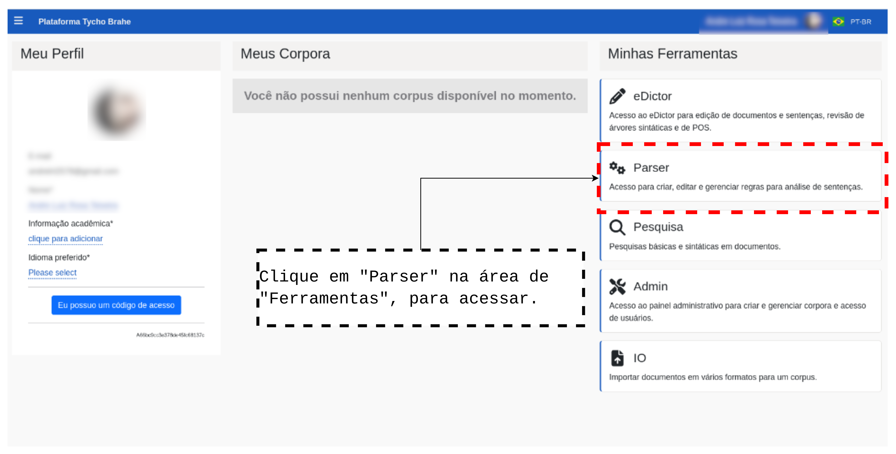

4. Selecione o parser no qual deseja realizar edições e gerenciamento.

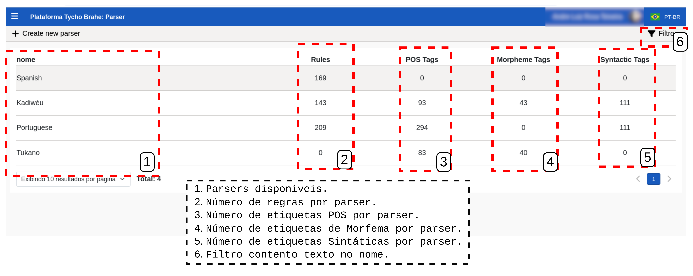

#### **Aba "Parsers"**

##### Criação, edição e exclusão de regras 

Permite a criação, edição, depuração e visualização da análise sintática passo a passo.

- Selecione uma regra a ser editada ao clicar sobre ela. Apresentam-se campos referentes à regra selecionada (Nome; Node; Query: regra propriamente dita, escrita em sintaxe Corpus Search(Documentação acessível em: <https://corpussearch.sourceforge.net/>)). Além disso, é possível excluir a regra ao clicar no ícone com lixeira e confirmar.
- Debugger: se desejar, preencha uma sentença a ser analisada para testar o conjunto de regras (é possível adicionar paradas (debugger), em quaisquer das regras, para teste do parser. Para marcar uma parada, clique no círculo à direita da regra - "add/remove breaking point"). É possível incluir a sentença testada nos casos de teste.
- Adicionar regras: clique no botão "+ add new rule", edite (documentação corpus search em: <https://corpussearch.sourceforge.net/>) e salve.

#### **Aba "Casos de teste"**

##### Cenários de testes automatizados

- Adicionar caso de teste: clique no botão "+" para adicionar caso de teste; preencha a "expressão" em parênteses, referente à sentença desejada. **Nota:** a expressão deve deve gerar uma árvore que representa o objetivo final esperado de geração pelo parser automático, ensejando uma comparação com o resultado efetivo de aplicação do parser automático. Ao preencher uma expressão, na sub-aba "Expression", uma árvore objetivo é apresentada na sub-aba "Expected".
- Rodar casos de teste: clique no botão "►" para rodar os casos de teste e comparar o resultado esperado pelo usuário com o efetivamente processado pelo parseamento automático. Esta ação cria uma sub-aba "Output" que apresenta a árvore efetivamente gerada automaticamente pelo parser, possibilitando sua comparação com a árvore esperada.

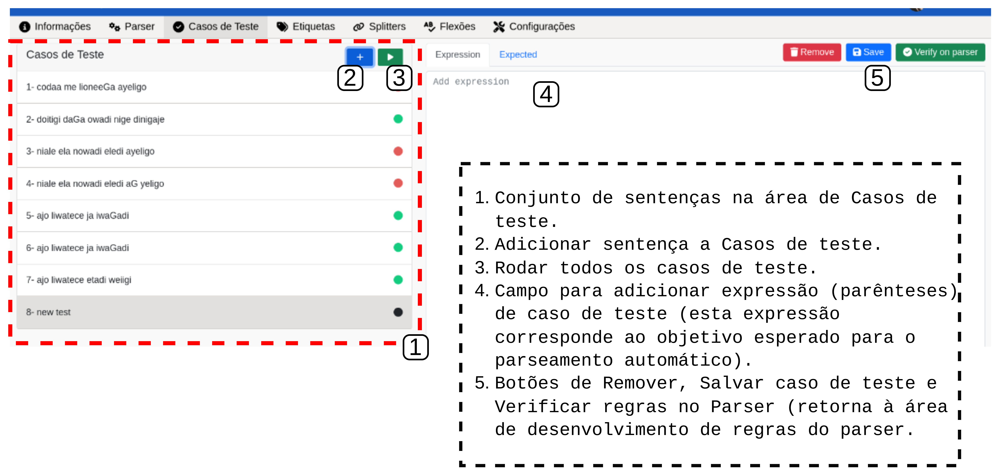

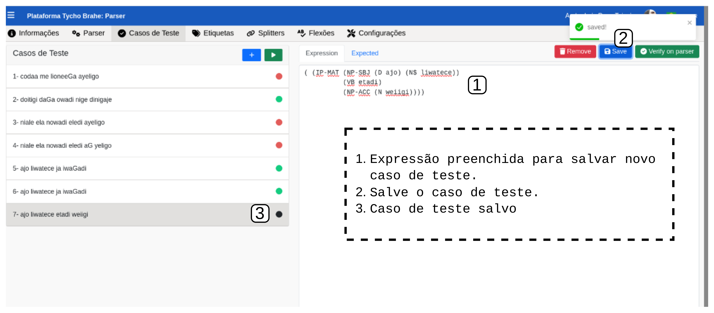

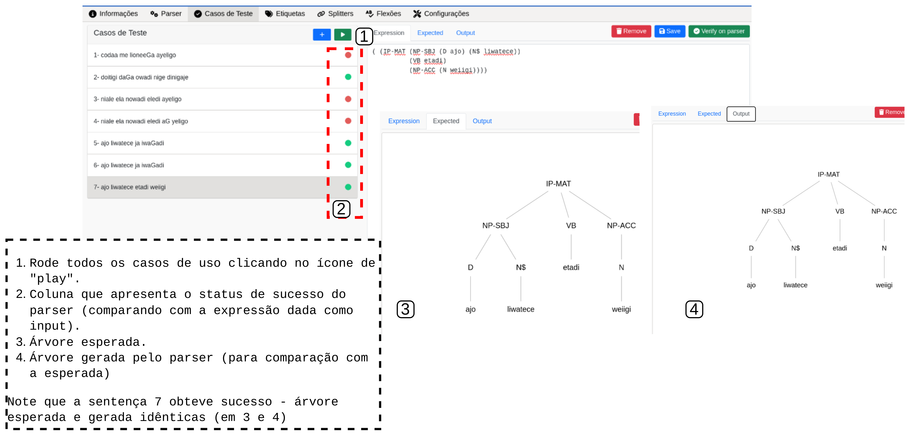

#### **Aba "Etiquetas"**

##### Gerenciamento de regras de POS, morfemas, contrações

- Selecione tipo de etiqueta entre POS, SYNTACTIC, MORPHEME.
- Pesquisar etiqueta: preencha o campo para realizar pesquisa de etiquetas.
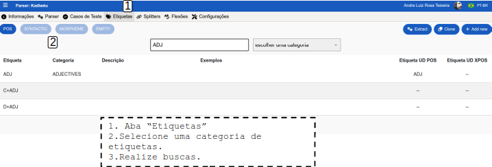
- "Extract": botão para extração de etiquetas de um corpus (CUIDADO! Esta ação exclui todas as etiquetas atualmente salvas - ação irreversível).
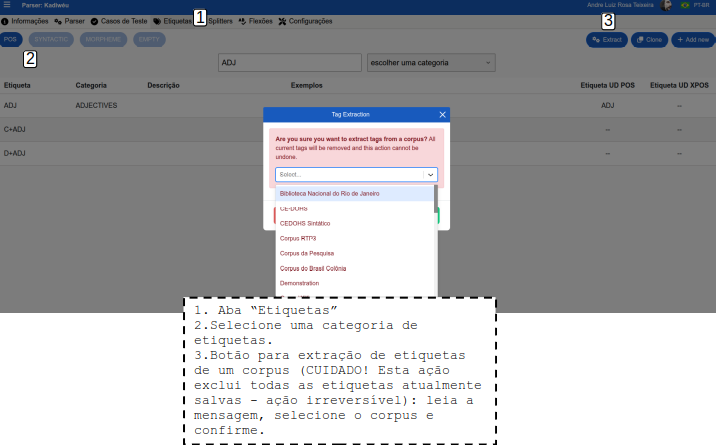
- "Clone": escolha um corpus do qual clonar todas as etiquetas (CUIDADO!Esta ação deleta todas as etiquetas atuais do parser - ação irreversível).
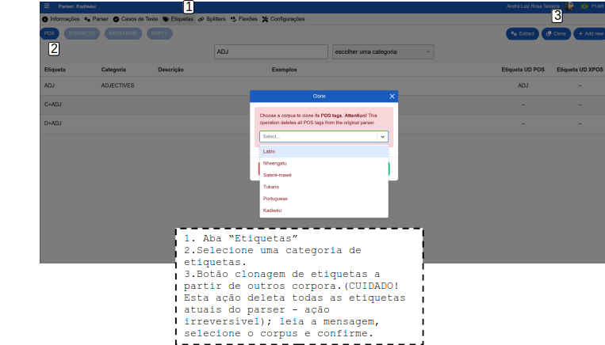
- "+ Add new"(botão para adicionar nova etiqueta (POS, SYNTACTIC ou MORPHEME)): preencha campos referentes a - etiqueta, categoria, descrição etc.
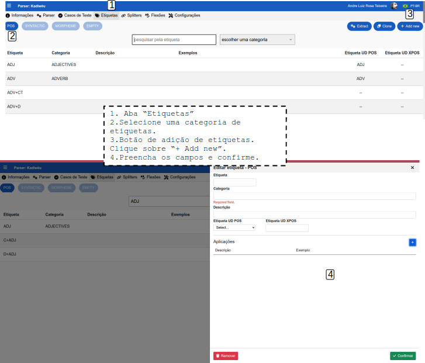

#### **Aba "Splitters"** <!-- REVISAR: COMO É UTILIZADA ESTA FUNÇÃO? NÃO APARECE ONDE INCLUIR REGRAS DE SPLITTER-->

#### **Aba "Flexões"**

- Criar flexões no menu, "create": na linha "inflections", clique no menu, selecione "create" e configure prioridade, valores a serem encontrados, etiqueta a ser aplicada, adicione substituição e confirme.
- É possível testar a flexão: na área "Inflection test", adicione a palavra desejada e a etiqueta, e clique em "Run".

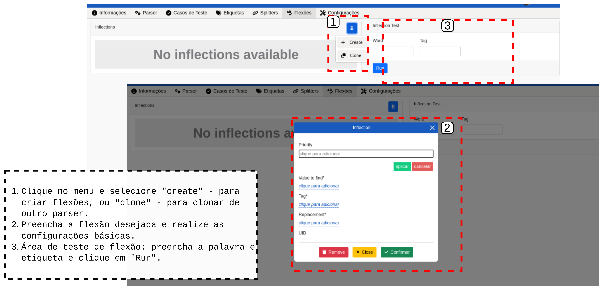

#### **Aba "Configurações"**

- "Definitions": é possível incluir definições que terão aplicação nas regras do parser. <!--REVISAR: preciso entender quais tipos de definições podem ser incluídas aqui; qual é o tipo de sintaxe aplicada, é o CORPUS SEARCH?-->

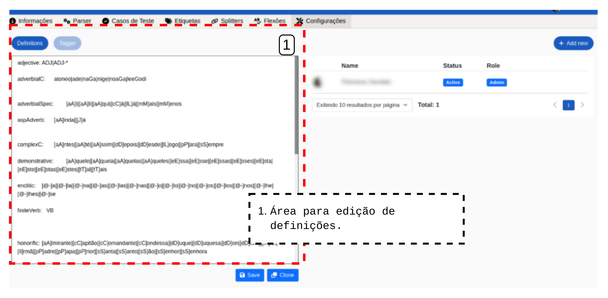

- Tagger: <!--REVISAR: como gerenciar os Taggers?-->

#### **Gerenciarmento de permissões de usuários**:

- Revogar credenciais de usuários no parser: selecione o usuário; clique em "Revoke access" e confirme.
- Gerenciar credenciais: selecione o usuário, mude o "Role (papel)" do usuário (entre Admminstrador, Editor, Visitante), e mude o "Status" do usuário (entre Ativo e Inativo).

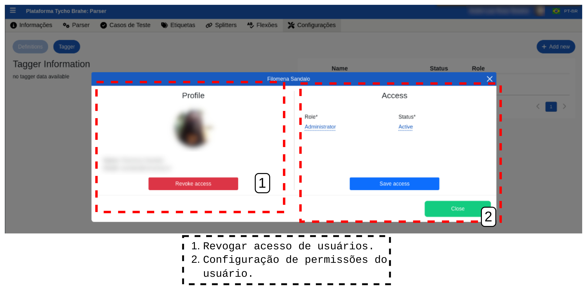

- Adicionar usuário ao parser: clicar em "+ Add new"; clicar no campo e iniciar o preenchimento de nome ou e-mail para adicionar dentre a lista de perfis já cadastrados na plataforma; selecionar o grau de permissão (Adminstrador, Editor, Visitante); selecionar o Status das credenciais e confirmar.

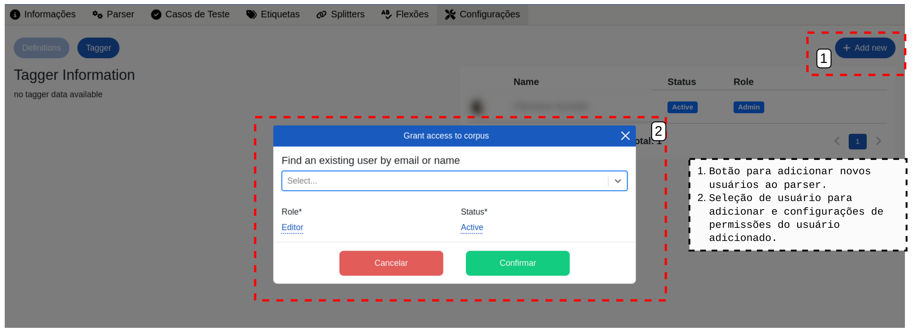

### **Fluxo Alternativo**

**A1**

1. Acesse o Parser diretamente, a partir do link: <https://www.tycho.iel.unicamp.br/parser>.
2. Siga a partir do passo 4 do Fluxo normal.

---
