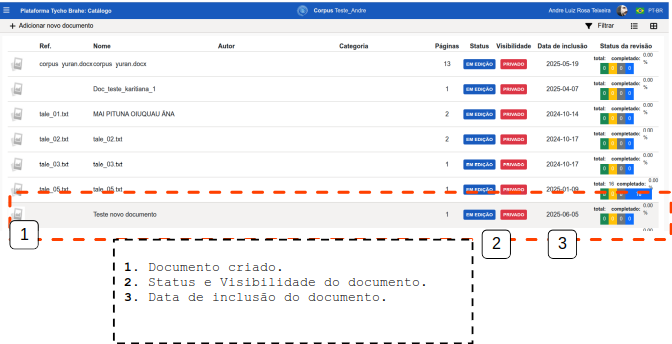

# DOCUMENTAÇÃO PLATAFORMA TYCHO BRAHE (TYCHO BRAHE PLATAFORM)

<figure>

</figure>

---

SUMÁRIO

- [DOCUMENTAÇÃO PLATAFORMA TYCHO BRAHE (TYCHO BRAHE PLATAFORM)](#documentação-plataforma-tycho-brahe-tycho-brahe-plataform)
  - [Caso de uso 10 - Importação e configuração de documentos - interoperabilidade (IO)](#caso-de-uso-10---importação-e-configuração-de-documentos---interoperabilidade-io)
    - [Importação de novos documentos](#importação-de-novos-documentos)
      - [**Fluxo normal**](#fluxo-normal)

---

## Caso de uso 10 - Importação e configuração de documentos - interoperabilidade (IO)

Este tutorial apresenta o passo a passo para importação de documentos a partir do sistema de interoperabilidade (IO). Este sistema permite ao usuário a importação de documentos em diversos formatos nos corpora selecionados. Durante a importação de documentos, o usuário consegue realizar configurações iniciais, facilitando a preparação do documento para a importação.

Nos tópicos a seguir serem desenvolvidos os principais fluxos envolvidos na importação de novos documentos por meio da ferramento de interoperabilidade.

### Importação de novos documentos

**Objetivo**: Este tutorial detalha os passos necessários para a importação de novos documentos no catálogo de corpora aos quais o usuário é associado, por meio da ferramenta de interoperabilidade.

**Atores primários**:

1. Usuário com permissões de editor ou admin no respectivo corpus

**Pré-requisitos:**

1. Os usuários devem ser previamente cadastrados e ter permissões de administrador ou editor nos corpora a serem editados.
2. Para que as ferramentas desejadas sejam associadas ao documento criado, o admin do corpus deve tê-las habilitado na página de admin - configurações de corpora.

#### **Fluxo normal**

1. Acesse a página _home_ da plataforma através do link: <https://www.tycho.iel.unicamp.br/home>.
2. Na área de "Ferramentas", o Usuário acessa "Área reservada" para ser redirecionado ao _login_.

3. Realize o _signin_ (ver caso de uso 00 - sign in).
4. Acesse o botão eDictor na área de botões de acesso rápido (sendo redirecionado ao catálogo do corpus):

5. Na página de catálogo, clique em "+ Adicionar novo documento".
6. Na janela que se abre:
   1. Preencha o nome do documento a ser criado;
   2. Escolha a ferramenta para edição (previamente cadastradas);
   3. Selecione a Visibilidade (se Privado, o corpus não fica disponível nas ferramentas de busca, etc., abertas a usuários não cadastrados ou não associados ao corpus).
7. Clique em Confirmar

Após criação do documento ele fica disposto no catálogo:

**Nota**: A Visibilidade deve ser selecionada como privada, por exemplo, durante a anotação do documento, ou quando o material tem questões relacionadas ao _copyright_.
