# Importação e configuração de documentos - interoperabilidade (IO)

Índice

- [Importação e configuração de documentos - interoperabilidade (IO)](#importação-e-configuração-de-documentos---interoperabilidade-io)
      - [**Fluxo normal**](#fluxo-normal)
        - [**Acesso**](#acesso)
        - [**Upload de arquivos**](#upload-de-arquivos)
        - [**Processamento do arquivo**](#processamento-do-arquivo)

---

## Tutorial

Este tutorial detalha os passos necessários para a importação de novos documentos no catálogo de corpora aos quais o usuário é associado, por meio da ferramenta de interoperabilidade.

### **Fluxo normal**

#### **Acesso**

1. Acesse a página de _IO_  através do link: <https://www.tycho.iel.unicamp.br/io>.
2. Se for redirecionado para a página de _login_, preencha suas credenciais ou acesse com a conta Google. A página inicial do _IO_ apresenta essas informações:

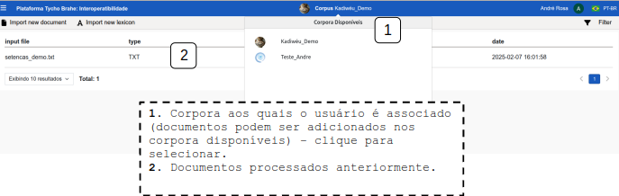

#### **Upload de arquivos**

1. Para importar um documento, clique em “Import new document”.
2. Na janela de upload, arraste ou clique para enviar um arquivo.
3. Após o arquivo enviado, clique em Confirmar.

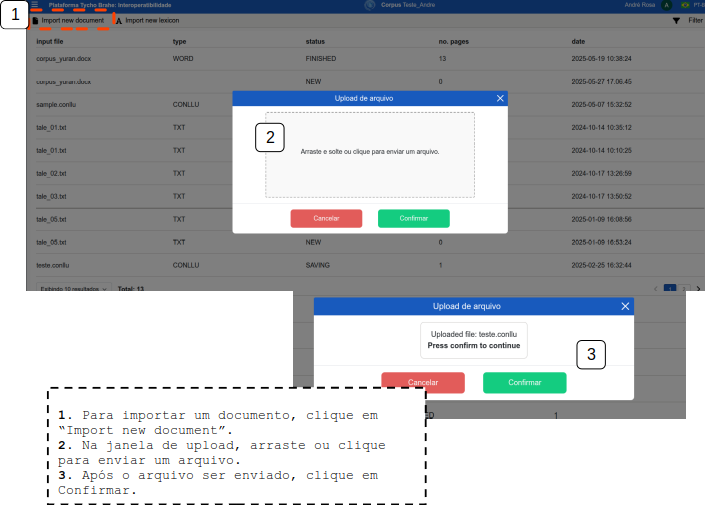

4. Após Confirmar a importação do documento, o usuário é direcionado a esta tela:
   
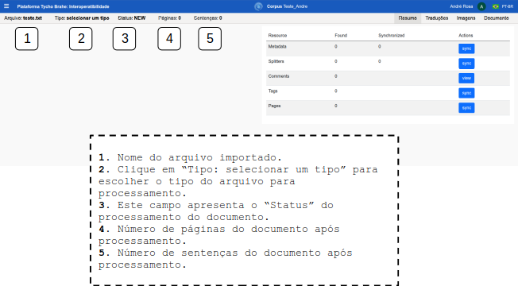

#### **Processamento do arquivo**

1. A primeira ação recomendada nesta fase é a seleção de tipo do arquivo importado. Isso garante que o arquivo seja processado corretamente, que sejam extraídos os metadados (quando se aplicar), páginas, número de sentenças, línguas de tradução etc.  Para selecionar o tipo, clique em "Tipo: selecionar um tipo". Na lista suspensa, selecione o tipo de arquivo correspondente (a extensão do arquivo dá uma dica do tipo).

Após a seleção do tipo de arquivo, o usuário consegue iniciar o processamento do arquivo de entrada.

2. Para realizar configurações básicas para o processamento, clique em "Arquivo:<nome_arquivo.extensão>".
3. Selecione "Acões" na lateral esquerda.
4. Clique sobre o campo "Clique aqui para alterar as configurações padrão do processo".
   1. Marque/desmarque as seleções de "Sentence Delimiters (Delimitadores de Sentença)": esta configuração determina quais caracteres serão utilizados para que o sistema separe o documento em sentenças.
   2. Número da página quebra a página: habilitar/desabilitar - elemento de texto com tipo pag_nr no XML do Pré eDictor deve adicionar nova página, é específico para arquivos pré-edictor.
   3. Tipo de seção que deve adicionar nova página: usado para arquivos pré-edictor. Habilita seções que poderão ser utilizadas no eDictor.
   4. Translations for multiple line text file: importa as traduções em arquivos de texto. Os valores devem ser alinhados aos configurados no corpus (na pg de admin - configurações).
   5. Gloss for multiple line text file: importa atributos de palavra em arquivos de texto. Os valores devem representar categorias de palavras configuradas no corpus (na pg de admin - configurações).
5. Clique em Confirmar para salvar as alterações.
6. Após finalizar as configurações, é possíve processar o documento. Com "Ações" selecionado, clique sobre sobre "Processar arquivo de entrada": Executa o processo de importação, o que pode levar algum tempo.

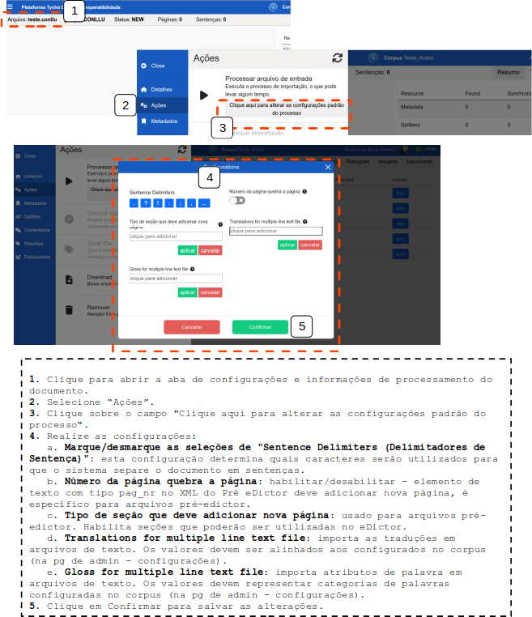

Após o processamento, o sistema apresenta ao usuário as páginas com o conteúdo transcrito do documento que foi processado e será importado. Além disso, são apresentados potenciais dados importados durante o processamento, por exemplo, Exibir Universal Dependencies (se se aplicar), Exibir tags POS (se se aplicar), Níveis de Edição (se se aplicar).

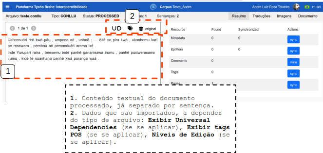

Do lado direito superior também são apresentadas abas com Resumo, Traduções, Imagens e Documento (área de associação do documento importado a um documeto no catálogo).

**Resumo**: a depender do tipo de documento a ser importado dados pode ser sincronizados (se houver), por exemplo, Metadados, Splitters, Comentários, Etiquetas e número de Páginas. No quadro de resumo são apresentados as colunas com **Resource** (Metadata, Splitters, Comments, Tags, Pages); **Found** - número de recursos encontrados a serem sincronizados; **Syncronized** - número de recursos já sincronizados; **Actions** - Sync (sincronizar), View (visualizar)

<!--REVISAR: há um erro com relação à sincronização de informações - observei em Metadata, há nos outros também? Precisarei expandir esta parte assim que os erros forem corrigidos (explicar um a um dos dados do resumo?-->

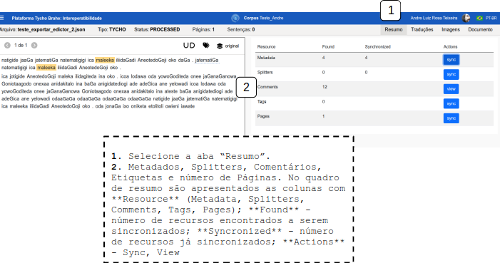

**Traduções**: também a depender do tipo e formato do documento importado, é possível já importar o corpus paralelo (original e traduções). Por exemplo, contos do nheengatu foram importados em format .txt, com original e tradução em português. O conto tem cada sentença importada neste formato:

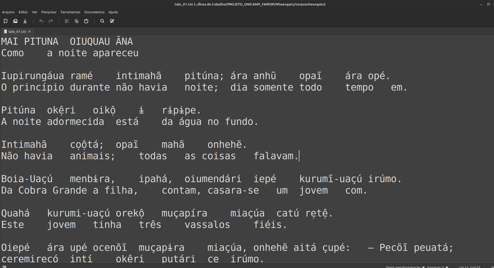

Após o processamento fica disposto em relação paralela:

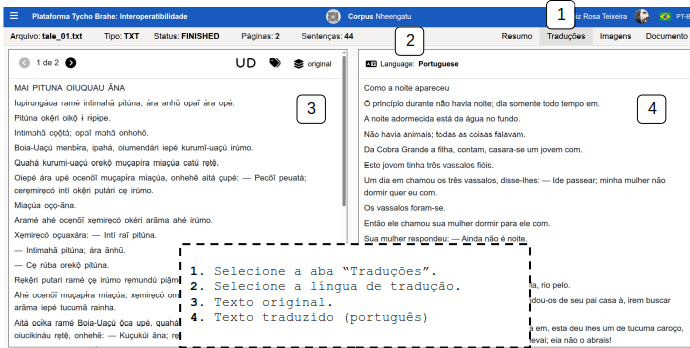

**Imagens**: se o documento imoportado tiver imagens de capa, por exemplo (depende do formato), as imagens podem ser sincronizadas e serão associadas ao documento alvo no catálogo da plataforma. 

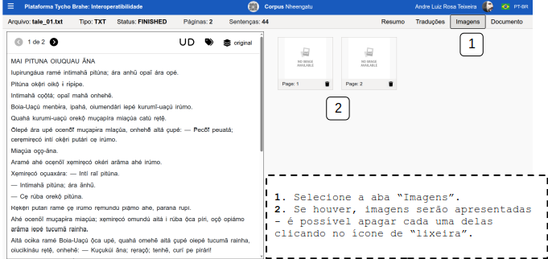

**Document**: esta aba permite a associação do documento importado a um documeto no catálogo

1. Selecione a aba “Documento”.
2. O sistema apresenta as opções:
   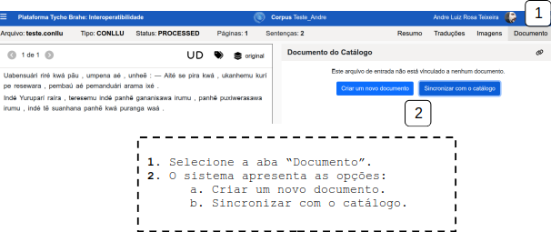
   1. Criar um novo documento: o sistema prepara para importação como um novo documento no corpus.
   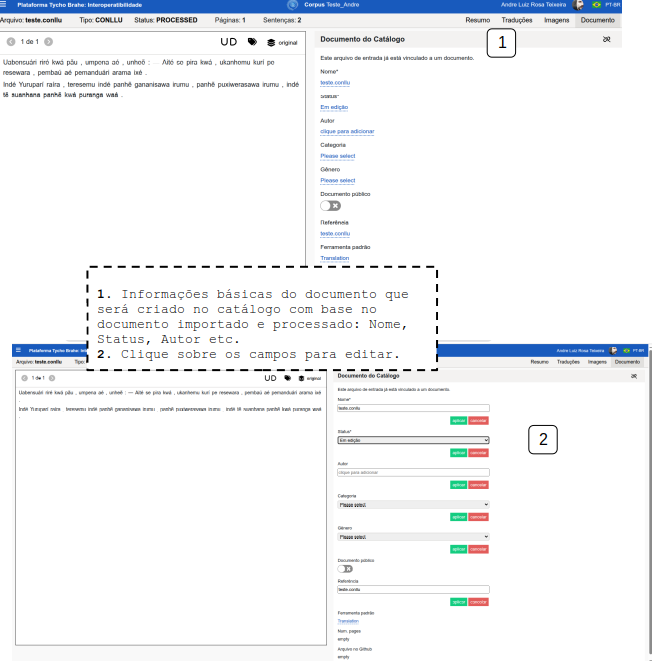
   
   2. Sincronizar com o catálogo: se houver um documento previamente criado no catálogo com a mesma referência do documento importado, o sistema apresenta a opção de vincular o documento importado ao documento do catálogo.

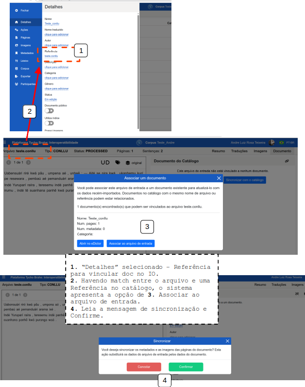

---