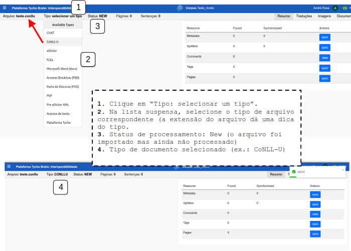

# DOCUMENTAÇÃO PLATAFORMA TYCHO BRAHE (TYCHO BRAHE PLATAFORM)

<figure>

</figure>

---

SUMÁRIO

- [DOCUMENTAÇÃO PLATAFORMA TYCHO BRAHE (TYCHO BRAHE PLATAFORM)](#documentação-plataforma-tycho-brahe-tycho-brahe-plataform)
  - [Caso de uso 10 - Importação e configuração de documentos - interoperabilidade (IO)](#caso-de-uso-10---importação-e-configuração-de-documentos---interoperabilidade-io)
    - [Importação de novos documentos - interoperabilidade](#importação-de-novos-documentos---interoperabilidade)
      - [**Fluxo normal**](#fluxo-normal)
        - [**Acesso**](#acesso)
        - [**Upload de arquivos**](#upload-de-arquivos)
        - [**Processamento do arquivo**](#processamento-do-arquivo)

---

## Caso de uso 10 - Importação e configuração de documentos - interoperabilidade (IO)

Este tutorial apresenta o passo a passo para importação de documentos a partir do sistema de interoperabilidade (IO). Este sistema permite ao usuário a importação de documentos em diversos formatos nos corpora selecionados. Durante a importação de documentos, o usuário consegue realizar configurações iniciais, facilitando a preparação do documento para a importação.

Nos tópicos a seguir serem desenvolvidos os principais fluxos envolvidos na importação de novos documentos por meio da ferramento de interoperabilidade.

### Importação de novos documentos - interoperabilidade

**Objetivo**: Este tutorial detalha os passos necessários para a importação de novos documentos no catálogo de corpora aos quais o usuário é associado, por meio da ferramenta de interoperabilidade.

**Atores primários**:

1. Usuário com permissões de editor ou admin no respectivo corpus

**Pré-requisitos:**

1. Os usuários devem ser previamente cadastrados e ter permissões de administrador ou editor nos corpora a serem editados.

#### **Fluxo normal**

##### **Acesso**
1. Acesse a página de _IO_  através do link: <https://www.tycho.iel.unicamp.br/io>.
2. Se for redirecionado para a página de _login_, preencha suas credenciais ou acesse com a conta Google. A página inicial do _IO_ apresenta essas informações:

##### **Upload de arquivos**

1. Para importar um documento, clique em “Import new document”.
2. Na janela de upload, arraste ou clique para enviar um arquivo.
3. Após o arquivo enviado, clique em Confirmar.

4. Após Confirmar a importação do documento, o usuário é direcionado a esta tela:
   

##### **Processamento do arquivo**

1. A primeira ação recomendada nesta fase é a seleção de tipo do arquivo importado. Isso garante que o arquivo seja processado corretamente, que sejam extraídos os metadados (quando se aplicar), páginas, número de sentenças, línguas de tradução etc.  Para selecionar o tipo, clique em "Tipo: selecionar um tipo". Na lista suspensa, selecione o tipo de arquivo correspondente (a extensão do arquivo dá uma dica do tipo).

Após a seleção do tipo de arquivo, o usuário consegue iniciar o processamento do arquivo de entrada.

2. Para realizar configurações básicas para o processament, clique em "Arquivo:<nome_arquivo.extensão>".
3. Clique sobre o campo "Clique aqui para alterar as configurações padrão do processo".
   1. Marque/desmarque as seleções de "Sentence Delimiters (Delimitadores de Sentença)".
   2. Número da página quebra a página: habilitar/desabilitar - elemento de texto com tipo pag_nr no XML do Pré eDictor deve adicionar nova página, é específico para arquivos pré-edictor.
   3. Tipo de seção que deve adicionar nova página: usado para arquivos pré-edictor. Habilita seções que poderão ser utilizadas no eDictor.
   4. Translations for multiple line text file: importa as traduções em arquivos de texto. Os valores devem ser alinhados aos configurados no corpus (na pg de admin - configurações).
   5. Gloss for multiple line text file: importa atributos de palavra em arquivos de texto. Os valores devem representar categorias de palavras configuradas no corpus (na pg de admin - configurações).
