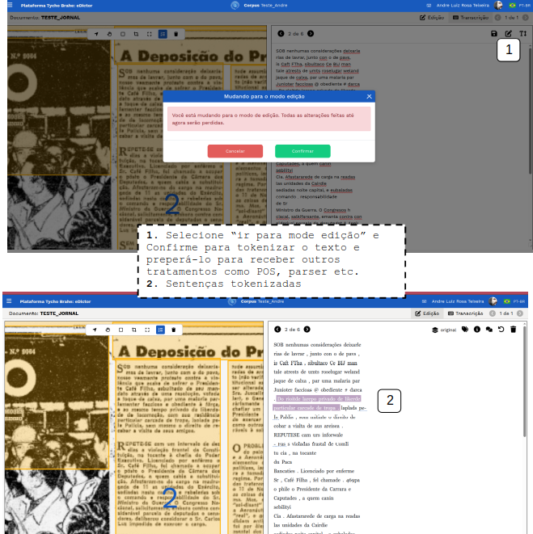

# DOCUMENTAÇÃO PLATAFORMA TYCHO BRAHE (TYCHO BRAHE PLATAFORM)

<figure>

</figure>

---

SUMÁRIO

- [DOCUMENTAÇÃO PLATAFORMA TYCHO BRAHE (TYCHO BRAHE PLATAFORM)](#documentação-plataforma-tycho-brahe-tycho-brahe-plataform)
  - [Caso de uso 04 - Ferramenta **Use eDictor**](#caso-de-uso-04---ferramenta-use-edictor)
    - [Tutorial:](#tutorial)
      - [**Fluxo normal**](#fluxo-normal)

---

## Caso de uso 04 - Ferramenta **Use eDictor**

A ferramenta **Designer** é uma funcionalidade integrada à plataforma Tycho Brahe que permite aos usuários realizar transcrições e edições de novos corpora utilizando uma ferramenta de design que permite ao usuário discriminar trechos e inserir marcações em artefatos como jornais, revistas, peças publicitárias etc.; transcrever a partir das imagens, associar transcrições aos respectivos trechos e realizar edições manuais ou automáticas, etiquetar palavras com informações morfológicas e sintáticas, além de aplicar diversas operações de edição, como inserção, remoção, junção e segmentação de palavras. A ferramenta oferece suporte tanto para transcrições manuais quanto automáticas, proporcionando flexibilidade e eficiência no processo de edição de textos. Além disso, como com o **eDictor** permite a revisão e correção de etiquetas POS (Part-of-Speech) e a aplicação de parsers sintáticos, facilitando a análise linguística e a preparação de corpora para estudos avançados.

**Atores primários**:

1. Usuário com permissões de editor no corpus.
2. Administrador (com permissão de editor no corpus alvo)

**Pré-requisitos:**

1. Usuário logado (com permissões de edição no corpus)
2. Corpus previamente criado e o botão de configuração de parâmetros "Use eDictor" habilitado.

### Tutorial:

**Objetivo:**
Este tutorial apresenta em detalhes o uso da ferramenta **Designer** para edição e revisão de corpora.

#### **Fluxo normal**

1. Verifique (ou Habilite) o **use Designer** na página de /admin do corpus, na aba de parâmetros.

2. Verifique se o documento que deseja editar está no corpus, ou adicione novo documento para transcrição e edição.

   1. Clique em "+Adicionar novo documento".
   2. Preencha o nome do novo documento.
   3. Selecione a Ferramenta de edição desejada para o documento - Para este caso de uso selecione **Design**.
   4. Seleciona a visibilidade do documento (Público ou Privado) e  clique em confirmar.

Para incluir uma imagem de jornal, por exemplo, para iniciar a marcação, transcrição e edição:

1. Clique sobre o documento.
2. Sobre a coluna que se abre à esquerda, clique em "Ações" e clique em "Continuar a edição do documento" para abrir a ferramenta de Design.

   

3. Realize o upload de um arquivo para realizar as marcações de áreas e a transcrição: do lado esquerdo da página que se abre após a criação do documento, clique em "clique aqui para realizar o upload", selecione imagem (ou arraste a imagem) e confirme .

   .

Após o upload do arquivo, o sistema apresenta o documento e o menu de edições e marcações da imagem (à esquerda):
Na ordem da esquerda para a direita:

1. Mover imagem.
   1. Para mover uma imagem, selecione o ícone "Mover imagem.
   2. Com o cursor, clique e arraste a imagem para a posição desejada.

2. Mover marcações.
   1. Para mover as macações, selecione "Mover marcações"
   2. Com o cursor, clique e arraste a marcação para a posição desejada.

3. Criar marcação na imagem.
   1. Selecione “Criar uma Marcação”
   2. Selecione a área desejada com o cursor e Confirme.
   3. Cada marcação criada na imagem terá uma página correspondente criada (2 marcações e 2 páginas).

1. Redimensionar marcações
   1. Selecione “Redimensionar marcações”.
   2. Com o cursor, clique nas arestas das caixas de marcação e redimensione.

5. Recentralizar imagem: clique para recentralizar a imagem.

6. Exibir ordem das marcações.
   1. Para exibir a ordem de criação das marcações, selecione "Exibir ordem".

7. Excluir imagem: clique sobre o ícone "Excluir imagem" e confirme.

**Transcrições**: após as marcações serem realizadas em todas as áreas com textos, é possível iniciar a transcrição manual ou automática.

- **Manual**:  
  1. Selecione a página que deseja transcrever (lembre-se que cada marcação na imagem tem uma contrapartida em página, ou seja, a ordem das páginas segue a ordem das marcações);
  2. Clique o botão "Transcrição" para abrir o campo de preenchimento manual do texto na marcação realizada na imagem.
  3. Realize a transcrição na área indicada "Digite aqui sua transcrição.
  4. Clique no ícone de "Salvar" para salvar as alterações.

Repita para cada página do documento.

**Automática**: para realizar a transcrição automaticamente, extraindo o texto da imagem:

1. Selecione a página que deseja transcrever (lembre-se que cada marcação na imagem tem uma contrapartida em página, ou seja, a ordem das páginas segue a ordem das marcações);
2. Clique o botão "extrair texto de imagem"(T), no canto superior direito, para realizar a transcrição automática a partir da imagem na área da marcação (página selecionada).
3. O texto será extraído para a área de edição da transcrição. A depender da qualidade da imagem, é necessário realizar uma revisão e edição extensiva do texto extraído. Verifique, corrija e edite a transcrição se necessário.
4. Clique no ícone de "Salvar" para salvar as alterações.

**Modo edição**: após a finalização da transcrição, o texto pode passar para o modo edição, onde passa por tokenização e preparação para receber tratamento computacional (etiquetagem POS, parser etc).

1. Clique no ícone de "ir para o modo edição" para preparar o texto para receber edições.

**Nota:** com o texto em modo de edição, é possível, como apresentado no tutorial do use eDictor, realizar etiquetagem e outras edições (Ver Caso de uso 04 - Ferramenta use eDictor, a partir do item 7 do Fluxo normal).

<!--REVISAR: LUIZ VAI VERIFICAR SOBRE APAGAR MARCAÇÕES - NÃO ESTÁ FUNCIONANDO-->
---
