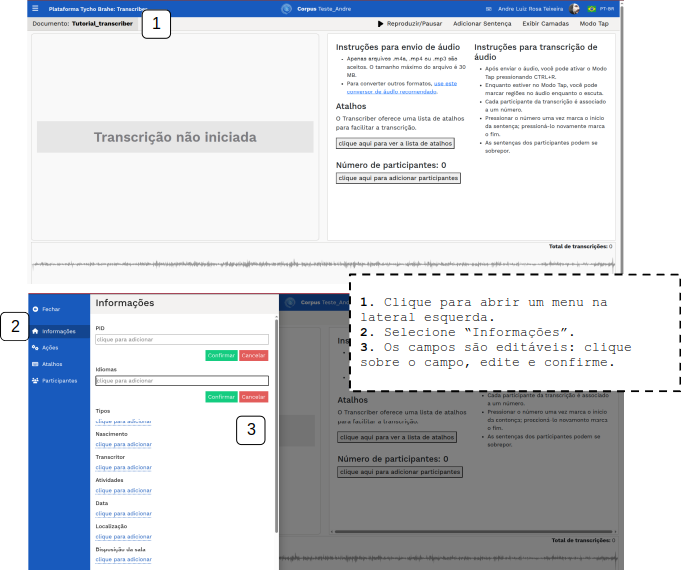

# DOCUMENTAÇÃO PLATAFORMA TYCHO BRAHE (TYCHO BRAHE PLATAFORM)

<figure>

</figure>

---

SUMÁRIO

- [DOCUMENTAÇÃO PLATAFORMA TYCHO BRAHE (TYCHO BRAHE PLATAFORM)](#documentação-plataforma-tycho-brahe-tycho-brahe-plataform)
  - [Caso de uso 12 - Transcriber](#caso-de-uso-12---transcriber)
    - [Tutorial:](#tutorial)
      - [**Fluxo normal**](#fluxo-normal)

---

## Caso de uso 12 - Transcriber

Este tutorial apresenta os passos para utilização do Transcriber. Esta ferramenta permite que o usuário realize transcrições de áudios importados na plataforma, crie e atribua participantes, importar arquivos com transcrições previamente digitalizadas e associação com participantes, além de outras tarefas de gestão de ativos de som e trasncrições.

**Atores primários**:

1. Usuário com permissões de edição aos corpora alvo

**Pré-requisitos:**

1. Usuário logado (com permissões de edição no corpus).
2. Corpus alvo configurado para uso no Transcriber.

### Tutorial:

**Objetivo:**
Este tutorial apresenta os passos para utilização do Transcriber, envolvendo a adição de áudio para transcrição, criação de perfil de participantes, associação desses perfis a regiões de áudio (utilizando o Modo Tap), extração de trechos de áudio associados às transcrições etc.

#### **Fluxo normal**

Para a edição de uma transcrição no Transcriber, pressupõe-se que o documento tenha sido previamente criado e selecionada a ferramenta Transcriber como ferramenta associada ao documento (para mais detalhes de criação de documentos,ver Caso de uso 03_02 - Criação, configuração e edição de novos documentos).

O primeiro passo a ser adotado para realizar uma trasncrição é a adição de um áudio.
Neste tutorial vamos seguir o exemplo de um áudio em karitiana.

-**Adicionar áudio**:

1. No corpus alvo, clique sobre o documento criado para edição no Transcriber.
2. Clique no ícone para abrir menu de ferramentas de edição.
3. Selecione "Usar o Transcriber".

Esta é a tela inicial do documento no Transcriber

4. Para adicionar um áudio para transcrição clique na área "Áudio não disponível - clique aqui para realizar o upload".
5. Selecione um arquivo de áudio no diretório de sua preferência. São aceitos áudios nos formatos: m4a, mp4 ou mp3 - no caso de outras extensões, realize uma conversão em uma plataforma online para as extensões suportadas no Transcriber. Após upload clique em "Confirmar"

6. Após a adição do áudio, uma barra horizontal apresenta a representação gráfica em forma de onda do áudio. Clique em Reproduzir/pausar para controlar o áudio (Atalho: CTRL + SPACE). Nesta janela, outras informações são apresentadas (ver figura a seguir).

- **Modo Tap**: após realizar a adição de um áudio e a criação de participantes, a ferramenta de "Modo Tap" permite ao usuário tocar o áudio e associar regiões a participantes através das teclas numéricas (a cada participante criado é atribuído um número cardinal do teclado numérico). Para utilizar o "Modo Tap":

1. Clique em “Modo Tap” para abrir a funcionalidade. A tela apresenta as informações como dispostas na imagem:
2. Ulilize o botão Reproduzir/Pausar para dar início ao áudio.

3. Cada participante tem um número associado. Para associar uma região do áudio a um participante, com o áudio em andamento, pressione o respectivo número para marcar o início e pressione o número novamente para marcar o fim. Por exemplo, no áudio, **Participant 1** inicia uma fala - pressione 1 para marcar o início da sentença e 1 novamente para marcar o fim. Isso criará regiões do áudio associadas a cada participante. Os trechos marcados são dispostos com a mesma cor atribuídas aos participantes.

- **Transcrição manual**:

Para realizar uma transcrição de região marcada:

1. Clique sobre um trecho associado a um participante.
2. Use o botão de play para tocar apenas o trecho de áudio.
3. Realize a Transcrição original do trecho (sentença).
4. Transcrição normalizada: campo com a transcrição que será efetivamente associada ao eDictor e será usada para análise morfossintática. Clique no botão caso queira copiar exatamente o conteúdo da Transcrição original.
5. Clique para inserir camadas.
6. Preencha as traduções (se houver).
7. Abra sentença no eDictor (habilitado quando a Transcrição Normalizada é preenchida).
8. Lembre-se de salvar para não perder seu trabalho (salvamento não é automático).
9. Clique para remover a transcrição.
10. Clique para marcar para revisão
11. Clique para adicionar uma Observação.

A transcrição e a tradução ficam dispostas no trecho associado ao participante:

Para adicionar uma Observação e atribuí-la a um outro usuário:

1. Selecione “Observações”.
2. Clique em “Adicionar comentário”.
3. Preencha o comentário.
4. Dê um título.
5. Selecione um destinatário para o comentário.
6. Clique em “Adicionar comentário” para salvar o comentário.

- **Editar Informações da transcrição** - para editar informações da transcrição:

1. Clique para abrir um menu na lateral esquerda.
2. Selecione “Informações”.
3. Os campos são editáveis: clique sobre o campo, edite e confirme.
<!--REVISAR:VERIFICAR O QUE CADA CAMPO SIGNIFICA CONCEITUALMENTE?-->

- **Ações**: a plataforma disponibiliza algumas ações que podem operar para facilitar e acelerar o processo (como "Importar frases") e algumas ações pós transcrição (como "Dividir arquivo de áudio", "Remover sentenças" e "Remover arquivo de áudio".)
  
  - **Dividir arquivo de áudio**: Divida o áudio principal em trechos menores de acordo com os trechos associados aos Participantes no "Modo Tap".<!--Revisar: inserir figura -->
  - 

- **Atalhos**: a ferramenta Transcriber disponibiliza alguns atalhos para facilitar a tarefa do transcritor:

- **Adicionar participantes**

1. Clique para abrir um menu na lateral à esquerda.
2. Selecione “Participantes”.
3. Clique “+ Adicionar participante”.
4. Preencha um ID e o Nome do participante e clique em “Confirmar”.

Após a criação do Participante, é possível realizar configurações específicas:

1. Clique para selecionar qual participante vai ser configurado (uma lista suspensa com todos os Participantes previamente criados se apresenta).
2. Clique sobre os campos editáveis, preencha e confirme.
3. Defina a cor que será associada ao perfil do Participante (esta cor fica marcada nos trechos de áudio associados aos participantes no "Modo Tap").
4. Botão pare “Remover” Participante.

Para cada um dos Participantes, é atribuido um número cardinal para uso na associação de trecho de áudio a participante no "Modo Tap".

---
