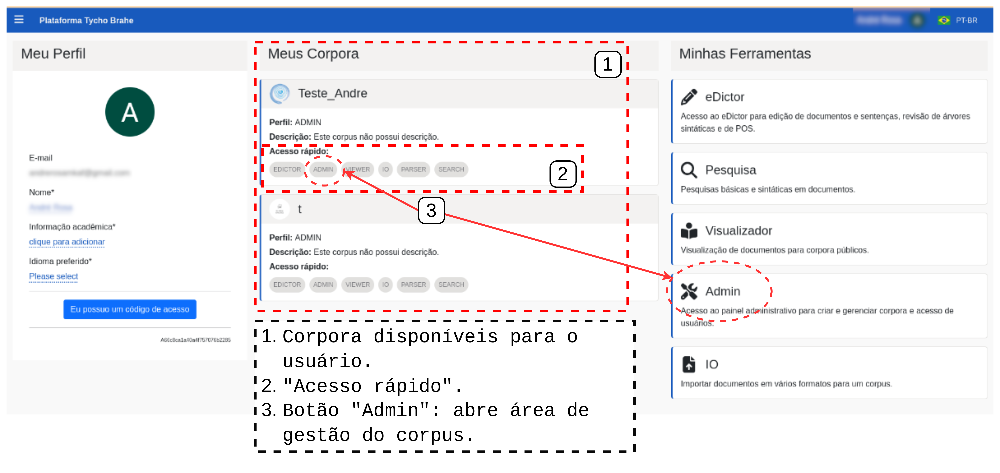
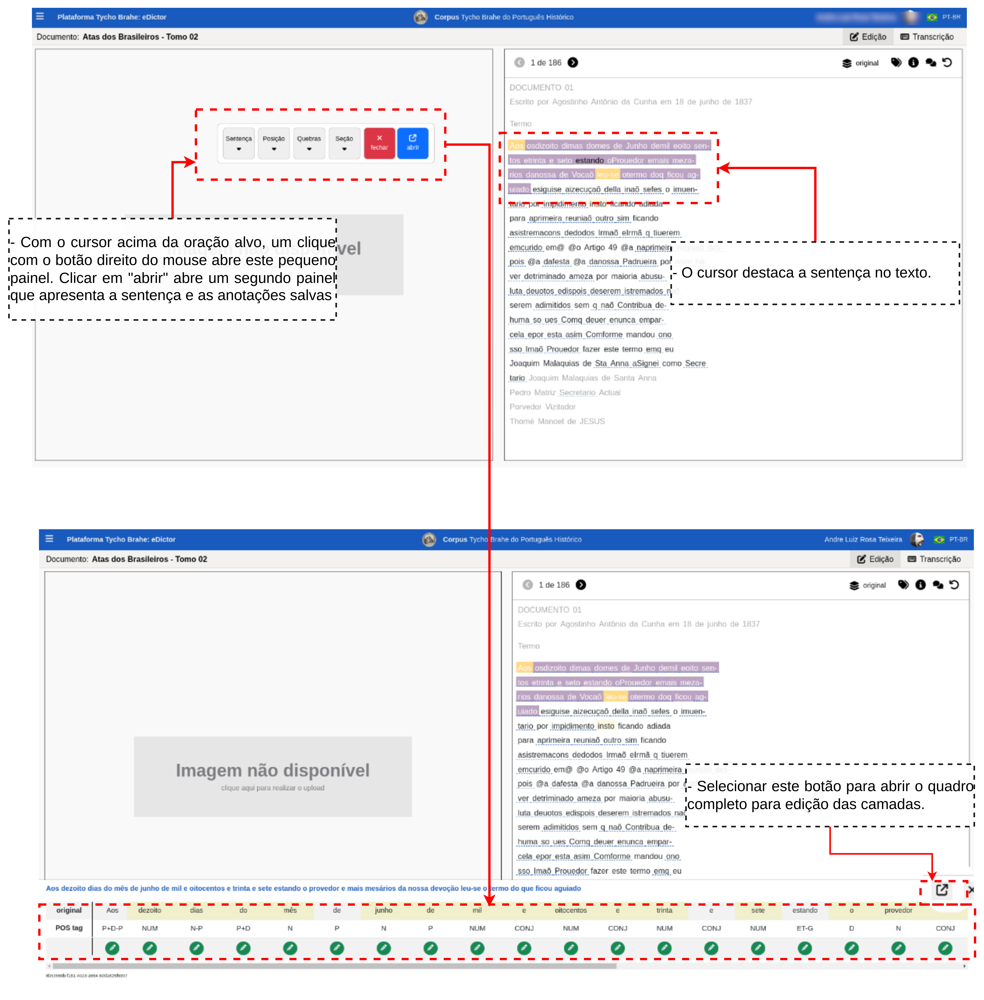
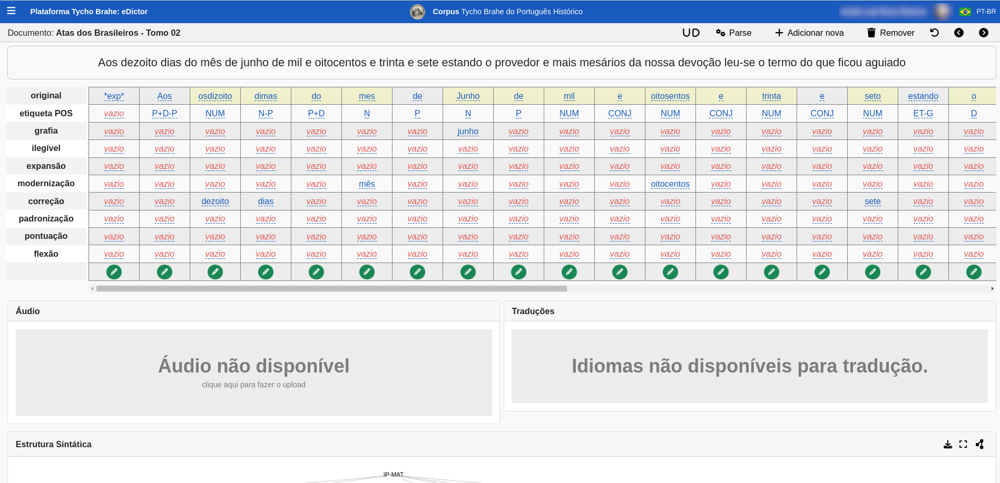

# DOCUMENTAÇÃO PLATAFORMA TYCHO BRAHE (TYCHO BRAHE PLATAFORM)

<figure>

</figure>

---

SUMÁRIO

- [DOCUMENTAÇÃO PLATAFORMA TYCHO BRAHE (TYCHO BRAHE PLATAFORM)](#documentação-plataforma-tycho-brahe-tycho-brahe-plataform)
  - [Caso de uso 03 - Criação, configuração e edição dos corpora](#caso-de-uso-03---criação-configuração-e-edição-dos-corpora)
    - [Descrição Subcaso de uso 03.1 - Criação de corpora](#descrição-subcaso-de-uso-031---criação-de-corpora)
    - [Diagrama do Subcaso de uso 03.1 - Criação de corpora](#diagrama-do-subcaso-de-uso-031---criação-de-corpora)
    - [Tutorial: Criação de corpora](#tutorial-criação-de-corpora)
      - [**Tutorial: Fluxo normal**](#tutorial-fluxo-normal)
    - [Descrição Subcaso de uso 03.2 - Configuração dos corpora](#descrição-subcaso-de-uso-032---configuração-dos-corpora)
    - [Diagrama do Caso de uso 03.2 - Configuração de corpora](#diagrama-do-caso-de-uso-032---configuração-de-corpora)
    - [Tutorial: Configuração de corpora](#tutorial-configuração-de-corpora)
      - [**Tutorial: Fluxo normal**](#tutorial-fluxo-normal-1)

---

## Caso de uso 03 - Criação, configuração e edição dos corpora

A ferramenta de gestão de corpora é um componente fundamental para a construção e configuração eficiente de coleções de textos destinados a análises linguísticas. Este processo pode ser realizado por Administradores e usuários devidamente cadastrados e com as credenciais corretas (de edição).

Para os administradores, a ferramenta oferece recursos avançados para a criação e configuração dos corpora, atribuição de permissões e gerenciamento etc.

Há três formas para executar a criação de corpora na ferramenta Tycho Brahe:

1. _Translation mode_ (Modo traduções) ou _Translation eDictor_
2. TO DO<!-- <-[REVISAR CRÍTICO: INSERIR LISTA DE MANEIRAS DE DEV DE CORPUS]...diz respeito às ferramentas que vou habilitar na configuração dos corpora? Use eDictor, use Transcriber, Use designer ... ?-->

Nos tópicos a seguir, serão abordados os principais fluxos de trabalho para a criação e configuração de novos corpora, além de tutoriais detalhados que guiam administradores e usuários no uso eficiente da ferramenta, garantindo uma experiência fluida e colaborativa na gestão dos catálogos.

### Descrição Subcaso de uso 03.1 - Criação de corpora

**Atores primários**:

1. Administrador
2. Usuário

**Pré-requisitos:**

1. Os usuários devem ser previamente cadastrados e ter permissões de administrador. <!--REVISAR CRÍTICO: SOMENTE ADMINS PODEM CRIAR NOVOS CORPORA?-->

**Fluxo normal:**

1. Acessar a página inicial de /admin na plataforma Tycho Brahe, através do link: <https://www.tycho.iel.unicamp.br/admin> (e realizar o _log in_).<!--REVISAR CRÍTICO: SÓ CONSIGO CRIAR A PARTIR DO LINK ADMIN MESMO? Ou um usuário normal, por meio da área reservada consegue criar um corpus sem ser adminstrador? consegui criar com o perfil alternativo do google que não é adminstrador, mas não consigo acessar a página de gestão pelo perfil-->
2. Na janela que se abre uma lista de corpora disponíveis é apresentada. Clicar em _"+ Create new corpus"_.
3. Adicionar nome ao novo corpus e clicar em "Confirmar": novo corpus criado.

**Nota**: este processo apenas cria o corpus. Sua alimentação pode ser realizada de diferentes formas a depender do tipo de material disponível (textos em papel, áudios, arquivos .txt, arquivos .csv - com ou sem traduções), das configurações estabelecidas (Caso de uso 03.2). É necessário que haja uma interação com a equipe responsável pelo desenvolvimento da plataforma para que a melhor estratégia de importação de dados seja escolhida e aplicada. Cada um dos tipos de importação/transcrição de dados linguísticos será discutido separadamente nesta documentação.

### Diagrama do Subcaso de uso 03.1 - Criação de corpora

Diagrama caso de uso - Criação de corpora

### Tutorial: Criação de corpora

**Objetivo**: Este tutorial detalha os passos necessários para a criação de novos corpora através através do link de administrador.

#### **Tutorial: Fluxo normal**

1. Acesse a página inicial de administrador da plataforma Tycho Brahe, através do link: <https://www.tycho.iel.unicamp.br/admin> e realize o login com a conta Google (se não estiver logado).

2. Ao acessar a página de adminstrador, uma lista de corpora disponíveis abre. Clique em _"+ Create new corpus"_.

"
Criação de um novo corpus

3. Adicione um nome ao novo corpus e clique em "Confirmar": esta ação finaliza a criação do corpus (Note que estas ações apenas criam o corpus. Para inclusão/edição de documentos, ou seja, alimentar o corpus ver Caso de uso 03.2). Após preencher com o nome desejado, clique em "Confirmar". Esta ação cria um novo corpus, que aparecerá na lista.

Criação de corpus: inserção de nome

**Nota**: este processo apenas cria o corpus. Sua alimentação (importação de dados/transcrição de áudios/extração de dados a partir de textos impressos etc.) pode ser realizada de diferentes formas a depender do tipo de material disponível (textos em papel, áudios, arquivos .txt, arquivos .csv - com ou sem traduções), das configurações estabelecidas (Caso de uso 03.2). É necessário que haja uma interação com a equipe responsável pelo desenvolvimento da plataforma para que a melhor estratégia de importação de dados seja escolhida e aplicada. Cada um dos tipos de importação/transcrição de dados linguísticos será discutido separadamente nesta documentação.

### Descrição Subcaso de uso 03.2 - Configuração dos corpora

**Atores primários**:

<!--REVISAR CRÍTICO: VERIFICAR SOBRE AS CREDENCIAIS NECESSÁRIAS SE UM USUÁRIO NORMAL, MAS COM ACESSO ADMIN CONSEGUE REALIZAR CONFIGURAÇÕES-->

1. Administrador
2. Usuário (com permissão de admin no corpus)

**Pré-requisitos:**

1. Os usuários devem ser previamente cadastrados e ter permissões de administrador. Para cadastro, ver Caso de uso 01; para solicitar cadastro, ver Caso de uso 02. Um corpus deve ter sido criado previamente (ver caso de uso 03.1).

**Fluxo normal:**

1. Acessar a página inicial da plataforma Tycho Brahe, através do link: <https://www.tycho.iel.unicamp.br/home>.
2. Na área "Ferramentas", selecionar "Área Reservada".
3. Na página de perfil que se abre, os corpora disponíveis, vinculados ao usuário, são apresentados. O usuário deve selecionar o corpus que deseja configurar e clicar no botão "Admin" na área de "Acesso rápido".
4. Na janela que se abre, selecionar a aba "Parâmetros": abre-se uma caixa com botões de alternância para a realização de configurações de parâmetros do corpus.

**Fluxo alternativo:**

**A1** - **Acesso direto pelo link de administrador**

1. Acessar o link de administrador: <https://www.tycho.iel.unicamp.br/admin>.
2. Navegar até o corpus desejado e selecionar (abre página de gestão do corpus).
3. Retomar a partir do passo 4 do Fluxo normal e realizar as configurações de parâmetros do corpus.

### Diagrama do Caso de uso 03.2 - Configuração de corpora

Diagrama caso de uso - Configuração de corpora

### Tutorial: Configuração de corpora

**Objetivo:**: Este tutorial detalha os passos necessários para a configuração dos corpora. As configurações são responsáveis por determinar desde o status dos corpora, grau de privacidade, tipo de display do corpus na plataforma, tipos de ferramentas habilitadas para o corpus etc.

#### **Tutorial: Fluxo normal**

1. Acesse a página inicial da plataforma Tycho Brahe, através do link: <https://www.tycho.iel.unicamp.br/home> .

2. Navegue até a área "Ferramentas" e selecione "Área Reservada".

Acessando "Área Reservada"

3. Na página de perfil que se abre, os corpora disponíveis, vinculados ao usuário, são apresentados. Selecione o corpus que deseja configurar e clique no botão "Admin" na área de "Acesso rápido" ou "Admin" na área "Minhas Ferramentas" e selecione o corpus que deseja configurar.

Acesso rápido - botões "Admin"

4. Clique em "Parâmetros": uma caixa se abre, disponibilizando diversos botões de alternância para configuração do corpus.

Acessando área de configuração de corpora

**Tutorial: Fluxo alternativo:**

**A1** - **Acesso direto pelo link de administrador**

1. Acesse o link de administrador: <https://www.tycho.iel.unicamp.br/admin>.
2. Navegue até o corpus desejado e o selecione, clicando sobre ele (isto abre a página de gestão do corpus).

Acesso configuração de parâmetros - Fluxo alternativo 1

3. Retomar a partir do passo 4 do Fluxo normal e realizar as configurações de parâmetros do corpus. 
   A seguir são apresentadas descrições de cada um dos botões de configurações disponíveis. 

**Public corpus**: seleciona se o corpus é disponível ao público em geral ou se é privado.

**Active**: configura se o corpus está ativo ou inativo;

**Featured Corpus**: Um corpus marcado com esse parâmetro aparece na página principal da plataforma, na área "Corpora em Destaque".

Corpora em corpora_em_destaque

**Use Morphemes**: habilita o uso campos referentes a morfemas, incluindo glossa, nos corpora.

Configuração de corpora: botão "Use Morphemes"

 **Use Sound**: a habilita o uso de áudio no corpus.

- Como podemos observar na Figura abaixo, a habilitação do botão "Use Sound" habitila uma seção de Áudio, que permite ao analista incluir o áudio a ser transcrito (ou o áudio correspondente à transcrição da sentença selecionada).

  
  Configuração de corpora: botão "Use Sound"

 

- O **"Use Sound"** também habilita, na ferramenta "eDictor", um botão de _play_ para ser tocar os áudios associados às sentenças do documento selecionado, como observamos na Figura abaixo:
  
  Configuração de corpora: botão "Use Sound"(no eDictor)

 **Use Translations**: o botão "Use Translations" habilita a seção de Traduções no eDictor, como apresentado na

Configuração de corpora: botão "Use Translations"

**Use Lexicon**: é utilizado quando há um parser disponível, mas não há um etiquetador automático (que só funciona se houver uma quantidade mínima de palavras para treinamento do etiquetador). No caso de esta condição não estar satisfeita, o analista deve utilizar o léxico para realizar a etiquetagem automática.

**Use Grid**: ao acessar o catálogo, o usuário tem a possibilidade de apresentação de documentos de duas maneiras: lista, ou grid. Ao habilitar o botão "Use Grid", o usuário configura a apresentação em grid como default, como apresentado na Figura abaixo:

Configuração de corpora: botão "Use Grid"

**Use Category**: este botão habilita a possibilidade de categorização e subcategorização dos corpora (por exemplo, categorização com base em parâmetros demográficos etc). Note-se que a criação dos rótulos para as categorias pode ser realizada por um usuário com permissões de adminstrador

Configuração de corpora: botão "Use Category"

**Use Edition Tiers**<!--[REVISAR COM O LUIS]-->: este botão habilita a disponibilização de diversos níveis de edição para garantir a máxima fidelidade filológica do texto. Por exemplo, acessando-se o catálogo, selecione o corpus Tycho Brahe do Português Histórico e selecione o documento "Atas dos Brasileiros - Tomo 02", como apresentado na Figura:

 Configuração de corpora: botão "Use Edition Tiers"

Configuração de corpora: botão "Use Edition Tiers" (abrindo a ferramenta).

Configuração de corpora botão "Use Edition Tiers"

Esta ação abre um painel com uma matriz para edição dos níveis de edição, como mostra a Figura abaixo. Note-se: na mesma tela que seria análoga à sentença com o "Use Morphemes" selecionado, são apresentadas os níveis de edição.

Matriz para edição em níveis de edição

Os botões "Use eDictor Translations"/"Use eDictor"/"Use Designer"/"Use Transcriber" não são excludentes, i.e., podem ser habilitados ao mesmo tempo em um determinado corpus. Esta ação disponibiliza todas as ferramentas para utilização no corpus.

**Use eDictor Translations**: Habilita o uso da versão eDictor para apresentação de corpora paralelos, como apresentado na Figura a seguir:

Configuração de corpora: botão Use eDictor Translations - Corpora paralelos

A configuração do eDictor Tranlations também depende de configurações na aba eDictor na pagina de admin ("Corpora Management"):

- Acesse a página inicial da ferramenta no endereço <https://www.tycho.iel.unicamp.br/home>;
- Acesse "Corpora Management" na área de Ferramentas.
- Selecione o corpus que deseja configurar (ou crie um novo corpus em "+ Create New Corpus").
- Selecione a aba "eDictor" e "Translations" no canto esquerdo.
- Clique em "Create": uma caixa com campos de configurações para entradas de tradução abre:
  - **Order**: aceita números inteiros para configuração da ordem em que as línguas de tradução serão apresentadas;
  - **Symbol**: preencha com o rótulo desejado;
  - **Name**: preencha com o nome desejado;
  - **Reference**: preencha para adicionar uma referência.<!--[REVISAR: ESTA REFERENCIA DIZ RESPEITO A QUE?]-->

Configurações no eDictor
 
Estas configurações habilitam a apresentação dos corpora paralelos como em [2] na Figura abaixo; Em [3], o usuário pode selecionar qual lingua de tradução deseja que seja apresentada; Em [4], após a seleção de uma sentença, é possível verificar as traduções para a sentença selecionada, além de ser possível realizar edições nas traduções.

Resultado configurações de eDictor Translations

**Use eDictor**: o acionamento do botão "Use eDictor" habilita o uso do eDictor tradicional para transcrição e edição.

**Use Designer**: o acionamento deste botão habilita o uso da versão do eDictor para trabalhar com textos de layouts complexos, como jornais.

**Use Transcriber**: este botão habilita o uso da versão do eDictor para trabalhar com transcrição de áudio.

**Allow POS Tag inclusion**: o acionamento deste botão possibilita adicionar novas etiquetas POS à lista enquanto o usuário edita sentenças no eDictor.

**Default for UD**: habilita que o corpus seja configurado para usar Universal Dependencies como o framework padrão para edição de sentenças.

---
