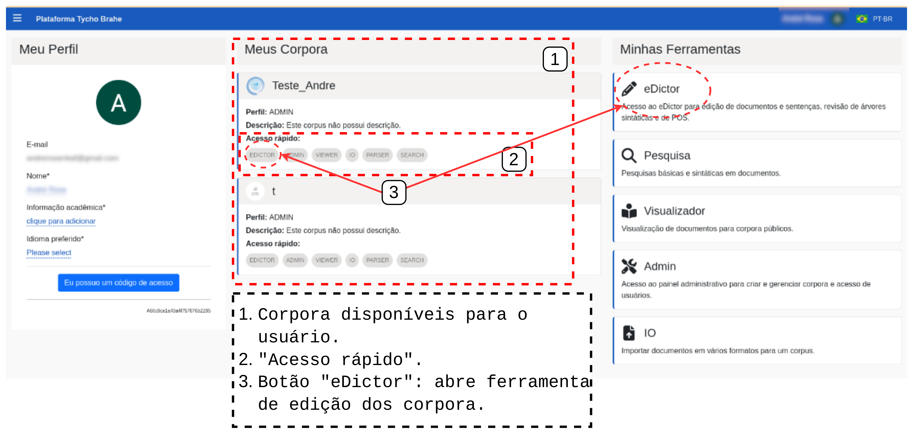
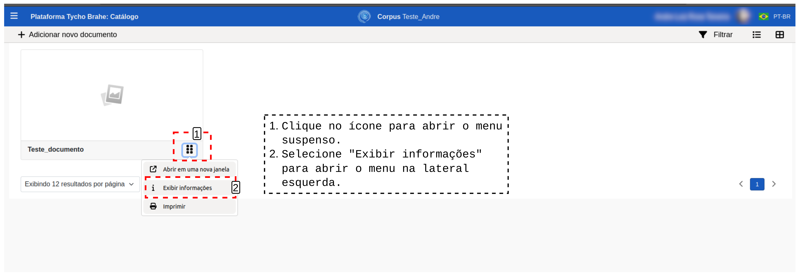
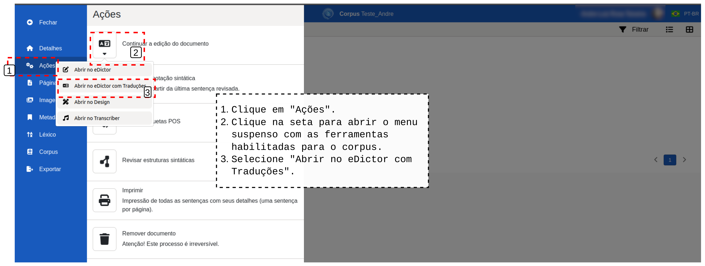
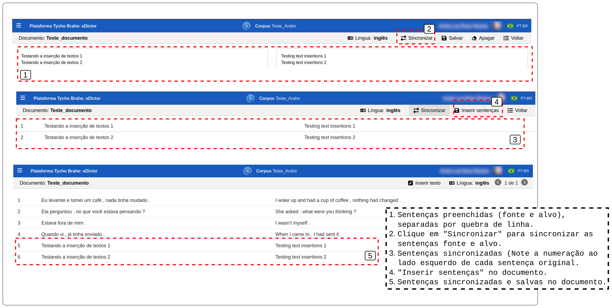
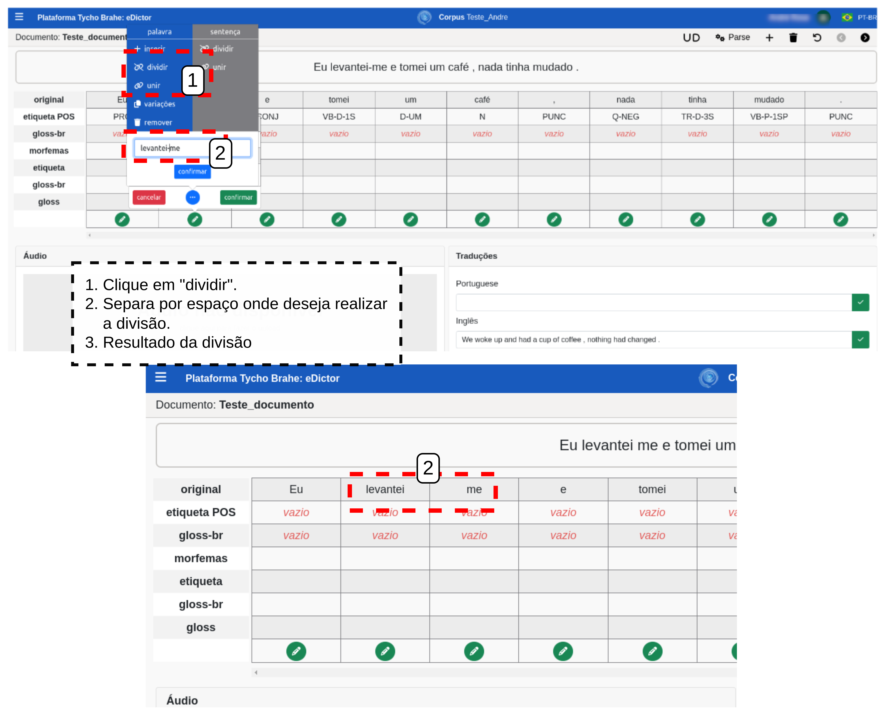
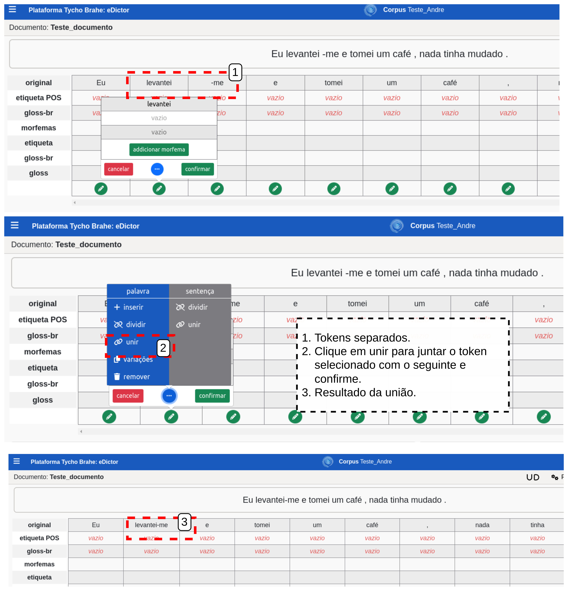
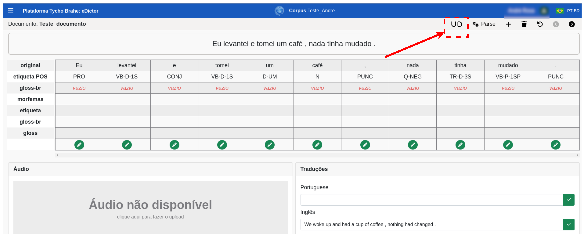

# DOCUMENTAÇÃO PLATAFORMA TYCHO BRAHE (TYCHO BRAHE PLATAFORM)

<figure>

</figure>

---

SUMÁRIO

- [DOCUMENTAÇÃO PLATAFORMA TYCHO BRAHE (TYCHO BRAHE PLATAFORM)](#documentação-plataforma-tycho-brahe-tycho-brahe-plataform)
  - [Caso de uso 05 - Ferramenta **eDictor Translations**](#caso-de-uso-05---ferramenta-edictor-translations)
    - [Descrição Subcaso de uso 05.01 - Edição de corpora (Inserir, editar e remover sentenças) ](#descrição-subcaso-de-uso-0501---edição-de-corpora-inserir-editar-e-remover-sentenças-)
    - [Diagrama do Subcaso de uso 05.01 - **Use eDictor Translations: Edição de corpora**](#diagrama-do-subcaso-de-uso-0501---use-edictor-translations-edição-de-corpora)
    - [Tutorial:](#tutorial)
      - [**Tutorial: Fluxo normal**](#tutorial-fluxo-normal)
      - [**Tutorial: Fluxo alternativo:**](#tutorial-fluxo-alternativo)

---

## Caso de uso 05 - Ferramenta **eDictor Translations**

A ferramenta **Use eDictor Translations** habilita o uso da versão eDictor para desenvolvimento de corpora com suas traduções nas línguas configuradas e selecionadas pelo usuário. A habilitação desta ferramenta permite, consequentemente, a apresentação dos corpora de forma paralela, ou seja, com originais e traduções de forma paralela e sincronizada.

<!--[REVISAR: AVALIAR SE FUTURAMENTE VOU INSERIR AS OUTRAS FUNCIONALIDADES DE EDIÇÃO DOS CORPORA AQUI: EDITAR ETIQUETAS DAS DIVERSAS CAMADAS ETC]-->

### Descrição Subcaso de uso 05.01 - Edição de corpora (Inserir, editar e remover sentenças) <!--[REVISAR: CONSIDERER SUBDIVIDIR OS CASOS?]-->

**Atores primários**:

1. Usuário (com acesso admin ao corpus)
2. Adminstrador

**Pré-requisitos:**

1. Usuário logado (com permissões de edição no corpus)
2. Corpus previamente criado e o botão de configuração de parâmetros "Use eDictor Translations" habilitado.

**Fluxo normal:**

1. Acessar a página inicial da plataforma Tycho Brahe, através do link: <https://www.tycho.iel.unicamp.br/home>.
2. Na área "Ferramentas", selecionar "Área Reservada" e realizar login com conta Google (se já não estiver logado).
3. Na página de perfil que se abre, os corpora disponíveis, vinculados ao usuário, são apresentados. O usuário deve selecionar o corpus que deseja configurar e clicar no botão "eDictor" na área de "Acesso rápido".
4. Com o catálogo aberto, selecionar o corpus e documento que deseja editar.
5. Acessar "Exibir informações" clicando no ícone com menu no documento do corpus.
6. Na aba de ações que abre à esquerda, no campo "Continuar a edição do documento", clique na seta para abrir o menu de ferramentas de edição: selecionar o "eDictor Translations".

   1. Inserir textos (sentenças):
      1. Selecionar "Inserir texto".
      2. Inserir o texto fonte (original); selecionar o idioma de tradução; inserir texto traduzido. (Nota: sentenças a serem sincronizadas em paralelo podem ser separadas por quebra de linha).
      3. Clicar em "Salvar" para salvar transcrições.
      4. Clicar no botão "Sincronizar", para que as sentenças fonte e alvo sejam apresentados paralelamente.
      5. Clicar em "Inserir sentenças" para inserir sentenças paralelas no documento do corpus.
   2. Apagar textos transcritos (ainda não sincronizados):
      1. Selecionar "Inserir texto"
      2. Clicar em "Apagar" para apagar textos transcritos (Textos já sincronizados são mantidos)
   3. Editar sentenças sincronizadas:

      1. Via botão E - eDictor:

         1. Selecionar um par de sentenças.
         2. Selecionar botão E (eDictor).
         3. Para editar o original: no quadro, clicar no ícone de "lápis" (edição) da palavra que desejar, editar a palavra e confirmar.
         4. Para editar a tradução: rolar a página até o campo de "Traduções", editar o campo com o texto e salvar.
         5. Para outras edições da palavra: clicar em "...":

            1. "Inserir": inserir palavra á direita.
            2. "Dividir": dividir palavra em duas.
            3. "Unir": unir palavras.
            4. "Variações".
            5. "Remover": remover palavra 6. Para edições da sentença, clicar em "...":

               1. "Dividir": dividir sentença em duas (após token selecionado).
               2. "Unir": unir com sentença seguinte

                  Nota: A função de Dividir e Unir sentenças não funciona se a sentença tiver traduções e áudios associados. Na tentativa, o sistema retorna uma mensagem de erro e a operação é impedida:

         

      2. Via botão UD <!--REVISAR CRÍTICO: ACREDITO QUE PARA FAZER EDIÇÕES NO ORIGINAL COM UD SELECIONADO É NECESSÁRIO ANTES TER ASSOCIADO UM PARSER - NO CASO DO NHEENGATU POR EXEMPLO, SÓ CONSIGO EDITAR COM O EDICTOR SELECIONADO-->:
         1. Selecionar um par de sentenças.
         2. Selecionar botão UD (Dependências Universais).
         3. Para editar o original: no quadro, na linha da palavra desejada clicar no ícone de lápis (edição) da palavra que desejar, editar a palavra e confirmar.
         4. Para editar a tradução: não há edição de tradução com o botão UD selecionado.
         5. Para incluir palavra: na linha da palavra selecionada, clicar em "+", editar o campo e confirmar.
         6. Para aplicar informações de um token a todos tokens similares do documento: na linha da palavra objetivo, clicar no ícone de "cópia"
         7. Para deletar: na linha da palavra, clicar no ícone com "lixeira" e confirmar.

   4. Remover sentenças sincronizadas:
      1. Selecionar um par de sentenças.
      2. Clicar em no ícone de "lixeira" (remover) e confirmar.

**Fluxo alternativo:**

**A1**

1. Acessar a página de catálogo através do link: <https://www.tycho.iel.unicamp.br/catalog>
2. Seguir a partir de 3 no Fluxo normal.

**A2** Alternativa para inserção de sentenças

Seguir o fluxo normal de 1 a 5, ou o fluxo A1, para acesso à ferramenta eDictor Translations. Para um fluxo alternativo de inserção de novas sentenças:

1. Selecionar um par de sentenças.
2. Clicar no botão "Adicionar nova".
3. Uma caixa de diaĺogo se abre: clicar em "confirmar".
4. No campo superior "digite a transcrição aqui", preencher.
5. Preencher as traduções e clicar no botão verde para salvar.
6. Clicar em "adicionar nova sentença"

### Diagrama do Subcaso de uso 05.01 - **Use eDictor Translations: Edição de corpora**

Figura X: Diagrama Caso de uso 6.01 - Edição de corpora (eDictor Translations)

Figura x: Cont. Diagrama Caso de uso 6.01 - Ações no corpus <!--REVISAR: VOU TER DE MODIFICAR ESTA FIGURA NÃO SEI SE VALE A PENA-->

### Tutorial:

**Objetivo:** Este tutorial detalha os procedimentos necessários para a edição de corpora usando a ferramenta **"eDictor Translations"**.

#### **Tutorial: Fluxo normal**

1. Acesse a página inicial da plataforma Tycho Brahe, através do link: <https://www.tycho.iel.unicamp.br/home> .

2. Navegue até a área "Ferramentas" e selecione "Área Reservada".
   
   Figura x: Acessando "Área Reservada"  

3. Na página de perfil que se abre, os corpora disponíveis, vinculados ao usuário, são apresentados. Selecione o corpus que deseja configurar e clique no botão "eDictor" na área de "Acesso rápido" ou "eDictor" na área "Minhas Ferramentas" e selecione o corpus que deseja configurar.
   
   Figura x: Selecionando a ferramenta eDictor   

4. Com o catálogo aberto, clique sobre o nome do corpus e como em [1] para abrir a lista suspensa com os corpora disponíveis e selecione o corpus que deseja editar [2], como na Figura x:
   
   Figura x: Selecionando um corpus no catálogo</figcaption>  

5. Após selecionar o corpus que deseja editar, acesse "Exibir informações" clicando no ícone com menu (menu com seis pontos) no documento do corpus.
   
   Figura x: Acessando "Exibir informações"  

6. Na aba de "Ações" , na menu que abre à esquerda, no campo "Continuar a edição do documento", clique na seta para abrir o menu de ferramentas de edição: selecionar o "eDictor Translations" (Nota: o botão de configuração de parâmetros "Use eDictor Translations" deve estar habilitado para habilitar a edição através do **eDictor Translations**).
   
   Figura x: Ações - Abrir edição com "eDictor Translations"  

   1. Para inserir textos (sentenças):

      1. Selecione o botão "Inserir texto".
      2. Preencha o campo que apresenta "Digite ou cole o texto no idioma original" com o texto fonte (original); selecione o idioma de tradução; preencha o campo "Digite ou cole o texto traduzido em: [idioma selecionado para tradução]" com o texto traduzido.
      3. Clique em "Salvar" para salvar transcrições.
      4. Clique no botão "Sincronizar", para que as sentenças fonte e alvo sejam sincronizadas apresentadas paralelamente.
      5. Clique em "Inserir sentenças" para que as sentenças sincronizadas sejam inseridas no documento do corpus.
         Figura x: Ações no eDictor Translations

   2. Apagar textos transcritos (ainda não sincronizados):

      1. Selecione "Inserir texto"
      2. Clique em "Apagar" para apagar textos transcritos (Textos já sincronizados são mantidos)
      3. Clique em "voltar" para retornar ao documento com suas sentenças paralelas. Figura x: Sentenças sincronizadas e inseridas no documento

   3. Editar sentenças sincronizadas:
      1. Via botão E - eDictor:
         1. Com o corpus já selecionado, selecione um par de sentenças.
         2. Selecione botão E (eDictor).
         3. Para editar o texto original do token: no quadro, clique no ícone de "lápis" (edição) da palavra que desejar, edite a palavra e confirme.
         4. Para editar a tradução: role a página até o campo de "Traduções", edite o campo com o texto e salve.
         5. Para outras edições da palavra: clique em "...":
            1. Clique em "inserir": inserir palavra á direita da palavra selecionada, preencha o campo e confirme
            2. Clique em "dividir": dividir palavra em dois tokens distintos
            3. Clique em "unir" para unir o toke selecionado ao token seguinte na sentença: 
            4. Clique em "Variações": o botão de variações apresenta todas as variações de etiquetas e glossas utilizadas para a palavra e salvas no banco de dados. Este botão permite um preenchimento mais rápido das informações sobre a palavra selecionada.
            5. Clique em "remover": remover palavra.
         6. Para edições da sentença, clicar em "...":
            1. "Dividir": dividir sentença em duas (após token selecionado)
            2. "Unir": unir com sentença seguinte
      2. Via botão UD:
         1. Com o corpus já selecionado, selecione um par de sentenças.
         2. Selecione botão UD (Dependências Universais).
         3. Para editar o original: no quadro, na linha da palavra desejada clique no ícone de lápis (edição) da palavra que desejar, edite a palavra e confirma.
         4. Não há edição de tradução com o botão UD selecionado
         5. Para incluir palavra: na linha da palavra selecionada, clique em "+", preencha o campo com a palavra a ser adicionada e confirme.
         6. Para aplicar informações de um token a todos tokens similares do documento: na linha da palavra selecionada, clique no ícone de "cópia".
         7. Para deletar: na linha da palavra, clique no ícone com "lixeira" e confirme.
   4. Remover sentenças sincronizadas:
      1. Selecionar um par de sentenças.
      2. Clicar em no ícone de "lixeira" (remover) e confirmar.

#### **Tutorial: Fluxo alternativo:**

**A1**

1. Acesse a página de catálogo através do link: <https://www.tycho.iel.unicamp.br/catalog> :

Figura x: Acesso a catálogo

2. Siga a partir do item 3 do Fluxo normal.

**A2** - Alternativa para inserção de sentenças

Siga o fluxo normal de 1 a 5, ou o fluxo A1, para acesso à ferramenta eDictor Translations. Para um fluxo alternativo de inserção de novas sentenças:

1. Selecione um par de sentenças.
2. Clique no botão "Adicionar nova".
3. Uma caixa de diaĺogo se abre: clique em "confirmar".

4. No campo superior "digite a transcrição aqui", preencha com o texto desejado.
5. Preencha as traduções e clique no botão verde para salvar.
6. Clique em "adicionar nova sentença".

Sentença e tradução adicionadas:

---
