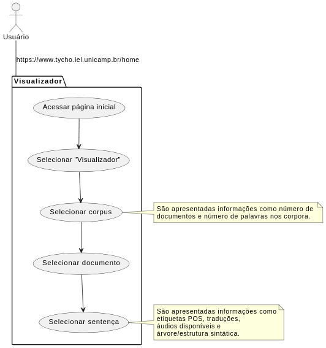
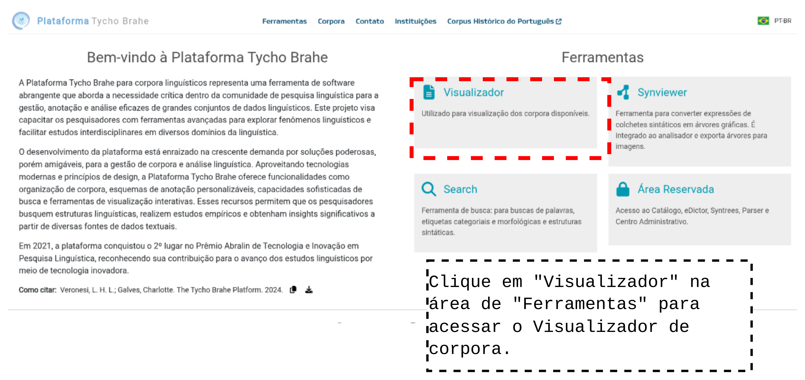
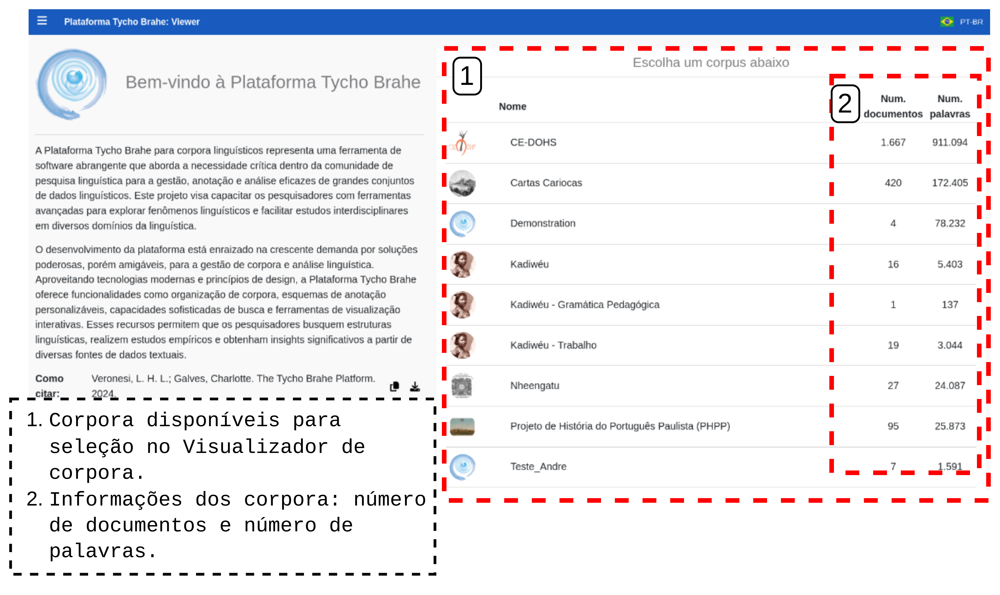
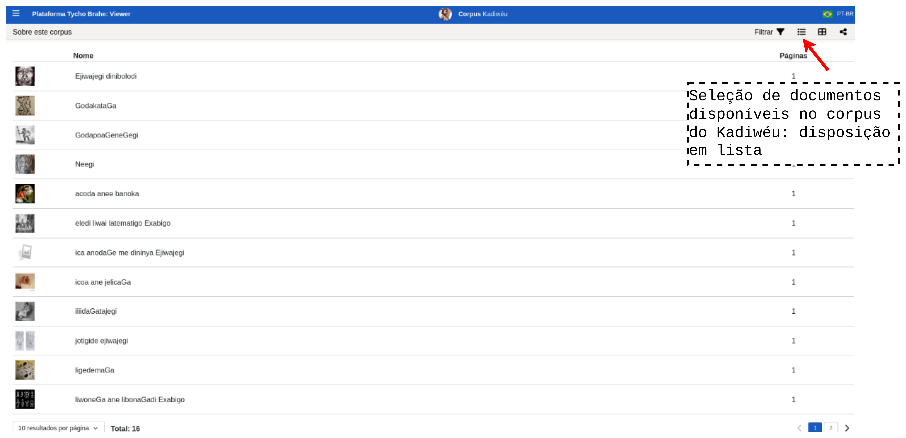
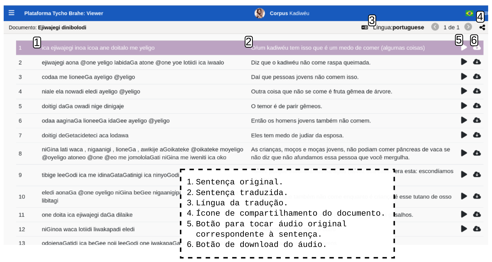
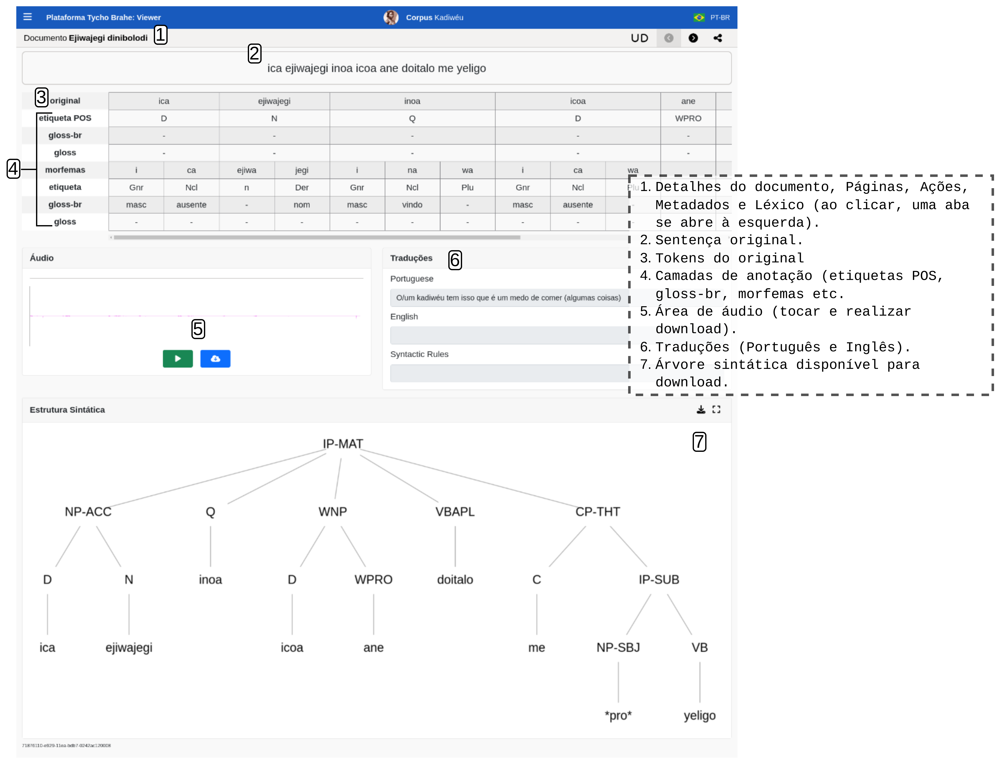

# DOCUMENTAÇÃO PLATAFORMA TYCHO BRAHE (TYCHO BRAHE PLATAFORM)

<figure>

</figure>

---

SUMÁRIO

- [DOCUMENTAÇÃO PLATAFORMA TYCHO BRAHE (TYCHO BRAHE PLATAFORM)](#documentação-plataforma-tycho-brahe-tycho-brahe-plataform)
  - [Caso de uso 07 - Visualizador de corpora](#caso-de-uso-07---visualizador-de-corpora)
    - [Descrição Caso de uso 07 - Visualizador de corpora](#descrição-caso-de-uso-07---visualizador-de-corpora)
    - [Diagrama do Caso de uso 07 - Visualizador de corpora](#diagrama-do-caso-de-uso-07---visualizador-de-corpora)
    - [Tutorial:](#tutorial)
      - [**Tutorial: Fluxo normal**](#tutorial-fluxo-normal)

---

## Caso de uso 07 - Visualizador de corpora

O visualizador de corpora da plataforma Tycho Brahe oferece uma interface acessível e prática para a exploração dos corpora disponíveis. Essa funcionalidade está aberta a todos os usuários, incluindo aqueles que não possuem cadastro na plataforma, promovendo a democratização do acesso aos dados linguísticos desenvolvidos no projeto.

Com o visualizador, é possível:

- Examinar anotações realizadas nos corpora, como etiquetas (POS) e anotações sintáticas.
- Visualizar e exportar representações gráficas, como árvores sintáticas, diretamente a partir da ferramenta, permitindo maior flexibilidade para estudos e apresentações.
- Acessar áudios disponíveis (quando se aplicar).
- Visualizar traduções das sentenças analizadas (quando se aplicar).
  Essas funcionalidades são ideais para pesquisadores, estudantes e interessados em linguística que desejam explorar os corpora de forma detalhada e aproveitar os recursos sem barreiras iniciais de acesso.

### Descrição Caso de uso 07 - Visualizador de corpora

**Atores primários**:

1.Usuários em geral

**Pré-requisitos:**

1.Sem pré-requisitos

**Fluxo normal:**

1. Acessar a página inicial da plataforma Tycho Brahe no endereço <https://www.tycho.iel.unicamp.br/home>.
2. Clicar no "Vizualizador" na área de "Ferramentas".
3. Selecionar um dos corpora disponíveis na lista.
   1. São apresentadas informações como número de documentos e número de palavras nos corpora.
4. Navegar pela lista de documentos. Selecionar um documento.
5. Selecionar a sentença desejada.
   1. São apresentadas informações como etiquetas POS, traduções, áudios disponíveis e árvore/estrutura sintática.

### Diagrama do Caso de uso 07 - Visualizador de corpora

Diagrama caso de uso Visualizador de corpora

### Tutorial:

**Objetivo:**
Este tutorial tem como objetivo guiar os usuários no uso do visualizador de corpora da plataforma Tycho Brahe. Ao final, o usuário será capaz de:

- Acessar o visualizador, mesmo sem cadastro na plataforma.
- Navegar pelas anotações disponíveis nos corpora.
- Visualizar e exportar árvores sintáticas desejadas para uso externo.

#### **Tutorial: Fluxo normal**

1. Acesse a página inicial da plataforma Tycho Brahe no endereço <https://www.tycho.iel.unicamp.br/home>.

2. Clique no "Vizualizador" na área de "Ferramentas".

Acessando o Visulizador de corpus.

3. Selecione um dos corpora disponíveis na lista.
   1. São apresentadas informações como número de documentos e número de palavras nos corpora.

4. Navegue pela lista de documentose e selecione um documento. Há alguma ícones que disponibilizam algumas funcionalidades:

- Filtragem de documentos por palavra ou status:

Filtragem de documentos no Visualizador

- Documentos dispostos em forma de grade ou lista:

Disposição de documentos em grade.

Disposição de documentos em lista.

- Botão de compartilhamento de link do corpus:

Compartilhamento do link do corpus.

5. Após a seleção do documento desejado, as sentenças que o corpus contém são apresentadas. Selecione a sentença desejada.
   - Na tela que apresenta as sentenças, são apresentadas: tradução, botão para tocar o áudio original, botão para realizar download do áudio, língua de tradução etc.:

Sentenças disponíveis no documento.

- Ao ser selecionada uma sentença, são apresentadas informações como etiquetas POS, traduções, áudios disponíveis e árvore/estrutura sintática.

Anotações realizadas na sentença selecionada.

---
