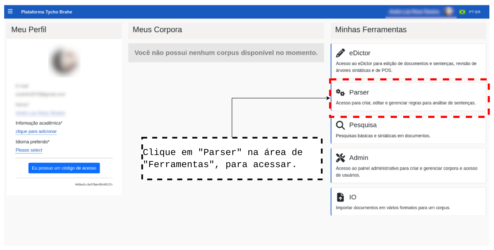
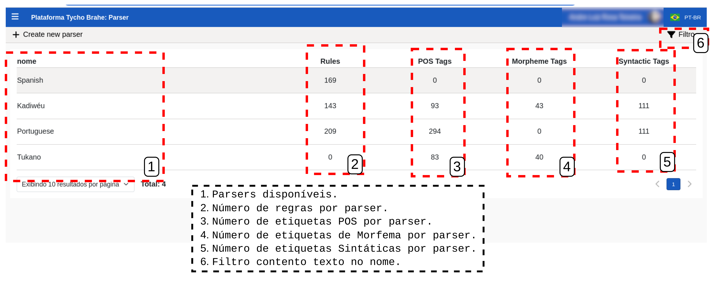
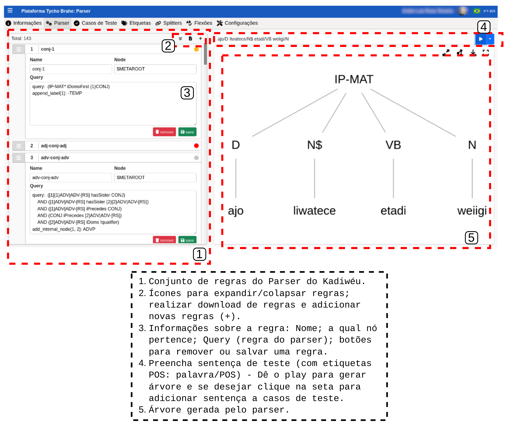
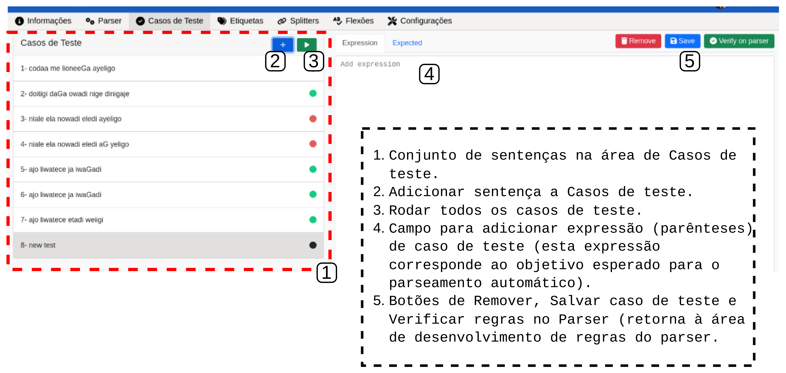
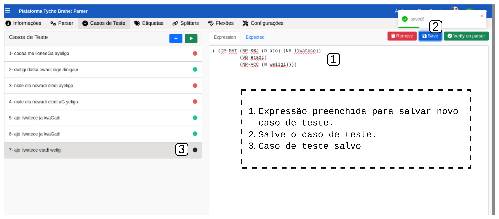
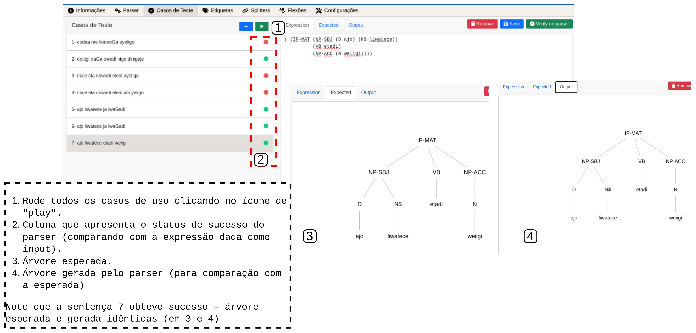
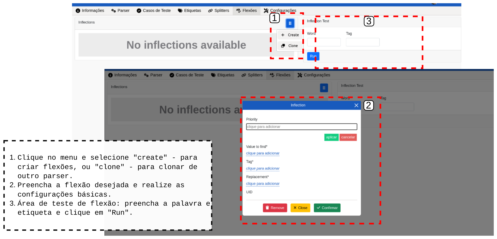
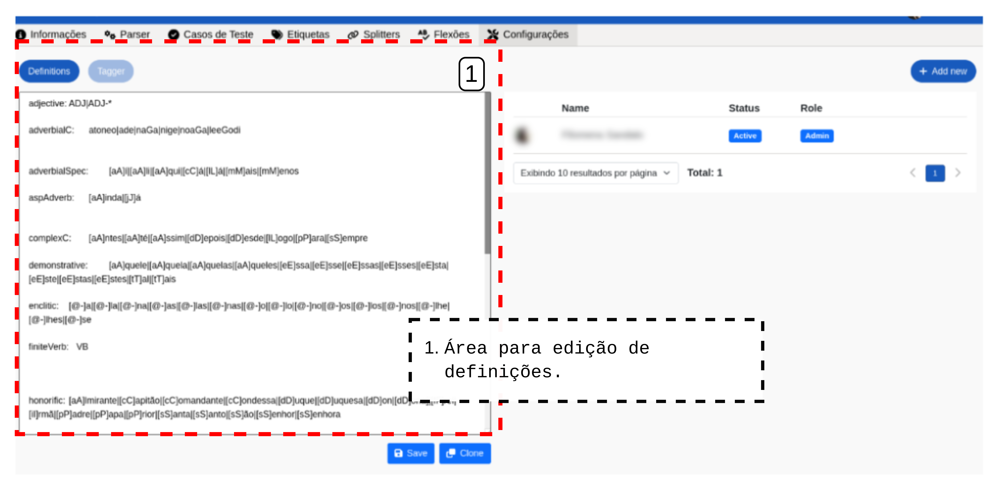
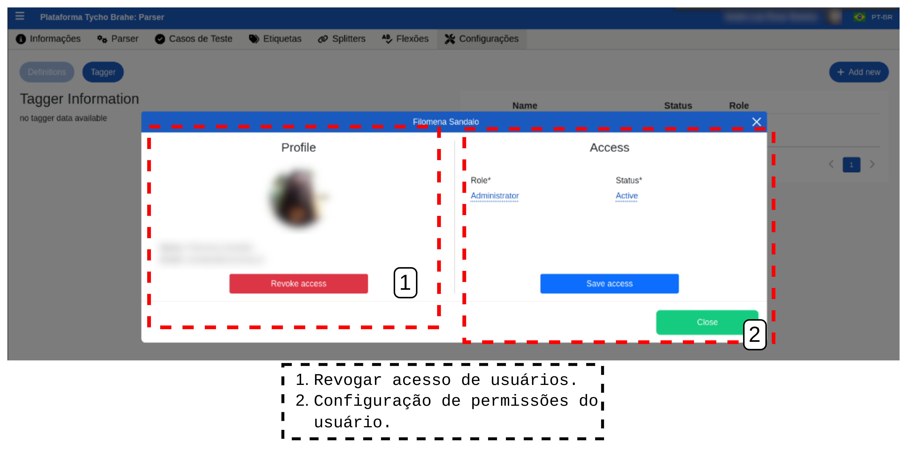

# DOCUMENTAÇÃO PLATAFORMA TYCHO BRAHE (TYCHO BRAHE PLATAFORM)

<figure>

</figure>

---

SUMÁRIO

- [DOCUMENTAÇÃO PLATAFORMA TYCHO BRAHE (TYCHO BRAHE PLATAFORM)](#documentação-plataforma-tycho-brahe-tycho-brahe-plataform)
  - [Caso de uso 09.1 - Parser - Edição e gerenciamento das regras dos parsers](#caso-de-uso-091---parser---edição-e-gerenciamento-das-regras-dos-parsers)
    - [Diagrama do Caso de uso 09 - Parser](#diagrama-do-caso-de-uso-09---parser)
    - [Tutorial:](#tutorial)
      - [**Tutorial: Fluxo normal**](#tutorial-fluxo-normal)
      - [**Tutorial: Fluxo Alternativo**](#tutorial-fluxo-alternativo)

<!--A FAZER-->

## Caso de uso 09.1 - Parser - Edição e gerenciamento das regras dos parsers

A ferramenta de construção de Parser possibilita a criação, edição e gerenciamento de parsers baseados em regras, construção de casos de teste, inclusão de splitters e flexões e outras configurações como o desenvolvimento de definições e etiquetadores.

**Atores primários**:

1. Administradores.
2. Usuários com credencial "admin" no parser <!--REVISAR: verificar com Luis-->

**Pré-requisitos:**

1. Usuário Administrador devidamente logado.

**Fluxo normal:**

1. Acessar a página inicial da plataforma Tycho Brahe, através do link: <https://www.tycho.iel.unicamp.br/home>.
2. Na área "Ferramentas", selecionar "Área Reservada" e realizar login com conta Google ou com suas credenciais  (se já não estiver logado).
3. Ao acessar "Área Reservada", na área "Minhas Ferramentas", acessar o "Parser".
4. Selecionar o parser no qual deseja realizar edições e gerenciamento.

- **Aba "Parsers":**

  - Edição de regras:
    - Selecionar uma regra a ser editada ao clicar sobre a regra. Abre-se uma área com os campos (Nome; Node; Query: regra propriamente dita, escrita em sintaxe Corpus Search(Documentação acessível em: <https://corpussearch.sourceforge.net/>)).
    - Se desejar, preencher uma sentença a ser análisada para testar o conjunto de regras (é possível adicionar paradas, em quaisquer das regras, para teste do parser: clicar no círculo à direita da regra - "add/remove breaking point"). É possível incluir a sentença testada nos casos de teste.
    - Adicionar regras: clicar no botão "+ add new rule", editar e salvar.

- **Aba "Casos de teste"**:

  - Adicionar caso de teste: clicar no botão "+" para adicionar caso de teste; preencher a "expressão" em parênteses, referente à sentença desejada. **Note-se** que a expressão deve estar "correta", ou seja, deve representar o objetivo final esperado de geração pelo parser automático, ensejando uma comparação com o resultado efetivo de aplicação do parser automático. Ao preencher uma expressão, na sub-aba "Expression", uma árvore objetivo é apresentada na sub-aba "Expected".
  - Rodar casos de teste: Clicar no botão "►" para rodar os casos de teste e comparar o resultado esperado pelo usuário com o efetivamente processado pelo parseamento automático. Esta ação cria uma sub-aba "Output" que apresenta a árvore efetivamente gerada automaticamente pelo parser, possibilitando sua comparação com a árvore esperada.

- **Aba "Etiquetas":**

  - Selecionar tipo de etiqueta entre POS, SYNTACTIC, MORPHEME.
  - Pesquisar etiqueta: preencher o campo para realizar pesquisa de etiquetas.
  - "Extract": botão para extração de etiquetas de um corpus (CUIDADO! Esta ação exclui todas as etiquetas atualmente salvas - ação irreversível).
  - "Clone": escolher um corpus do qual clonar todas as etiquetas (CUIDADO!Esta ação deleta todas as etiquetas atuais do parser - ação irreversível).
  - "+ Add new"(botão para adicionar nova etiqueta (POS, SYNTACTIC ou MORPHEME)): preencher campos referentes a - etiqueta, categoria, descrição etc.

- **Aba "Splitters"**: <!-- REVISAR: COMO É UTILIZADA ESTA FUNÇÃO? NÃO APARECE ONDE INCLUIR REGRAS DE SPLITTER-->
- **Aba "Flexões"**, criar flexões no menu, "create": configurar prioridade, valores a serem encontrados, etiqueta a ser aplicada, adicionar substituição e confirmar flexão. É possível testar a flexão: adicionar a palavra desejada e a etiqueta.
- **Aba "Configurações"**:
  - "Definitions": incluir definições. <!--REVISAR: preciso entender quais tipos de definições podem ser incluídas aqui; qual é o tipo de sintaxe aplicada, é o CORPUS SEARCH?-->
  - Tagger: <!--REVISAR: como gerenciar os Taggers?-->
- **Gerenciarmento de permissões de usuários**:
  - Revogar credenciais de usuários no parser: selecionar usuário; clicar em "Revoke access" e confirmar.r
  - Gerenciar credenciais: selecionar usuário, mudar o "Role (papel)" do usuário (entre Admminstrador, Editor, Visitante), mudar o "Status" do usuário (entre Ativo e Inativo),
  - Adicionar usuário ao parser: clicar em "+ Add new"; clicar no campo e iniciar o preenchimento de nome ou e-mail para adicionar dentre a lista de perfis já cadastrados na plataforma; selecionar o grau de permissão (Adminstrador, Editor, Visitante); selecionar o Status das credenciais e confirmar.

**Fluxo alternativo:**

**A1**

1. Acessar o Parser diretamente, a partir do link: <https://www.tycho.iel.unicamp.br/parser>.
2. Seguir a partir de 4 do Fluxo normal

### Diagrama do Caso de uso 09 - Parser

<figure>
    
    <figcaption>Figura X: CAPTION</figcaption>
</figure>

### Tutorial:

**Objetivo:**
Este tutorial apresenta as edições possíveis nos parsers. As edições tratadas aqui compreendem: acesso ao parser, edição das regras, edição das definições, configurações de acesso de usuários, debugger etc.

#### **Tutorial: Fluxo normal**

1. Acesse a página inicial da plataforma Tycho Brahe, através do link: <https://www.tycho.iel.unicamp.br/home>.
2. Na área "Ferramentas", selecione "Área Reservada" e realize o login com conta Google ou com suas credenciais (se já não estiver logado).
   
   Acessando "Área Reservada"  
3. Ao acessar "Área Reservada", na área "Minhas Ferramentas", acesse o "Parser".

4. Selecione o parser no qual deseja realizar edições e gerenciamento.

- **Aba "Parsers":**

  - Edição de regras:
    - Selecione uma regra a ser editada ao clicar sobre ela. Apresentam-se campos referentes à regra selecionada (Nome; Node; Query: regra propriamente dita, escrita em sintaxe Corpus Search(Documentação acessível em: <https://corpussearch.sourceforge.net/>)). Além disso, é possível excluir a regra ao clicar no ícone com lixeira e confirmar.
    - Debugger: se desejar, preencha uma sentença a ser analisada para testar o conjunto de regras (é possível adicionar paradas (debugger), em quaisquer das regras, para teste do parser. Para marcar uma parada, clique no círculo à direita da regra - "add/remove breaking point"). É possível incluir a sentença testada nos casos de teste.
    - Adicionar regras: clique no botão "+ add new rule", edite (documentação corpus search em: <https://corpussearch.sourceforge.net/>) e salve.

- **Aba "Casos de teste"**:

  - Adicionar caso de teste: clique no botão "+" para adicionar caso de teste; preencha a "expressão" em parênteses, referente à sentença desejada. **Note:** a expressão deve deve gerar uma árvore que representa o objetivo final esperado de geração pelo parser automático, ensejando uma comparação com o resultado efetivo de aplicação do parser automático. Ao preencher uma expressão, na sub-aba "Expression", uma árvore objetivo é apresentada na sub-aba "Expected".
  - Rodar casos de teste: clique no botão "►" para rodar os casos de teste e comparar o resultado esperado pelo usuário com o efetivamente processado pelo parseamento automático. Esta ação cria uma sub-aba "Output" que apresenta a árvore efetivamente gerada automaticamente pelo parser, possibilitando sua comparação com a árvore esperada.

- **Aba "Etiquetas":**

  - Selecione tipo de etiqueta entre POS, SYNTACTIC, MORPHEME.
  - Pesquisar etiqueta: preencha o campo para realizar pesquisa de etiquetas.
  - "Extract": botão para extração de etiquetas de um corpus (CUIDADO! Esta ação exclui todas as etiquetas atualmente salvas - ação irreversível).
  - "Clone": escolha um corpus do qual clonar todas as etiquetas (CUIDADO!Esta ação deleta todas as etiquetas atuais do parser - ação irreversível).
  - "+ Add new"(botão para adicionar nova etiqueta (POS, SYNTACTIC ou MORPHEME)): preencha campos referentes a - etiqueta, categoria, descrição etc.

- **Aba "Splitters"**: <!-- REVISAR: COMO É UTILIZADA ESTA FUNÇÃO? NÃO APARECE ONDE INCLUIR REGRAS DE SPLITTER-->
- **Aba "Flexões"**:
  - Criar flexões no menu, "create": na linha "inflections", clique no menu, selecione "create" e configure prioridade, valores a serem encontrados, etiqueta a ser aplicada, adicione substituição e confirme.
  - É possível testar a flexão: na área "Inflection test", adicione a palavra desejada e a etiqueta, e clique em "Run".

- **Aba "Configurações"**:

  - "Definitions": é possível incluir definições que terão aplicação nas regras do parser. <!--REVISAR: preciso entender quais tipos de definições podem ser incluídas aqui; qual é o tipo de sintaxe aplicada, é o CORPUS SEARCH?-->

  

  - Tagger: <!--REVISAR: como gerenciar os Taggers?-->

- **Gerenciarmento de permissões de usuários**:

  - Revogar credenciais de usuários no parser: selecione o usuário; clique em "Revoke access" e confirme.
  - Gerenciar credenciais: selecione o usuário, mude o "Role (papel)" do usuário (entre Admminstrador, Editor, Visitante), e mude o "Status" do usuário (entre Ativo e Inativo).

  

  - Adicionar usuário ao parser: clicar em "+ Add new"; clicar no campo e iniciar o preenchimento de nome ou e-mail para adicionar dentre a lista de perfis já cadastrados na plataforma; selecionar o grau de permissão (Adminstrador, Editor, Visitante); selecionar o Status das credenciais e confirmar.

  

#### **Tutorial: Fluxo Alternativo**

**A1**

1. Acesse o Parser diretamente, a partir do link: <https://www.tycho.iel.unicamp.br/parser>.
2. Siga a partir do passo 4 do Fluxo normal.

---
