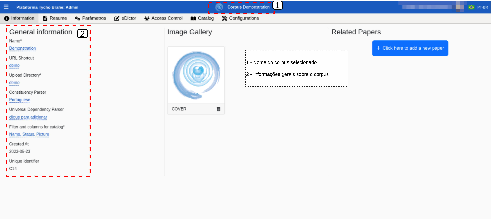
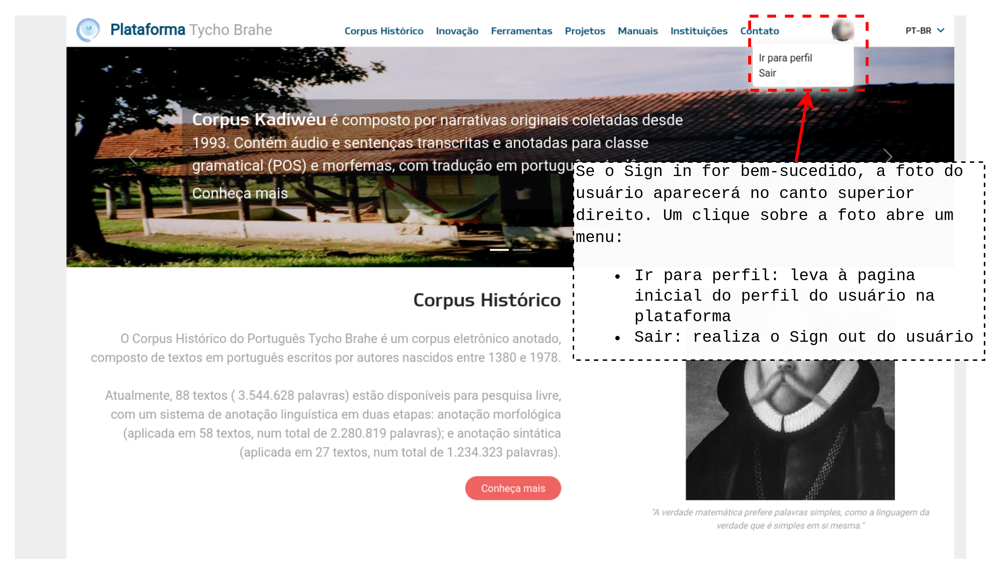
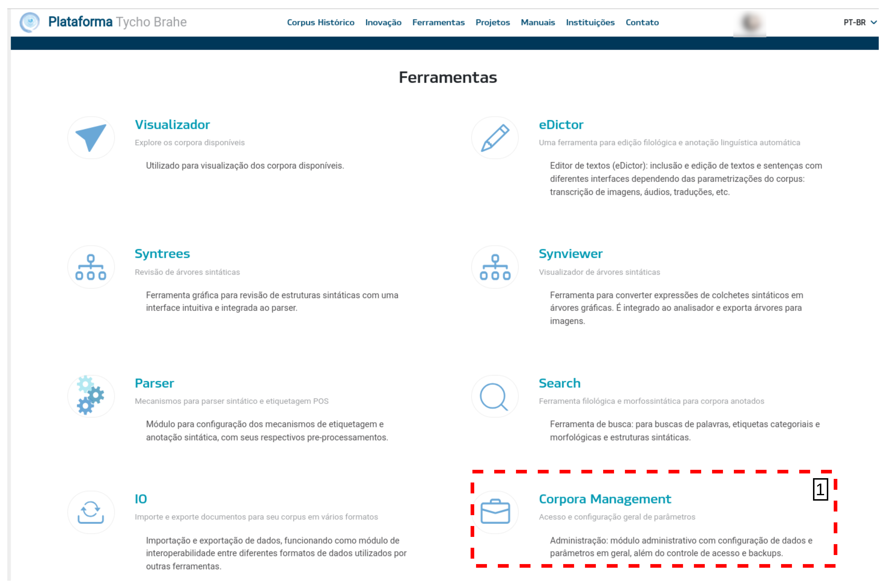

# DOCUMENTAÇÃO PLATAFORMA TYCHO BRAHE (TYCHO BRAHE PLATAFORM)

<figure>

</figure>

***
SUMÁRIO

- [DOCUMENTAÇÃO PLATAFORMA TYCHO BRAHE (TYCHO BRAHE PLATAFORM)](#documentação-plataforma-tycho-brahe-tycho-brahe-plataform)
  - [Introdução](#introdução)
  - [1. Caso de uso 01 - Cadastro de novos usuários nos corpora da plataforma](#1-caso-de-uso-01---cadastro-de-novos-usuários-nos-corpora-da-plataforma)
    - [Descrição Caso de uso 01](#descrição-caso-de-uso-01)
    - [Diagrama do Caso de uso 01 - Cadastro](#diagrama-do-caso-de-uso-01---cadastro)
    - [Tutorial: Cadastro de Novos Usuários - Guia do Administrador](#tutorial-cadastro-de-novos-usuários---guia-do-administrador)
      - [**Tutorial: Fluxo normal**](#tutorial-fluxo-normal)
      - [**Tutorial: Fluxo Alternativo 1 - Usuário não presente na Base de Dados**](#tutorial-fluxo-alternativo-1---usuário-não-presente-na-base-de-dados)
      - [**Tutorial: Fluxo Alternativo 2 - Usuário já presente na Base de Dados, vinculado a outro corpus**](#tutorial-fluxo-alternativo-2---usuário-já-presente-na-base-de-dados-vinculado-a-outro-corpus)
    - [Tutorial: Como Se Cadastrar em um Corpus - Guia do Usuário Final](#tutorial-como-se-cadastrar-em-um-corpus---guia-do-usuário-final)
      - [**Tutorial: Fluxo normal (usuários não cadastrados previamente em nenhum dos corpora)**](#tutorial-fluxo-normal-usuários-não-cadastrados-previamente-em-nenhum-dos-corpora)
      - [**Tutorial: Fluxo alternativo**](#tutorial-fluxo-alternativo)
  - [2. Caso de uso 02 - Realizar *Sign in*](#2-caso-de-uso-02---realizar-sign-in)
    - [Descrição do Caso de uso 02](#descrição-do-caso-de-uso-02)
    - [Diagramas do Caso de uso 02 - Sign in](#diagramas-do-caso-de-uso-02---sign-in)
    - [Tutorial: *Sign in* de usuários](#tutorial-sign-in-de-usuários)
      - [**Tutorial: Fluxo normal**](#tutorial-fluxo-normal-1)
  - [3. Caso de uso 03 - Solicitar cadastro](#3-caso-de-uso-03---solicitar-cadastro)
    - [Descrição Caso de uso 03](#descrição-caso-de-uso-03)
    - [Diagramas do Caso de uso 03 - Solicitar cadastro](#diagramas-do-caso-de-uso-03---solicitar-cadastro)
    - [Tutorial: Solicitar cadastro na plataforma](#tutorial-solicitar-cadastro-na-plataforma)
      - [**Tutorial: Fluxo normal**](#tutorial-fluxo-normal-2)
  - [4. Caso de uso 04 - Criação, configuração e edição dos corpora](#4-caso-de-uso-04---criação-configuração-e-edição-dos-corpora)
    - [Descrição Subcaso de uso 04.1 - Criação de corpora](#descrição-subcaso-de-uso-041---criação-de-corpora)
    - [Diagrama do subcaso de uso 04.1 - Criação de corpora](#diagrama-do-subcaso-de-uso-041---criação-de-corpora)
    - [Tutorial: Criação de corpora](#tutorial-criação-de-corpora)
      - [**Tutorial: Fluxo normal**](#tutorial-fluxo-normal-3)
    - [Descrição Subcaso de uso 04.2 - Configuração dos corpora](#descrição-subcaso-de-uso-042---configuração-dos-corpora)
    - [Diagrama do Caso de uso 04.2 - Configuração de corpora](#diagrama-do-caso-de-uso-042---configuração-de-corpora)
    - [Tutorial: Configuração de corpora](#tutorial-configuração-de-corpora)
      - [**Tutorial: Fluxo normal**](#tutorial-fluxo-normal-4)
  - [1. Caso de uso 0X - NOME CASO DE USO](#1-caso-de-uso-0x---nome-caso-de-uso)
    - [Descrição Caso de uso X](#descrição-caso-de-uso-x)
    - [Diagrama do Caso de uso 0X - NOME CASO](#diagrama-do-caso-de-uso-0x---nome-caso)
    - [Tutorial:](#tutorial)
      - [**Tutorial: Fluxo normal**](#tutorial-fluxo-normal-5)
      - [\*\*Tutorial: Fluxo Alternativo](#tutorial-fluxo-alternativo-1)
    - [Tutorial: Guia do Usuário Final (SE HOUVER)](#tutorial-guia-do-usuário-final-se-houver)
      - [\*\*Tutorial: Fluxo normal \*\*](#tutorial-fluxo-normal-)
      - [**Tutorial: Fluxo alternativo**](#tutorial-fluxo-alternativo-2)

## Introdução

A Plataforma Tycho Brahe representa um marco na área de linguística computacional, oferecendo um ambiente online integrado para a criação, análise e gestão de corpora linguísticos anotados sintaticamente. Esta ferramenta abrange todo o processo de
desenvolvimento de corpora, desde a etapa inicial de transcrição até a aplicação de técnicas avançadas de processamento linguístico, anotação e busca.

Dentre as funcionalidades mais notáveis da Plataforma Tycho Brahe, citam-se:

- Mecanismos de busca sofisticados que permitem explorar dados linguísticos em múltiplos níveis, abrangendo desde unidades lexicais até estruturas sintáticas complexas;
- Recursos para o desenvolvimento de novos corpora, facilitando a colaboração e o compartilhamento de metodologias de anotação entre pesquisadores;
- Ferramentas especializadas para o registro e análise de idiomas ameaçados de extinção, fundamentadas em princípios da gramática gerativa;
- Suporte ao primeiro corpus com anotação sintática de uma língua indígena do Brasil, o kadiwéu, marcando um avanço significativo na documentação linguística;
- Interface intuitiva que permite a participação ativa de falantes nativos na edição e enriquecimento dos corpora, contribuindo para iniciativas educacionais em comunidades indígenas.

A Plataforma Tycho Brahe desempenha um papel crucial na preservação e no estudo de línguas ameaçadas. Sua flexibilidade e abrangência a tornam uma ferramenta valiosa para linguistas, educadores e comunidades linguísticas, promovendo avanços tanto na pesquisa acadêmica quanto na manutenção da diversidade linguística.

Este documento detalha o uso da Plataforma Tycho Brahe, uma ferramenta avançada para o estudo e análise linguística. A plataforma oferece uma gama de funcionalidades projetadas para facilitar a pesquisa e o trabalho com corpora linguísticos.

Entre as principais características da Plataforma Tycho Brahe, destacam-se:

- Visualizador de árvores sintáticas: permite a representação gráfica e análise detalhada de estruturas sintáticas;
- Construção de corpus: ferramentas para criar, organizar e gerenciar corpora linguísticos;
- Anotação: recursos para adicionar metadados, tags e anotações aos textos do corpus;
- Busca avançada: mecanismos de pesquisa sofisticados para localizar padrões linguísticos específicos;

Esta documentação fornecerá instruções detalhadas sobre como utilizar cada uma dessas funcionalidades, além de orientações sobre o acesso à plataforma, gerenciamento de usuários e boas práticas para o uso eficiente do sistema.

Nas seções a seguir, serão apresentadas as diversas funcionalidades da plataforma Tycho Brahe. Cada funcionalidade será apresentada com a seguinte estrutura: primeiro, uma pequena introdução; em seguida, são apresentados os casos de uso que representam as funcionalidades no sistema - é apresentada uma descrição de cada, com os atores, pré-requisitos, fluxos normal e alternativos; em seguida, é apresentado um diagrama de Caso de uso da funcionalidade em questão; por fim, um tutorial completo e detalhado de uso da funcionalidade.

## 1. Caso de uso 01 - Cadastro de novos usuários nos corpora da plataforma

O processo de cadastro na Plataforma Tycho Brahe é um procedimento essencial para garantir o acesso controlado e seguro aos corpora linguísticos. Este processo envolve tanto administradores quanto usuários finais, cada um com papéis específicos no fluxo de cadastro.

Para os administradores, o processo inclui a criação de convites, configuração de permissões e envio de links de "onboarding" para novos usuários. Já para os usuários finais, o processo consiste em receber o convite, acessar o link de "onboarding" e inserir o código de acesso fornecido.

O sistema oferece flexibilidade para lidar com diferentes cenários, como usuários não presentes na base de dados ou já cadastrados em outros corpora. Além disso, permite a configuração de diferentes níveis de permissão (edição ou admin) e status de usuário (ativo ou inativo).

Nos tópicos a seguir, será detalhado o caso de uso para o cadastro de novos usuários, bem como tutoriais passo a passo tanto para administradores quanto para usuários finais, garantindo uma compreensão completa do processo de cadastro na Plataforma Tycho Brahe.

### Descrição Caso de uso 01

**Atores primários**:

1. Usuário
2. Administrador da plataforma;

**Pré-requisitos:**

1. Para o cadastramento de um usuário em um corpus, é necessário que o corpus tenha sido previamente criado (por um usuário com permissões de administrador), ou seja, a permissão de acesso tem de ser necessariamente associada a um corpus já cadastrado no sistema;
2. Configuração de permissões pelo admin: necessita permissão de administrador e acesso ao link de administrador <!--(VERIFICAR SE POSSO INSERIR link admin NA DOCUMENTAÇÃO)-->;
3. Solicitação de cadastro pelo usuário: nenhum (funcional); Solicitações de cadastro passam pela coordenação do projeto.

**Fluxo normal (usuário sem cadastro prévio na plataforma):**

1. O corpus é previamente criado por um administrador (professor, instituição coordenadora do subprojeto/corpus);
2. Usuário não está previamente cadastrado em nenhum corpus (não está na base de dados da plataforma);
3. O Admin seleciona um corpus;
4. O Admin acessa a aba de “Access control”
5. O Admin acessa botão “Invite” e clica em “+ Add new”
6. O Admin cria um “convite” para associação ao corpus:
7. Admin configura parâmetros de permissão de usuário:
    1. Insere um título “Title”
    2. Seleciona nível da permissão “Role” (edição ou admin)
    3. Seleciona número de convidados (1 - N): no caso de criação de convites N > 1, o contador decresce à medida que usuários se cadastram utilizando o código de acesso;
    4. Seleciona “Status” (active/inactive)
    5. Confirma
8. O sistema cria um link de “onboarding” e um código de acesso.
9. Admin copia o código e o link de onboarding e envia ao potencial usuário;
10. O usuário utiliza o link de “onboading”; clica no botão “Eu possuo um código de acesso”, preenche com o código e confirma, o que resulta em usuário cadastrado.

**Fluxo alternativo:**

**A1** - **Alternativo ao passo 5 do fluxo normal (Usuário não cadastrado previamente e não presente na base de dados)**

1. Admin envia link “/onboarding” para usuário;
2. Usuário entra no link “/onboarding” para automaticamente cadastrar email na base de dados da plataforma (no primeiro acesso, o usuário verifica uma mensagem de acesso negado ao corpus);
3. Na área /admin, o Admin acessa o corpus, seleciona o botão “Users”, clica em botão “+ Add new” ;
    1. Admin seleciona email respectivo ao usuário a ser cadastrado (super-usuários e e-mails já cadastrados no corpus não são apresentados como opção);
4. Admin configura parâmetros da permissão de usuário:
    1. Admin seleciona o tipo de permissão (edição ou admin);
    2. Admin seleciona status (active ou inactive);
    3. Admin confirma cadastro do usuário no corpus;

**A2** - **Alternativo ao passo 4 (Usuário já presente na base de dados, vinculado a outro corpus)**

1. Na área /admin, o Admin acessa o corpus, seleciona o botão “Users”, clica em botão “+ Add new” ;
    1. Admin seleciona e-mail respectivo ao usuário a ser cadastrado (super-usuários e emails já cadastrados no corpus não são apresentados como opção para seleção);
2. Admin configura parâmetros da permissão de usuário:
    1. Admin seleciona o tipo de permissão (edição ou admin);
    2. Admin seleciona status (active ou inactive);
    3. Admin confirma cadastro do usuário ao corpus;

### Diagrama do Caso de uso 01 - Cadastro

<figure>
    
    <figcaption>Figura 1: Caso de uso 01 - Cadastro</figcaption>
</figure>

### Tutorial: Cadastro de Novos Usuários - Guia do Administrador

**Objetivo:** Este tutorial detalha o processo para o Administrador da plataforma realizar o cadastro de novos usuários em corpora já criados, configurando as permissões necessárias e/ou enviando os convites de acesso. Em um fluxo normal, a coordenação ou professor entra em contato com o Admin previamente avisando a necessidade de cadastrar ou vincular um novo usuário a um determinado corpus (seja via convite para um novo cadastro na plataforma ou associação de um usuário já cadastrado a um novo corpus)

#### **Tutorial: Fluxo normal**

Antes de iniciar o processo de cadastro de um usuário, certifique-se de que o corpus ao qual o usuário será associado já tenha sido criado.

1. **Acesso ao Sistema**: Faça login na plataforma com sua conta de administrador, através do link <!--(VERIFICAR SE POSSO INSERIR O LINK) --> “/admin”
2. **Verificar Corpora**: Os corpora disponíveis na plataforma aparecem na página inicial de Admin, listados com os campos: Nome, Type, Status No. of documents, No. of words, No. of users. Navegue até a seção de gerenciamento de corpora para verificar se o corpus está disponível (note que são exibidos 10 resultados por página, e que pode haver várias páginas de corpora - então navegue em todas as páginas para verificar a presença de um corpus). Previamente, o usuário já deve ter realizado contado com a coordenação do projeto solicitando sua associação a determinado corpus. A coordenação então entra em contato com o administrador solicitando associação/cadastro a um determinado corpus. Veja a Figura 2 abaixo:

<figure>
    
    <figcaption>Figura 2: Lista de corpora disponíveis na plataforma</figcaption>
</figure>

3. **Selecionar o Corpus**: Na interface de administração, selecione o corpus ao qual o novo usuário será associado. A Figura 3 a seguir apresenta o catálogo de corpora disponíveis para acesso. Ao clicar em um dos corpora, o usuário é redirecionado ao corpus específico, como apresentado na Figura 4, como apresentado no topo da página “Corpus: Demonstration”.
Na primeira tela após a seleção do corpus, no inventário, são apresentadas informações gerais sobre o corpus, como nome, um atalho URL, os parsers etc.

<figure>
    
    <figcaption>Figura 3: Corpus Demonstration selecionado</figcaption>
</figure>

<figure>
    
    <figcaption>Figura 4: Pagina de apresentação do corpus Demonstration </figcaption>

</figure>

4. **Acessar "Access Control**: No painel do corpus, clique na aba "Access Control" para gerenciar as permissões de acesso.

<figure>
    
    <figcaption>Figura 4: Pagina inicial do corpus selecionado - Controle de acesso</figcaption>

</figure>

Ao acessar o “Access Control”, a plataforma apresenta uma página com os atuais usuários com permissões no corpus selecionado, como mostra a Figura a seguir. Com botão “Users” selecionado, é apresentado o usuário com os seguintes campos - “Name”, “status”, “Role”.

<figure>
    
    <figcaption>Figura 5: Área de Controle de acesso</figcaption>

</figure>

5. **Criar Convite de acesso**: Na aba "Access Control", clique no botão "Invites" e depois em “ + Add new”.
6. **Realizar as configurações da permissão:**

    1. **Inserir título:**  Escolha um título para o convite no campo “Title”
    2. **Definir Quantidade de Convites**: Escolha se o convite será para um único usuário ou para múltiplos usuários (o contador de convites disponíveis será atualizado conforme os usuários se registrarem).
    3. **Definir o tipo de permissão:** Selecione o tipo de permissão “Role” que o usuário terá:
        - **Edição**: O usuário poderá editar o corpus.
        - **Admin**: O usuário terá permissões de administrador no corpus.
    4. **Status do Usuário**: Selecione o status do usuário:
        - **Active**: O usuário terá acesso ativo ao corpus.
        - **Inactive**: O usuário estará registrado, mas sem acesso ativo.
7. **Confirmar as Configurações de permissão**: Após configurar as permissões clicar em "Confirmar".

<figure>
    
    <figcaption>Figura 6: Criação e configuração de convite de acesso</figcaption>

</figure>

8. **Gerar Link e Código**: O sistema gerará automaticamente um link de "onboarding" e um código de acesso.
9. **Copiar Informações para enviar ao usuário**: Copie o link de onboarding e o código de acesso gerados. O botão “click here to copy to clipboard” copia o código de acesso.

<figure>
    
    <figcaption>Figura 7: Código de acesso gerado automaticamente</figcaption>

</figure>

10. **Enviar o Convite**: Envie o link de "/onboarding" e o código de acesso ao usuário potencial, via e-mail ou outro meio de comunicação apropriado.
11. Usuário recém cadastrado deve logar-se novamente para verificar se i cadastri foi bemsucedido.

#### **Tutorial: Fluxo Alternativo 1 - Usuário não presente na Base de Dados**

Se o usuário ainda não estiver na base de dados da plataforma, siga estas etapas adicionais:

1. **Envio do Link de Onboarding**: Envie o link "/onboarding" para o usuário.
2. **Cadastro Inicial do Usuário**: O usuário acessa o link, e ao tentar se cadastrar, o sistema mostrará uma mensagem de acesso negado ao corpus.

<!--INSERIR IMAGEM-->

3. **Adicionar Novo Usuário**: Na tela /admin, selecione o corpus. No painel de "Access Control", com o botão “Users” selecionado, clique em "+ Add New" para adicionar o usuário à base de dados.
4. **Selecionar o E-mail do Usuário**: No campo de busca, preencha o nome ou e-mail do usuário (são apresentados candidatos salvos na base de dados com base no termo de busca preenchido). Escolha o nome/e-mail do usuário que você deseja cadastrar no menu drop down.

<figure>
    
    <figcaption>Figura 9: Vincular usuário ao corpus</figcaption>

</figure>

5. **Configurar Permissões e Confirmar**: Siga o Passo 5 (c e d) do fluxo normal para configurar as permissões e confirme o cadastro.
6. Usuário recém cadastrado deve logar-se novamente para verificar sucesso de cadastro.

#### **Tutorial: Fluxo Alternativo 2 - Usuário já presente na Base de Dados, vinculado a outro corpus**

Se o usuário já estiver cadastrado em outro corpus, siga estas etapas:

1. **Adicionar novo usuário**: No painel de "Access Control", com o botão “Users” selecionado, clique em "+ Add New". (Ver Figura 9)
2. **Selecionar o e-mail do usuário**: Escolha o e-mail do usuário na lista (super-usuários e e-mails já cadastrados no corpus não aparecerão como opção). (Ver Figura 9)
3. **Configurar Permissões e Confirmar**: Siga o Passo 6 (.3 e .4) do fluxo normal para configurar as permissões e confirme o cadastro.

---

### Tutorial: Como Se Cadastrar em um Corpus - Guia do Usuário Final

**Objetivo:** Este tutorial detalha o processo para os usuários se cadastrarem em um corpus da plataforma, utilizando o link de "/onboarding" e código de acesso fornecido pelo administrador, ou apenas o link "/onboarding" .

#### **Tutorial: Fluxo normal (usuários não cadastrados previamente em nenhum dos corpora)**

1. **Receber Link onboarding e código de acesso (convite)**: Aguarde o e-mail ou mensagem com o link de "onboarding" e o código de acesso enviados pelo administrador da plataforma.
2. **Acessar o link**: No e-mail ou mensagem recebida, copie o link de "/onboarding" fornecido pelo administrador, insira no navegador.
3. **Acessar Página de perfil**: Você será redirecionado para uma página de perfil na plataforma. Como é o primeiro acesso, não haverá corpora vinculados na área “Meus corpora”
4. **Código de Acesso**: Na página de perfil, clique no botão "Eu possuo um código de acesso".
5. **Preencher o Código**: Insira o código de acesso fornecido no campo correspondente.
6. **Confirmar Cadastro**: Após preencher o código, clique em "Confirmar".

<figure>
    
    <figcaption>Figura 9: Tela de inserção de código de acesso</figcaption>
</figure>

7. **Acesso ao Sistema**: O usuário deve tentar realizar o sign in para certificar-se de que o cadastro foi realizado com sucesso. Se o sign in for bem-sucedido, o usuário poderá acessar o corpus com as permissões definidas pelo administrador.

#### **Tutorial: Fluxo alternativo**

1. **Receber Link onboarding**: Aguarde o e-mail ou mensagem com o link de "onboarding" enviado pelo administrador da plataforma.
2. **Acessar o link**: No e-mail ou mensagem recebida, copie o link de "/onboarding" fornecido pelo administrador, insira no navegador.
3. **Acessar Página de perfil**: Você será redirecionado para uma página de perfil na plataforma. Como é o primeiro acesso, não haverá corpora vinculados na área “Meus corpora”. Esse acesso salva o seu e-mail na base de dados permitindo que o Admin consiga vincular o seu perfil ao corpus desejado.
4. **Acesso ao Sistema**: O usuário deve tentar realizar o sign in para certificar-se de que o cadastro foi realizado com sucesso. Se o sign in for bem-sucedido, o usuário poderá acessar o corpus com as permissões definidas pelo administrador.

***

## 2. Caso de uso 02 - Realizar *Sign in*

O Sign in seguro permite ao usuário acessar a plataforma com segurança. Este processo envolve somente o usuário previamente cadastrado. Como será apresentado, o usuário terá acesso à plataforma por meio de um login Google. 

### Descrição do Caso de uso 02

**Ator primário**:

1. Usuário

**Pré-requisitos:**

1. Para realizar o *sign in*, é necessário que o usuário tenha sido previamente cadastrado com um e-mail da google (.gmail). Para solicitar o cadastramento, veja Caso de uso 03 O *sign in* é feito com o perfil google logado do usuário uma vez que o e-email tenha sido cadastrado na plataforma Tycho Brahe.

**Fluxo normal (usuário já cadastrado na plataforma):**

1. O usuário acessa a página inicial da plataforma Tycho Brahe no endereço <https://www.tycho.iel.unicamp.br/home> .
2. O usuário clica no botão “Sign in as” e abre uma janela para selecionar a conta Google com a qual deseja realizar o sign in na plataforma Tycho Brahe (conta já cadastrada no processo de cadastro na plataforma).

### Diagramas do Caso de uso 02 - Sign in

<figure>

<figcaption>Figura 10: Diagrama Caso de uso 02</figcaption>
</figure>

### Tutorial: *Sign in* de usuários

**Objetivo:** Este tutorial detalha o processo para o usuário realizar o Sign in na plataforma. Em um fluxo normal, o usuário já foi previamente cadastrado com um e-mail Google. Caso contrário, veja Caso de uso 3 - Solicitar cadastro para realizar a solicitação junto aos administradores da plataforma.

***

#### **Tutorial: Fluxo normal**

1. Acesse a página inicial da plataforma Tycho Brahe, disponível no link: <https://www.tycho.iel.unicamp.br/home>.
2. No canto superior direito, selecione o botão de “Sign in” (o usuário é redirecionado a uma janela para selecionar a conta Google para continuar.
3. Selecione a conta, preencha as credenciais Google (se não estiver logado) e confirme.

<figure>

<figcaption>Figura 11: Tela inicial - Sign in</figcaption>
</figure>

4. Se o “Sign in” for bem-sucedido, a foto do perfil Google do usuário aparecerá no canto superior direito:

<figure>

<figcaption>Figura 12: Sign in bem-sucedido </figcaption>
</figure>

## 3. Caso de uso 03 - Solicitar cadastro

O processo de solicitação de cadastro por meio do formulário permite aos usuários iniciar o procedimento de registro na plataforma. Este caso de uso detalha as etapas necessárias para que um novo usuário envie suas informações pessoais, garantindo que os dados sejam avaliados pelos administradores, validados e armazenados corretamente no sistema. Assim, mediante análise, os administradores podem providenciar o processo de cadastramento de novos usuários.

### Descrição Caso de uso 03

**Ator primário**:

1. Usuário
2. Administrador

**Pré-requisitos:** Não há. A solicitação será avaliada pelo Adminstrador/Coordenadores da plataforma.

**Fluxo normal:**

No caso de interesse de participação no projeto, o usuário deve entrar em contato por meio do formulário no fim da página inicial do projeto.

1. O usuário acessa a página inicial da plataforma Tycho Brahe, disponível no link: <https://www.tycho.iel.unicamp.br/home>.
2. O usuário rola a página até chegar ao final.
3. O usuário preenche o formulário com seu Nome, E-mail, Assunto, Mensagem (descrevendo seus interesses e motivos para associar-se, por exemplo).
4. Os Administradores devem entrar em contato sobre a solicitação e informar detalhes do procedimento de cadastro (Caso de uso 01)

### Diagramas do Caso de uso 03 - Solicitar cadastro

<figure>

<figcaption>Figura 13: Diagrama do Caso de uso 03</figcaption>
</figure>

### Tutorial: Solicitar cadastro na plataforma

**Objetivo:**  Este tutorial detalha o processo para solicitar o cadastramento na plataforma. Em um fluxo normal, o usuário entra na página principal da plataforma e preenche o formulário fixado no final da página e aguarda contato dos administradores.

#### **Tutorial: Fluxo normal**

1. Acesse a página inicial da plataforma Tycho Brahe, disponível no link: <https://www.tycho.iel.unicamp.br/home>.
2. Role a página até chegar ao final.
3. Preencha o formulário com seu Nome, E-mail, Assunto, Mensagem (descrevendo seus interesses e motivos para associar-se, por exemplo).

<figure>

<figcaption>Figura 14: Formulário para solicitar cadastro na plataforma</figcaption>
</figure>

## 4. Caso de uso 04 - Criação, configuração e edição dos corpora

A ferramenta de criação de corpora é um componente fundamental para a construção e gestão eficiente de coleções de textos destinados a análises linguísticas. Este processo pode ser realizado por Administradores e usuários devidamente cadastrados e com as credenciais corretas (de edição).

Para os administradores, a ferramenta oferece recursos avançados para a criação e configuração dos corpora, atribuição de permissões e gerenciamento etc.

Há três formas [REVISAR] para executar a criação de corpora na ferramenta Tycho Brahe:

1. *Translation mode* (Modo traduções) ou *Translation eDictor*
2. [REVISAR: INSERIR LISTA DE MANEIRAS DE DEV DE CORPUS]
   
Nos tópicos a seguir, serão abordados os principais fluxos de trabalho para a criação e configuração de novos corpora, além de tutoriais detalhados que guiam administradores e usuários no uso eficiente da ferramenta, garantindo uma experiência fluida e colaborativa na gestão dos catálogos.

### Descrição Subcaso de uso 04.1 - Criação de corpora

**Atores primários**:

1. Administrador
2. Usuário

**Pré-requisitos:**

1. Os usuários devem ser previamente cadastrados e ter permissões de edição. Para cadastro, ver Caso de uso 01; para solicitar cadastro, ver Caso de uso 03.

**Fluxo normal:**

1. Acessar a página inicial da plataforma Tycho Brahe, através do link: https://www.tycho.iel.unicamp.br/home .
2. Na área "Ferramentas", selecionar a ferramenta *"Corpora Management"*.
3. Ao acessar o *"Corpus Management"*, uma lista de corpora disponíveis abre. Clicar em *"+ Create new corpus"*.
4. Adicionar nome ao novo corpus e clicar em "Confirmar": novo corpus criado.

### Diagrama do subcaso de uso 04.1 - Criação de corpora 

<figure>
    
    <figcaption>Figura 15: Diagrama caso de uso - Criação de corpora</figcaption>
</figure>

### Tutorial: Criação de corpora

**Objetivo:**: Este tutorial detalha os passos necessários para a criação de novos corpora através da ferramenta *"Corpus management"*

#### **Tutorial: Fluxo normal**

1. Acesse a página inicial da plataforma Tycho Brahe, através do link: <https://www.tycho.iel.unicamp.br/home> .

2. Na área "Ferramentas", role a página para baixo e selecione a ferramenta "Corpus Management", como apresentado na Figura x:

<figure>
    
    <figcaption> Figura x: Selecionando a ferrramenta "Corpora Management"</figcaption>
</figure>

3. Ao acessar o *"Corpus Management"*, uma lista de corpora disponíveis abre. Clique em *"+ Create new corpus"*.

<figure>
    
    <figcaption>Figura x: Criação de um novo corpus</figcaption>
</figure>

4. Adicione um nome ao novo corpus e clique em "Confirmar": esta ação finaliza a criação do corpus (Note que estas ações apenas criam o corpus. Para inclusão/edição de documentos, ou seja, alimentar o corpus ver Caso de uso 04.2). Após preencher com o nome desejado, clique em "Confirmar". Esta ação cria um novo corpus, que aparecerá na lista. 

<figure>
    
    <figcaption>Figura x: Criação de corpus: inserção de nome</figcaption>
</figure>

### Descrição Subcaso de uso 04.2 - Configuração dos corpora

**Atores primários**:

1. Administrador
2. Usuário (com permissão de admin no corpus)

**Pré-requisitos:**

1. Os usuários devem ser previamente cadastrados e ter permissões de edição. Para cadastro, ver Caso de uso 01; para solicitar cadastro, ver Caso de uso 03. Um corpus deve ter sido criado previamente (ver caso de uso 04.1).

**Fluxo normal:**

1. Acessar a página inicial da plataforma Tycho Brahe, através do link: https://www.tycho.iel.unicamp.br/home .
2. Na área "Ferramentas", selecionar a ferramenta *"Corpora Management"*.
3. Ao acessar o *"Corpora Management"*, uma lista de corpora disponíveis abre. Selecionar o corpus que deseja configurar.
4. Selecionar a aba **"Parâmetros"**: abre-se uma caixa com botões de alternância para a realização de configurações do corpus.

### Diagrama do Caso de uso 04.2 - Configuração de corpora

<figure>
    
    <figcaption>Figura 15: Diagrama caso de uso - Configuração de corpora</figcaption>
</figure>

### Tutorial: Configuração de corpora

**Objetivo:**: Este tutorial detalha os passos necessários para a configuração dos corpora através da ferramenta *"Corpora management"*

#### **Tutorial: Fluxo normal**

1. Acesse a página inicial da plataforma Tycho Brahe, através do link: <https://www.tycho.iel.unicamp.br/home> .

2. Na área "Ferramentas", role a página para baixo e selecione a ferramenta *"Corpora Management"*, como apresentado na Figura x:

3. Ao acessar o *"Corpora Management"*, uma lista de corpora disponíveis abre. Clique no corpus que deseja configurar.

4. Clique em "Parâmetros": uma caixa com botões de alternância se abre, disponibilizando diversos botões de alternância para configuração dos corpora.

<figure> 
    
    <figcaption>Figura x: Acessando área de configuração de corpora </figcaption>
</figure>
A seguir são apresentadas descrições de cada um dos botões de configurações disponíveis.  

**Public corpus**: seleciona se o corpus é disponível ao público em geral ou se é privado.

**Active**: configura se o corpus está ativo ou inativo;

**Use Morphemes**: habilita o uso campos referentes a morfemas, incluindo glossa, nos corpora.

<figure>
    
    <figcaption>Figura X: Configuração de corpora: botão "Use Morphemes"</figcaption>
</figure>

 **Use Sound**: a habilita o uso de áudio no corpus. 
  - Como podemos observar na Figura x abaixo, a habilitação do botão "Use Sound" habitila uma seção de Áudio, que permite ao analista incluir o áudio a ser transcrito.
  
    
  Figura X: Configuração de corpora: botão "Use Sound"

   

-  O "Use Sound" também habilita, na ferramenta "eDictor", um botão para dar play nos áudios associados às sentenças do documento selecionado, como observamos na Figura x abaixo:
  
  Figura X: Configuração de corpora: botão "Use Sound"(no eDictor)

 **Use Translations**: o botão "Use Translations" habilita a seção de Traduções no eDictor, como apresentado na Figura x:

<figure>
    
    <figcaption> Figura x: Configuração de corpora: botão "Use Translations"  </figcaption>
</figure>

 **Use Lexicon**: é utilizado quando há um parser disponível, mas não há um etiquetador automático (que só funciona se houver uma quantidade mínima de palavras para treinamento do etiquetador). No caso de esta condição não estar satisfeita, o analista deve utilizar o léxico para realizar a etiquetagem automática.

**Use Grid**: ao acessar o catálogo, o usuário tem a possibilidade de apresentação de documentos de duas maneiras: lista, ou grid. Ao habilitar o botão "Use Grid", o usuário configura a apresentação em grid como default, como apresentado na Figura x abaixo:

<figure>

<figcaption> Figura x: Configuração de corpora: botão "Use Grid"</figcaption>

</figure>

 **Use Category**: o botão "Use Category" habilita a possibilidade de categorização e subcategorização dos corpora (por exemplo, categorização com base em parâmetros demográficos etc), como apresentado na Figura x, com o corpus CE-DOHS selecionado no catálogo. Note-se que a criação dos rótulos para as categorias pode ser realizada por um usuário com permissões de adminstrador 

<figure>
    
    <figcaption>Figura x: Configuração de corpora: botão "Use Category"</figcaption>
</figure>

 **Use Edition Tiers**[REVISAR COM O LUIS]: o botão "Use Edition Tiers", contrapondo-se ao "Use Morphemes", habilita a disponibilização de diversos níveis de edição para garantir a máxima fidelidade filológica do texto. Por exemplo, acessando-se o catálogo, selecione o corpus Tycho Brahe do Português Histórico e selecione o documento "Atas dos Brasileiros - Tomo 02", como apresentado na Figura X:

<figure>
    
    <figcaption>Figura x: Configuração de corpora: botão "Use Edition Tiers"
</figure>

<figure>
    
    <figcaption>Figura x: Configuração de corpora: botão "Use Edition Tiers (abrindo a ferramenta)."</figcaption>

</figure>

<figure>
    
    <figcaption>Figura x: Configuração de corpora  botão "Use Edition Tiers: "</figcaption>
</figure>

Esta ação abre um painel com uma matriz para edição dos níveis de edição, como mostra a Figura x. Note-se: na mesma tela que seria análoga à sentença com o "Use Morphemes" selecionado, são apresentadas os níveis de edição.

<figure>
    
    <figcaption>Figura x: Matriz para edição em níveis de edição </figcaption>
</figure>

Os botões "Use eDictor Translations"/"Use eDictor"/"Use Designer"/"Use Transcriber" não são excludentes, i.e., podem ser habilitados ao mesmo tempo em um determinado corpus. Esta ação disponibiliza todas as ferramentas para utilização no corpus.

"Use eDictor Translations": Habilita o uso da versão eDictor para trabalhar com corpora paralelos, como apresentado na Figura x a seguir:
<figure>
    
    <figcaption>Figura x: Configuração de corpora: botão Use eDictor Translations - Corpora Paralelos </figcaption>
</figure>

###########rascunho  ESTRUTURA BÁSICA PARA REUTILIZAÇÃO
## 1. Caso de uso 0X - NOME CASO DE USO
[INTRODUÇÃO]
### Descrição Caso de uso X

**Atores primários**:

1.  

**Pré-requisitos:**

1. 

**Fluxo normal:**

1. 
**Fluxo alternativo:**

**A1** 
1. 
**A2** 

1. 
### Diagrama do Caso de uso 0X - NOME CASO

<figure>
    
    <figcaption>Figura X: CAPTION</figcaption>
</figure>

### Tutorial: 

**Objetivo:** 

#### **Tutorial: Fluxo normal**

1. 

#### **Tutorial: Fluxo Alternativo 

### Tutorial: Guia do Usuário Final (SE HOUVER)

**Objetivo:** 
#### **Tutorial: Fluxo normal **

1. 
#### **Tutorial: Fluxo alternativo**

1.
