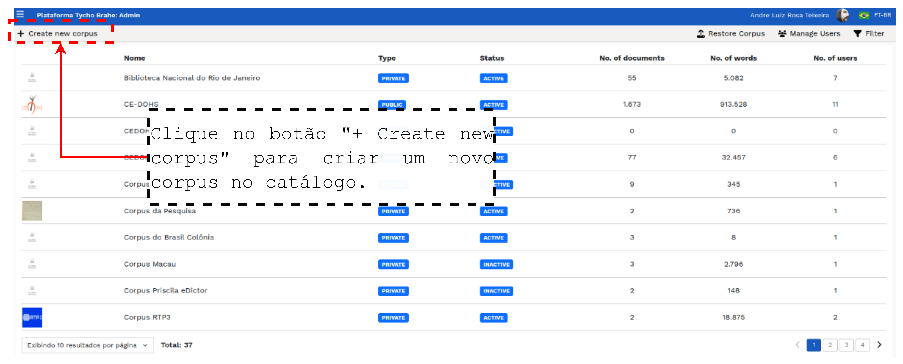
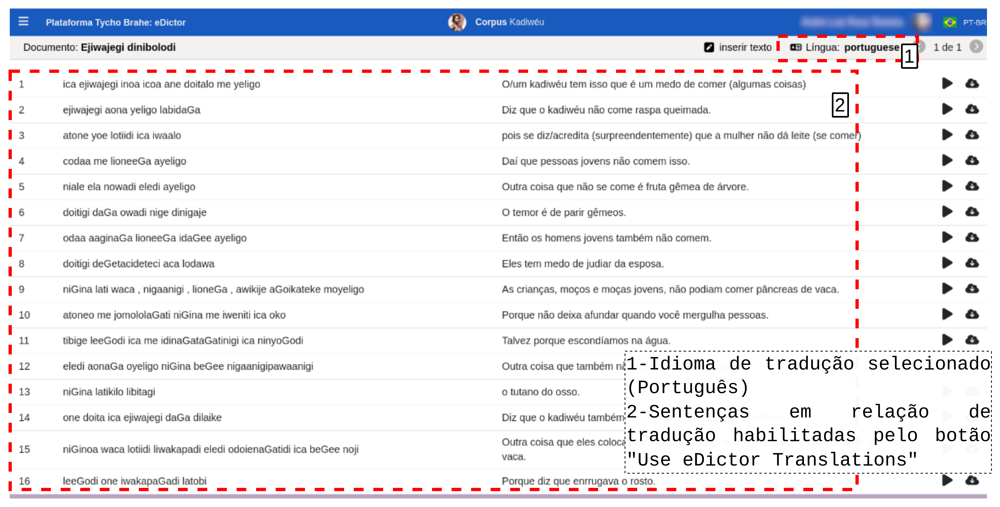
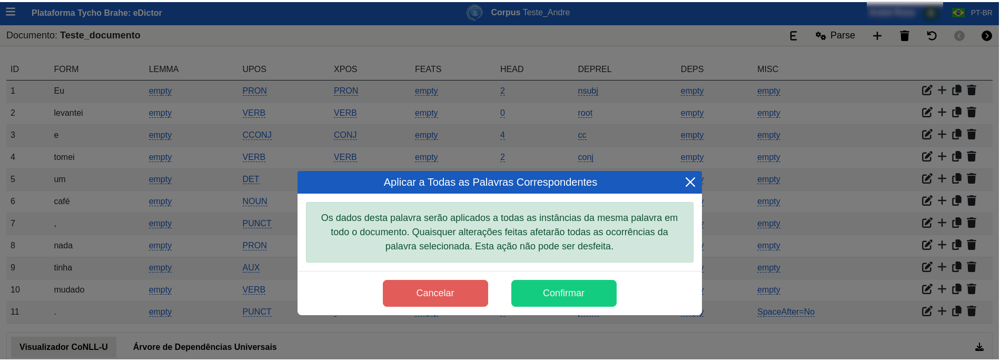
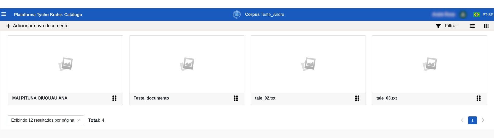
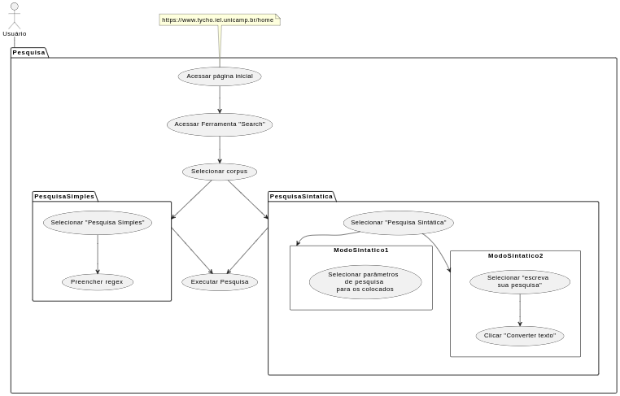
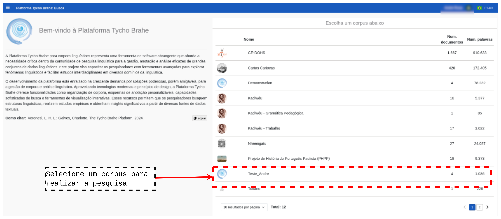
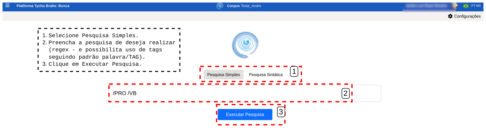
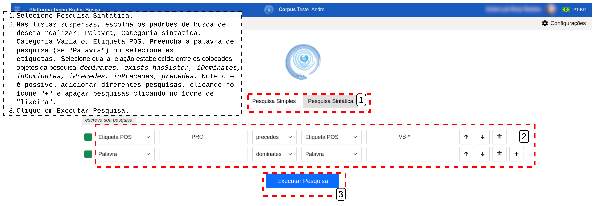

# DOCUMENTAÇÃO PLATAFORMA TYCHO BRAHE (TYCHO BRAHE PLATAFORM)

<figure>

</figure>

---

SUMÁRIO

- [DOCUMENTAÇÃO PLATAFORMA TYCHO BRAHE (TYCHO BRAHE PLATAFORM)](#documentação-plataforma-tycho-brahe-tycho-brahe-plataform)
  - [Introdução](#introdução)
  - [Caso de Uso 00 - Acesso à tela inicial de perfil do usuário](#caso-de-uso-00---acesso-à-tela-inicial-de-perfil-do-usuário)
    - [Descrição Caso de uso 00 - Acesso à tela inicial de perfil do usuário](#descrição-caso-de-uso-00---acesso-à-tela-inicial-de-perfil-do-usuário)
    - [Diagrama do Caso de uso 00 - Acesso à tela inicial de perfil do usuário](#diagrama-do-caso-de-uso-00---acesso-à-tela-inicial-de-perfil-do-usuário)
    - [Tutorial:](#tutorial)
      - [**Tutorial: Fluxo normal**](#tutorial-fluxo-normal)
      - [**Tutorial: Fluxo Alternativo**](#tutorial-fluxo-alternativo)
  - [Caso de uso 01 - Cadastro de novos usuários nos corpora da plataforma](#caso-de-uso-01---cadastro-de-novos-usuários-nos-corpora-da-plataforma)
    - [Descrição Caso de uso 01 - Cadastro de novos usuários nos corpora da plataforma](#descrição-caso-de-uso-01---cadastro-de-novos-usuários-nos-corpora-da-plataforma)
    - [Diagrama do Caso de uso 01 - Cadastro](#diagrama-do-caso-de-uso-01---cadastro)
    - [Tutorial: Cadastro de Novos Usuários - Guia do Administrador](#tutorial-cadastro-de-novos-usuários---guia-do-administrador)
      - [**Tutorial: Fluxo normal**](#tutorial-fluxo-normal-1)
      - [**Tutorial: Fluxo Alternativo 1 - Usuário não presente na Base de Dados**](#tutorial-fluxo-alternativo-1---usuário-não-presente-na-base-de-dados)
      - [**Tutorial: Fluxo Alternativo 2 - Usuário já presente na Base de Dados, vinculado a outro corpus**](#tutorial-fluxo-alternativo-2---usuário-já-presente-na-base-de-dados-vinculado-a-outro-corpus)
    - [Tutorial: Como se cadastrar em um corpus - Guia do usuário final](#tutorial-como-se-cadastrar-em-um-corpus---guia-do-usuário-final)
      - [**Tutorial: Fluxo normal (usuários não cadastrados previamente em nenhum dos corpora)**](#tutorial-fluxo-normal-usuários-não-cadastrados-previamente-em-nenhum-dos-corpora)
      - [**Tutorial: Fluxo alternativo**](#tutorial-fluxo-alternativo-1)
  - [Caso de uso 02 - Realizar _Sign in_ na Área Reservada](#caso-de-uso-02---realizar-sign-in-na-área-reservada)
    - [Descrição do Caso de uso 02 - Realizar _Sign in_ na Área Reservada](#descrição-do-caso-de-uso-02---realizar-sign-in-na-área-reservada)
    - [Diagramas do Caso de uso 02 - Sign in](#diagramas-do-caso-de-uso-02---sign-in)
    - [Tutorial: _Sign in_ de usuários](#tutorial-sign-in-de-usuários)
      - [**Tutorial: Fluxo normal**](#tutorial-fluxo-normal-2)
  - [Caso de uso 03 - Solicitar cadastro](#caso-de-uso-03---solicitar-cadastro)
    - [Descrição Caso de uso 03](#descrição-caso-de-uso-03)
    - [Diagramas do Caso de uso 03 - Solicitar cadastro](#diagramas-do-caso-de-uso-03---solicitar-cadastro)
    - [Tutorial: Solicitar cadastro na plataforma](#tutorial-solicitar-cadastro-na-plataforma)
      - [**Tutorial: Fluxo normal**](#tutorial-fluxo-normal-3)
  - [Caso de uso 04 - Criação, configuração e edição dos corpora](#caso-de-uso-04---criação-configuração-e-edição-dos-corpora)
    - [Descrição Subcaso de uso 04.1 - Criação de corpora](#descrição-subcaso-de-uso-041---criação-de-corpora)
    - [Diagrama do subcaso de uso 04.1 - Criação de corpora](#diagrama-do-subcaso-de-uso-041---criação-de-corpora)
    - [Tutorial: Criação de corpora](#tutorial-criação-de-corpora)
      - [**Tutorial: Fluxo normal**](#tutorial-fluxo-normal-4)
    - [Descrição Subcaso de uso 04.2 - Configuração dos corpora](#descrição-subcaso-de-uso-042---configuração-dos-corpora)
    - [Diagrama do Caso de uso 04.2 - Configuração de corpora](#diagrama-do-caso-de-uso-042---configuração-de-corpora)
    - [Tutorial: Configuração de corpora](#tutorial-configuração-de-corpora)
      - [**Tutorial: Fluxo normal**](#tutorial-fluxo-normal-5)
  - [Caso de uso 05 - Ferramenta **Use eDictor**](#caso-de-uso-05---ferramenta-use-edictor)
    - [Descrição Caso de uso 05](#descrição-caso-de-uso-05)
    - [Diagrama do Caso de uso 05 - **Use eDictor**](#diagrama-do-caso-de-uso-05---use-edictor)
    - [Tutorial:](#tutorial-1)
      - [**Tutorial: Fluxo normal**](#tutorial-fluxo-normal-6)
      - [\*\*Tutorial: Fluxo Alternativo](#tutorial-fluxo-alternativo-2)
    - [Tutorial: Guia do Usuário Final (SE HOUVER)](#tutorial-guia-do-usuário-final-se-houver)
      - [\*\*Tutorial: Fluxo normal \*\*](#tutorial-fluxo-normal-)
      - [**Tutorial: Fluxo alternativo**](#tutorial-fluxo-alternativo-3)
  - [Caso de uso 06 - Ferramenta **eDictor Translations**](#caso-de-uso-06---ferramenta-edictor-translations)
    - [Descrição Caso de uso 06.01 - Edição de corpora (Inserir, editar e remover sentenças) ](#descrição-caso-de-uso-0601---edição-de-corpora-inserir-editar-e-remover-sentenças-)
    - [Diagrama do Caso de uso 06.01 - **Use eDictor Translations: Edição de corpora**](#diagrama-do-caso-de-uso-0601---use-edictor-translations-edição-de-corpora)
    - [Tutorial:](#tutorial-2)
      - [**Tutorial: Fluxo normal**](#tutorial-fluxo-normal-7)
      - [**Tutorial: Fluxo alternativo:**](#tutorial-fluxo-alternativo-4)
  - [Caso de uso 07 - Ferramenta de Pesquisa](#caso-de-uso-07---ferramenta-de-pesquisa)
    - [Descrição Caso de uso 07 - Ferramenta de Pesquisa](#descrição-caso-de-uso-07---ferramenta-de-pesquisa)
    - [Diagrama do Caso de uso 07 - FERRAMENTA DE PESQUISA](#diagrama-do-caso-de-uso-07---ferramenta-de-pesquisa)
    - [Tutorial:](#tutorial-3)
      - [**Tutorial: Fluxo normal**](#tutorial-fluxo-normal-8)
  - [Caso de uso 08 - Visualizador de corpora](#caso-de-uso-08---visualizador-de-corpora)
    - [Descrição Caso de uso 08](#descrição-caso-de-uso-08)
    - [Diagrama do Caso de uso 08 - Visualizador de corpora](#diagrama-do-caso-de-uso-08---visualizador-de-corpora)
    - [Tutorial:](#tutorial-4)
      - [**Tutorial: Fluxo normal**](#tutorial-fluxo-normal-9)
      - [\*\*Tutorial: Fluxo Alternativo](#tutorial-fluxo-alternativo-5)
    - [Tutorial: Guia do Usuário Final (SE HOUVER)](#tutorial-guia-do-usuário-final-se-houver-1)
      - [\*\*Tutorial: Fluxo normal \*\*](#tutorial-fluxo-normal--1)
      - [**Tutorial: Fluxo alternativo**](#tutorial-fluxo-alternativo-6)
  - [Caso de uso 09 - Synviewer](#caso-de-uso-09---synviewer)
    - [Descrição Caso de uso X](#descrição-caso-de-uso-x)
    - [Diagrama do Caso de uso 09 - Synviewer](#diagrama-do-caso-de-uso-09---synviewer)
    - [Tutorial:](#tutorial-5)
      - [**Tutorial: Fluxo normal**](#tutorial-fluxo-normal-10)
      - [\*\*Tutorial: Fluxo Alternativo](#tutorial-fluxo-alternativo-7)
    - [Tutorial: Guia do Usuário Final (SE HOUVER)](#tutorial-guia-do-usuário-final-se-houver-2)
      - [\*\*Tutorial: Fluxo normal \*\*](#tutorial-fluxo-normal--2)
      - [**Tutorial: Fluxo alternativo**](#tutorial-fluxo-alternativo-8)
  - [as](#as)
  - [Caso de uso 10 - Parser ](#caso-de-uso-10---parser-)
    - [Descrição Caso de uso 10](#descrição-caso-de-uso-10)
    - [Diagrama do Caso de uso 10 - Parser](#diagrama-do-caso-de-uso-10---parser)
    - [Tutorial:](#tutorial-6)
      - [**Tutorial: Fluxo normal**](#tutorial-fluxo-normal-11)
      - [\*\*Tutorial: Fluxo Alternativo](#tutorial-fluxo-alternativo-9)
    - [Tutorial: Guia do Usuário Final (SE HOUVER)](#tutorial-guia-do-usuário-final-se-houver-3)
      - [\*\*Tutorial: Fluxo normal \*\*](#tutorial-fluxo-normal--3)
      - [**Tutorial: Fluxo alternativo**](#tutorial-fluxo-alternativo-10)
  - [Caso de uso 11 - IO (Importação e Exportação)](#caso-de-uso-11---io-importação-e-exportação)
    - [Descrição Caso de uso 11 - IO (Importação e Exportação)](#descrição-caso-de-uso-11---io-importação-e-exportação)
    - [Diagrama do Caso de uso 11 - IO (Importação e Exportação)](#diagrama-do-caso-de-uso-11---io-importação-e-exportação)
    - [Tutorial:](#tutorial-7)
      - [**Tutorial: Fluxo normal**](#tutorial-fluxo-normal-12)
      - [\*\*Tutorial: Fluxo Alternativo](#tutorial-fluxo-alternativo-11)
    - [Tutorial: Guia do Usuário Final (SE HOUVER)](#tutorial-guia-do-usuário-final-se-houver-4)
      - [\*\*Tutorial: Fluxo normal \*\*](#tutorial-fluxo-normal--4)
      - [**Tutorial: Fluxo alternativo**](#tutorial-fluxo-alternativo-12)

## Introdução

A Plataforma Tycho Brahe representa um marco na área de linguística computacional, oferecendo um ambiente online integrado para a criação, análise e gestão de corpora linguísticos anotados sintaticamente. Esta ferramenta abrange todo o processo de
desenvolvimento de corpora, desde a etapa inicial de transcrição até a aplicação de técnicas avançadas de processamento linguístico, anotação e busca.

Dentre as funcionalidades mais notáveis da Plataforma Tycho Brahe, citam-se:

- Mecanismos de busca sofisticados que permitem explorar dados linguísticos em múltiplos níveis, abrangendo desde unidades lexicais até estruturas sintáticas complexas;
- Recursos para o desenvolvimento de novos corpora, facilitando a colaboração e o compartilhamento de metodologias de anotação entre pesquisadores;
- Ferramentas especializadas para o registro e análise de idiomas ameaçados de extinção, fundamentadas em princípios da gramática gerativa;
- Suporte ao primeiro corpus com anotação sintática de uma língua indígena do Brasil, o kadiwéu, marcando um avanço significativo na documentação linguística;
- Interface intuitiva que permite a participação ativa de falantes nativos na edição e enriquecimento dos corpora, contribuindo para iniciativas educacionais em comunidades indígenas.

A Plataforma Tycho Brahe desempenha um papel crucial na preservação e no estudo de línguas ameaçadas. Sua flexibilidade e abrangência a tornam uma ferramenta valiosa para linguistas, educadores e comunidades linguísticas, promovendo avanços tanto na pesquisa acadêmica quanto na manutenção da diversidade linguística.

Este documento detalha o uso da Plataforma Tycho Brahe, uma ferramenta avançada para o estudo e análise linguística. A plataforma oferece uma gama de funcionalidades projetadas para facilitar a pesquisa e o trabalho com corpora linguísticos.

Entre as principais características da Plataforma Tycho Brahe, destacam-se:

- Visualizador de árvores sintáticas: permite a representação gráfica e análise detalhada de estruturas sintáticas;
- Construção de corpus: ferramentas para criar, organizar e gerenciar corpora linguísticos;
- Anotação: recursos para adicionar metadados, tags e anotações aos textos do corpus;
- Busca avançada: mecanismos de pesquisa sofisticados para localizar padrões linguísticos específicos;

Esta documentação fornecerá instruções detalhadas sobre como utilizar cada uma dessas funcionalidades, além de orientações sobre o acesso à plataforma, gerenciamento de usuários e boas práticas para o uso eficiente do sistema.

Nas seções a seguir, serão apresentadas as diversas funcionalidades da plataforma Tycho Brahe. Cada funcionalidade será apresentada com a seguinte estrutura: primeiro, uma pequena introdução; em seguida, são apresentados os casos de uso que representam as funcionalidades no sistema - é apresentada uma descrição de cada, com os atores, pré-requisitos, fluxos normal e alternativos; em seguida, é apresentado um diagrama de Caso de uso da funcionalidade em questão; por fim, um tutorial completo e detalhado de uso da funcionalidade.

---

## Caso de Uso 00 - Acesso à tela inicial de perfil do usuário

A tela inicial do perfil do usuário, acessada por meio do link "Área reservada", na página inicial da plataforma, apresenta as seguintes informações.

1. **Meu Perfil**, com Informações do usuário, como e-mail, Nome, Informações acadêmicas e Idioma de preferência.
2. **Meus corpora**, que apresenta os corpora disponíveis associados ao perfil logado.
3. **Minhas Ferrametentas**, que disponibiliza as ferramentas disponíveis para o usuário logado, de acordo com as permissões de acesso configuradas.

### Descrição Caso de uso 00 - Acesso à tela inicial de perfil do usuário

**Atores primários**:

1. Usuário
2. Administrador

**Pré-requisitos:**

1. Usuário deve estar logado; Para uso de algumas ferramentas, usuário deve ter permissão de admin.

**Fluxo normal:**

1. Usuário acessa página _home_ da plataforma no link: <https://www.tycho.iel.unicamp.br/home>.
2. Na área de "Ferramentas", o Usuário acessa "Área reservada" para ser redirecionado ao _login_.
3. Após realizar o _login_ com o Google, o Usuário é redirecionado à página inicial do perfil.

**Fluxo alternativo:**

**A1**

1. Usuário acessa o link <https://www.tycho.iel.unicamp.br/platform> diretamente, sem passar pela página inicial da plataforma e "Área reservada".
2. Retoma a partir do passo 3 do Fluxo normal

### Diagrama do Caso de uso 00 - Acesso à tela inicial de perfil do usuário

Figura x: Diagrama do Caso de Uso 00 - Acesso à tela inicial de perfil do usuário.

### Tutorial:

**Objetivo:**
Este tutorial detalha os fluxos para acesso à tela de perfil do usuário.

#### **Tutorial: Fluxo normal**

1. Acesse a página _home_ da plataforma através do link: <https://www.tycho.iel.unicamp.br/home>.
2. Na área de "Ferramentas", o Usuário acessa "Área reservada" para ser redirecionado ao _login_.

Figura x: Acessando "Área reservada".

3. Realize o _login_ com o Google. Após _login_ o Usuário é redirecionado à página inicial do perfil, onde são dispostas as áreas **Meu Perfil**, com Informações do usuário, como e-mail, Nome, Informações acadêmicas e Idioma de preferência, que podem eventualmente serem editadas <!-- REVISAR CRÍTICO: avisar ao Luiz que as edições não são perpetuadas na base, não ficam salvas-->, **Meus corpora**, que apresenta os corpora disponíveis associados ao perfil logado e **Minhas Ferrametentas**, que disponibiliza as ferramentas disponíveis para o usuário logado, de acordo com as permissões de acesso configuradas.

Figure x: Tela inicial - perfil de usuário

Observe que para cada um dos corpora disponíveis para trabalho pelo usuário, são também disponibilizados botões de acesso rápido:

#### **Tutorial: Fluxo Alternativo**

1. Acesse o link da plataforma/perfil <https://www.tycho.iel.unicamp.br/platform> diretamente, sem passar pela página inicial da plataforma e acessar a "Área reservada".
2. Retome a partir do passo 3 do Fluxo normal

---

## Caso de uso 01 - Cadastro de novos usuários nos corpora da plataforma

O processo de cadastro na Plataforma Tycho Brahe é um procedimento essencial para garantir o acesso controlado e seguro aos corpora linguísticos. Este processo envolve tanto administradores quanto usuários finais, cada um com papéis específicos no fluxo de cadastro.

Para os administradores, o processo inclui a criação de convites, configuração de permissões e envio de links de "onboarding" para novos usuários. Já para os usuários finais, o processo consiste em receber o convite, acessar o link de "onboarding" e inserir o código de acesso fornecido.

O sistema oferece flexibilidade para lidar com diferentes cenários, como usuários não presentes na base de dados ou já cadastrados em outros corpora. Além disso, permite a configuração de diferentes níveis de permissão (edição ou admin) e status de usuário (ativo ou inativo).

Nos tópicos a seguir, será detalhado o caso de uso para o cadastro de novos usuários, bem como tutoriais passo a passo tanto para administradores quanto para usuários finais, garantindo uma compreensão completa do processo de cadastro na Plataforma Tycho Brahe.

### Descrição Caso de uso 01 - Cadastro de novos usuários nos corpora da plataforma

**Atores primários**:

1. Usuário (com permissão admin no corpus alvo)
2. Administrador da plataforma (Super-usuário com acesso a todos os corpora);

Note-se a distinção entre Administrador e Usuário com permissão de administrador (admin) em corpora específicos. O Administrador da plataforma tem permissões mais abrangentes de gestão geral na na plataforma, tendo acesso mais irrestrito aos corpora. Do contrário, o Usuário com permissão de admin em um determinado corpus não goza dos mesmos privilégios, tendo permissão de gestão apenas em corpora específicos, aos quais é associado.

**Pré-requisitos:**

1. Para o cadastramento de um usuário em um corpus, é necessário que o corpus tenha sido previamente criado (por um usuário com permissões de administrador ou Adminstrador), ou seja, a permissão de acesso tem de ser necessariamente associada a um corpus já cadastrado no sistema;
2. Configuração de permissões pelo Administrador: necessita permissão de Administrador e acesso ao link de Administrador <!--(VERIFICAR SE POSSO INSERIR link admin NA DOCUMENTAÇÃO)-->;
3. Usuário comum precisa de permissão de admin no corpus específico;
4. Solicitação de cadastro pelo usuário: nenhum (funcional); Solicitações de cadastro passam pela coordenação do projeto.

**Fluxo normal (usuário sem cadastro prévio na plataforma):**

1. O corpus é previamente criado por um Administrador ou Usuário com permissões de admin no corpus (professor, instituição coordenadora do subprojeto/corpus).
2. Usuário não está previamente cadastrado em nenhum corpus (não está na base de dados da plataforma).
3. O Administrador (ou Usuário admin) realiza **login** com a conta Google.
4. O Administrador seleciona um corpus, ou o Usuário admin seleciona "Área reservada" e seleciona a ferramente "Admin" e seleciona um corpus para gerenciar.
5. O Administrador (ou Usuário admin) acessa a aba de “Access control”.
6. O Administrador (ou Usuário admin) acessa botão “Invite” e clica em “+ Add new”.
7. O Administrador (ou Usuário admin) cria um “convite” para associação ao corpus.
8. O Administrador (ou Usuário admin) configura parâmetros de permissão de usuário:
   1. Insere um título “Title”
   2. Seleciona nível da permissão “Role” (edição ou admin)
   3. Seleciona número de convidados (1 - N): no caso de criação de convites N > 1, o contador decresce à medida que usuários se cadastram utilizando o código de acesso;
   4. Seleciona “Status” (active/inactive)
   5. Confirma
9. O sistema cria um link de “onboarding” e um código de acesso.
10. O Administrador (ou Usuário admin) copia o código e o link de onboarding e envia ao potencial usuário;
11. O usuário utiliza o link de “onboading”; clica no botão “Eu possuo um código de acesso”, preenche com o código e confirma, o que resulta em usuário cadastrado.

**Fluxo alternativo:**

**A1** - **Alternativo ao passo 5 do fluxo normal (Usuário não cadastrado previamente e não presente na base de dados)**

1. O Administrador (ou Usuário admin) envia link “/onboarding” para usuário;
2. Usuário entra no link “/onboarding” para automaticamente cadastrar email na base de dados da plataforma (no primeiro acesso, o usuário verifica uma mensagem de acesso negado ao corpus);
3. Na área /admin, o Administrador (ou Usuário admin) acessa o corpus, seleciona o botão “Users”, clica em botão “+ Add new” ;
   1. O Administrador (ou Usuário admin) seleciona email respectivo ao usuário a ser cadastrado (super-usuários e e-mails já cadastrados no corpus não são apresentados como opção);
4. O Administrador (ou Usuário admin) configura parâmetros da permissão de usuário:
   1. Admin seleciona o tipo de permissão (edição ou admin);
   2. Admin seleciona status (active ou inactive);
   3. Admin confirma cadastro do usuário no corpus;

**A2** - **Alternativo ao passo 4 (Usuário já presente na base de dados, vinculado a outro corpus)**

1. Na área /admin, o Administrador (ou Usuário admin) acessa o corpus, seleciona o botão “Users”, clica em botão “+ Add new” ;
   1. Admin seleciona e-mail respectivo ao usuário a ser cadastrado (super-usuários e emails já cadastrados no corpus não são apresentados como opção para seleção);
2. O Administrador (ou Usuário admin) configura parâmetros da permissão de usuário:
   1. Admin seleciona o tipo de permissão (edição ou admin);
   2. Admin seleciona status (active ou inactive);
   3. Admin confirma cadastro do usuário ao corpus;

### Diagrama do Caso de uso 01 - Cadastro

<figure>
    
    <figcaption>Figura 1: Caso de uso 01 - Cadastro</figcaption>
</figure>

### Tutorial: Cadastro de Novos Usuários - Guia do Administrador

**Objetivo:** Este tutorial detalha o processo para o Administrador da plataforma realizar o cadastro de novos usuários em corpora já criados, configurando as permissões necessárias e/ou enviando os convites de acesso. Em um fluxo normal, a coordenação ou professor entra em contato com o Admin previamente avisando a necessidade de cadastrar ou vincular um novo usuário a um determinado corpus (seja via convite para um novo cadastro na plataforma ou associação de um usuário já cadastrado a um novo corpus)

#### **Tutorial: Fluxo normal**

Antes de iniciar o processo de cadastro de um usuário, certifique-se de que o corpus ao qual o usuário será associado já tenha sido criado.

1.  **Acesso ao Sistema**: Há duas maneira de acessar o sistema de gerenciamento dos corpora.

    1. No caso de acesso por um Administrador sem associação a nenhum corpus na plataforma: faça login na plataforma com sua conta de Administrador (_login_ com a conta Google), através do link <!--(REVISAR: VERIFICAR SE POSSO DEIXAR O LINK) --> “/admin”: <https://www.tycho.iel.unicamp.br/admin>. Este link redireciona o Administrador à janela de login com a conta Google.
    2. No caso de acesso por um Usuário com permissão de admin nos corpora alvos: seguir tutorial de Caso de Uso 00 - para acesso à area de perfil do usuário.

2.  **Verificar Corpora**:

    1. **Administrador**: todos os corpora disponíveis para o Administrador aparecem na sua página inicial, através do link <https://www.tycho.iel.unicamp.br/admin> (e devido login), listados com os campos: Nome, Type, Status No. of documents, No. of words, No. of users. Verifique se o corpus que deseja gerenciar está disponível (note que são exibidos 10 resultados por página, e que pode haver várias páginas de corpora - então navegue em todas as páginas para verificar a presença do corpus alvo).  
       Figura x: Tela inicial Administrador.  
    2. **Usuário com permissão de admin**: O Usuário admin tem acesso aos corpora aos quais está vínculado após o acesso pela "Área reservada" e o seu login, como em [2], e acesso a área de gerenciamento do corpus através do botão "Admin" (em [3]), como apresentado na Figura x a seguir:  
       
       Figura x: Tela inicial perfil - Área reservada

    Previamente, o usuário já deve ter realizado contato com a coordenação do projeto solicitando sua associação a determinado corpus. A coordenação então entra em contato com o administrador solicitando associação/cadastro a um determinado corpus. Veja a Figura 2 abaixo:

3.  **Selecionar o Corpus**:

    1. Na interface de Administrador, selecione o corpus ao qual o novo usuário será associado. A Figura x a seguir apresenta o catálogo de corpora disponíveis para acesso. Ao clicar em um dos corpora, o usuário é redirecionado ao corpus específico, como apresentado na Figura x, como apresentado no topo da página “Corpus: Demonstration”.
       
       Figura x: Corpus Demonstration selecionado
    1. No caso do Usuário com permissão admin em determinados corpora, há duas maneiras de acessar a área de gerenciamento: na área "Meus corpora" na página incial do perfil, em "Acesso rápido", clique em "Admin"; ou na área "Minhas Ferramentas", selecione "Admin":  
       Figura x: Acesso à área de administração dos corpra.  

4.  **Acessar "Access Control**: Na primeira tela de administração do corpus, são apresentadas informações gerais, como nome, um atalho URL, os parsers etc. No painel do corpus, clique na aba "Access Control" para gerenciar as permissões de acesso.<
    Figura x: Pagina inicial do corpus selecionado - Controle de acesso  

    Ao acessar o “Access Control”, a plataforma apresenta uma página com os atuais usuários com permissões no corpus selecionado, como mostra a Figura a seguir. Com botão “Users” selecionado, é apresentado o usuário com os seguintes campos - “Name”, “status”, “Role”.

Figura 5: Área de Controle de acesso

5.  **Criar Convite de acesso**: Na aba "Access Control", clique no botão "Invites" e depois em “ + Add new”.
6.  **Realizar as configurações da permissão:**

    1. **Inserir título:** Escolha um título para o convite no campo “Title”
    2. **Definir Quantidade de Convites**: Escolha se o convite será para um único usuário ou para múltiplos usuários (o contador de convites disponíveis será atualizado conforme os usuários se registrarem).
    3. **Definir o tipo de permissão:** Selecione o tipo de permissão “Role” que o usuário terá:
       - **Edição**: O usuário poderá editar o corpus.
       - **Admin**: O usuário terá permissões de administrador no corpus.
    4. **Status do Usuário**: Selecione o status do usuário:
       - **Active**: O usuário terá acesso ativo ao corpus.
       - **Inactive**: O usuário estará registrado, mas sem acesso ativo.

7.  **Confirmar as Configurações de permissão**: Após configurar as permissões clicar em "Confirmar".

Figura x: Criação e configuração de convite de acesso  

8. **Gerar Link e Código**: O sistema gerará automaticamente um link de "onboarding" e um código de acesso.
9. **Copiar Informações para enviar ao usuário**: Copie o link de onboarding e o código de acesso gerados. O botão “click here to copy to clipboard” copia o código de acesso.

Figura x: Código de acesso gerado automaticamente

</figure>

10. **Enviar o Convite**: Envie o link de "/onboarding" e o código de acesso ao usuário potencial, via e-mail ou outro meio de comunicação apropriado.
11. Usuário recém cadastrado deve logar-se novamente para verificar se o cadastro foi bem-sucedido.

#### **Tutorial: Fluxo Alternativo 1 - Usuário não presente na Base de Dados**

Se o usuário ainda não estiver na base de dados da plataforma, siga estas etapas alternativas:

1. **Envio do Link de Onboarding**: Envie o link "/onboarding" para o usuário.
2. **Cadastro Inicial do Usuário**: O usuário acessa o link, e ao tentar se cadastrar, o sistema mostrará uma mensagem de acesso negado ao corpus.

<!--REVISAR:INSERIR IMAGEM-->

3. **Adicionar Novo Usuário**: Na tela /admin (<https://www.tycho.iel.unicamp.br/admin>) <!-- REVISAR:MANTER LINK?-->, selecione o corpus ou por meio da "Área reservada"(selecione o "Acesso rápido"-"Admin"). No painel de "Access Control", com o botão “Users” selecionado, clique em "+ Add New" para adicionar o usuário à base de dados.
4. **Selecionar o E-mail do Usuário**: No campo de busca, preencha o nome ou e-mail do usuário (são apresentados candidatos salvos na base de dados com base no termo de busca preenchido). Escolha o nome/e-mail do usuário que você deseja cadastrar no menu drop down.
   
   Figura x: Vincular usuário ao corpus

5. **Configurar Permissões e Confirmar**: Siga o Passo 5 (c e d) do fluxo normal para configurar as permissões e confirme o cadastro.
6. Usuário recém cadastrado deve logar-se novamente para verificar sucesso de cadastro.

#### **Tutorial: Fluxo Alternativo 2 - Usuário já presente na Base de Dados, vinculado a outro corpus**

Se o usuário já estiver cadastrado em outro corpus, siga estas etapas:

1. **Adicionar novo usuário**: Acesse o link "admin" <https://www.tycho.iel.unicamp.br/admin> e selecione um corpus, ou por meio da "Área reservada"(selecione o "Acesso rápido"-"Admin"). No painel de "Access Control", com o botão “Users” selecionado, clique em "+ Add New". (Ver Figura x acima)
2. **Selecionar o e-mail do usuário**: Escolha o e-mail do usuário na lista (super-usuários e e-mails já cadastrados no corpus não aparecerão como opção). (Ver Figura x acima)
3. **Configurar Permissões e Confirmar**: Siga o Passo 6 (.3 e .4) do fluxo normal para configurar as permissões e confirme o cadastro.

### Tutorial: Como se cadastrar em um corpus - Guia do usuário final

**Objetivo:** Este tutorial detalha o processo para os usuários se cadastrarem em um corpus da plataforma, utilizando o link de "/onboarding" e código de acesso fornecido pelo administrador, ou apenas o link "/onboarding" .

#### **Tutorial: Fluxo normal (usuários não cadastrados previamente em nenhum dos corpora)**

1. **Receber Link onboarding e código de acesso (convite)**: Aguarde o e-mail ou mensagem com o link de "onboarding" e o código de acesso enviados pelo administrador da plataforma.
2. **Acessar o link**: No e-mail ou mensagem recebida, copie o link de "/onboarding" fornecido pelo administrador, insira no navegador.
3. **Acessar Página de perfil**: Você será redirecionado para uma página de perfil na plataforma. Como é o primeiro acesso, não haverá corpora vinculados na área “Meus corpora”
4. **Código de Acesso**: Na página de perfil, clique no botão "Eu possuo um código de acesso".
5. **Preencher o Código**: Insira o código de acesso fornecido no campo correspondente.
6. **Confirmar Cadastro**: Após preencher o código, clique em "Confirmar".
   
   Figura 9: Tela de inserção de código de acesso.   

7. **Acesso ao Sistema**: O usuário deve tentar realizar o sign in para certificar-se de que o cadastro foi realizado com sucesso. Se o sign in for bem-sucedido, o usuário poderá acessar o corpus com as permissões definidas pelo administrador do corpus.

#### **Tutorial: Fluxo alternativo**

1. **Receber Link onboarding**: Aguarde o e-mail ou mensagem com o link de "onboarding" enviado pelo administrador da plataforma.
2. **Acessar o link**: No e-mail ou mensagem recebida, copie o link de "/onboarding" fornecido pelo administrador, insira no navegador.
3. **Acessar Página de perfil**: Você será redirecionado para uma página de perfil na plataforma. Como é o primeiro acesso, não haverá corpora vinculados na área “Meus corpora”. Esse acesso salva o seu e-mail na base de dados permitindo que o Admin consiga vincular o seu perfil ao corpus desejado.
4. **Acesso ao Sistema**: O usuário deve tentar realizar o sign in para certificar-se de que o cadastro foi realizado com sucesso. Se o sign in for bem-sucedido, o usuário poderá acessar o corpus com as permissões definidas pelo administrador.

---

## Caso de uso 02 - Realizar _Sign in_ na Área Reservada

O Sign in seguro permite ao usuário acessar a plataforma com segurança.
Este processo envolve somente o usuário previamente cadastrado.
Como será apresentado, o usuário terá acesso à plataforma por meio de um login Google.
A Área Reservada dá acesso ao Catálogo, eDictor, Syntrees, Parser e Centro Administrativo.

### Descrição do Caso de uso 02 - Realizar _Sign in_ na Área Reservada

**Ator primário**:

1. Usuário

**Pré-requisitos:**

1. Para realizar o _sign in_, é necessário que o usuário tenha sido previamente cadastrado com um e-mail da google (.gmail). Para solicitar o cadastramento, veja Caso de uso 03. O _sign in_ é feito com o perfil google do usuário uma vez que o e-email tenha sido cadastrado na plataforma Tycho Brahe.

**Fluxo normal (usuário já cadastrado na plataforma):**

1. O usuário acessa a página inicial da plataforma Tycho Brahe no endereço <https://www.tycho.iel.unicamp.br/home> .
2. O usuário acessa a "Área Reservada".
3. O usuário clica no botão “Fazer login com o Google” e abre-se uma janela de seleção a conta Google com a qual deseja realizar o sign in na plataforma Tycho Brahe (conta já cadastrada no processo de cadastro na plataforma). No caso de não ser o primeiro _sign in_, a conta já utilizada anteriormente já aparece como primeira opção.

### Diagramas do Caso de uso 02 - Sign in

Figura 10: Diagrama Caso de uso 02

### Tutorial: _Sign in_ de usuários

**Objetivo:** Este tutorial detalha o processo para o usuário realizar o Sign in na plataforma. Em um fluxo normal, o usuário já foi previamente cadastrado com um e-mail Google. Caso contrário, veja Caso de uso 3 - Solicitar cadastro para realizar a solicitação junto aos administradores da plataforma.

#### **Tutorial: Fluxo normal**

1. Acesse a página inicial da plataforma Tycho Brahe, disponível no link: <https://www.tycho.iel.unicamp.br/home>.
2. Na área de Ferramentas, selecione o botão de “Área Reservada”. (o usuário é redirecionado a uma janela para preencher credenciais da conta Google para continuar.

<figure>

<figcaption>Figura X:  Sign in Área Reservada</figcaption>
</figure>

3. Clique em "Fazer login com o Google". Selecione uma conta já logada anteriormente, ou preencha as credenciais Google (se não tiver logado anteriormente) e clique em "Próxima". Preencha a senha e confirme.

<figure>

<figcaption>Figura X: Login in com o Google</figcaption>
</figure>

4. Se o “_Sign in_” for bem-sucedido, o usuário é direcionado à sua página de perfil, que apresenta suas informações, os corpora associados ao seu perfil e o nível de acesso:

<figure>

<figcaption>Figura 12: Sign in bem-sucedido </figcaption>
</figure>

---

## Caso de uso 03 - Solicitar cadastro

O processo de solicitação de cadastro por meio do formulário permite aos usuários iniciar o procedimento de registro na plataforma. Este caso de uso detalha as etapas necessárias para que um novo usuário envie suas informações pessoais, garantindo que os dados sejam avaliados pelos administradores, validados e armazenados corretamente no sistema. Assim, mediante análise, os administradores podem providenciar o processo de cadastramento de novos usuários.

### Descrição Caso de uso 03

**Ator primário**:

1. Usuário
2. Administrador

**Pré-requisitos:** Não há. A solicitação será avaliada pelo Adminstrador/Coordenadores da plataforma.

**Fluxo normal:**

No caso de interesse de participação no projeto, o usuário deve entrar em contato por meio do formulário no fim da página inicial do projeto.

1. Acessar a página inicial da plataforma Tycho Brahe, disponível no link: <https://www.tycho.iel.unicamp.br/home>.
2. Rolar a página até a área do formulário "Entre em contato".
3. Preencher o formulário com seu Nome, E-mail, Assunto, Mensagem (descrevendo seus interesses e motivos para associar-se, por exemplo).
4. Os Administradores devem entrar em contato sobre a solicitação e informar detalhes do procedimento de cadastro (Caso de uso 01)

### Diagramas do Caso de uso 03 - Solicitar cadastro

<figure>

<figcaption>Figura 13: Diagrama do Caso de uso 03</figcaption>
</figure>

### Tutorial: Solicitar cadastro na plataforma

#### **Tutorial: Fluxo normal**

1. Acesse a página inicial da plataforma Tycho Brahe, disponível no link: <https://www.tycho.iel.unicamp.br/home>.
2. Role a página até chegar na área "Entre em contato".
3. Preencha o formulário com seu Nome, E-mail, Assunto, Mensagem (descrevendo seus interesses e motivos para associar-se, por exemplo).

<figure>

<figcaption>Figura x: Formulário para solicitar cadastro na plataforma</figcaption>
</figure>

---

## Caso de uso 04 - Criação, configuração e edição dos corpora

A ferramenta de gestão de corpora é um componente fundamental para a construção e configuração eficiente de coleções de textos destinados a análises linguísticas. Este processo pode ser realizado por Administradores e usuários devidamente cadastrados e com as credenciais corretas (de edição).

Para os administradores, a ferramenta oferece recursos avançados para a criação e configuração dos corpora, atribuição de permissões e gerenciamento etc.

Há três formas <!-- <-[REVISAR CRÍTICO: INSERIR LISTA DE MANEIRAS DE DEV DE CORPUS]--> para executar a criação de corpora na ferramenta Tycho Brahe:

1. _Translation mode_ (Modo traduções) ou _Translation eDictor_
2. [REVISAR: INSERIR]

Nos tópicos a seguir, serão abordados os principais fluxos de trabalho para a criação e configuração de novos corpora, além de tutoriais detalhados que guiam administradores e usuários no uso eficiente da ferramenta, garantindo uma experiência fluida e colaborativa na gestão dos catálogos.

### Descrição Subcaso de uso 04.1 - Criação de corpora

**Atores primários**:

1. Administrador
2. Usuário

**Pré-requisitos:**

1. Os usuários devem ser previamente cadastrados e ter permissões de administrador. <!--REVISAR CRÍTICO: SOMENTE ADMINS PODEM CRIAR NOVOS CORPORA?-->

**Fluxo normal:**

1. Acessar a página inicial de /admin na plataforma Tycho Brahe, através do link: <https://www.tycho.iel.unicamp.br/admin> (e realizar o _log in_).<!--REVISAR CRÍTICO: SÓ CONSIGO CRIAR A PARTIR DO LINK ADMIN MESMO? Ou um usuário normal, por meio da área reservada consegue criar um corpus sem ser adminstrador? consegui criar com o perfil alternativo do google que não é adminstrador, mas não consigo acessar a página de gestão pelo perfil-->
2. Na janela que se abre uma lista de corpora disponíveis é apresentada. Clicar em _"+ Create new corpus"_.
3. Adicionar nome ao novo corpus e clicar em "Confirmar": novo corpus criado.

### Diagrama do subcaso de uso 04.1 - Criação de corpora

<figure>
    
    <figcaption>Figura 15: Diagrama caso de uso - Criação de corpora</figcaption>
</figure>

### Tutorial: Criação de corpora

**Objetivo**: Este tutorial detalha os passos necessários para a criação de novos corpora através através do link de administrador.

#### **Tutorial: Fluxo normal**

1. Acesse a página inicial de administrador da plataforma Tycho Brahe, através do link: <https://www.tycho.iel.unicamp.br/admin> e realize o login com a conta Google (se não estiver logado).

2. Ao acessar a página de adminstrador, uma lista de corpora disponíveis abre. Clique em _"+ Create new corpus"_.

<figure>
    
    <figcaption>Figura x: Criação de um novo corpus</figcaption>
</figure>

3. Adicione um nome ao novo corpus e clique em "Confirmar": esta ação finaliza a criação do corpus (Note que estas ações apenas criam o corpus. Para inclusão/edição de documentos, ou seja, alimentar o corpus ver Caso de uso 04.2). Após preencher com o nome desejado, clique em "Confirmar". Esta ação cria um novo corpus, que aparecerá na lista.

<figure>
    
    <figcaption>Figura x: Criação de corpus: inserção de nome</figcaption>
</figure>

### Descrição Subcaso de uso 04.2 - Configuração dos corpora

**Atores primários**:

<!--REVISAR CRÍTICO: VERIFICAR SOBRE AS CREDENCIAIS NECESSÁRIAS SE UM USUÁRIO NORMAL, MAS COM ACESSO ADMIN CONSEGUE REALIZAR CONFIGURAÇÕES-->

1. Administrador
2. Usuário (com permissão de admin no corpus)

**Pré-requisitos:**

1. Os usuários devem ser previamente cadastrados e ter permissões de administrador. Para cadastro, ver Caso de uso 01; para solicitar cadastro, ver Caso de uso 03. Um corpus deve ter sido criado previamente (ver caso de uso 04.1).

**Fluxo normal:**

1. Acessar a página inicial da plataforma Tycho Brahe, através do link: <https://www.tycho.iel.unicamp.br/home>.
2. Na área "Ferramentas", selecionar "Área Reservada".
3. Na página de perfil que se abre, os corpora disponíveis, vinculados ao usuário, são apresentados. O usuário deve selecionar o corpus que deseja configurar e clicar no botão "Admin" na área de "Acesso rápido".
4. Na janela que se abre, selecionar a aba "Parâmetros": abre-se uma caixa com botões de alternância para a realização de configurações de parâmetros do corpus.

**Fluxo alternativo:**

**A1** - **Acesso direto pelo link de administrador**

1. Acessar o link de administrador: <https://www.tycho.iel.unicamp.br/admin>.
2. Navegar até o corpus desejado e selecionar (abre página de gestão do corpus).
3. Retomar a partir do passo 4 do Fluxo normal e realizar as configurações de parâmetros do corpus.

### Diagrama do Caso de uso 04.2 - Configuração de corpora

<figure>
    
    <figcaption>Figura x: Diagrama caso de uso - Configuração de corpora</figcaption>
</figure>

### Tutorial: Configuração de corpora

**Objetivo:**: Este tutorial detalha os passos necessários para a configuração dos corpora.

#### **Tutorial: Fluxo normal**

1. Acesse a página inicial da plataforma Tycho Brahe, através do link: <https://www.tycho.iel.unicamp.br/home> .

2. Navegue até a área "Ferramentas" e selecione "Área Reservada".

<figure>    
    
    <figcaption>Figura x: Acessando "Área Reservada"</figcaption>
</figure>

3. Na página de perfil que se abre, os corpora disponíveis, vinculados ao usuário, são apresentados. Selecione o corpus que deseja configurar e clique no botão "Admin" na área de "Acesso rápido" ou "Admin" na área "Minhas Ferramentas" e selecione o corpus que deseja configurar.

<figure>

<figcaption>Figura x: Acesso rápido - botões "Admin" </figcaption>
</figure>

4. Clique em "Parâmetros": uma caixa com botões de alternância se abre, disponibilizando diversos botões de alternância para configuração do corpus.

<figure> 
    
    <figcaption>Figura x: Acessando área de configuração de corpora </figcaption>
</figure>

**Tutorial: Fluxo alternativo:**

**A1** - **Acesso direto pelo link de administrador**

1. Acesse o link de administrador: <https://www.tycho.iel.unicamp.br/admin>.
2. Navegue até o corpus desejado e selecione (isto abre a página de gestão do corpus).
<figure>

<figcaption>Figura x: Acesso configuração de parâmetros - Fluxo alternativo 1</figcaption>
</figure>
3. Retomar a partir do passo 4 do Fluxo normal e realizar as configurações de parâmetros do corpus.

A seguir são apresentadas descrições de cada um dos botões de configurações disponíveis.  

**Public corpus**: seleciona se o corpus é disponível ao público em geral ou se é privado.

**Active**: configura se o corpus está ativo ou inativo;

**Featured Corpus**: Um corpus marcado com esse parâmetro aparece na página principal da plataforma, na área "Corpora em Destaque".

<figure>

<figcaption>Figura x: Corpora em Destaque</figcaption>
</figure>

**Use Morphemes**: habilita o uso campos referentes a morfemas, incluindo glossa, nos corpora.

<figure>
    
    <figcaption>Figura X: Configuração de corpora: botão "Use Morphemes"</figcaption>
</figure>

 **Use Sound**: a habilita o uso de áudio no corpus.

- Como podemos observar na Figura x abaixo, a habilitação do botão "Use Sound" habitila uma seção de Áudio, que permite ao analista incluir o áudio a ser transcrito.

  
  Figura X: Configuração de corpora: botão "Use Sound"

 

- O "Use Sound" também habilita, na ferramenta "eDictor", um botão para dar play nos áudios associados às sentenças do documento selecionado, como observamos na Figura x abaixo:
  
  Figura X: Configuração de corpora: botão "Use Sound"(no eDictor)

 **Use Translations**: o botão "Use Translations" habilita a seção de Traduções no eDictor, como apresentado na Figura x:

<figure>
    
    <figcaption> Figura x: Configuração de corpora: botão "Use Translations"  </figcaption>
</figure>

 **Use Lexicon**: é utilizado quando há um parser disponível, mas não há um etiquetador automático (que só funciona se houver uma quantidade mínima de palavras para treinamento do etiquetador). No caso de esta condição não estar satisfeita, o analista deve utilizar o léxico para realizar a etiquetagem automática.

**Use Grid**: ao acessar o catálogo, o usuário tem a possibilidade de apresentação de documentos de duas maneiras: lista, ou grid. Ao habilitar o botão "Use Grid", o usuário configura a apresentação em grid como default, como apresentado na Figura x abaixo:

<figure>

<figcaption> Figura x: Configuração de corpora: botão "Use Grid"</figcaption>

</figure>

 **Use Category**: este botão habilita a possibilidade de categorização e subcategorização dos corpora (por exemplo, categorização com base em parâmetros demográficos etc), como apresentado na Figura x, com o corpus CE-DOHS selecionado no catálogo. Note-se que a criação dos rótulos para as categorias pode ser realizada por um usuário com permissões de adminstrador

<figure>
    
    <figcaption>Figura x: Configuração de corpora: botão "Use Category"</figcaption>
</figure>

 **Use Edition Tiers**[REVISAR COM O LUIS]: o botão "Use Edition Tiers", habilita a disponibilização de diversos níveis de edição para garantir a máxima fidelidade filológica do texto. Por exemplo, acessando-se o catálogo, selecione o corpus Tycho Brahe do Português Histórico e selecione o documento "Atas dos Brasileiros - Tomo 02", como apresentado na Figura X:

<figure>
    
    <figcaption>Figura x: Configuração de corpora: botão "Use Edition Tiers"
</figure>

<figure>
    
    <figcaption>Figura x: Configuração de corpora: botão "Use Edition Tiers (abrindo a ferramenta)."</figcaption>

</figure>

<figure>
    
    <figcaption>Figura x: Configuração de corpora  botão "Use Edition Tiers: "</figcaption>
</figure>

Esta ação abre um painel com uma matriz para edição dos níveis de edição, como mostra a Figura x. Note-se: na mesma tela que seria análoga à sentença com o "Use Morphemes" selecionado, são apresentadas os níveis de edição.

<figure>
    
    <figcaption>Figura x: Matriz para edição em níveis de edição </figcaption>
</figure>

Os botões "Use eDictor Translations"/"Use eDictor"/"Use Designer"/"Use Transcriber" não são excludentes, i.e., podem ser habilitados ao mesmo tempo em um determinado corpus. Esta ação disponibiliza todas as ferramentas para utilização no corpus.

**Use eDictor Translations**: Habilita o uso da versão eDictor para apresentação de corpora paralelos, como apresentado na Figura x a seguir:

<figure>
    
    <figcaption>Figura x: Configuração de corpora: botão Use eDictor Translations - Corpora Paralelos </figcaption>
</figure>
 
A configuração do eDictor Tranlations também depende de configurações na aba eDictor na pagina de admin ("Corpora Management"):

- Acesse a página inicial da ferramenta no endereço <https://www.tycho.iel.unicamp.br/home>;
- Acesse "Corpora Management" na área de Ferramentas.
- Selecione o corpus que deseja configurar (ou crie um novo corpus em "+ Create New Corpus").
- Selecione a aba "eDictor" e "Translations" no canto esquerdo.
- Clique em "Create": uma caixa com campos de configurações para entradas de tradução abre:
  - **Order**: aceita números inteiros para configuração da ordem em que as línguas de tradução serão apresentadas;
  - **Symbol**: preencha com o rótulo desejado;
  - **Name**: preencha com o nome desejado;
  - **Reference**: preencha para adicionar uma referência.<!--[REVISAR: ver videos de gravação da reunião]-->

 
<figure>
    
    <figcaption>Figura x: Configurações de apresentação das traduções no eDictor Translations</figcaption>
</figure>
 
Estas configurações habilitam a apresentação dos corpora paralelos como em 2 na Figura x abaixo; Em 3, o usuário pode selecionar qual lingua de tradução deseja que seja apresentada; Em 4, após a seleção de uma sentença, é possível verificar as traduções para a sentença selecionada, além de ser possível realizar edições nas traduções.

<figure>
    
    <figcaption>Figura x: Resultado configurações de eDictor Translations</figcaption>
</figure>

**Use eDictor**: o acionamento do botão "Use eDictor" habilita o uso do eDictor tradicional para transcrição e edição.

**Use Designer**: o acionamento deste botão habilita o uso da versão do eDictor para trabalhar com textos de layouts complexos, como jornais.

**Use Transcriber**: este botão habilita o uso da versão do eDictor para trabalhar com transcrição de áudio.

**Allow POS Tag inclusion**: o acionamento deste botão possibilita adicionar novas etiquetas POS à lista enquanto o usuário edita sentenças no eDictor.

**Default for UD**: habilita que o corpus seja configurado para usar Universal Dependencies como o framework padrão para edição de sentenças.

---

## Caso de uso 05 - Ferramenta **Use eDictor**

[INTRODUÇÃO]

### Descrição Caso de uso 05

**Atores primários**:

1.

**Pré-requisitos:**

1.

**Fluxo normal:**

1.  **Fluxo alternativo:**

**A1**

1.  **A2**

1.

### Diagrama do Caso de uso 05 - **Use eDictor**

<figure>
    
    <figcaption>Figura X: CAPTION</figcaption>
</figure>

### Tutorial:

**Objetivo:**

#### **Tutorial: Fluxo normal**

1.

#### \*\*Tutorial: Fluxo Alternativo

### Tutorial: Guia do Usuário Final (SE HOUVER)

**Objetivo:**

#### **Tutorial: Fluxo normal **

1.

#### **Tutorial: Fluxo alternativo**

1.

---

## Caso de uso 06 - Ferramenta **eDictor Translations**

A ferramenta **Use eDictor Translations** habilita o uso da versão eDictor para desenvolvimento de corpora com suas traduções nas línguas configuradas e selecionadas pelo usuário. A habilitação desta ferramenta permite, consequentemente, a apresentação dos corpora de forma paralela, ou seja, com originais e traduções de forma paralela e sincronizada.

<!--[REVISAR: AVALIAR SE FUTURAMENTE VOU INSERIR AS OUTRAS FUNCIONALIDADES DE EDIÇÃO DOS CORPORA AQUI: EDITAR ETIQUETAS DAS DIVERSAS CAMADAS ETC]-->

### Descrição Caso de uso 06.01 - Edição de corpora (Inserir, editar e remover sentenças) <!--[REVISAR: CONSIDERER SUBDIVIDIR OS CASOS?]-->

**Atores primários**:

1. Usuário (com acesso admin ao corpus)
2. Adminstrador

**Pré-requisitos:**

1. Usuário logado (com permissões de edição no corpus)
2. Corpus previamente criado e o botão de configuração de parâmetros "Use eDictor Translations" habilitado.

**Fluxo normal:**

1. Acessar a página inicial da plataforma Tycho Brahe, através do link: <https://www.tycho.iel.unicamp.br/home>.
2. Na área "Ferramentas", selecionar "Área Reservada" e realizar login com conta Google (se já não estiver logado).
3. Na página de perfil que se abre, os corpora disponíveis, vinculados ao usuário, são apresentados. O usuário deve selecionar o corpus que deseja configurar e clicar no botão "eDictor" na área de "Acesso rápido".
4. Com o catálogo aberto, selecionar o corpus e documento que deseja editar.
5. Acessar "Exibir informações" clicando no ícone com menu no documento do corpus.
6. Na aba de ações que abre à esquerda, no campo "Continuar a edição do documento", clique na seta para abrir o menu de ferramentas de edição: selecionar o "eDictor Translations".
   1. Inserir textos (sentenças):
      1. Selecionar "Inserir texto".
      2. Inserir o texto fonte (original); selecionar o idioma de tradução; inserir texto traduzido. (Nota: sentenças a serem sincronizadas em paralelo podem ser separadas por quebra de linha).
      3. Clicar em "Salvar" para salvar transcrições.
      4. Clicar no botão "Sincronizar", para que as sentenças fonte e alvo sejam apresentados paralelamente.
      5. Clicar em "Inserir sentenças" para inserir sentenças paralelas no documento do corpus.
   2. Apagar textos transcritos (ainda não sincronizados):
      1. Selecionar "Inserir texto"
      2. Clicar em "Apagar" para apagar textos transcritos (Textos já sincronizados são mantidos)
   3. Editar sentenças sincronizadas:
      1. Via botão E - eDictor:
         1. Selecionar um par de sentenças.
         2. Selecionar botão E (eDictor).
         3. Para editar o original: no quadro, clicar no ícone de "lápis" (edição) da palavra que desejar, editar a palavra e confirmar.
         4. Para editar a tradução: rolar a página até o campo de "Traduções", editar o campo com o texto e salvar.
         5. Para outras edições da palavra: clicar em "...",
            1. "Inserir": inserir palavra á direita
            2. "Dividir": dividir palavra em duas
            3. "Unir": unir palavras
            4. "Variações" <!--REVISAR: NÃO SURTE EFEITO-->
            5. "Remover": remover palavra
         6. Para edições da sentença, clicar em "...":
            1. "Dividir": dividir sentença em duas (após token selecionado)
            2. "Unir": unir com sentença seguinte
      2. Via botão UD <!--REVISAR CRÍTICO: ACREDITO QUE PARA FAZER EDIÇÕES NO ORIGINAL COM UD SELECIONADO É NECESSÁRIO ANTES TER ASSOCIADO UM PARSER - NO CASO DO NHEENGATU POR EXEMPLO, SÓ CONSIGO EDITAR COM O EDICTOR SELECIONADO-->:
         1. Selecionar um par de sentenças.
         2. Selecionar botão UD (Dependências Universais).
         3. Para editar o original: no quadro, na linha da palavra desejada clicar no ícone de lápis (edição) da palavra que desejar, editar a palavra e confirmar.
         4. Para editar a tradução: não há edição de tradução com o botão UD selecionado.
         5. Para incluir palavra: na linha da palavra selecionada, clicar em "+", editar o campo e confirmar.
         6. Para aplicar informações de um token a todos tokens similares do documento: na linha da palavra objetivo, clicar no ícone de "cópia"
         7. Para deletar: na linha da palavra, clicar no ícone com "lixeira" e confirmar.
   4. Remover sentenças sincronizadas:
      1. Selecionar um par de sentenças.
      2. Clicar em no ícone de "lixeira" (remover) e confirmar.

**Fluxo alternativo:**

**A1**

1. Acessar a página de catálogo através do link: <https://www.tycho.iel.unicamp.br/catalog>
2. Seguir a partir de 3 no Fluxo normal.

**A2** Alternativa para inserção de sentenças

Seguir o fluxo normal de 1 a 5, ou o fluxo A1, para acesso à ferramenta eDictor Translations. Para um fluxo alternativo de inserção de novas sentenças:

1. Selecionar um par de sentenças.
2. Clicar no botão "Adicionar nova".
3. Uma caixa de diaĺogo se abre: clicar em "confirmar".
4. No campo superior "digite a transcrição aqui", preencher.
5. Preencher as traduções e clicar no botão verde para salvar.
6. Clicar em "adicionar nova sentença"

### Diagrama do Caso de uso 06.01 - **Use eDictor Translations: Edição de corpora**

<figure>
    
    <figcaption>Figura X: Diagrama Caso de uso 6.01 - Edição de corpora (eDictor Translations) </figcaption>
</figure>

Figura x: Cont. Diagrama Caso de uso 6.01 - Ações no corpus <!--REVISAR: VOU TER DE MODIFICAR ESTA FIGURA NÃO SEI SE VALE A PENA-->

### Tutorial:

**Objetivo:** Este tutorial detalha os procedimentos necessários para a edição de corpora usando a ferramenta **"eDictor Translations"**.

#### **Tutorial: Fluxo normal**

1. Acesse a página inicial da plataforma Tycho Brahe, através do link: <https://www.tycho.iel.unicamp.br/home> .

2. Navegue até a área "Ferramentas" e selecione "Área Reservada".
   
   Figura x: Acessando "Área Reservada"  

3. Na página de perfil que se abre, os corpora disponíveis, vinculados ao usuário, são apresentados. Selecione o corpus que deseja configurar e clique no botão "eDictor" na área de "Acesso rápido" ou "eDictor" na área "Minhas Ferramentas" e selecione o corpus que deseja configurar.
   
   Figura x: Selecionando a ferramenta eDictor   

4. Com o catálogo aberto, clique sobre o nome do corpus e como em [1] para abrir a lista suspensa com os corpora disponíveis e selecione o corpus que deseja editar [2], como na Figura x:
   
   Figura x: Selecionando um corpus no catálogo</figcaption>  

5. Após selecionar o corpus que deseja editar, acesse "Exibir informações" clicando no ícone com menu (menu com seis pontos) no documento do corpus.
   
   Figura x: Acessando "Exibir informações"  

6. Na aba de "Ações" , na menu que abre à esquerda, no campo "Continuar a edição do documento", clique na seta para abrir o menu de ferramentas de edição: selecionar o "eDictor Translations" (Nota: o botão de configuração de parâmetros "Use eDictor Translations" deve estar habilitado para habilitar a edição através do **eDictor Translations**).
   
   Figura x: Ações - Abrir edição com "eDictor Translations"  

   1. Para inserir textos (sentenças):

      1. Selecione o botão "Inserir texto".
      2. Preencha o campo que apresenta "Digite ou cole o texto no idioma original" com o texto fonte (original); selecione o idioma de tradução; preencha o campo "Digite ou cole o texto traduzido em: [idioma selecionado para tradução]" com o texto traduzido.
      3. Clique em "Salvar" para salvar transcrições.
      4. Clique no botão "Sincronizar", para que as sentenças fonte e alvo sejam sincronizadas apresentadas paralelamente.
      5. Clique em "Inserir sentenças" para que as sentenças sincronizadas sejam inseridas no documento do corpus.
         Figura x: Ações no eDictor Translations

   2. Apagar textos transcritos (ainda não sincronizados):

      1. Selecione "Inserir texto"
      2. Clique em "Apagar" para apagar textos transcritos (Textos já sincronizados são mantidos)
      3. Clique em "voltar" para retornar ao documento com suas sentenças paralelas. Figura x: Sentenças sincronizadas e inseridas no documento

   3. Editar sentenças sincronizadas:
      1. Via botão E - eDictor:
         1. Com o corpus já selecionado, selecione um par de sentenças.
         2. Selecione botão E (eDictor).
         3. Para editar o texto original do token: no quadro, clique no ícone de "lápis" (edição) da palavra que desejar, edite a palavra e confirme.
         4. Para editar a tradução: role a página até o campo de "Traduções", edite o campo com o texto e salve.
         5. Para outras edições da palavra: clique em "...":
            1. Clique em "inserir": inserir palavra á direita da palavra selecionada, preencha o campo e confirme
            2. Clique em "dividir": dividir palavra em dois tokens distintos
            3. Clique em "unir" para unir o toke selecionado ao token seguinte na sentença: 
            4. "Variações" <!--REVISAR: NÃO SURTE EFEITO-->
            5. Clique em "remover": remover palavra.
         6. Para edições da sentença, clicar em "...":
            1. "Dividir": dividir sentença em duas (após token selecionado)
            2. "Unir": unir com sentença seguinte
      2. Via botão UD:
         1. Com o corpus já selecionado, selecione um par de sentenças.
         2. Selecione botão UD (Dependências Universais).
         3. Para editar o original: no quadro, na linha da palavra desejada clique no ícone de lápis (edição) da palavra que desejar, edite a palavra e confirma.
         4. Não há edição de tradução com o botão UD selecionado
         5. Para incluir palavra: na linha da palavra selecionada, clique em "+", preencha o campo com a palavra a ser adicionada e confirme.
         6. Para aplicar informações de um token a todos tokens similares do documento: na linha da palavra selecionada, clique no ícone de "cópia".
         7. Para deletar: na linha da palavra, clique no ícone com "lixeira" e confirme.
   4. Remover sentenças sincronizadas:
      1. Selecionar um par de sentenças.
      2. Clicar em no ícone de "lixeira" (remover) e confirmar.

#### **Tutorial: Fluxo alternativo:**

**A1**

1. Acesse a página de catálogo através do link: <https://www.tycho.iel.unicamp.br/catalog> :

2. Siga a partir do item 3 do Fluxo normal.

**A2** Alternativa para inserção de sentenças

Siga o fluxo normal de 1 a 5, ou o fluxo A1, para acesso à ferramenta eDictor Translations. Para um fluxo alternativo de inserção de novas sentenças:

1. Selecionar um par de sentenças.
2. Clicar no botão "Adicionar nova".
3. Uma caixa de diaĺogo se abre: clicar em "confirmar".

4. No campo superior "digite a transcrição aqui", preencha com o texto desejado.
5. Preencha as traduções e clique no botão verde para salvar.
6. Clique em "adicionar nova sentença".

Sentença e tradução adicionadas:

---

## Caso de uso 07 - Ferramenta de Pesquisa

A Ferramenta de Pesquisa possibilita ao usuário realizar pesquisas nos corpora disponíveis na plataforma Tycho Brahe. Há dois tipos de busca disponíveis na plataforma: **Pesquisa simples** e **Pesquisa sintática**. A Pesquisa Simples possibilita que o usuário utilize a sintaxe de expressões regulares (regex) para realizar buscas. Por outro lado, a Pesquisa Sintática disponibiliza dois modos de busca: um modo direto, utilizando os campos com listas suspensas, que apresentam opções para as seleções pertinentes para a pesquisa; ou um modo que possibilita a escrita livre da busca utilizando padrão de sintaxe do _corpus search_, e posterior conversão do texto livre para o modo anterior<!--REVISAR: VER COM O LUIS SE É ISSO MESMO QUE UTILIZA - CORPUS SEARCH?-->

### Descrição Caso de uso 07 - Ferramenta de Pesquisa

**Atores primários**:

1. Usuário (geral). <!--REVISAR: verificar se qualquer pessoa pode realizar busca, sem a necessidade de ser cadastrado na plataforma-->

**Pré-requisitos:**

1. Os corpora devem estar com o status "completed" e serem públicos ("_public_").

**Fluxo normal:**

1. Acessar a página _home_ da plataforma Tycho Brahe através do link: <https://www.tycho.iel.unicamp.br/home>.
2. Na área de "Ferramentas", acessar "Search".
3. Escolher um dos corpora para realizar a pesquisa.
4. Escolher o tipo de busca que será realizada: **Pesquisa simples** ou **Pesquisa sintática**.

   1. **Pesquisa simples**:
      1. Selecionar o botão **Pesquisa simples**
      2. Preencher o campo com a expressão de busca utilizando sintaxe de expressão regular (regex).
      3. Clicar em "Executar pesquisa"
   2. **Pesquisa sintática** - escolher um dos modos da pesquisa Modo 1- Default: selecionar rótulos nas listas suspensas; Modo 2 - Escreva sua pesquisa: escrever a expressão de busca e converter):
      1. Modo 1 - Default
         1. Selecionar **Pesquisa sintática**.
         2. Selecionar quais padrões serão aplicados na busca pelos colocados:
            1. Nas listas suspensas, escolher entre: Palavra, Categoria sintática, Categoria vazia ou Etiqueta POS.
            2. A depender da seleção anterior, preencher se for "palavra"; ou iniciar o preenchimento e selecionar a partir da lista suspensa se for por categorias sintática, vazia ou Etiqueta POS.
            3. Selecionar qual a relação estabelecida entre os colocados objetos da busca: _dominates, exists hasSister, iDominates, inDominates, iPrecedes, inPrecedes, precedes_.
         3. É possível adicionar mais buscas ao clicar no ícone "+" e deletar padrão de busca ao clicar na "lixeira".
         4. Clicar em "Executar Pesquisa"
      2. Modo 2 - Escreva sua pesquisa. É posível abrir um campo livre para preenchimento para executar busca com padrão de sintaxe do _corpus search_: clicar em "escreva sua pesquisa".
         1. Preencher com o padão de busca (sintaxe _corpus search_).
         2. Clicar em "Converter texto" para converter busca para campos preenchidos na "Pesquisa sintática"<!--REVISAR: AVISAR AO LUIS QUE QUANDO PREENCHO NO CAMPO LIVRE E CONVERTO PARA A BUSCA E REALIZO ESTÁ DANDO ERRO-->

Para qualquer tipo de busca, é possível realizar algumas configurações:

1. Clicar no ícone de "configurações" no canto direito superior.
   1. Metadados <!--REVISAR: encontrei onde se preenche os metadados no admin, configurações (mas não entendi quais os tipos de dados são para serem preenchidos e não sei como isto impacta na hora da pesquisa) -->
   2. Documentos: selecionar um documento para limitar a busca a um documento específico (pode aumentar velocidade de resposta da requisição).
   3. Exportar: selecionar o formato para exportar os resultados da pesquisa.
   4. Consultas: verificar consultas salvas.
   5. Definições <!--REVISAR: VERIFICAR QUAIS SÃO AS DEFINIÇÕES POSSÍVEIS AQUI-->

### Diagrama do Caso de uso 07 - FERRAMENTA DE PESQUISA

Figura x: Diagrama Caso de Uso 07 - Ferramenta de Pesquisa

### Tutorial:

**Objetivo:**
Este tutorial dem o objetivo de detalhar os procedimentos necessários para a realização de pesquisas nos corpora disponíveis na plataforma Tycho Brahe.

#### **Tutorial: Fluxo normal**

1. Acesse a página _home_ da plataforma Tycho Brahe através do link: <https://www.tycho.iel.unicamp.br/home>.
2. Na área de "Ferramentas", acesse a Ferramenta "Search".

Figura x: Ferramenta de Pesquisa

3. Escolha um dos corpora para realizar a busca.

Figura x: Selecionando corpus para realizar uma pesquisa. 4. Escolha o tipo de pesquisa que deseja realizar: **Pesquisa simples** ou **Pesquisa sintática**.

**Pesquisa simples**:

1. Selecione o botão **Pesquisa simples**
2. Preencha o campo com a expressão de busca utilizando sintaxe de expressão regular (regex).
3. Clique em "Executar pesquisa"

Figura x: Relizando uma Pesquisa Simples.
A pesquisa realizada no exemplo na Figura x acima retorna o seguinte resultado no corpus de Teste.

Figura x: Resultado de uma busca simples.

**Pesquisa sintática** - escolha um dos modos da pesquisa Modo 1- Default: este modo disponibiliza listas suspensas com os tipos de tags/pesquisa pré-determinadas (Palavra, Categoria Sintática, Categoria Vazia, Etiqueta POS), uma lista suspensa com o tipo de relação entre os colocados (_dominates, exists hasSister_ etc); Modo 2 - Escreva sua pesquisa: é possível escrever a expressão de pesquisa e converter para o modo anterior antes de realizar a pesquisa):

**Modo 1 - Default**

1. Selecione **Pesquisa sintática**.
2. Selecione quais padrões serão aplicados na busca pelos colocados:
   1. Nas listas suspensa, escolher entre: Palavra, Categoria sintática, Categoria Vazia ou Etiqueta POS.
   2. A depender da seleção anterior: se selecionar "Palavra", preencha o campo com a palavra desejada a ser pesquisada; Se a pesquisa for por Categorias sintática, Categoria vazia ou Etiqueta POS, inicie o preenchimento da tag desejada e selecione a tag pertinente a partir da lista suspensa.
   3. Selecione qual a relação estabelecida entre os colocados objetos da pesquisa: _dominates, exists hasSister, iDominates, inDominates, iPrecedes, inPrecedes, precedes_.<!--REVISAR: INSERIR DEFINICÃO DE CADA UMA DESSAS PALAVRAS CHAVES?-->
3. É possível adicionar mais buscas ao clicar no ícone "+" e deletar padrão de busca ao clicar na "lixeira".
4. Clique em "Executar Pesquisa".

Figura x: Realizando uma Pesquisa Sintática

**Modo 2 - Escreva sua pesquisa**. É posível abrir um campo livre para preenchimento para executar busca com padrão de sintaxe do _corpus search_:

1. Clique em "escreva sua pesquisa".
2. Preencha o campo com o padão de pesquisa desejado (seguindo a sintaxe do _corpus search_).
3. Clique em "Converter texto" para converter busca para campos preenchidos na "Pesquisa sintática" default<!--REVISAR: AVISAR AO LUIS QUE QUANDO PREENCHO NO CAMPO LIVRE E CONVERTO PARA A BUSCA E REALIZO ESTÁ DANDO ERRO-->

Para qualquer tipo de busca, é possível realizar algumas configurações:

1. Clique no ícone de "configurações" no canto direito superior.
   1. Metadados <!--REVISAR: encontrei onde se preenche os metadados no admin, configurações (mas não entendi quais os tipos de dados são para serem preenchidos e não sei como isto impacta na hora da pesquisa) -->
   2. Documentos: selecione um documento para limitar a pesquisa a documentos específicos (pode aumentar velocidade de resposta da requisição).
   3. Exportar: selecione o formato para exportar os resultados da pesquisa.
   4. Consultas: verifique consultas salvas.
   5. Definições <!--REVISAR: VERIFICAR QUAIS SÃO AS DEFINIÇÕES POSSÍVEIS AQUI-->
   <!--REVISAR: aguardar reunião com Luiz para entender melhor esta parte de configurações-->

---

<!--REVISAR: CASOS DE USO A SEREM INCLUÍDOS-->

## Caso de uso 08 - Visualizador de corpora

[INTRODUÇÃO]

### Descrição Caso de uso 08

**Atores primários**:

1.

**Pré-requisitos:**

1.

**Fluxo normal:**

1.  **Fluxo alternativo:**

**A1**

1.  **A2**

1.

### Diagrama do Caso de uso 08 - Visualizador de corpora

<figure>
    
    <figcaption>Figura X: CAPTION</figcaption>
</figure>

### Tutorial:

**Objetivo:**

#### **Tutorial: Fluxo normal**

1.

#### \*\*Tutorial: Fluxo Alternativo

### Tutorial: Guia do Usuário Final (SE HOUVER)

**Objetivo:**

#### **Tutorial: Fluxo normal **

1.

#### **Tutorial: Fluxo alternativo**

1.

---

## Caso de uso 09 - Synviewer

[INTRODUÇÃO]

### Descrição Caso de uso X

**Atores primários**:

1.

**Pré-requisitos:**

1.

**Fluxo normal:**

1.  **Fluxo alternativo:**

**A1**

1.  **A2**

1.

### Diagrama do Caso de uso 09 - Synviewer

<figure>
    
    <figcaption>Figura X: CAPTION</figcaption>
</figure>

### Tutorial:

**Objetivo:**

#### **Tutorial: Fluxo normal**

1.

#### \*\*Tutorial: Fluxo Alternativo

### Tutorial: Guia do Usuário Final (SE HOUVER)

**Objetivo:**

#### **Tutorial: Fluxo normal **

1.

#### **Tutorial: Fluxo alternativo**

1.  as

---

## Caso de uso 10 - Parser <!--Criação, edição e gerenciamento das regras dos parsers-->

[INTRODUÇÃO]

### Descrição Caso de uso 10

**Atores primários**:

1.

**Pré-requisitos:**

1.

**Fluxo normal:**

1.  **Fluxo alternativo:**

**A1**

1.  **A2**

1.

### Diagrama do Caso de uso 10 - Parser

<figure>
    
    <figcaption>Figura X: CAPTION</figcaption>
</figure>

### Tutorial:

**Objetivo:**

#### **Tutorial: Fluxo normal**

1.

#### \*\*Tutorial: Fluxo Alternativo

### Tutorial: Guia do Usuário Final (SE HOUVER)

**Objetivo:**

#### **Tutorial: Fluxo normal **

1.

#### **Tutorial: Fluxo alternativo**

1.

---

## Caso de uso 11 - IO (Importação e Exportação)

[INTRODUÇÃO]

### Descrição Caso de uso 11 - IO (Importação e Exportação)

**Atores primários**:

1.

**Pré-requisitos:**

1.

**Fluxo normal:**

1.  **Fluxo alternativo:**

**A1**

1.  **A2**

1.

### Diagrama do Caso de uso 11 - IO (Importação e Exportação)

<figure>
    
    <figcaption>Figura X: CAPTION</figcaption>
</figure>

### Tutorial:

**Objetivo:**

#### **Tutorial: Fluxo normal**

1.

#### \*\*Tutorial: Fluxo Alternativo

### Tutorial: Guia do Usuário Final (SE HOUVER)

**Objetivo:**

#### **Tutorial: Fluxo normal **

1.

#### **Tutorial: Fluxo alternativo**

1.  #########################

<!--###########rascunho  ESTRUTURA BÁSICA PARA REUTILIZAÇÃO

## Caso de uso 0X - NOME CASO DE USO

[INTRODUÇÃO]

### Descrição Caso de uso X

**Atores primários**:

1.

**Pré-requisitos:**

1.

**Fluxo normal:**

1.  **Fluxo alternativo:**

**A1**

1.  **A2**

1.

### Diagrama do Caso de uso 0X - NOME CASO

<figure>
    
    <figcaption>Figura X: CAPTION</figcaption>
</figure>

### Tutorial:

**Objetivo:**

#### **Tutorial: Fluxo normal**

1.

#### \*\*Tutorial: Fluxo Alternativo

### Tutorial: Guia do Usuário Final (SE HOUVER)

**Objetivo:**

#### **Tutorial: Fluxo normal **

1.

#### **Tutorial: Fluxo alternativo**

1.

    DÚVIDAS A TIRAR COM O LUIZ

COMO DELETAR UM CORPUS? AINDA NÃO IMPLEMENTADO

PERGUNTAR PRO LUIZ, DE MANEIRA GERAL, SOBRE AS CREDENCIAIS NECESSÁRIAS PARA REALIZAR ALGUMAS TAREFAS DE GESTÃO DOS CORPORA
-->
