# Cadastro de Novos Usuários - Guia do Administrador

Índice

- [Cadastro de Novos Usuários - Guia do Administrador](#cadastro-de-novos-usuários---guia-do-administrador)
  - [Tutorial](#tutorial)
    - [**Fluxo normal**](#fluxo-normal)
    - [**Fluxo Alternativo 1 - Usuário já presente na Base de Dados, vinculado a outro corpus**](#fluxo-alternativo-1---usuário-já-presente-na-base-de-dados-vinculado-a-outro-corpus)

---

Este tutorial detalha o processo para o Administrador da plataforma realizar o cadastro de novos usuários em corpora já criados, configurando as permissões necessárias e/ou enviando os convites de acesso. Em um fluxo normal, a coordenação ou professor entra em contato com o Admin previamente avisando a necessidade de cadastrar ou vincular um novo usuário a um determinado corpus (seja via convite para um novo cadastro na plataforma ou associação de um usuário já cadastrado a um novo corpus)
<!--REVISAR: ver com o Luis se vai haver modificação no processo de solicitação de cadastro-->

## Tutorial

### **Fluxo normal**

Antes de iniciar o processo de cadastro de um usuário, certifique-se de que o corpus ao qual o usuário será associado já tenha sido criado.

**Acesso ao Sistema**: Há duas maneira de acessar o sistema de gerenciamento dos corpora.

   1. No caso de acesso por um Administrador sem associação a nenhum corpus na plataforma: faça login na plataforma com sua conta de Administrador (_login_ com a conta Google), através do link “/admin”: <https://www.tycho.iel.unicamp.br/admin>. Este link redireciona o Administrador à janela de login com a conta Google ou com as credenciais (email e senha) cadastradas.
   2. No caso de acesso por um Usuário com permissão de admin nos corpora alvos: seguir tutorial de Caso de Uso 00 - para acesso à area de perfil do usuário.

**Verificar Corpora**:

**Administrador**: todos os corpora disponíveis para o Administrador aparecem na sua página inicial, através do link <https://www.tycho.iel.unicamp.br/admin> (e devido login), listados com os campos: Nome, Type, Status No. of documents, No. of words, No. of users. Verifique se o corpus que deseja gerenciar está disponível (note que são exibidos 10 resultados por página, e que pode haver várias páginas de corpora - então navegue em todas as páginas para verificar a presença do corpus alvo).

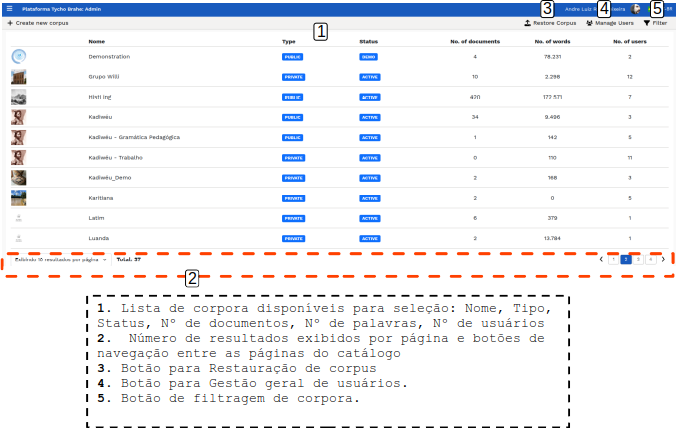

Nesta tela, o administrador consegue realizar algumas tarefas de gestão, como: 

**Restaurar um corpus**:

   1. Clique sobre o botão “Restore corpus”.
   2. Arraste e solte um arquivo ou clique e selecione para enviar um arquivo e confirme.

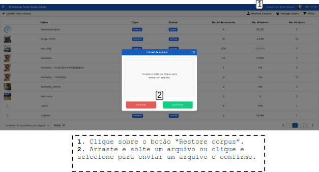

**Gerenciar usuários**: verificar informações de usuários na plataforma.

   1. Clique sobre o botão “Manage users”: serão apresentados todos os usuários.
   2. . Clique sobre um usuário para ver suas informações.
   3. Informações do usuário selecionado: Nome, e-mail, UID, Corpora aos quais o usuário é associado.
   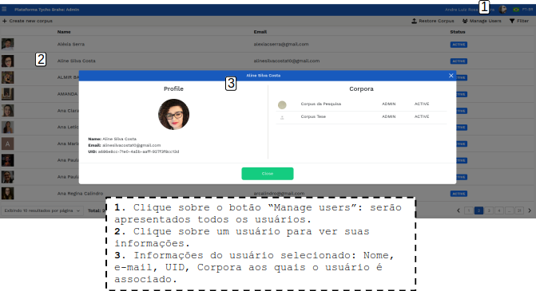

**Filtrar corpora**: busca corpora, filtrando com base nas informaçõs fornecidas:

   1. Clique sobre o botão “Filter”.
   2. Preencha:
      1. **Containing text on name**: retorna os documentos que contenham as palavras informadas no título do documento.
      2. **Public corpus**: ao clicar,  filtrar corpora públicos ou privados.
      3. **Clear**: limpa o filtro e refaz a busca.
      4. **Search**: executa a busca de acordo com os filtros preenchidos.

      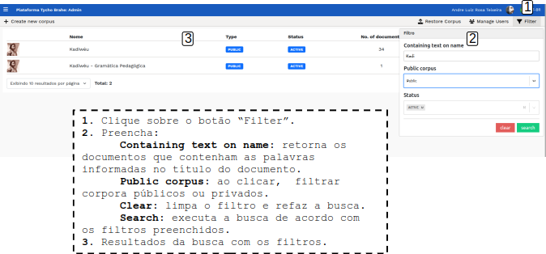

**Usuário com permissão de admin**: O Usuário admin tem acesso aos corpora aos quais está vínculado após o acesso pela "Área reservada" e o seu login, como no Caso de uso 00 -Tutorial:fluxo normal [2], e acesso à área de gerenciamento do corpus através do botão "Admin" na área "Meus corpora" (em Caso de uso 00 - Tutorial: fluxo normal[4]), como apresentado na Figura a seguir: 
      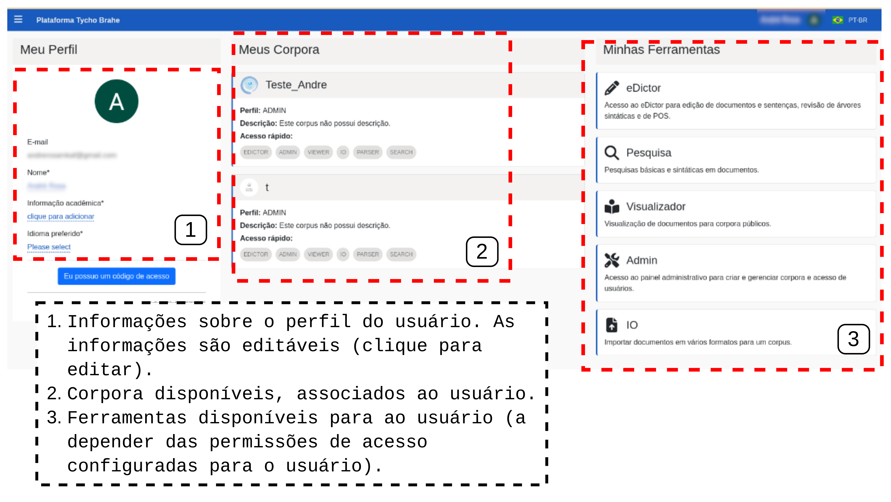

Previamente, o usuário já deve ter realizado contato com a coordenação do projeto solicitando sua associação a determinado corpus. A coordenação então entra em contato com o administrador solicitando associação/cadastro a um determinado corpus. Veja a Figura abaixo:

**Selecionar o Corpus**:

   1. Na interface de Administrador, selecione o corpus ao qual o novo usuário será associado. A Figura a seguir apresenta o catálogo de corpora disponíveis para acesso. Ao clicar em um dos corpora, o usuário é redirecionado ao corpus específico, como apresentado na Figura, como apresentado no topo da página “Corpus: Demonstration”. 
      

   2. No caso do Usuário com permissão admin em determinados corpora, há duas maneiras de acessar a área de gerenciamento: na área "Meus corpora" na página incial do perfil, em "Acesso rápido", clique em "Admin"; ou na área "Minhas Ferramentas", selecione "Admin":

   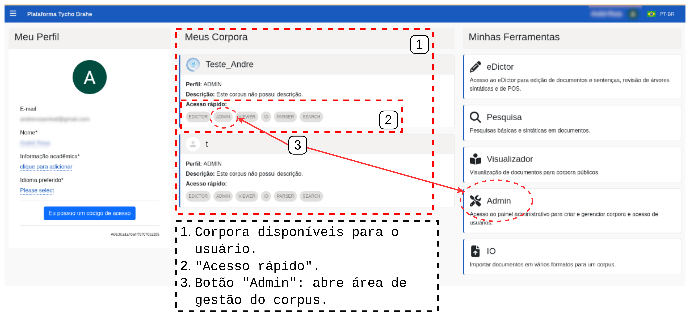

**Acessar "Access Control**: Na primeira tela de administração do corpus, são apresentadas informações gerais, como nome, um atalho URL, os parsers etc. No painel do corpus, clique na aba "Access Control" para gerenciar as permissões de acesso.

   
  
Ao acessar o “Access Control”, a plataforma apresenta uma página com os atuais usuários com permissões no corpus selecionado, como mostra a Figura a seguir. Com botão “Users” selecionado, é apresentado o usuário com os seguintes campos - “Name”, “status”, “Role”.

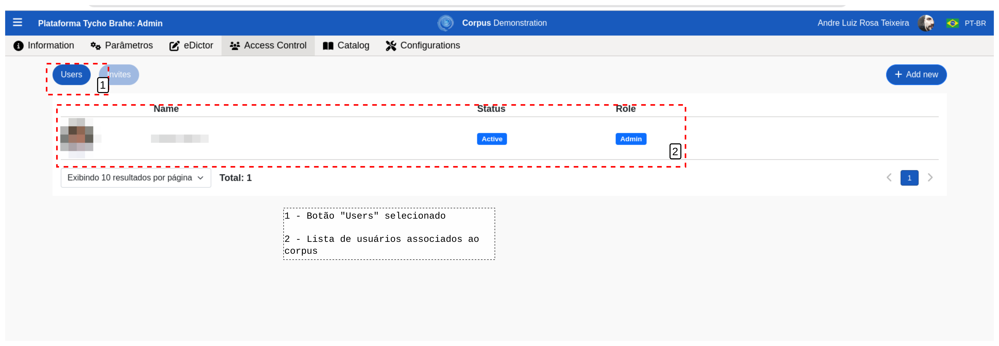

**Criar Convite de acesso**: Na aba "Access Control", clique no botão "Invites" e depois em “ + Add new”. Uma nova janela se abre para que o admin possa realizar as configurações da permissão:

   1. **Inserir título:** Escolha um título para o convite no campo “Title”
   2. **Definir Quantidade de Convites**: Escolha se o convite será para um único usuário ou para múltiplos usuários (o contador de convites disponíveis será atualizado conforme os usuários se registrarem).
   3. **Definir o tipo de permissão:** Selecione o tipo de permissão “Role” que o usuário terá:
      - **Edição**: O usuário poderá editar o corpus.
      - **Admin**: O usuário terá permissões de administrador no corpus.
   4. **Email**: Preencha o email do usuário a ser adicionado ao corpus.
   5. **Status do Usuário**: Selecione o status do usuário:
      - **Active**: O usuário terá acesso ativo ao corpus.
      - **Inactive**: O usuário estará registrado, mas sem acesso ativo.
   6. Após configurar as permissões clicar em "Confirmar".

   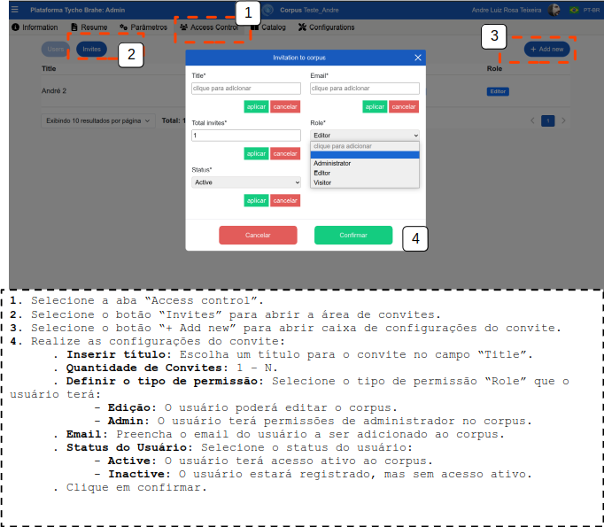

Após a geração do convite, o admin consegue enviar uma notificação automática com o convite para o e-mail cadastrado, copiar o ID do convite. Além disso, é possível reacessar o convite para verificação das informações, reenvio do e-mail etc.

   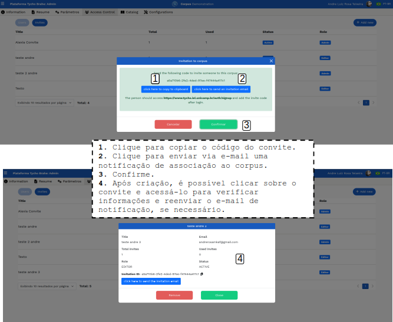

O usuário recém cadastrado deve receber um email automático neste formato e deve clicar em "Join now" para ser redirecionado à página de adesão ao corpus e inserir o código de acesso constante no email.

   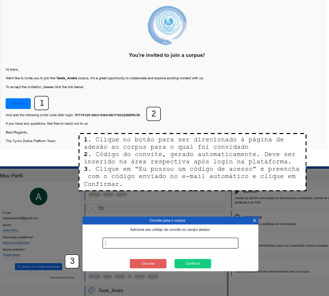

### **Fluxo Alternativo 1 - Usuário já presente na Base de Dados, vinculado a outro corpus**

Se o usuário já estiver cadastrado em outro corpus, siga estas etapas:

1. Acesse o link "admin" <https://www.tycho.iel.unicamp.br/admin> e selecione um corpus, ou por meio da "Área reservada"(selecione o "Acesso rápido"-"Admin"). No painel de "Access Control", com o botão “Users” selecionado, clique em "+ Add New".
2. **Selecionar o e-mail do usuário**: Inicie o preenchimento e escolha o e-mail do usuário na lista suspensa (super-usuários e e-mails já cadastrados no corpus não aparecerão como opção).
3. **Configurar Permissões e Confirmar**: Selecione as permissões de "Role" (Adminstrator, Editor, Visitor) e "Status" (Active, Inactive).

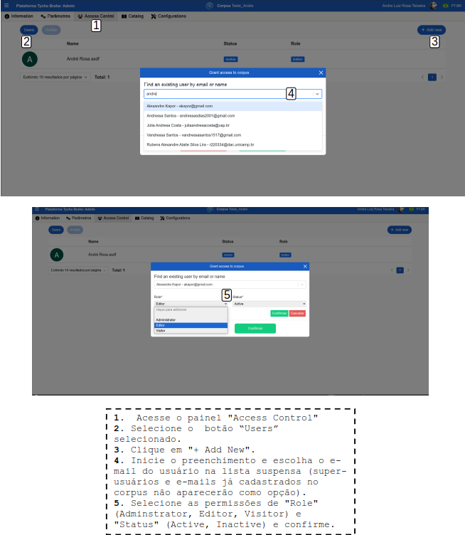

---
