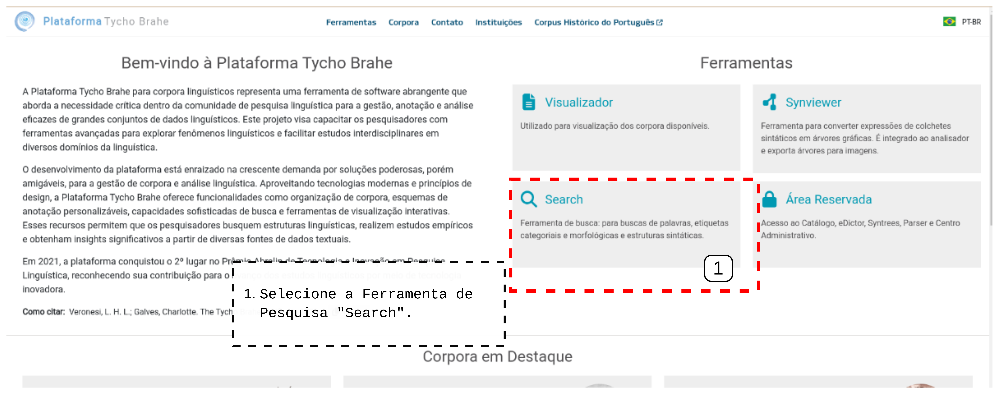
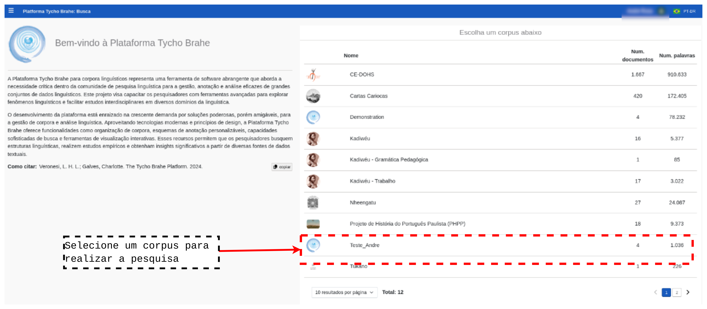
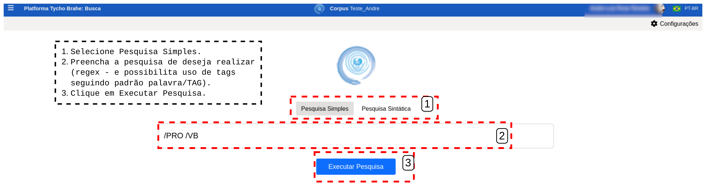
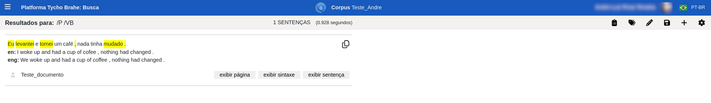
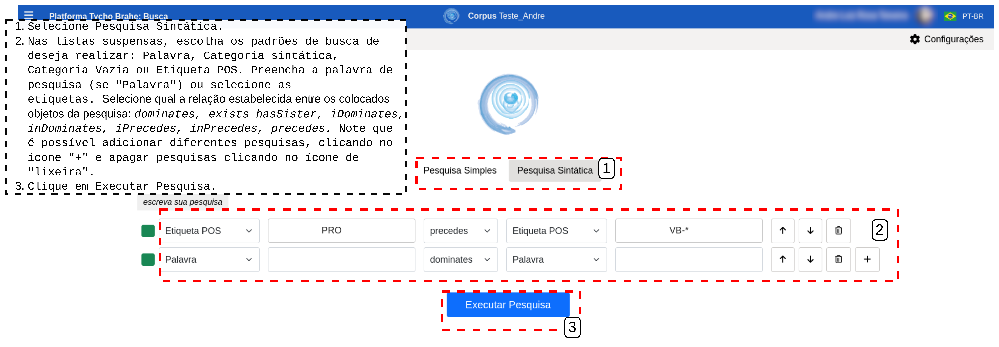

# Ferramenta de Pesquisa

Índice

- [Ferramenta de Pesquisa](#ferramenta-de-pesquisa)
  - [Tutorial](#tutorial)
    - [**Fluxo normal**](#fluxo-normal)
      - [**Pesquisa simples**](#pesquisa-simples)
      - [**Pesquisa sintática**](#pesquisa-sintática)
        - [**Modo 1 - Default**](#modo-1---default)
        - [**Modo 2 - Escreva sua pesquisa**.](#modo-2---escreva-sua-pesquisa)

---

## Tutorial

### **Fluxo normal**

1. Acesse a página _home_ da plataforma Tycho Brahe através do link: <https://www.tycho.iel.unicamp.br/home>.
2. Na área de "Ferramentas", acesse a Ferramenta "Search". Alternativamente, acesse https://www.tycho.iel.unicamp.br/search diretamente.

3. Escolha um dos corpora para realizar a busca.

4. Escolha o tipo de pesquisa que deseja realizar: **Pesquisa simples** ou **Pesquisa sintática**.

#### **Pesquisa simples**

   1. Selecione o botão **Pesquisa simples**
   2. Preencha o campo com a expressão de busca utilizando partes de palavra, palavra completa, palavra + POS, múltiplas palavras (não necessariamente em sequência), múltiplas palavras em sequência, múltiplas palavras com etiquetas POS (não necessariamente em sequência), palavra + expressão regular ou múltiplas palavras com expressão regular.

| Tipo de consulta                                                    | Exemplo             |
| ------------------------------------------------------------------- | ------------------- |
| Parte de palavra                                                    | ejiwa               |
| Palavra inteira                                                     | "ejiwajegi"         |
| Palavra + etiqueta POS                                              | ejiwajegi/N         |
| Múltiplas palavras (não necessariamente em sequência)               | ica ejiwajegi       |
| Múltiplas palavras em sequência                                     | "ica ejiwajegi"     |
| Múltiplas palavras com etiquetas (não necessariamente em sequência) | ica/D ejiwajegi/N   |
| Múltiplas palavras em sequência com etiquetas                       | "ica/D ejiwajegi/D" |
| Palavra com expressão regular                                       | ica.\*ejiwajegi     |
| Múltiplas palavras com expressão regular                            |                     |

<!--Revisar com o Luiz sobre as expressões regulares, não funciona todos os tipos de buscas-->

   3. Clique em "Executar pesquisa"

Relizando uma Pesquisa Simples.

A pesquisa realizada no exemplo na Figura acima retorna o seguinte resultado no corpus de Teste.

Resultado de uma busca simples.

#### **Pesquisa sintática**

Escolha um dos modos da pesquisa Modo 1- Default: este modo disponibiliza listas suspensas com os tipos de tags/pesquisa pré-determinadas (Palavra, Categoria Sintática, Categoria Vazia, Etiqueta POS), uma lista suspensa com o tipo de relação entre os colocados (_dominates, exists hasSister_ etc); Modo 2 - Escreva sua pesquisa: é possível escrever a expressão de pesquisa e converter para o modo anterior antes de realizar a pesquisa):

##### **Modo 1 - Default**

   1. Selecione **Pesquisa sintática**.
   2. Selecione quais padrões serão aplicados na busca pelos colocados:
      1. Nas listas suspensa, escolher entre: Palavra, Categoria sintática, Categoria Vazia ou Etiqueta POS.
      2. A depender da seleção anterior: se selecionar "Palavra", preencha o campo com a palavra desejada a ser pesquisada; Se a pesquisa for por Categorias sintática, Categoria vazia ou Etiqueta POS, inicie o preenchimento da tag desejada e selecione a tag pertinente a partir da lista suspensa.
      3. Selecione qual a relação estabelecida entre os colocados objetos da pesquisa: _dominates, exists hasSister, iDominates, inDominates, iPrecedes, inPrecedes, precedes_.<!--REVISAR: INSERIR DEFINICÃO DE CADA UMA DESSAS PALAVRAS CHAVES COM FIGURAS?-->
   3. É possível adicionar mais buscas ao clicar no ícone "+" e deletar padrão de busca ao clicar na "lixeira".
   4. Clique em "Executar Pesquisa".

   
   Realizando uma Pesquisa Sintática

##### **Modo 2 - Escreva sua pesquisa**. 

   É posível abrir um campo livre para preenchimento para executar busca com padrão de sintaxe livre com etiquetas POS:

   1. Clique em "escreva sua pesquisa".
   2. Preencha o campo com o padão de pesquisa desejado.
   3. Clique em "Converter texto" para converter busca para campos preenchidos na "Pesquisa sintática" default<!--REVISAR: AVISAR AO LUIS QUE QUANDO PREENCHO NO CAMPO LIVRE E CONVERTO PARA A BUSCA E REALIZO ESTÁ DANDO ERRO-->

   Para qualquer tipo de busca, é possível realizar algumas configurações:

   1. Clique no ícone de "configurações" no canto direito superior.
      1. Metadados <!--REVISAR: encontrei onde se preenche os metadados no admin, configurações (mas não entendi quais os tipos de dados são para serem preenchidos e não sei como isto impacta na hora da pesquisa) -->
      2. Documentos: selecione um documento para limitar a pesquisa a documentos específicos (pode aumentar velocidade de resposta da requisição).
      3. Exportar: selecione o formato para exportar os resultados da pesquisa.
      4. Consultas: verifique consultas salvas.
      5. Definições <!--REVISAR: VERIFICAR QUAIS SÃO AS DEFINIÇÕES POSSÍVEIS AQUI-->
      <!--REVISAR: aguardar reunião com Luiz para entender melhor esta parte de configurações-->

 <!-- REVISAR COM LUIZ: O PADRÃO DE BUSCA NA BUSCA SINTÁTICA LIVRE É CORPUS SEARCH?-->
---