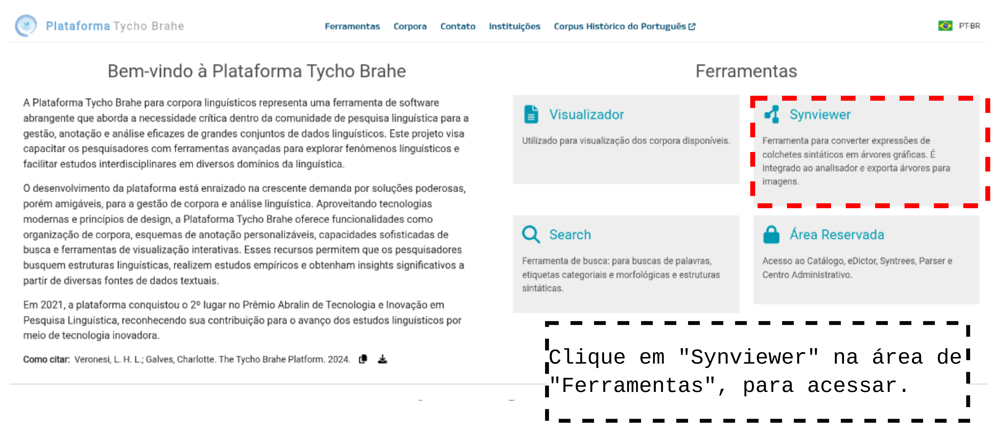
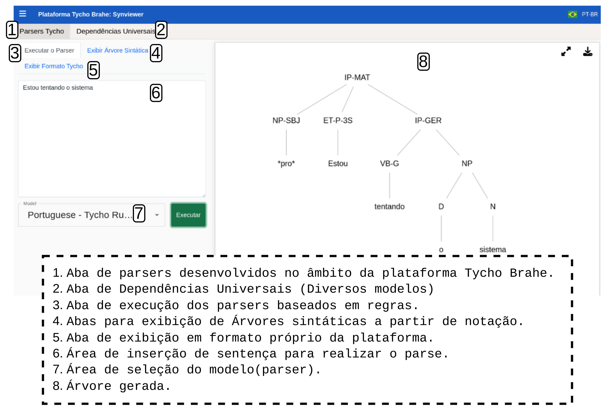
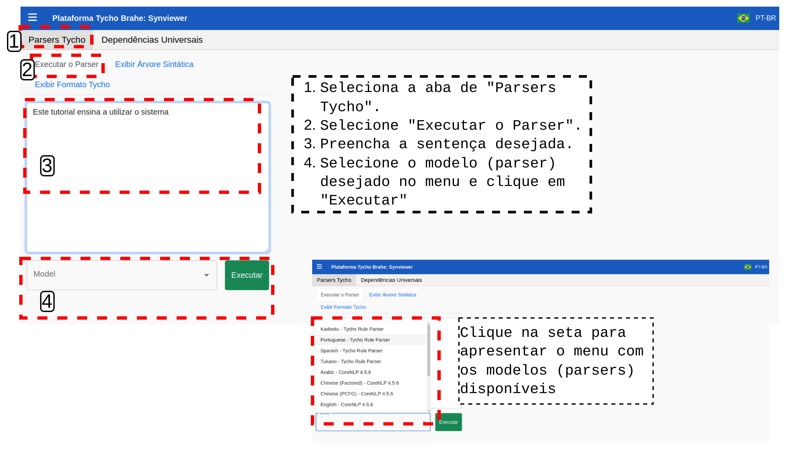
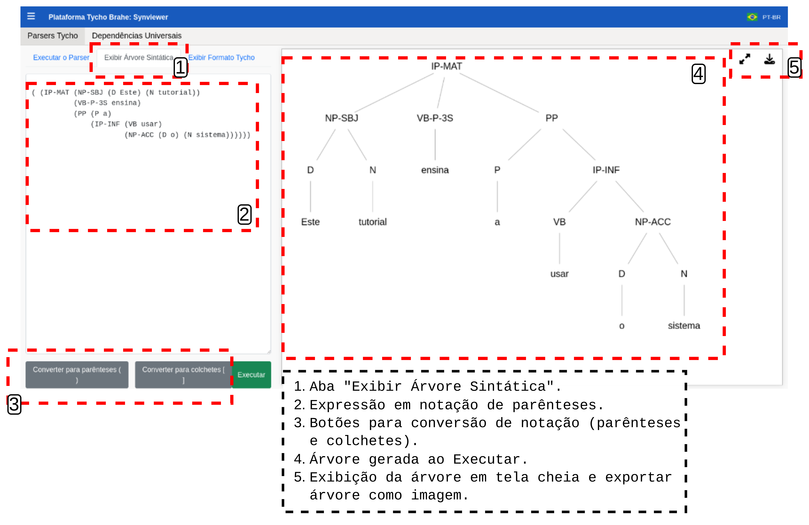
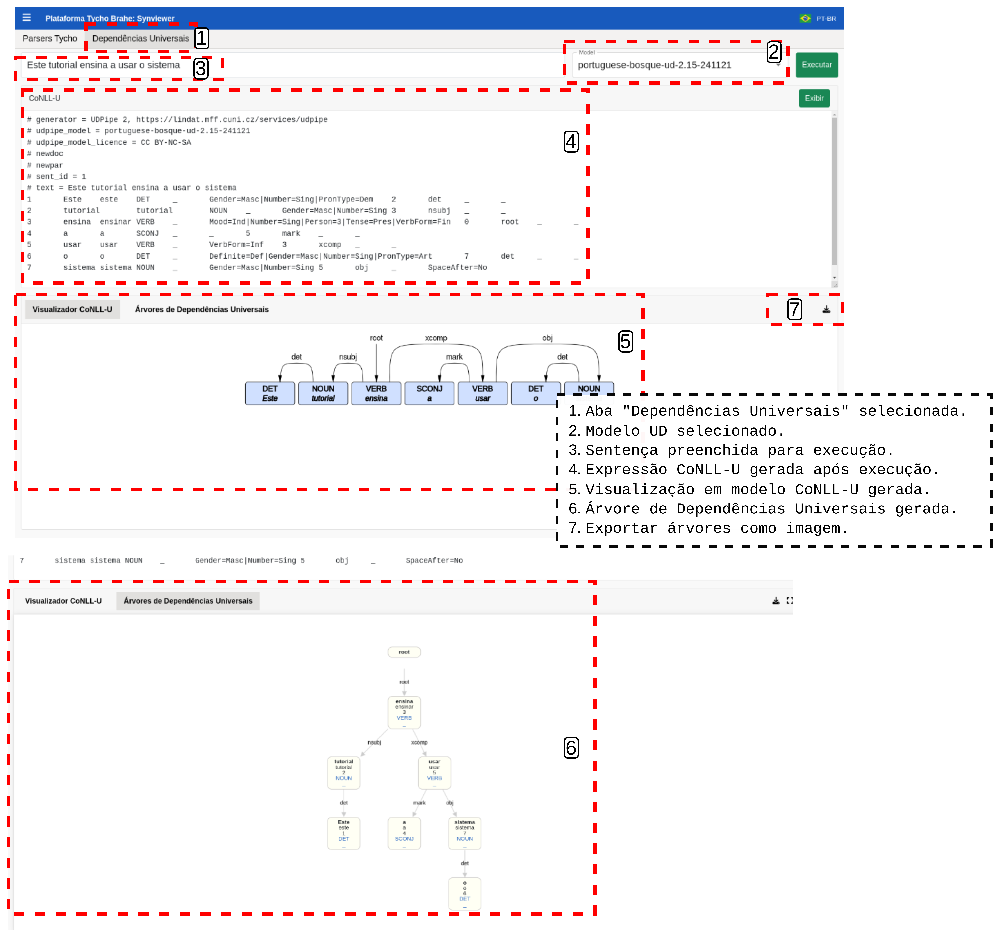
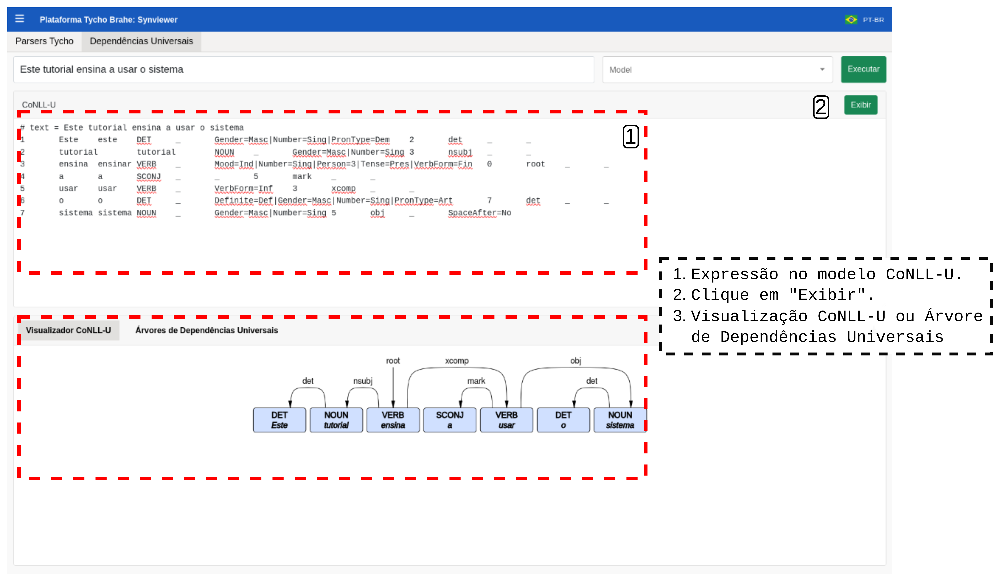

# Synviewer

Índice

- [Synviewer](#synviewer)
  - [Tutorial](#tutorial)
    - [Acesso](#acesso)
      - [**Parsers Tycho**](#parsers-tycho)
        - [**Executar o parser**](#executar-o-parser)
        - [**Exibir Árvore Sintática**](#exibir-árvore-sintática)
        - [**Exibir Formato Tycho**](#exibir-formato-tycho)
      - [**Parsers - Dependências Universais**](#parsers---dependências-universais)

---
<!--
Funcionalidades

Exportação de imagens das árvores sintáticas.
Disponível publicamente e independente de qualquer corpus específico.

Converte anotações complexas stand-off em estruturas de árvore legíveis por humanos.
Utiliza algoritmo dedicado para transformar tokens e chunks em nós e arestas na exibição da árvore.
-->
## Tutorial

### Acesso

1. Acesse a página inicial da plataforma Tycho Brahe no endereço <https://www.tycho.iel.unicamp.br/home>.

Acessando página inicial

2. Clique no "Synviewer" na área de "Ferramentas" para acessar a funcionalidade.

Acessando o "Synviewer"

Há duas funcionalidades principais no "Synviewer":

#### **Parsers Tycho**

Selecione esta aba com os parsers desenvolvidos no âmbito do projeto.

##### **Executar o parser**

  1. Selecione a aba "Executar o parser".
  2. Insira a sentença desejada.
  3. Selecione o modelo (parser) desejado e clique em "Executar".

  

  A execução do parser resulta na árvore, como apresentada na Figura a seguir:

  

##### **Exibir Árvore Sintática**

Visualização gráfica de árvores sintáticas para revisão sintática.
Funcionalidades de zoom e arrastar para navegação facilitada. Análise de sentenças em tempo real com todos os parsers suportados.

  1. Selecione a aba "Exibir Árvore Sintática".
  2. Insira expressão em notação de parênteses ou colchetes para geração da árvore.
  3. Converta para notação em colchetes ou parênteses (se aplicar) e clicar em "Executar" para gerar a árvore. É possível visualizar a árvore em tela cheia e exportar como imagem.

  

##### **Exibir Formato Tycho**

  1. Selecionar a aba "Exibir Formato Tycho".
  2. Inserir os dados.
  3. Clicar em "Executar" <!--REVISAR: ESTA FUNCIONALIDADE NÃO APRESENTA COMPORTAMENTO...TALVEZ TENHA TESTADO A ENTRADA ERRADA-->

#### **Parsers - Dependências Universais**

Parsers do banco de dados de Dependências Universais.

1. Insira a sentença desejada.
2. Selecione o modelo (parser) desejado.
3. Clique em "Executar".

Suporte a Universal Dependencies com conversão do formato CoNLL-U. O usuário pode visualizar e exportar árvores no formato CoNLL-U ou Dependências Universais como imagem. 

Suporte a exportação de imagens das árvores sintáticas, disponível publicamente e independente de qualquer corpus específico.

Nota: se o usuário preferir inserir a sentença e realizar o parser, o sistema retorna tanto as árvores quanto a expressão em notação CoNLL-U. É possível também inserir a expressão em CoNLL-U para geração das árvores diretamente: insira a expressão e clique em Exibir, para gerar as árvores.

---
