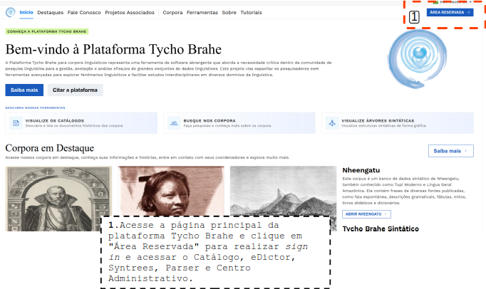
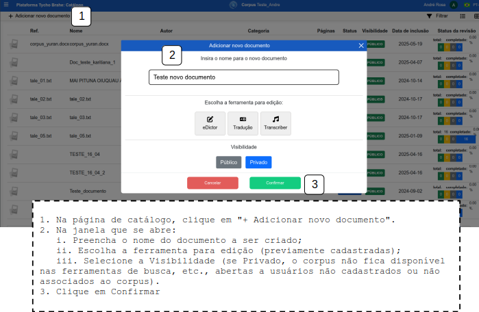
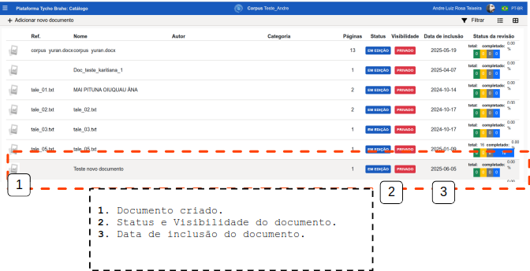

# Criação de novos documentos

Índice

- [Criação de novos documentos](#criação-de-novos-documentos)
  - [Tutorial](#tutorial)
    - [**Fluxo normal**](#fluxo-normal)

---

## Tutorial

Esta funcionalidade permite aos usuários associados aos corpora criarem novos documentos dentro dos corpora. Esta funcionalidade oferece recursos de criação de documentos, seleção de ferramentas de edição a serem utilizadas no documento, seleção de nível de publicidade do documento.

Nos tópicos a seguir serão desenvolvidos os principais fluxos envolvidos na criação de novos documentos.

### **Fluxo normal**

1. Acesse a página _home_ da plataforma através do link: <https://www.tycho.iel.unicamp.br/home>.
2. Na área de "Ferramentas", o Usuário acessa "Área reservada" para ser redirecionado ao _login_.

3. Realize o _signin_ (ver caso de uso 00 - sign in).
4. Acesse o botão eDictor na área de botões de acesso rápido (sendo redirecionado ao catálogo do corpus):

5. Na página de catálogo, clique em "+ Adicionar novo documento".
6. Na janela que se abre:
   1. Preencha o nome do documento a ser criado;
   2. Escolha a ferramenta para edição (previamente cadastradas);
   3. Selecione a Visibilidade (se Privado, o corpus não fica disponível nas ferramentas de busca, etc., abertas a usuários não cadastrados ou não associados ao corpus).
7. Clique em Confirmar

Após criação do documento ele fica disposto no catálogo:

**Nota**: A Visibilidade deve ser selecionada como privada, por exemplo, durante a anotação do documento, ou quando o material tem questões relacionadas ao _copyright_.

---
