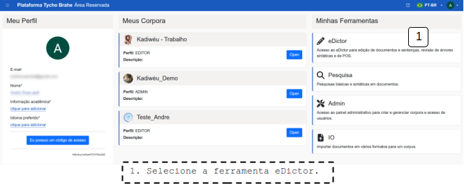

# Criação de novos documentos

---

Esta funcionalidade permite aos usuários associados aos corpora criarem novos documentos dentro dos corpora. Esta funcionalidade oferece recursos de criação de documentos, seleção de ferramentas de edição a serem utilizadas no documento, seleção de nível de publicidade do documento.

Nos tópicos a seguir serão desenvolvidos os principais fluxos envolvidos na criação de novos documentos.

1. Realize o _sign in_ e acesse a Área Reservada, seguindo o [tutorial de _sign in_](../../home/pt-br/sign-in.md).
2. Acesse o botão eDictor na área Minhas Ferramentas:

3. Na página de catálogo, clique em "+ Adicionar novo documento".
4. Na janela que se abre:
   1. Preencha o nome do documento a ser criado;
   2. Escolha a ferramenta para edição (previamente cadastradas);
   3. Selecione a Visibilidade (se Privado, o corpus não fica disponível nas ferramentas de busca, etc., abertas a usuários não cadastrados ou não associados ao corpus).
5. Clique em Confirmar

Após criação do documento ele fica disposto no catálogo:

**Nota**: A Visibilidade deve ser selecionada como privada, por exemplo, durante a anotação do documento, ou quando o material tem questões relacionadas ao _copyright_.

---
