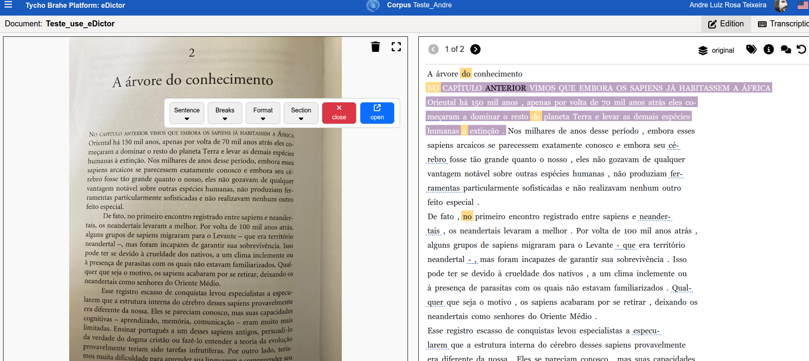
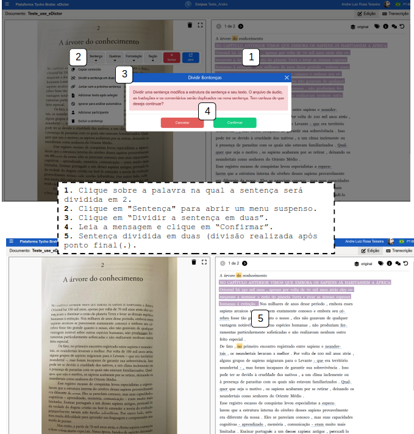
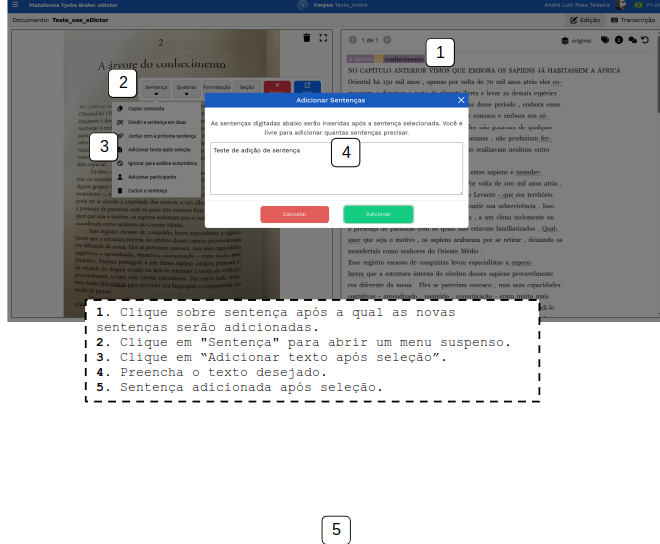
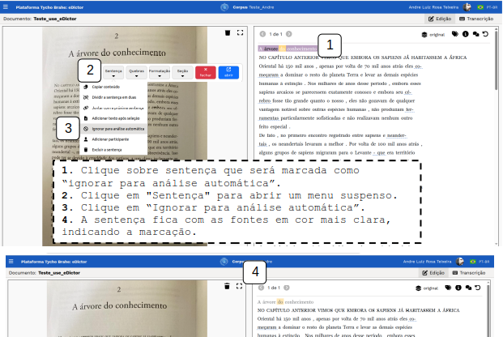
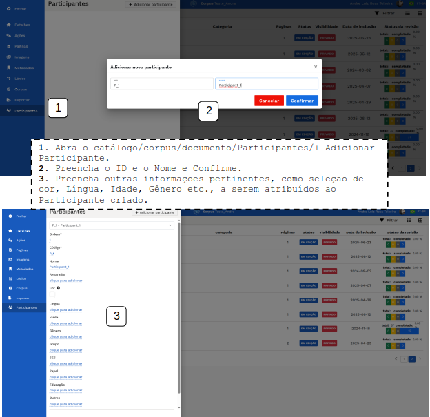
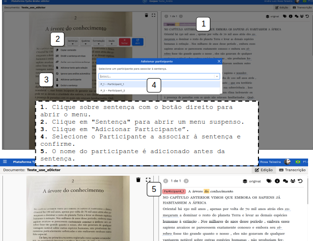
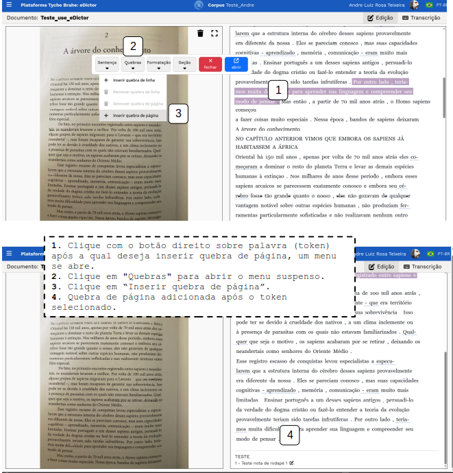

# Ferramenta **eDictor**

- [Ferramenta **eDictor**](#ferramenta-edictor)
      - [Operações no menu suspenso](#operações-no-menu-suspenso)
        - [**Alterações na sentença no modo edição no eDictor**](#alterações-na-sentença-no-modo-edição-no-edictor)
        - [**Inserir quebras**](#inserir-quebras)
        - [**Formatar**](#formatar)
        - [**Seções**](#seções)
        - [**Outras edições realizadas na sentença**](#outras-edições-realizadas-na-sentença)
          - [**"Continuar anotação sintática"**](#continuar-anotação-sintática)
          - [**Revisar etiquetas POS**](#revisar-etiquetas-pos)

---

Este tutorial apresenta em detalhes o uso do eDictor para edição e revisão dos corpora.

## Operações básicas no eDictor

1. Verifique (ou Habilite) o **eDictor** na página de /admin do corpus, na aba de parâmetros.

   

2. Verifique se o documento que deseja editar está no corpus, ou adicione novo documento para transcrição e edição.

   1. Clique em "+Adicionar novo documento".
   2. Preencha o nome do novo documento.
   3. Selecione a Ferramenta de edição desejada para o documento (dentre use eDictor ou eDictor Translation) - Para este caso de uso selecione o use eDictor.

   

3. Realize o upload de um arquivo de imagem de onde pretende realizar a transcrição: do lado esquerdo da página que abre após a criação do documento, clique em "clique aqui para realizar o upload", selecione imagem e confirme.

   
   Upload de documento para eDictor.

   

4. Transcrições:
   **Manual**: Clique o botão "Transcrição" para abrir o campo de preenchimento manual das transcrições do texto da imagem inserida.

   

   **Automática**: Clique o botão "extrair texto de imagem"(T), no canto superior direito, para realizar a transcrição automática a partir da imagem com texto.

   

5. Preenchidas as transcrições, manualmente ou automaticamente, salve as alterações clicando no ícone em [2].

   

6. Clique no ícone de "ir para o modo edição" para preparar o texto para receber edições (o texto será tokenizado (palavras e sentenças) e será preparado para outros tratamentos computacionais, como etiquetagme POS, parser automático etc).

   

7. Etiquetagem e outras edições:
   **Edições manuais** realizadas em cada palavra da sentença. Estas edições são feitas ainda no ambiente de edição o eDictor. Para abrir os campos de edição, clique sobre palavra que deseja editar e realize as edições desejadas:

   **Operações**:

   

   - **Inserir palavras**: selecionada uma palavra da sentença, no menu "Operações" seleciona "inserir". Uma tela com espaço para preencher palavras a serem inseridas se abre. Preencha as palavras que deseja adicionar e confirme. Note que as palavras preenchidas serão inseridas após a palavra selecionada para edição na sentença;

   

   - **Dividir**: Divida a palavra selecionada em duas ou mais (separadas por espaços). As palavras separadas por espaços serão incluídas como novos _tokens_ na sentença e todas as informações dar parseamento serão redefinidas.  

     

   - **Juntar com a próxima**: Com a palavra que será junta e a operação "juntar com a próxima" selecionadas, clique em "Confirmar" para juntar as palavras. Note que a palavra selecionada se juntará à seguinte na sentença e informações de parseamento serão redefinidas.

     

   - **Splitter**: é possível adicionar ou remover spliter de um par de palavras. <!--[ REVISAR crítico: VER COM O LUIZ COMO FUNCIONA - NÃO PARECE ESTAR EM FUNCIONAMENTO?]-->

   - **Remover** uma palavra: Selecione a palavra que deseja remover, clique em "remover" e confirme.

     

   - **Observações**: é possível adicionar observações nas palavras. Clique em "Observações", preencha o campo com as observações desejadas e confirme. As palavras com observações serão grifadas no eDictor e as observações são apresentadas ao usuário passar o cursor sobre a palavra grifada.

   

   - **Notas de rodapé**: é possível, também, adicionar notas de rodapé nas palavras. Com a palavra selecionada, clique em "Notas de rodapé". Preencha o campo com as notas desejadas e confirme. O token recebe um índice superior e a nota correspondente aparece no rodapé do eDictor.

   

   - **Edição da palavra original**: é possível realizar uma edição na palavra selecionada. Selecione a palavra desejada; no campo "Palavra original" realize as edições desejadas e clique em "Salvar".

   

   - **Etiqueta POS**: selecione a palavra que deseja etiquetar; clique sobre o campo "Etiquetas POS" para abrir um menu suspenso com as opçõs de etiquetas POS; selecione a etiqueta apropriada; clique em "Salvar".

   

   - **Flexão**: além da etiqueta POS, também é possível marcar etiquetas de flexão (1,2,3S e 1,2,3P). Clique no campo "Flexão" para abrir o menu suspenso; selecione a flexão desejada e clique em "Salvar".

   
   Etiquetas de flexão  

   - **Ignorar para análise automática**: esta botão de alternância marca a palavra selecionada para ser ignorada pela análise automática. Essa operação altera a estrutura sintática e todas as informações de análise são redefinidas. Com a palavra selecionada, clique no botão de alternância "Ignorar para análise automática", leia a mensagem de aviso e clique em "Confirmar".

   

   - "**Marcar esta palavra para ser revisada**": este botão de alternância grifa a palavra, marcando-a como palavra a ser revisada.

   
   Marcar palavra para revisão

- **Operações de edição**:
  <!--[REVISAR: pedir Luiz exemplos de segmentação e junção para entender melhor o objetivo destas funcionalidades-->

  - junção: é possível inserir junções. Selecione uma palavra, preencha o campo "junção" e clique no botão azul para confirmar.
  - segmentação: é possível incluir segmentações. Selecione a palavra, preencha o campo "segmentação" e clique no botão azul para confirmar.

  

  - **Níveis de edição**: é possível preencher diversos níveis de edição da palavra selecionada.Selecione a palavra desejada, preencha os diversos Níveis de edição: grafia, expansão, correção, pontuação, ilegível, modernização, padronização, flexão. A palavra cujo preenchimento dos níveis de edição for realizado fica grifada, e as informações são apresentadas sob contato do cursor.

  

## Operações no menu suspenso

### Alterações na sentença no modo edição no eDictor

É possível realizar algumas alterações nas sentenças ainda em modo de edição no eDictor.

1. Clique sobre uma sentença com o botão direito do mouse. Um menu se abre:
   

   1. Copiar conteúdo: copia conteúdo da sentença selecionada para área de transferência (permite colar o conteúdo da sentença em outras áreas de edição):
      
   2. "Dividir sentença em duas": divide a sentença em duas após a palavra selecionada pelo usuário:
      
   3. "Juntar sentença à seguinte": junta uma sentença à seguinte (a partir do token selecionado):
      

   4. "Adicionar texto após seleção": Preencha o texto desejado. A sentença será adicionada após a seleção. <!--REVISAR PQ TEM UM BUG AQUI-->
      

   5. “Ignorar para análise automática”: a sentença fica com as fontes em cor mais clara, indicando a marcação.
      

   A sentença com essa marcação apresenta "IGNORAR" ao acessar o catálogo e "Revisar etiquetas POS":
   
   É possível "Remover ignorar para análise automática:
   

   6. "Adicionar Participante": associar um participante (previamente criado ao acessar catálogo/corpus/documento/Participantes/+Adicionar Participantes) - Preencha o ID, Nome e outras informações pertinentes, escolha cor etc. e confirme.
      

   Após a criação do perfil de Participante, é possível associar este perfil às sentenças, clicando com o botão direito na sentença para abrir o menu, clique em "Sentença" e em "Adicionar Participante", selecione o participante e confirme:
   

   1. Remover sentença: clique sobre a sentença com o botão direito para abrir o menu, selecione "Sentença" e "Excluir Sentença". Leia o aviso e confirme a exclusão.
      

### **Inserir quebras**

Para inserir quebras de linha e página:

1. Linha

   1. Clique com o botão direito sobre palavra (token) onde deseja inserir quebra de linha, um menu se abre.
   2. Clique em "Quebras" para abrir o menu suspenso.
   3. Clique em “Inserir quebra de linha”.
      A quebra de linha será adicionada após o token selecionado.
      

2. Página
   1. Clique com o botão direito sobre palavra (token) onde deseja inserir quebra de página, um menu se abre.
   2. Clique em "Quebras" para abrir o menu suspenso.
   3. Clique em “Inserir quebra de página”.
      A quebra de página será adicionada após o token selecionado.
      

### **Formatar**

1. Clique com o botão direito sobre palavra (token)que deseja formatar.
2. Clique em "Formatação" para abrir o menu suspenso.
3. Utilize os botões de alternância para ligar/desligar Itálico, Negrito, Sublinhado e Tachado. Clique sobre o campo e preencha o Espaçamento. Confirme.

### **Seções**

Para associar seções a trechos de texto (esta ação pressupões que seções tenham sido criadas previamente - para mais detalhes ver Caso de uso 03 - criação e configuração de corpora, página de admin):

1. No eDictor, selecione a aba de "Edição
2. Sobre a parte que deseja associar a um rótulo de seção, clique com o botão direito do mouse.
3. No menu que se abre, clique sobre "Seção" e "Adicionar seção"
4. Clique no menu “Tipo de seção” e escolha uma seção previamente cadastrada.

**Nota:** as seções que são disponibilizadas ao usuário no eDictor dependem de uma configuração extra: se a seção for configurada com um "gênero" ela só ficará disponível para rotulação em documentos também associados ao respectivo gênero.

Após a rotulação com a respectiva seção, o trecho apresenta-se com uma etiqueta no eDictor. No exemplo, o título do texto foi etiquetado como "titulo":

Para criar seções, ver [tutorial de criação e configuração de corpora](../../admin/pt-br/corpora-configuration.md)

1. Selecione "Configurações”.
2. Selecione “Seções”.
3. Clique no ícone e selecione "+ Adcionar novo" para criar uma nova categoria.
4. Na janela que se abre, preencha e clique em “aplicar” para salvar as alterações:
   1. Ordem: ordem em que a categoria será disposta;
   2. Símbolo: rótulo da categoria;
   3. Nome(obrigatório): nome da categoria;
   4. Gênero: gênero ao qual a seção é parte integrante.
5. Clique em “Confirmar”.

### **Outras edições e revisões realizadas na sentença**

Para outras funcionalidades de revisão de estruturas sintáticas e etiquetas POS, acesse o: [tutorial da Ferramenta de Revisão](../../revision/pt-br/revision.md)

---
