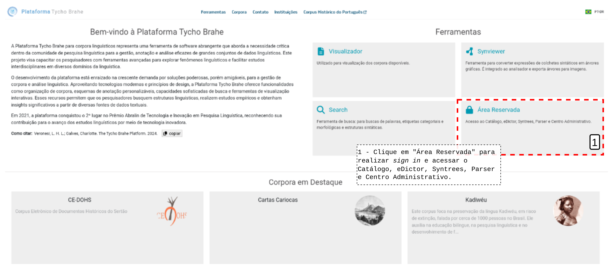
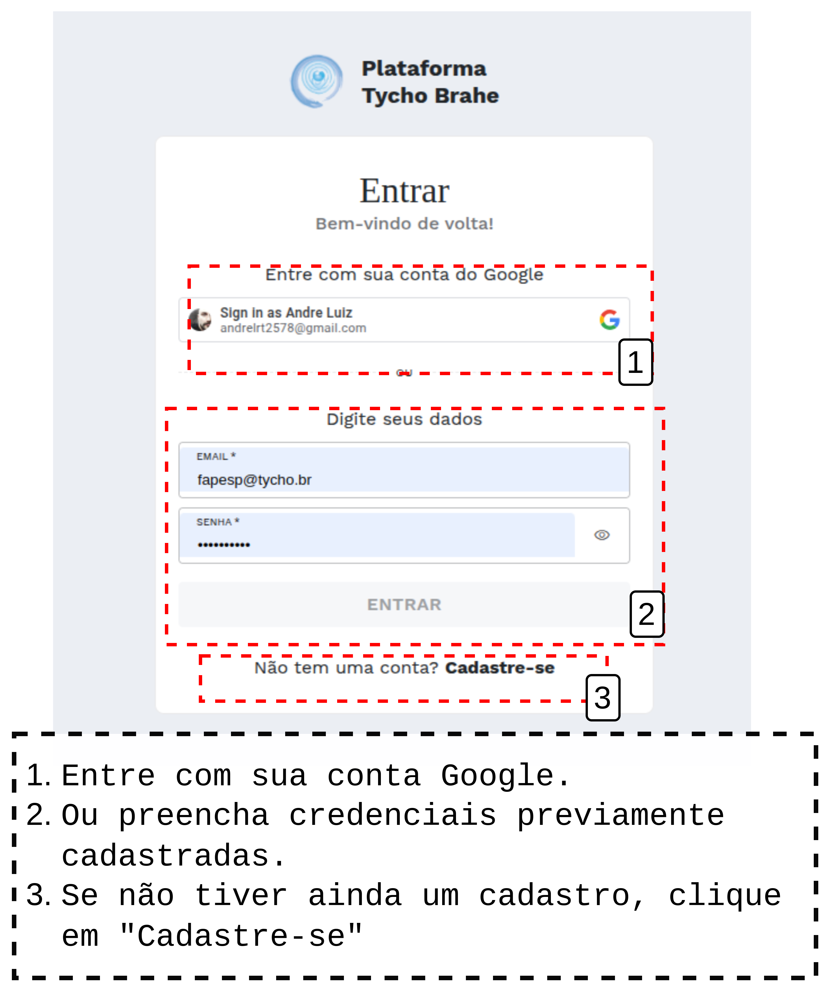
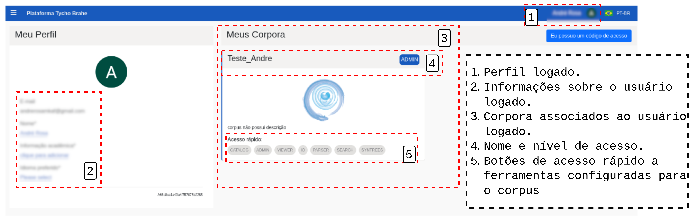
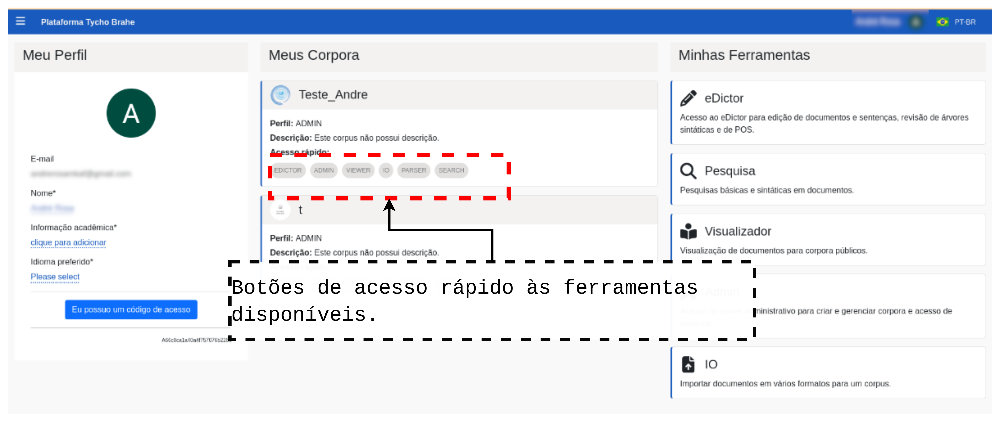

# Sign in e acesso à tela inicial de perfil do usuário cadastrado

Índice

- [Sign in e acesso à tela inicial de perfil do usuário cadastrado](#sign-in-e-acesso-à-tela-inicial-de-perfil-do-usuário-cadastrado)
  - [Tutorial](#tutorial)
    - [**Fluxo normal**](#fluxo-normal)
    - [**Fluxo Alternativo**](#fluxo-alternativo)

## Tutorial

Este tutorial detalha o processo para o usuário realizar o Sign in na plataforma e acessar a tela inicial do perfil do usuário. Em um fluxo normal, o usuário já foi previamente cadastrado com um e-mail Google. Caso contrário, veja Caso de uso 02 - Solicitar cadastro para realizar a solicitação junto aos administradores da plataforma.

### **Fluxo normal**

1. Acesse a página _home_ da plataforma através do link: <https://www.tycho.iel.unicamp.br/home>.
2. Na área de "Ferramentas", o Usuário acessa "Área reservada" para ser redirecionado ao _login_.

1. Realize o _login_ com o Google ou com suas credenciais previamente cadastradas. Selecione a conta salva no sistema ou preencha os dados da sua conta Google cadastrada na Plataforma Tycho Brahe.

Ou

4. Após _login_ o Usuário é redirecionado à página inicial do perfil, onde são dispostas as áreas **Meu Perfil**, com Informações do usuário, como e-mail, Nome, Informações acadêmicas e Idioma de preferência, que podem eventualmente ser editadas <!-- REVISAR CRÍTICO: avisar ao Luiz que as edições não são persistidos na base, não ficam salvas: ISSUE CRIADA-->, **Meus corpora**, que apresenta os corpora disponíveis associados ao perfil logado e **Minhas Ferrametentas**, que disponibiliza as ferramentas disponíveis para o usuário logado, de acordo com as permissões de acesso configuradas.

Observe que para cada um dos corpora disponíveis para trabalho pelo usuário, são também disponibilizados botões de acesso rápido:

### **Fluxo Alternativo**

1. Acesse o link da plataforma/perfil <https://www.tycho.iel.unicamp.br/platform> diretamente, sem passar pela página inicial da plataforma e acesse a "Área reservada".
2. Retome a partir do passo 3 do Fluxo normal
