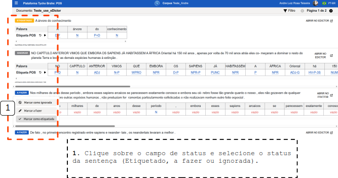

# Ferramenta de **Revisão**

- [Ferramenta de **Revisão**](#ferramenta-de-revisão)
  - [**Continuar anotação sintática"**](#continuar-anotação-sintática)
  - [**Revisar etiquetas POS**](#revisar-etiquetas-pos)

---

Este tutorial apresenta o uso da ferramenta de **Revisão**.

Há duas maneiras de acessar as sentenças para realizar uma análise (_parser_) e revisar/editar manualmente a etiquetagem realizada automaticamente. Ao acessar o catálogo e acessar a área "exibir informações" do documento, selecionar:

## **Continuar anotação sintática"**

(Continue a partir da última sentença revisada): Ao acessar esta área, a plataforma apresenta a última sentença revisada do documento (e se o parser já tiver sido aplicado previamente, apresenta também a árvore que corresponde à sentença). É possível navegar entre as sentenças através das setas do lado direito superior.

1. Para rodar o _parser_ na sentença selecionada é necessário que um parser tenha sido associado ao corpus previamente. Em caso afirmativo, clicar em no ícone de "▶️" no canto superior direito.
   

2. É possível editar os nós da árvore sintática: clicar sobre o nó desejado e selecionar a etiqueta adequada.
   1. Clique sobre um nó para editá-lo.
   2. Clique sobre o campo de “Tag” para selecionar uma etiqueta na lista suspensa.
   3. Selecionar uma “Extension” da etiqueta no nó selecionado.
   4. Clique no ícone "✔" para salvar as as alterações
      
3. Para conectar automaticamente ou remover um nó, clique com o botão direito do mouse sobre um nó para editá-lo.
   1. “Connect automatically”.
   2. ”Remove” para remover o nó.
      
4. Para conectaros nós, clique sobre o ponto vermelho sobre o nó e arraste para outro para conectá-los. Para remover a conexão, clique com o botão direito sobre ela e clique em "remover"
   

Outras informações a ações são disponibilizadas neste tela: abrir comentários, ver manuais de anotação sintática, salvar, desfazer/refazer, aplicar layout, histórico, juntar à próxima sentença (ação não permitida caso a sentença tenha tradução e/ou áudio correspondentes), debugar _parser_, e por fim, marcar status de revisão de etiquetagem da sentença (a fazer, como pronta, para revisão).<!--REVISAR: EVENTUALMENTE ESTA PARTE DEVE SER MAIS DETALHADA-->

## **Revisar etiquetas POS**

Ao se acessar esta área, a plataforma apresenta as sentenças do documento para que o usuário possa realizar uma revisão da etiquetagem. Se o _parsing_ já tiver sido previamente realizado nas sentenças, elas apresentam as etiquetas atribuídas. Do contrário, a camada de etiquetagem POS fica com a etiqueta "vazio" atribuída a todos os tokens das sentenças.

1. Para rodar o parser na sentença desejada (caso a sentença ainda não tenha sido etiquetada), clique no ícone "▶️" do lado esquerdo da sentença alvo.
   

É possível também realizar edições manuais em cada uma das etiquetas nas palavras da sentença:

2. Clique sobre o campo com "vazio" (ou etiqueta POS, se quiser editar uma anotação prévia), selecione a etiqueta POS desejada e Inflexão (se aplicável) e clique em "confirmar".
   
3. Ao editar uma etiqueta, é possível anotar outras ocorrências do mesmo token em _batch_, ou seja, dar a mesma etiqueta a todas as ocorrências do mesmo token. No campo de edição e seleção de uma etiqueta:
   1. Selecione a etiqueta POS desejada e Inflexão.
   2. Clique em apply all: leia a mensagem (A etiqueta "x" será aplicada a "N" ocorrência(s) da palavra "<TOKEN_SELECIONADO>". Note que as substituições serão aplicadas para todas as correspondências no documento. Se a sentença for etiquetada novamente, essa etiqueta será substituída.)

4. Revise sentença etiquetada e marque o status desejado (Marcar a fazer, Marcar como etiquetada, Marcar como ignorada.)

É possível ainda realizar outras ações nesta área:

1. Clique sobre o ícone para desfazer alterações.
2. Clique sobre o filtro para abrir campos de filtragem por “Contendo texto” ou por status.
3. Clique em "ABRIR NO EDICTOR" para retornar ao eDictor.

---
