# Visualizador de corpora

Índice

- [Visualizador de corpora](#visualizador-de-corpora)
  - [Tutorial](#tutorial)
    - [Acesso público aos corpora](#acesso-público-aos-corpora)
    - [Opções de busca e filtros](#opções-de-busca-e-filtros)
    - [Visualização de dados anotados](#visualização-de-dados-anotados)
      - [Aba de informações sobre o documento](#aba-de-informações-sobre-o-documento)
        - [Detalhes](#detalhes)
        - [Ações](#ações)
        - [Páginas](#páginas)
        - [Metadados](#metadados)
        - [Léxico](#léxico)

---

<!--FUNCIONALIDADES DISPOSTAS NA PÁGINA DE FERRAMENTAS:

- Modos de visualização configuráveis, permitindo alternar entre diferentes camadas de anotação (diplomática, interpretativa, modernizada).
- Segurança de dados e proteção de direitos autorais, restringindo downloads e metadados sensíveis quando necessário.
- Acesso aos metadados dos documentos, incluindo autor, período e descrição do corpus.
- Integração com links externos, como DOIs ou repositórios no GitHub, quando disponibilizados.

-->

## Tutorial

### Acesso público aos corpora

Funcionalidades de navegação e leitura

1. Acesse a página inicial da plataforma Tycho Brahe no endereço <https://www.tycho.iel.unicamp.br/home>.

2. Clique na aba "Ferramentas".
3. Na área de "Visualizador" clique sobre "Mais Detalhes".
4. Clique em "Abrir Visualizador".

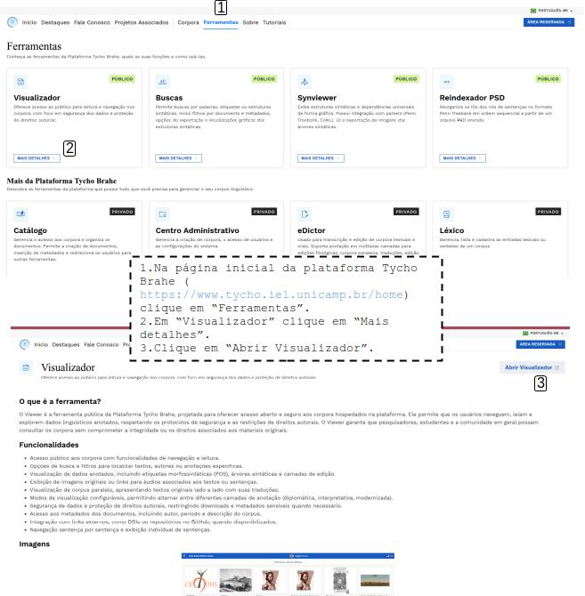

5. Selecione um dos corpora disponíveis na lista.
   1. São apresentadas informações como número de documentos e número de palavras nos corpora.

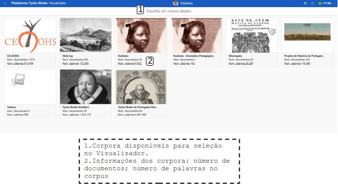

6. Navegue pela lista de documentose e selecione um documento.

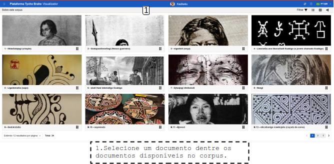

### Opções de busca e filtros

Funcionalidades para localizar textos, autores ou anotações específicas, exibição de imagens originais (que são associadas a cada documento) etc

- Filtragem de documentos por "contendo texto no nome" ou "status":

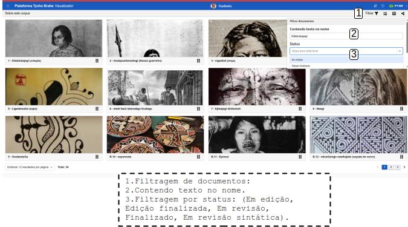
<!--REVISAR IMAGEM: FILTRO NÃO FUNCIONOU-->

- Documentos dispostos em forma de grade ou lista:

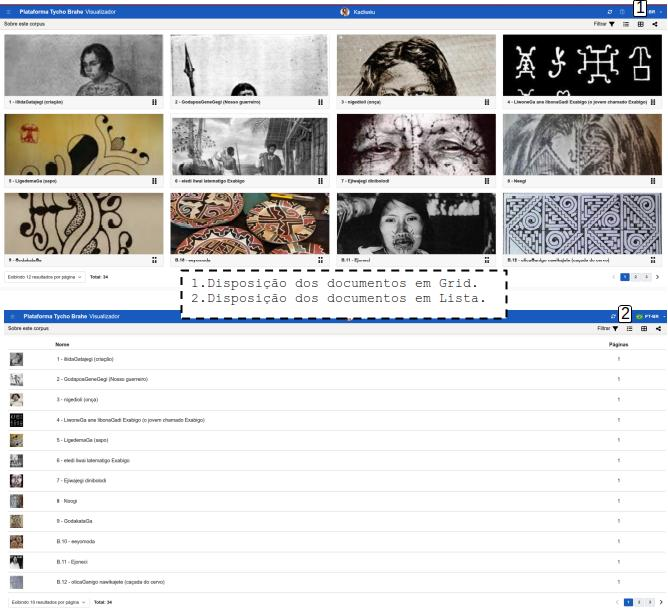

- Botão de compartilhamento de link do corpus:

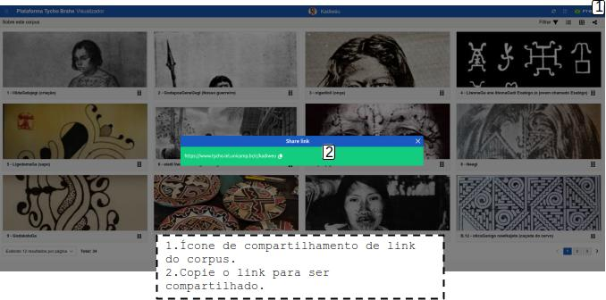

### Visualização de dados anotados

Visualização de corpus paralelo, apresentando textos originais lado a lado com suas traduções, Navegação sentença por sentença e exibição individual de sentenças; Etiquetas morfossintáticas (POS), árvores sintáticas e camadas de edição, links para áudios associados aos textos ou sentenças etc.

1. Após a seleção do documento desejado, as sentenças que o corpus contém são apresentadas. Selecione a sentença desejada.
   - Na tela que apresenta as sentenças, são apresentadas: tradução, botão para tocar o áudio original, botão para realizar download do áudio, língua de tradução etc.:

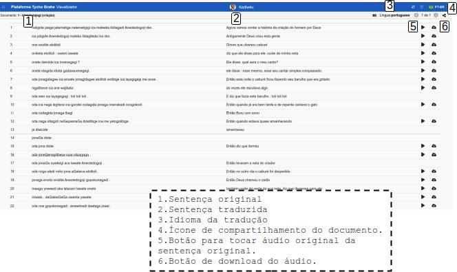

- Ao ser selecionada uma sentença, são apresentadas informações como etiquetas POS, traduções, áudios disponíveis e árvore/estrutura sintática.

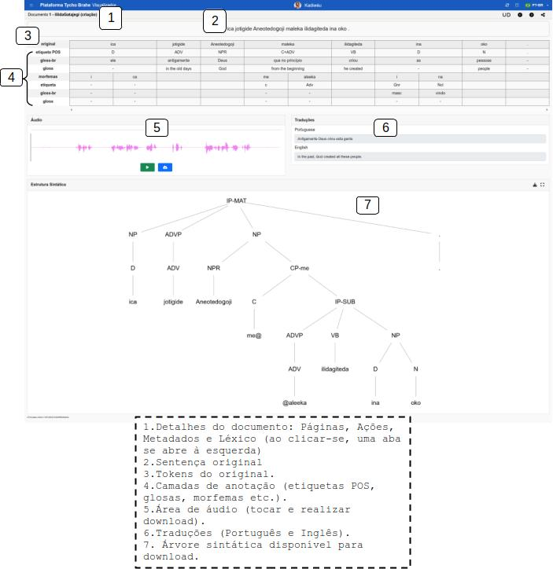

#### Aba de informações sobre o documento

Clique sobre o nome do documento para abrir a aba do lado esquerdo da janela. Esta aba apresenta Detalhes, Ações, Páginas, Metadados e Léxico.
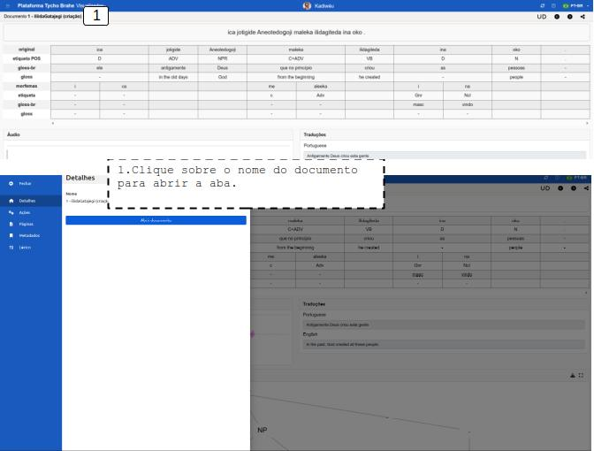

##### Detalhes

Clique em "Abrir documento" para abrir o documento da sentença.

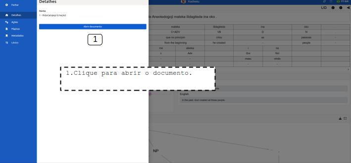

##### Ações

**Imprimir**:

1. Clique em "Ações".
2. Clique em "Imprimir" para imprimir uma sentença por página.

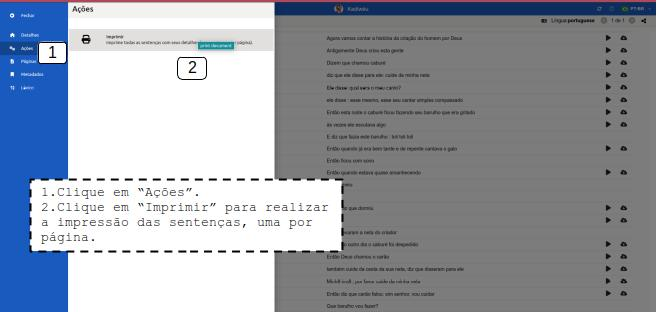

##### Páginas

1. Clique sobre "Paginas".
2. Navegue pelas páginas.
3. Clique sobre uma página para abrir no eDictor.

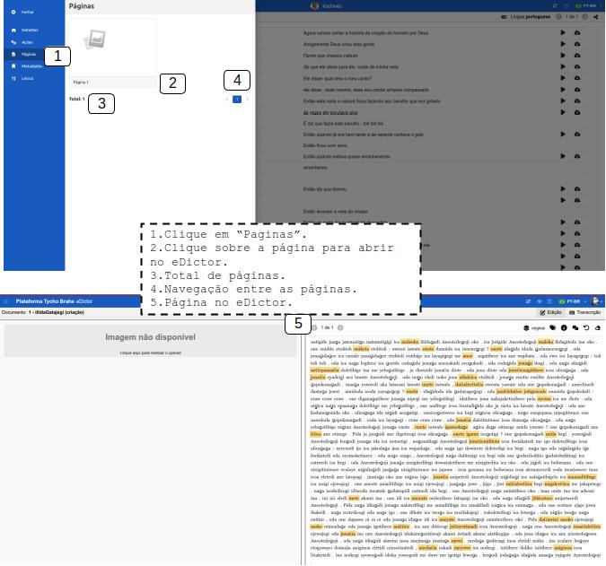

##### Metadados

1. Clique em "Metadados" para visualizá-los:

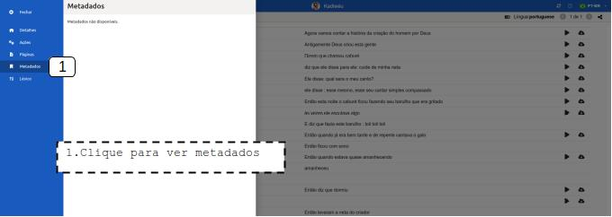

##### Léxico

1. Clique em "Léxico" para ter acesso ao conjunto léxico do documento.

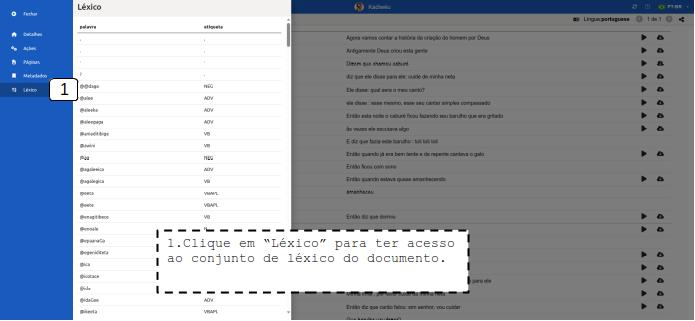

---
